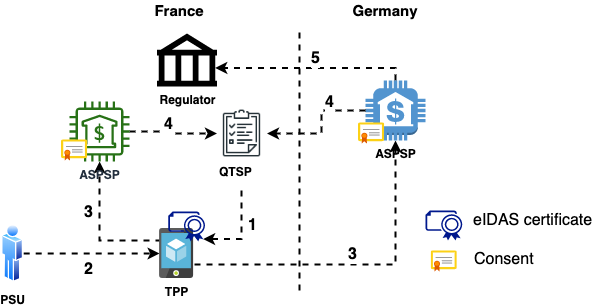
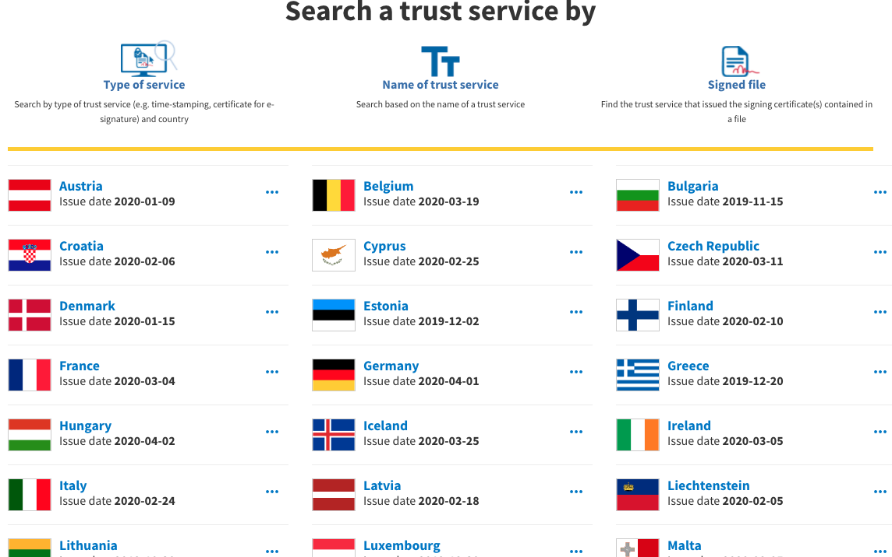

The term OpenBanking describes open financial APIs, giving customers access and control over their data.  
It took its name from the UK regulator's [2016 initiative][11] to front-run the EU [PSD2 directive][12], which was coming 
into full effect in September 2019.  
The successful implementation and roll-out of OpenBanking in the UK has resulted in  
* the name "OpenBanking" becoming almost global, and 
* the UK becoming the [de facto hub][13] for open APIs and fintech innovation (at least pre-Covid19).

In this series of two articles I will 
* give a high-level introduction to the key PSD2 and OpenBanking concepts,
* describe the eco-system from the PoV of the banks and external integrators, and
* give an easy-to-follow example of how an integration with the APIs looks like.

As this is an evolving ecosystem, I will be using a fusion of OpenBanking and PSD2 terminology throughout. 

<div id="psd2-content-container" markdown="1">

## PSD2 

From an end-user standpoint, PSD2 can be (very simplistically) summarised in the following sentence  
> Offer functional and security parity between a bank’s [channels][14] and its public APIs.

Or  
> A bank customer must be able to securely do through an API all things she can do through the bank's other channels.

PSD2 is a "meaty" combination of legal text and technical standards to set out the requirements for secure access by bank 
customers to their accounts.  
More specifically, it is composed of  
* The [Payment Services Directive 2][15] which sets out the legal framework and requirements for access to bank customer
accounts by Third Party Providers (TPPs).
* The European Banking Authority [technical standards for customer authentication and communications][16] (a.k.a. EBA RTS) in PSD2.
* The [Electronic Identification Regulation][17] (eIDAS) which sets out the details on the operation of Trust Service 
Providers (TSPs, more on this below).

PSD2 by its nature (law and technical standards) answers the "why" (legal framework, ownership of data) and the broad "how" 
(public/private cryptography, identification and security).  
The rest of the technical choices and concepts have evolved organically, taking into account industry best practice, while 
matching the [spirit][18] (if not the exact letter) of the law.  

The following diagram describes the PSD2 ecosystem, the key elements and their interactions from a high level.  
*It will auto-scroll on most browsers, as I am making references to it throughout the text below.*

<div style="position: -webkit-sticky; position: sticky; top: 0;">

</div>

> Note: The scenario shows interactions in both a local and a cross-European level.  
> This is a super-set of all possible interactions and contains all concepts and entities. These will apply to the UK and 
> elsewhere, with little change. 

Let's go through the different entities and how they interact.  

### QTSP

[Trust Service Providers][19] (TSPs) are  
> providing and preserving digital certificates to create and validate electronic signatures and to authenticate their 
> signatories as well as websites in general.

In other words, they play the same role as Certification Authorities in a [PKI infrastructure][20]. 
 
Becoming [‘Qualified’][21] means that they have   
> status and permission from a supervisory government body to provide qualified digital certificates which can 
> be used to create qualified electronic signatures
 
The eIDAS legislation wanted to prevent the EU security market from being controlled by [foreign entities][22].  
For this reason, it lays out in detail the assessment and practices to be followed by QTSPs across all EU Member States. This will
result in interoperability and commercial-grade security across the European trust infrastructure.

The list of each country's QTSPs are published and regularly updated in a [common top-level directory][23] (List of Trusted Lists,
LOTL)



The lists are published by each country's regulator. Each QTSP entry contains their active top-level [public key certificates][24] 
as well as what functionality they are meant for (MA-TLS, e-signatures, timestamping,...). This list is open for 
inspection and consumption by anyone. More on the LOTL below.

### TPP

A Third Party Provider (TPP) is an entity wishing to provide services to a Payment Services User (PSU, i.e. customer).  
These services can be  
* accessing the customer's transaction data to generate insights (e.g. "you are spending too much on X"), 
* initiating payments (e.g. "automatically invest an amount every month"), etc

Since TPPs are handling sensitive financial data, they are licensed and overseen by their country's financial 
regulator (e.g. the Central Bank in Greece, FCA in the UK,...). 

To participate in the PSD2 ecosystem and start calling banking APIs, a TPP contacts a QTSP (arrow 1) to issue 2 cryptographic 
certificates, a QWAC and a QSEAL. More on them below.  
The QTSP performs a number of background checks on the TPP before issuing the certificates and charges a price (if the QTSP is a  
commercial entity).  
These certificates are used as the identifier of the TPP's Application. A TPP (legal entity) can have many different 
Applications (i.e. brands) it is operating. <sup>[1](#footnote_1)</sup> In this case it is a best practice to issue 
multiple certificate pairs. 

**OBIE**  
In the UK, the [OpenBanking Implementation Entity][2] (OBIE) has played the role of QTSP so far.  
It was [established in 2016][25] to oversee the implementation and roll-out of the standard across the 9 major UK banks.
Since OBIE is essentially an independent public entity, it has been offering its services to TPPs for free.  

### Consent

At the core of PSD2 & OpenBanking is the concept of Consent; the permission of the Customer (PSU) for her account to be accessed
by a TPP.

In layman terms, an OpenBanking Consent is the equivalent of a notarized "contract".  
This contract is between the Customer and the TPP. The bank becomes the trusted 3rd party, safeguarding the interests of
both Customer and TPP (akin to a notary).

If an OpenBanking "Account Access" Consent was a document, it would read something like  
> I (Customer) authorize TPP XYZ to access my account 123 and read items A, B and C. 
> This authorization is valid until date DD/MM/YYYY.

When the Customer uses the TPP's Application (arrow 2) to access her account, the TPP makes a call to the bank's API 
(arrow 3).  
If the Consent does not already exist, its capture flow is the first thing which takes place. More on this in the next section.
 
The Consent is stored in the bank’s systems.  
Every time the TPP makes a call on behalf of the Customer, it references the Consent as "proof". The bank provides a 
mechanism for the Customer to revoke the Consent at any time prior to expiration. This "breaks the contract" and prevents 
the TPP from any further calls on behalf of the the Customer.

### ASPSP 

In PSD2-speak a bank has the ceremonial title Account Servicing Payment Services Provider (ASPSP).  
The reason they did not go for the term "bank" is that PSD2 covers not just banks but a wider range of deposit-holding 
organisations, like [building societies][26] in the UK.

The ASPSPs are responsible for implementing and enforcing the 3 key OpenBanking features: APIs, Security and Consent Capture.  

#### 1. APIs

##### Specification

To satisfy PSD2's mandate, all European ASPSPs are required to publish dedicated APIs <sup>[2](#footnote_2)</sup>. 
This needs to happen by the date of the law [coming into effect][27]. However that requirement does not say what the APIs should actually *look like* 
(i.e. endpoints, data,...). 

In UK the API specification and roll-out has been centrally [co-ordinated by the OBIE][28].  
By signing up to the UK's OpenBanking scheme, all participating banks are required to  
* provide a uniform set of APIs according to the [given specifications][29], and 
* (most importantly) follow a uniform API version lifecycle and [operational standards][30]  

This allows for a consistent and smooth integrator experience as all UK bank API implementations are practically identical.  
Minor/optional differences are [documented][31] and the whole of the UK ecosystem is advancing from version to version 
in "lock-step".

This is in contrast to the rest of the ASPSPs in Europe, where each bank is free to implement its own API specification.  
Unlike the prescriptive OBIE mandate, the PSD2 technical specifications are very permissive. This results in a sea of 
nuances and differences from [bank][32] to [bank][33].  

Needless to say that these differences make it prohibitive for any small-to-medium TPP to create and maintain connections
to more than one bank. This gives rise to API aggregators like [Yapily][34] and [TrueLayer][35].  
Their value proposition is that they provide a uniform, common API on top of all the different bank implementations. 
This approach, by necessity, does not expose every little bank-specific detail offered by each API. It is however the 
only way to hide the underlying "mess" and allow the TPP team to focus on delivering features.   

##### Registration

A TPP Application needs to be registered with an ASPSP before they can start calling the APIs.  

There are two ways of achieving this and ASPSPs pick one or the other.  
* **Manual registration** ([example][36])  
In this case, the TPP fills in a form in the ASPSP's API portal, uploading their QSEAL certificate.
* **Automatic registration** ([example][37])  
This approach follows the [OpenID Connect Dynamic Client Registration][38] specification. The TPP creates a signed 
[software statement assertion][39], containing both the TPP's information as well as the QSEAL.

Behind the scenes both approaches achieve the same thing: creating a [client entry][40] for the TPP's Application in 
the authorisation server's database, with the QSEAL as client credentials.  

##### Alternative channels 

It is worth noting that PSD2 explicitly mandates that ASPSPs make a dedicated TPP channel, *not discriminating in terms 
of performance and availability* compared to their other channels (mobile, eBanking,...).  
 
[In practice][41] this means that the new APIs need to have  
* the same uptime as the bank's mobile/eBanking channels, 
* the same performance/throughput, and 
* (as a stop-gap) no unplanned downtime of more than 30 consecutive seconds.

The onus is on the ASPSPs to continuously prove that they meet this criteria.  
If they do not, then they will need to provide a "fallback mechanism". This fallback can be anything, from a  
separate API stack to modifying their existing customer-facing interface for programmatic access by TPPs. <sup>[3](#footnote_3)</sup>

The creation of a new API with a complex new security profile is not a small undertaking, especially for small and 
medium banks.   
This has led to a growing marketplace of providers for PSD2 API compliance solutions. These are "bolt-on" platforms exposing 
OpenBanking-compatible APIs to the outside world. Under the hood they can be configured to connect to existing legacy 
bank systems.

#### 2. Security 

The OpenBanking API security is built on top of the [Financial API][3] and [Open ID Connect][4] specifications.  
In both cases it has opted for the highest security options, namely  
* [MA-TLS][43] for communication, and 
* [JWT signatures][42] for API client identification.  

These are made possible by using a pair of...

##### QSEAL and QWAC 

These acronyms come from the [eIDAS][17] regulation.  
* **QWAC**  
Qualified Website Authentication Certificates (QWACs) are intended for 'Internet Entity Identity' authentication and 
encryption. They are meant to be used at the [Transport Layer][44]. In OpenBanking they are used in MA-TLS communication
between the TPP and the bank.
* **QSEAL**  
Qualified Electronic Seal Certificates (QSEALs) are to be used at the [Application Layer][44]. They are used to "stamp" 
communication in order to prove origin, authenticity and integrity. In OpenBanking they are used for JWT signatures.

QWACs and QSEALs are issued by QTSPs, signed by the QTSPs Certification Authority certificate. The QWAC/QSEAL contains 
[specific fields][45] allowing the bank to identify the TPP legal entity.  
In the digital domain, the presence of valid certificates is legal proof that  
* the call to the bank's APIs comes from a TPP
* ...who is properly regulated (its regulator id being in the certificate), and
* ...which has undergone checks by the QTSP.

As a consequence, for any ASPSP receiving an API call with an [expired/revoked TPP certificate][7] it is a signal that 
"the TPP has lost its license or is otherwise unfit for financial transactions". 

Which makes it critical that the banks perform...

##### Certificate validation 

During the [MA-TLS handshake][46] of a PSD2 API call (arrow 3), the bank receives the TPP's QWAC.  
It then needs to answer 3 questions:  
* Is this a syntactically correct TPP eIDAS certificate, i.e. according to the spec?
* Is this certificate issued by a trusted QTSP, i.e. has the TPP been properly vetted?
* Is this certificate still valid and not revoked, i.e. is the TPP still authorized to make PSD2 calls?

**Syntax check**  
The certificate's field values must correspond to the prescribed [ETSI standard][47].

**QTSP check**  
The European Commission publishes a machine-readable top-level ["List of Trusted Lists"][48] (LOTL).  
This is an [ETSI TS 119 612 XML document][49], acting as an index to the list of trusted QTSPs, published by each member 
state. For example, in the excerpt below, you can see the URL location of the Austrian list of QTSPs.  
```xml
...
<OtherTSLPointer>
  <ServiceDigitalIdentities>...</ServiceDigitalIdentities>
  <TSLLocation>https://www.signatur.rtr.at/currenttl.xml</TSLLocation>
  <AdditionalInformation>...</AdditionalInformation>
</OtherTSLPointer>
...
```
Downloading the Austrian list we have, among others  
* the update schedule of the list itself (`ListIssueDateTime`, `NextUpdate`)
* the different QTSPs (`TrustServiceProvider`), each one having...
* their CA X509 certificates and subject names,
* what types of eIDAS certificates this CA can issue (e.g. `CA/QC` means QWAC/QSEAL), 
* if this CA is currently active (e.g. this one is `granted`, i.e. active), and  
* when the current status started (in this case, when it was activated and started issuing eIDAS certificates)  

```xml
...
<SchemeOperatorName>
  <Name xml:lang="en">Rundfunk und Telekom Regulierungs-GmbH</Name>
  <Name xml:lang="de">Rundfunk und Telekom Regulierungs-GmbH</Name>
</SchemeOperatorName>
...
<ListIssueDateTime>2020-01-09T01:00:00Z</ListIssueDateTime>
<NextUpdate>
  <dateTime>2020-07-09T00:00:00Z</dateTime>
</NextUpdate>
...
<TrustServiceProviderList>
<TrustServiceProvider>
<TSPInformation>
<TSPName>
  <Name xml:lang="en">
  A-Trust Gesellschaft für Sicherheitssysteme im elektronischen Datenverkehr GmbH
  </Name>
</TSPName>
...
</TSPInformation>
<TSPServices>
<TSPService>
<ServiceInformation>
<ServiceTypeIdentifier>http://uri.etsi.org/TrstSvc/Svctype/CA/QC</ServiceTypeIdentifier>
<ServiceDigitalIdentity>
<DigitalId>
  <X509Certificate>
  MIIE0TCCA7mgAwIBAgICApMwDQYJKoZIhvcNAQEFBQAwgc8xCzAJBgNVBAYTAkFUMYGLMIG...==
  </X509Certificate>
</DigitalId>
<DigitalId>
  <X509SubjectName>
  CN=TrustSign-Sig-01, OU=TrustSign-Sig-01, O=A-Trust Ges. für Sicherheitssysteme im elektr. Datenverkehr GmbH, C=AT
  </X509SubjectName>
</DigitalId>
</ServiceDigitalIdentity>
<ServiceStatus>
http://uri.etsi.org/TrstSvc/TrustedList/Svcstatus/granted
</ServiceStatus>
<StatusStartingTime>2017-10-04T22:00:00Z</StatusStartingTime>
...
```

**Validation check**  
The company A-Trust, the QTSP in the above XML fragment, is a trusted one; all European ASPSPs must accept eIDAS certificates issued by it.
This means being able to perform an MA-TLS handshake and accept the TPP client certificate.  
For this to happen securely, the bank needs to add the above `X509Certificate` value to the whitelist of its network device 
handling TLS (usually the external load balancer).  

Considering that the LOTL contains entries for 10s if not 100s of QTSPs from around Europe and is updated almost daily, 
the bank needs to  
* download and parse it at least once a day (example [parser][50]),
* update their network device(s) with the whitelisted QTSP CA certificates, and
* (most importantly) upon receiving a QWAC, reach out to the issuing QTSP's [Certificate Revocation List][53] or 
[OCSP endpoint][54] to verify that the QWAC is still valid (arrow 4).

All of this is **NOT** a trivial task to configure, operate **AND** keep performant.

The same concern extends to validating TPP JWT signatures with QSEALs.  
In the UK ecosystem, the OBIE is providing a central [JWKS][51] endpoint listing the TPP public keys for signature 
validation (example [entry][8]). However this is a convenience and not a standard approach across the EU.   
In the general case of PSD2, the bank has no central reference for the public key of QSEALs, hence it requires the TPP to upload 
them to the API portal in advance.

#### 3. Customer consent

As mentioned previously, the first thing that happens when a TPP calls a bank, is capturing the Customer's Consent to 
share her data with the TPP.  
The OpenBanking technical specification solves this by implementing a [Hybrid Flow][5] based on OpenID Connect. In this 
implementation, the `intentId` is the unique Consent identifier.  

Visualizing the flow from a customer’s point-of-view (e.g. to initiate a payment) will make things clearer.


> Source: OpenBanking - Customer Experience Guidelines

* The TPP's application has gathered all information from the Customer (bank details etc) and displays a confirmation 
screen with the payment that will be initiated (red dot 1, 2)
* It then redirects the Customer to the bank's OpenBanking endpoints to capture the Consent (blue 3).  
Behind the scenes, the TPP's application has already initiated the Hybrid Flow, by making API calls. These calls inform 
the bank that "Please create a Consent for a payment of £31.94. A Customer is coming your way to confirm it".
* The bank displays its standard login screen to the Customer (red 4).  
This is where the bank gets to know who the TPP's customer really is. In this example it also captures the explicit 
Customer's Consent for the transaction (red 6).
* Once the Customer identifies herself and clicks Continue/Confirm, the Bank sends the Customer back to the TPP (blue 7).  
Behind the scenes, the bank confirms to the TPP that the Consent has been authorized by the Customer. The payment can be 
initiated at the TPP's discretion.  
From that point on, the TPP's application continues with its normal UX (red 9).

The [Customer Experience Guidelines][10] of OpenBanking has a wealth of mockups and guidelines, describing happy and 
unhappy paths for various Consent capture scenarios (web, mobile, token-based identification,…).

### Regulators and passporting

The last case of PSD2 validation is a regulatory one. It is also the most interesting and peculiar.  
Within the EU, any financial institution is licensed by its home country's regulator to operate within that country. The 
EU's legal framework also allows it to provide services to any other EU country, as long as the regulator has given it 
explicit permission for those countries. This explicit permission is called [*passporting*][55]. <sup>[4](#footnote_4)</sup>

EU banks, upon receiving an API call from a TPP licensed in another country <sup>[5](#footnote_5)</sup>, must check if this
TPP is passported for the bank's country of operations (arrow 5).  

This is where it gets interesting. There is no machine-readable standard for reporting this information.  
Regulators are free to provide this information as they wish, resulting in a mish-mash. Here are some examples from 
[Austria][56], [Hungary][57], [Latvia][58] and [Greece][59].  
There is an [EBA register of TPPs][60] which also exists in [machine-readable form][61], but this is a convenience only;
it has no guarantee of accuracy or legal standing.  
The only real way for a bank to be covered for regulatory risk <sup>[6](#footnote_6)</sup> is to either write custom 
[screen-scraping][64] code for all the regulator websites or have people checking their websites every day.

This information gap has given rise to an interesting business model: "regulatory service" API providers, like [Preta][62] and [Konsentus][63].  
Behind the scenes this type of providers do exactly that: they either have custom screen-scraping code or simply [mechanical turk][65] 
operations, fronted by an easy-to-use API. They provide the operational and indemnity guarantees that information is 
timely and accurate.

</div>

## Around the world 

With PSD2 Europe has literally created the domain of financial APIs.  
It has trail-blazed the legal framework, the main concepts and the key technology choices. These have been (and continue 
to be) replicated around the world.  
For example, see in [Japan][66] or the [Australian][67] [technical choices][68].

This [very interesting report][69] sums up in the best way the progress of OpenBanking API adoption around the world.

## Some parting thoughts 


> Photo by Annie Spratt on Unsplash

[PSD2's][70] and [OpenBanking's][71] main motivations were to  
* foster innovation in the financial sector, and
* put customers in control of their own financial information. 

As is natural with businesses of all kinds, retail banks had created [walled gardens][72]. Tearing down the walls and 
allowing customers to access their financial information through other players would naturally increase competition. 

However, it is not just that.  
The main motivation for this re-think was the [financial crisis of 2008][73]. A large number of [banks in Europe][74] had 
to be bailed out as they posed a [systemic risk][75]. PSD2 / OpenBanking is a way of [disintermediating][76] the banks 
out through technology. Additional providers will be able to create value-added services, allowing customers to move 
funds around almost without realising.  
Banks would be slowly [commoditized][77] through market forces and fewer of them would be "too big to fail".  

That was in theory.  
After doing ["whatever it takes"][78], possibly the regulators thought that they had many years of runway for the innovation 
market forces to do their thing. Maybe that is why they were not more prescriptive in [picking winners][79].  
However, a few years later we are at the very beginning of an even larger [debt][80] and [currency crisis][81]. This will
inevitably cause a regime change in the West's monetary system (and by extension payment networks).  
What the "new thing" might be is up for debate.

OpenBanking APIs have proven in practice how *any entity* can safely become a participant in a national and transnational 
payment system.  
As OpenBanking leaves the [trough of disillusionment][52], regulators around the world will probably see this flexible 
framework under a different light. It can be a way, if they want, to completely disintermediate the existing financial 
players and seamlessly port the whole ecosystem to something "new".  
Whatever that might be.

## In the next episode


> Photo by Will Francis on Unsplash

The second and final article will be a technical one.  
I will go through the simple steps to  
* access an OpenBanking sandbox
* create some test data,
* experiment making calls,
* while explaining all the security and configuration options along the way. 

## Footnotes

1. <a name="footnote_1"></a>A naive example, to make this clear.  
Amazon is the TPP (legal entity) and has a number of separate Applications: Amazon Prime Video, AWS, Alexa,... 
2. <a name="footnote_2"></a>To be precise, PSD2 requires "dedicated channels" to be accessible by TPPs, without being more 
prescriptive. It was after the industry consultation phase that the EBA RTS steered towards the creation of APIs.   
3. <a name="footnote_3"></a>This would mean very expensive modifications to existing code, originally created for a 
different purpose (manual use by a single customer). This counter-incentive was enough to force the majority of European ASPSPs to 
take PSD2 API implementation seriously.  
4. <a name="footnote_4"></a>A small detail of passporting is that it is explicit per country, not EU-wide. So a Greek TPP
may have a passport for Germany and France only, if that is what they applied for. In that case they would not be able 
to offer their services in, say, Bulgaria.
5. <a name="footnote_5"></a>As indicated in the fields of their QWAC certificate.
6. <a name="footnote_6"></a>I.e. a TPP making API calls and accessing financial data in another country without having 
the permission to do so.


  [1]: https://en.wikipedia.org/wiki/Payment_Services_Directive
  [2]: https://www.openbanking.org.uk/providers/directory/
  [3]: http://openid.net/specs/openid-financial-api-part-2.html
  [4]: http://openid.net/specs/openid-connect-core-1_0.html
  [5]: https://openbanking.atlassian.net/wiki/spaces/DZ/pages/83919096/Open+Banking+Security+Profile+-+Implementer+s+Draft+v1.1.2#OpenBankingSecurityProfile-Implementer%27sDraftv1.1.2-SecurityArchitecture
  [6]: https://openbanking.atlassian.net/wiki/spaces/DZ/pages/80544075/OB+Root+and+Issuing+Certificates+for+Production
  [7]: https://openbanking.atlassian.net/wiki/spaces/DZ/pages/22577944/What+are+the+Open+Banking+CA+and+OCSP+expected+behaviours
  [8]: https://keystore.openbankingtest.org.uk/keystore/openbanking.jwks
  [9]: https://openbanking.atlassian.net/wiki/spaces/AD/pages/110264930/Implementation+Guide+Royal+Bank+of+Scotland
  [10]: https://www.openbanking.org.uk/wp-content/uploads/Customer-Experience-Guidelines-V1-1.pdf
  [11]: https://www.openbanking.org.uk/wp-content/uploads/OB_MediaPDF_FINAL.pdf
  [12]: https://en.wikipedia.org/wiki/Payment_Services_Directive#Revised_Directive_on_Payment_Services_(PSD2)
  [13]: https://www.finextra.com/newsarticle/35199/uk-fintech-scene-sees-record-investment-in-2019
  [14]: https://www.mindmill.com/banking-software/channel-banking.html
  [15]: https://ec.europa.eu/info/law/payment-services-psd-2-directive-eu-2015-2366/law-details_en
  [16]: https://eba.europa.eu/regulation-and-policy/payment-services-and-electronic-money/regulatory-technical-standards-on-strong-customer-authentication-and-secure-communication-under-psd2
  [17]: https://ec.europa.eu/digital-single-market/en/trust-services-and-eid
  [18]: https://en.wikipedia.org/wiki/Letter_and_spirit_of_the_law
  [19]: https://en.wikipedia.org/wiki/Trust_service_provider
  [20]: https://en.wikipedia.org/wiki/Public_key_infrastructure
  [21]: https://en.wikipedia.org/wiki/Trust_service_provider#Role_of_a_qualified_trust_service_provider
  [22]: https://en.wikipedia.org/wiki/Certificate_authority
  [23]: https://webgate.ec.europa.eu/tl-browser/#/
  [24]: https://en.wikipedia.org/wiki/Public_key_certificate
  [25]: https://www.openbanking.org.uk/about-us/
  [26]: https://en.wikipedia.org/wiki/Building_society
  [27]: https://en.wikipedia.org/wiki/Payment_Services_Directive#Key_dates
  [28]: https://openbanking.atlassian.net/wiki/spaces/DZ/overview
  [29]: https://openbanking.atlassian.net/wiki/spaces/DZ/pages/23922689/ARCHIVE+-+Specifications
  [30]: https://www.openbanking.org.uk/wp-content/uploads/Operational-Guidelines-v1.1.0-master-01.05.2019.pdf
  [31]: https://openbanking.atlassian.net/wiki/spaces/DZ/pages/641958663/ASPSP+Implementation+Guides
  [32]: https://openbanking.hellenicbank.com/definition/7d1ef5a4ebe947d9a37dc2daed877e51
  [33]: https://market.apis-i.redsys.es/psd2/xs2a/nodos/caixabank
  [34]: https://www.yapily.com/
  [35]: https://truelayer.com/
  [36]: https://openapis.hellenicbank.com/go-live
  [37]: https://openbanking.atlassian.net/wiki/spaces/DZ/pages/1078034771/Dynamic+Client+Registration+-+v3.2
  [38]: https://openid.net/specs/openid-connect-registration-1_0.html
  [39]: https://ldapwiki.com/wiki/OAuth%202.0%20Software%20Statement
  [40]: https://connect2id.com/products/server/docs/guides/client-registration
  [41]: https://medium.com/@touchtech/eba-publishes-guidelines-on-psd2-fallback-mechanism-9923575a45fc
  [42]: https://openid.net/specs/draft-jones-json-web-signature-04.html
  [43]: https://en.wikipedia.org/wiki/Mutual_authentication
  [44]: https://en.wikipedia.org/wiki/OSI_model
  [45]: https://en.wikipedia.org/wiki/Qualified_website_authentication_certificate
  [46]: https://www.cloudflare.com/learning/ssl/what-happens-in-a-tls-handshake/
  [47]: https://www.cryptomathic.com/news-events/blog/eidas-qualified-certificates-supporting-psd2-etsi-ts-119-495
  [48]: https://ec.europa.eu/tools/lotl/eu-lotl.xml
  [49]: https://ec.europa.eu/transparency/regexpert/index.cfm?do=groupDetail.groupDetailDoc&id=9979&no=4
  [50]: https://github.com/esig/dss/tree/master/specs-trusted-list
  [51]: https://auth0.com/docs/tokens/concepts/jwks
  [52]: https://en.wikipedia.org/wiki/Hype_cycle
  [53]: https://en.wikipedia.org/wiki/Certificate_revocation_list
  [54]: https://en.wikipedia.org/wiki/Online_Certificate_Status_Protocol
  [55]: https://www.investopedia.com/terms/p/passporting.asp
  [56]: https://www.fma.gv.at/en/search-company-database/?cname=&place=&bic=&category=1979&per_page=10&submitted=1
  [57]: https://www.mnb.hu/en/supervision/licensing-and-institution-oversight/market-participants/hungarian-cross-border-service-providers
  [58]: https://www.fktk.lv/en/market/payment-service-providers/payment-institutions/
  [59]: https://www.bankofgreece.gr/en/main-tasks/supervision/supervised-institutions
  [60]: https://euclid.eba.europa.eu/register/pir/search
  [61]: https://euclid.eba.europa.eu/register/pir/registerDownload
  [62]: https://www.openbankingeurope.eu/regulatory-directory/about-the-regulatory-directory/
  [63]: https://docs.sandbox.konsentus-dev.com/api-reference/regulatory-checking.html#overview
  [64]: https://www.techopedia.com/definition/16597/screen-scraping
  [65]: https://www.yourdictionary.com/mechanical-turk
  [66]: https://www.zenginkyo.or.jp/fileadmin/res/news/news290713_3.pdf
  [67]: https://consumerdatastandardsaustralia.github.io/standards/#client-authentication
  [68]: https://consumerdatastandardsaustralia.github.io/standards/#client-authentication
  [69]: https://www.openbankingexpo.com/wp-content/uploads/2019/09/ndgit-Open-Banking-APIs-worldwide-Whitepaper.pdf
  [70]: https://www.europeanpaymentscouncil.eu/sites/default/files/infographic/2018-04/EPC_Infographic_PSD2_April%202018.pdf
  [71]: https://assets.publishing.service.gov.uk/government/uploads/system/uploads/attachment_data/file/600842/retail-banking-market-investigation-order-2017.pdf
  [72]: https://medium.com/mediarithmics-what-is/what-is-a-walled-garden-and-why-it-is-the-strategy-of-google-facebook-and-amazon-ads-platform-296ddeb784b1
  [73]: https://en.wikipedia.org/wiki/Financial_crisis_of_2007%E2%80%9308
  [74]: https://www.telegraph.co.uk/finance/economics/12076186/Europes-trillion-euro-bank-bail-outs-are-over.html
  [75]: https://en.wikipedia.org/wiki/Systemic_risk
  [76]: https://www.investopedia.com/terms/d/disintermediation.asp
  [77]: https://www.investopedia.com/terms/c/commoditize.asp
  [78]: https://www.youtube.com/watch?v=tB2CM2ngpQg
  [79]: https://financial-dictionary.thefreedictionary.com/Picking+Winners
  [80]: https://www.ft.com/content/27cf0690-5c9d-11ea-b0ab-339c2307bcd4
  [81]: https://www.nytimes.com/2020/03/20/opinion/coronavirus-economy-currency.html