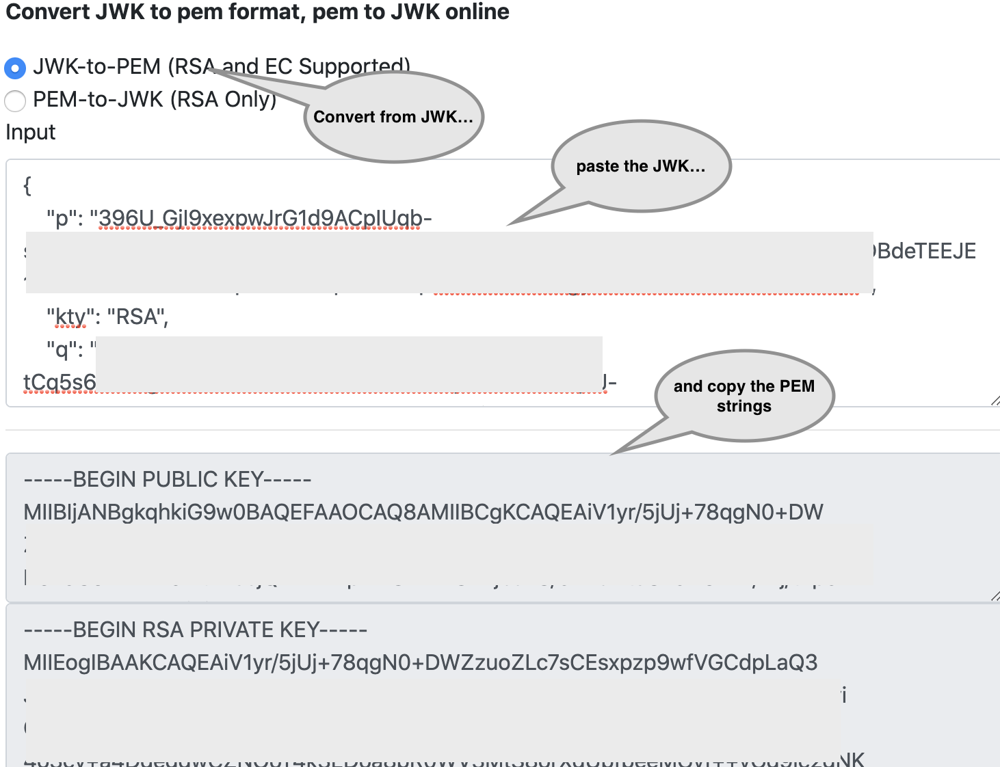
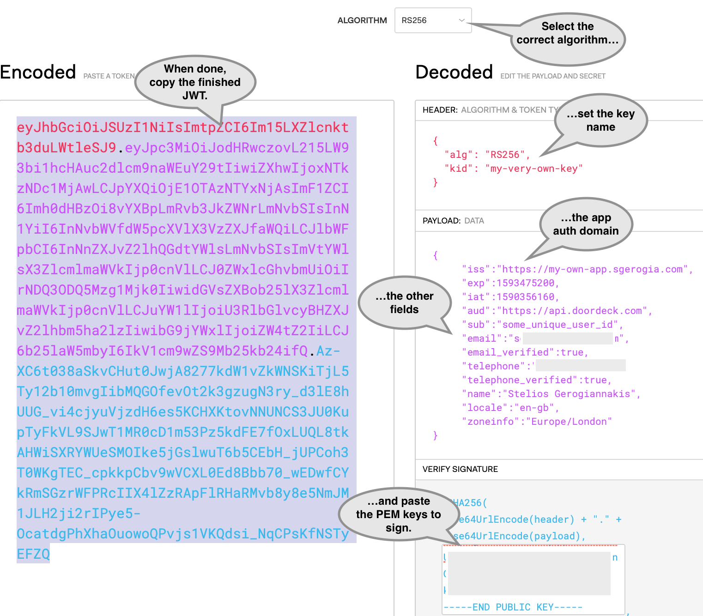

## A new paradigm 

Physical access has been slow to move to the internet age
The key has been with us for millenia 
in the last few decades has been slowly pushed back by the omni-present magnetic and NFC cards 


> Typical card access system

Card goes near reader prompting a read of its unique id
Id travels to controller device where it is checked against the whitelist
If confirmed, the controller opens the lock
  
Cards are easy to lose
they do not recognize an owner  
hard to centrally manage (one-time access, instantly revoke, API integration and automation...)  

Doordeck <sup>[1](#footnote_1)</sup> builds on top of existing physical card infrastructure and brings it online


When the user installs the app, it generates a public/private keypair 
This is securely sent to the Doordeck server and will be used to identify the user from then on 

NFC-enabled mobile phone goes near the Doordeck tile (or scans thew QR code printed on it)
https://doordeck.com/how-it-installs

The device requests access by sending the tile's id, signed with its private key 
This means "user X wants to open door Y"

The server checks the request against a number of possible rules (user allowed for this door, blackout times,...)
If successful instructs the controller add-on to unlock the door 

Application --> User


This only scratches the surface 
and will make more sense through a hands-on example

## Security as a service

The Doordeck entity model is quite simple 
 
```
+-------+         +--------+
|       |*       *|        |
| User  +---------+ Site   |
|       |         |        |
+-------+         +--------+
    |*               1|
    |                 |
    |                 |
    |                *|
    |             +--------+        +-------+
    |            *|        |1    0-1|       |
    +-------------+ Lock   +--------+ Tile  |
                  |        |        |       |
                  +--------+        +-------+
```

* A User has access to a number of Sites.  
* Each Site has a number of Locks (doors), for each one of which the User is explicitly permissioned.
* Each Lock can be associated with a Tile, which is effectively an identifier for the door.

To do a hands-on test of the API we need to do 3 things:  
* create an account with Doordeck, and
* associate the new account with a demo door, and 
* unlock it!

We will be calling the [staging version][5] of the API.

### Creating a user account

This is fairly easy at the [registration portal][3].  
After logging in, the web app's home screen looks rather sparse; we are not yet associated with any locks.


> Doordeck user login screen

### Associate with the demo door

First we need to discover our user's identifier.  
Let's call the [login endpoint][4], replacing the `EMAIL` and `PASSWORD` with your credentials.  
```bash
curl 'https://api.staging.doordeck.com/auth/token/' \
      -X POST \
        -H 'content-type: application/json' \
        --data-binary '{"email":"EMAIL","password":"PASSWORD"}' \
        | jq -r '.authToken'
```
Copy the printed token and paste it in the [debugger of jwt.io][2].  


> User id in the authentication token

To associate with the demo door, we will use a [simple web form][6] which has been provided for this reason.  
Paste your user id and click submit.


> Associate with demo door

You can verify the association by refreshing your [home screen][7] in the web app. 


> Demo door in the web app

You are all set to...

### Unlock your first door

On [logging in][4], each user is issued with  
* an `authToken` to call the non-sensitive API endpoints, and 
* a `privateKey` to sign a JWT authentication payload for sensitive operations like [unlock][8]. 

The signed authentication payload is time-constrained and serves to prevent replay attacks.   

This security feature makes it hard to test by hand; one needs to be typing super-fast.  
For this reason I have created the following utility script, which  
* takes in your credentials, 
* logs in
* signs a JWT authentication payload, and
* unlocks the demo door.

<details markdown="1">
  <summary>Click to expand!</summary>

```bash
#!/bin/bash

echo "Please provide your Doordeck user credentials"
read -p "Email: " USER
read -s -p "Password: " PWD

LOCK_ID="ad8fb900-4def-11e8-9370-170748b9fca8"

echo "Retrieving token for user $USER..."

read AUTH_TOKEN PRIVATE_KEY < \
  <(echo \
    $(curl 'https://api.staging.doordeck.com/auth/token/' \
      -X POST \
        -H 'content-type: application/json' \
        --data-binary '{"email":"'"$USER"'","password":"'"$PWD"'"}' \
        | jq -r '.authToken, .privateKey' \
      ) \
   )

echo $PRIVATE_KEY \
  | base64 --decode \
  | openssl pkcs8 -nocrypt -inform DER -outform PEM -out privatekey.pem

read USER_ID < \
  <(arrTOKEN=(${AUTH_TOKEN//./ }); echo ${arrTOKEN[1]} \
    | base64 --decode \
    | jq -r '.sub'
    )

IAT=$(date +%s)
EXP=$((IAT + 60))

echo "Preparing JWT auth. payload..."

HEADER='{"alg":"RS256","typ":"JWT"}'
BODY='{"iss":"'"$USER_ID"'","sub":"'"$LOCK_ID"'","nbf":'"$IAT"',"iat":'"$IAT"',"exp":'"$EXP"',"operation":{"type":"MUTATE_LOCK","locked":false,"duration":5}}'
HEADER_B64=`echo -n $HEADER | base64 | sed 's/+/-/g;s/\//_/g;s/=//g'`
BODY_B64=`echo -n $BODY | base64  | sed 's/+/-/g;s/\//_/g;s/=//g'`
SIGNATURE_B64=`echo -n $HEADER_B64.$BODY_B64 | openssl sha256 -sign privatekey.pem | base64 | sed 's/+/-/g;s/\//_/g;s/=//g'`
JWT=`echo -n $HEADER_B64.$BODY_B64.$SIGNATURE_B64`

echo "Unlocking demo door..."

curl "https://api.staging.doordeck.com/device/$LOCK_ID/execute" \
  -X POST \
  -H "Authorization: Bearer $AUTH_TOKEN" \
  -H "Content-type: application/json;charset=UTF-8" \
  --data-binary "$JWT"

```
</details>
 
Save it as an executable shell script and open a browser to the [demo door's web page][9].

Run the script and... voila!


> Door unlocking sequence

## 

### Prerequisites

I will assume you are on a Mac. <sup>[2](#footnote_2)</sup> 
curl
python 2.7.6
install pip 

### Registering the application

First of all the integrator server application 
needs to identify itself to the Doordeck API <sup>[3](#footnote_3)</sup> 

The application is registered in the Doordeck portal (https://developer.doordeck.com/)


The integrator application identifies needs to 1) identify itself and 2) prove its identity.

#### Application identity

Finally the application is going to identify itself using a URL
This will go in the `iss` field of the incoming JWT
and is called Auth domain in the Doordeck portal


> Adding the application's external identifier

#### Application security

itself to the Doordeck server with a signature key

and the current user with an OpenID JWT (link?)


Quickest way to generate a JWK from https://mkjwk.org/
https://tools.ietf.org/html/rfc7517

Select an algorithm from the RFC list 
https://tools.ietf.org/html/rfc7518#section-3.1

Same tool can be launched locally
https://github.com/mitreid-connect/json-web-key-generator


> Adding the integrator application identifier

Convert to PEM: https://8gwifi.org/jwkconvertfunctions.jsp
Run locally: https://8gwifi.org/download.jsp


> Converting the JWK to PEM

Save the PEM keys because we will need them when we...

### Generate a user JWT

The calling user's details are encapsulated in a JWT, signed by the application 
The full list of allowed fields can be found here (https://gist.github.com/mpbarnwell/532d0425abaf22239344151145ba8595#file-openid-fields-md)
You can use the following template 

<details markdown="1">
  <summary>Click to expand!</summary>

```
--- Header ---
{
  "alg": "RS256",
  "kid": "REPLACE_ME_WITH_THE_JWK_KID"
}

--- Payload ---
{  
     "iss":"REPLACE_ME_WITH_YOUR_APPLICATION_AUTH_DOMAIN",
     "exp":REPLACE_ME_WITH_A_UNIX_TIMESTAMP_FOR_EXPIRY,
     "iat":REPLACE_ME_WITH_A_UNIX_TIMESTAMP_FOR_ISSUANCE,
     "aud":"https://api.doordeck.com",
     "sub":"REPLACE_ME_WITH_YOUR_USER_UNIQUE_ID_CAN_BE_ANYTHING",
     "email":"some@email.com",
     "email_verified":true,
     "telephone":"+441234567890",
     "telephone_verified":true,
     "name":"Your TestUser",
     "locale":"en-gb",
     "zoneinfo":"Europe/London"
}
```  
</details> 

The placeholders `REPLACE_ME` are values which you should replace for things to work.
You may also want to set the email and phone number to something valid for further testing.

Timestamps: https://www.unixtimestamp.com/ 

Copy-paste the above template and assemble your final JWT in the online helper at [jwt.io][2].


> JWT creation in jwt.io


## Parting thoughts

Competition 

https://www.getkisi.com/access-control-system

https://tapkey.com/

http://www.controlsoft.com/controlsoft-mobile-access.asp

Bluetooth is double edged sword
https://www.buildings.com/news/industry-news/articleid/21265/title/simplify-access-control-with-smartphones


## Footnotes

1. <a name="footnote_1"></a>Full disclaimer: I am an angel investor in Doordeck. 
2. <a name="footnote_2"></a>It will be easy to follow on another development environment. 
3. <a name="footnote_3"></a>This section is a condensed version of the guide found [here][1].


  [1]: https://doordeck.com/developer/authenticating-your-users
  [2]: https://jwt.io/#debugger-io
  [3]: https://app.doordeck.com/#/register
  [4]: https://developer.doordeck.com/docs/#login-v1
  [5]: https://developer.doordeck.com/docs/#environments
  [6]: https://api.doordeck.com/demo/
  [7]: https://app.doordeck.com/
  [8]: https://developer.doordeck.com/docs/#unlock
  [9]: https://demo.doordeck.com/assets/