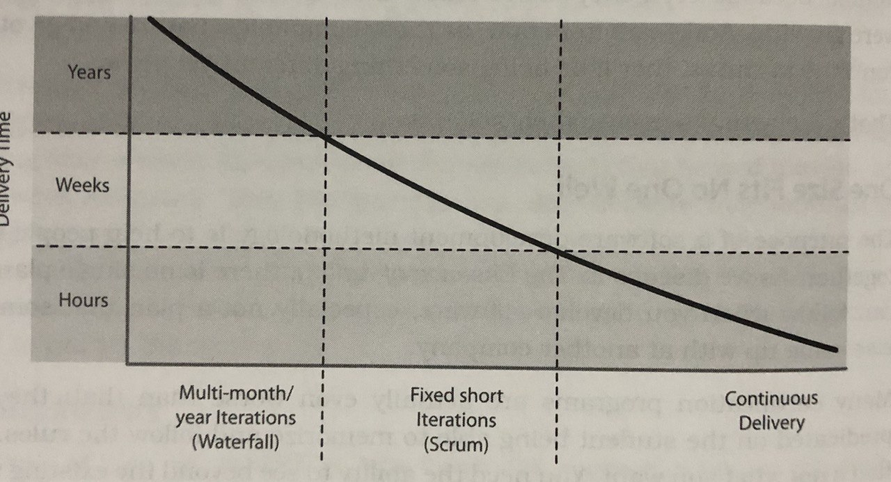

# Am I a Pragmatic Programmer?


This post begins with a warning: **this is a very personal and selfish outcome of a book**. In any sense it is meant to be a summary about it and, if I were you, I would give it a try. There are a lot of great concepts that are great to know and I am leaving them out because I've seen them in other books, my work experience, college, etc. You shouldn't. Only some of them are: Orthogonality, Coupling, DRY, Big O, CI, CD, etc.

I got a nice hardcover edition of **The Pragmatic Programmer 20th Anniversary Edition** by David Thomas and Andrew Hunt a few months ago and I read it in a couple of weeks. This is a classic that was a hit two decades ago but I’m a little young to have read it before.

Making your ideas survive in the industry so much time seems almost impossible but I think the authors succeeded. I really enjoyed some parts of the book and I want to express what I want to take away from the book. And for Dave and Andy's enjoyment, **I would try to use 10 tips from the list of 100 tips that comes with the book**.

## Think! About Your Work
This is a stolen one. THINK! is (was?) IBM's slogan but it represents a lot of what the authors want to express. Programming is not such a complex task, but you have to think to do it. Avoid the autopilot. It is very easy sometimes, at least for me, to fall in the trap. Don't do it. **THINK!**

## Invest Regularly in Your Knowledge Portfolio
This tip includes some personal finance ideas you may know: Diversify, Invest regularly, Manage risk, among others.

The tip is here because I’m suffering from a little FOMO. Doctors Dave and Andy say: **be critical when you learn, don’t always follow trends, get 1 programming language per year and 1 technical book per month.** I’m fine with the first number: I think 2019 was my Elixir year, now with a Golang year going as badly as 2020 itself. If you ask me today, I'm expecting Clojure 2021. As a person who reads more than that of books for fun and who tries to be always reading a technical book, I’m far from a technical book a month.

I’m not judging here. I will try to be critical. Maybe saving a little time each day is enough. I‘ll give it a try. Let’s see what happens.

## Good Design is Easier to Change Than Bad Design
This tip is  a guide for every other technical tip or recommendation in the book. Some good practices that follow this idea are very known, including DRY.

**More interesting are the chapters on Domain Languages (DSLs) and Tracer Bullets**: the idea of starting a project creating a final version of a feature (not a prototype) that will help you build the structure and have a better sense of progress, while helping you to *aim better* for the next feature.

## Estimate to Avoid Surprises
To estimate is to answer questions with missing information. You have to recognize it but know that you can estimate. A great idea I took from the book is to **take note of every estimation you make** in your daily work and then add the actual result.

Other from that, it's very important to **choose the right unit when estimating**. 15 days and 3 weeks are similar amounts but the unit you chose already defined your interlocutor's perspective.

*How Do You Eat An Elephant? One Bite At A Time!* The authors share the idea that huge PERTs and similar techniques make no sense when faced with a new project. **Iterate the schedule with the code** and your estimations will become more and more accurate. 

## Keep Knowledge in Plain Text
We are entering Tools Land. **And the book's favorite tool is Plain Text.** Like this article. But applied for every piece of knowledge in your work.

For that, be able to use an editor for everything. Be fluent in your favourite editor. Use version control everywhere it may be used. 

I'm not a non-IDE purist. I use VS Code for most of my work but I'm very positive on the direction of this advice. **Move everything to Plain Text, use more Version Control, use more a shell editor.** I think this also applies outside of work: I am doing a creative writing workshop and have started writing in *Markdown* and using *git* to do Version Control on my texts. It's been a month and any dead author has shown up at night and killed me, so I think I'll be fine.

## Design with Contracts
**Design By Contract (DBC)** is a development by Bertrand Meyer for the *Eiffel* programming language. 

Every function and method in a software system does something. Before starting that something, the function may have some expectation of the state of the world, and it may be able to make a statement about the state of the world when it concludes. That could be expressed in three concepts: *preconditions*, *postconditions* and *class invariants*. And in Meyer's words: *If all the routine's preconditions are met by the caller, the routine shall guarantee that all postconditions and invariants will be true when it completes*. But not more than that. Your universe of possibilities to code is automatically reduced.

The issue with DBC is perhaps the availability of tools to apply it. **And here I am faced with this problem again. There are many good concepts in programming that many of the mainstream programming languages lack.** Dave and Andy seems to be big fans of *Elixir* and *Clojure*, for example. I think *Rust* too. Applying DBC in Python, for instance, is very tricky and may become a type system. DBC is not a type system and it would be a pretty bad one. On the other hand, you could do it with guards in Elixir and the implementation in Clojure is awesome:

```clojure
(defn accept-deposit [account-id amount]
    { :pre [ (> amount 0.00)
             (account-open? account-id) ]
      :post [ (contains? (account-transactions account-id) %)] }
    ;; Some other processing goes here...
    ;; Return the newly created transaction:
    (create-transaction account-id :deposit amount))
```

## Crash Early
This tip has a special place for me because of its origins. *Crash Early!* comes from the great Joe Amstrong, one of Erlang's designers. **The idea is that dead programs tell no lies.**

**The impossible in your application should be handled as a pure exception.** Let it crash, don't catch it and raise a one of a family of exceptions. Let it crash and treat it as it is: an *impossible* hapenning. If this is not the case, the issue is in your code and you can solve it.

## Programming’s About Code, But Programs Are About Data
This can't be an OOP article. Maybe we can agree that OOP is useful, but it isn't as good as we used to think. The rest of the discussion doesn't belong here.

The book takes a concept that I first read in the Elixir world. **Programming itself is always about transforming data, not state, not objects, just data.** So we have to think like that and we usually don't. Functional programming and programming languages like Elixir give us the opportunity to do it. Please give them a chance.

In the discussion of other issues related to concurrency, the book takes a look at **actors or processes in Erlang**, a concurrently, async and shared-nothing solution to the problem. **Another interesting tool they recommend is a very old but great one: just a UML activity diagram.**

## Use Property-Based Tests to Validate Your Assumptions

Let's give a tip for testing. **Property-Based Testing is a cool way to test not your code, but your assumptions.**

Remember the DBC? If you defined that you expect a list of integers, other than using your classic unit test what would happen if you added a data generator with a random set of lists that actually proved your assumption to be correct? Simply put, that is property-based test. There is more information in the book and also in many articles in the Internet. **It is also very easy to implement in your preferred language.**

## Deliver When Users Need It

The last one refers to the importance of avoiding getting lost in the search improvement, being agile, doing Continuous Delivery, doing Continuous Integration or whatever. 



There is just one goal: **The Real Goal. Be in a position to deliver software at a moment's notice.** When your users need it. That concept is adaptable to your situation. You may not be able to deliver continously or something similar because of some project constraints. But that doesn't matter. Aim there, the goal is clear.

## Extra tip: Engineering Daybooks

This is cheating because it's the 11th and it's not selected as a tip in the book. But it seems like an interesting idea.

Dave once worked at a computer manufacturer with non-software engineers. He saw how they kept a journal, a kind of diary where they record what they did, ideas, things they learn, and so on. When the book is finished, they would write the date on the first page and put it on the shelf. 

The benefits are: they are more reliable than memory, it gives them a place to store non-revealing ideas in their immediate task, and it acts as a kind of rubber duck. I don't know why, but I feel I have to give it a chance.

---

We're done. **10 (+1) tips I took from the book but you can find many more if you take a look at the book.** If you found these interesting, I think that getting The Pragmatic Programmer would be a great idea for you.