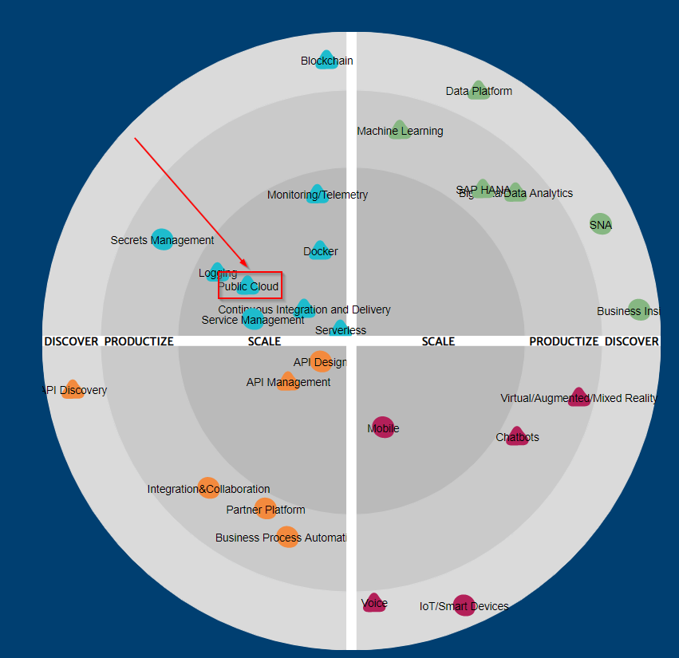

# Let's Scale! - Tools which Can Complete your Terraform Workflow

## Part 1: Don`t Repeat Yourself!

### Entering the "Scale" Phase of Haufe`s Cloud Journey

The cloud is not new for Haufe. When I started 4 years ago in the company, teams already used Azure or AWS here and there. This "discover to productize" phase is also reflected by the increasing number of "how to" articles for the cloud back at 2015/2016 on this blog, like [how-to-use-Lets-Encrypt-within-Azure](http://work.haufegroup.io/letsencrypt/). After that time, more and more products has started cloud native. And especially during the last one and half year we have reached a new level by entering into the scaling phase for the cloud, how you can see on the [Haufe-Tech-Radar](https://techradar.haufe.io/):




Today, the cloud is the starting point for our products and platforms in various ways, it can be a lift and shift migration of an existing VM stack or doing rewrites and greenfield projects based on serverless/container/FaaS stacks. It is now the normal morning ritual to log-in into AWS or Azure accounts, instead of writing tickets to your hoster. "The cloud" further supports us by putting data science into our products, the begining of this journey is described [here](http://work.haufegroup.io/upskilling_inverse_conway/).

From my perspective, Infrastructure as Code (IaC) is a key skill and paradigm to make it to this level of scalability. IAC provides an automated, reusable, composable, collaborative way to provision your cloud infrastructure. Therefore, for IaC provisioning, a lot of teams at Haufe Group have adopted declarative tools like Cloudformation, Serverless Framework and Terraform - or a combination of those.

### What you get from this series, and what not!

This blog series is about advanced use of Terraform, and gives you an overview of the open source ecosystem created by the community around Terraform. It is about how these tools can increase your team's work effiency, and therefore, the ability to scale within the domain of IaC. These tools described in this article can help you especially, if you are either a platform or SRE team, or if you are thinking about how to share you infrastructure templates between teams via a merge request contributing model. As well as if you are a product team which uses templates to create new services on the same architecure. The tools help you in following two ways:

1. **Modularization** (Part 1): The tool "Terragrunt" supports the idea of Terraform modules in a more consistent way by enabling you to use DRY Terraform code, defining configurations just once and inheriting Terraform module code.

2. **Collaboration** (Part 2): The tool "pre-commit" and its "Terraform githooks" supports the idea of working together on a "clean IaC" by adding formatter, linter and test as well as docu automation to your git repository.

Per tool I will touch these 3 questions:

- What I get from it?
- How does it work?
- What I have to consider?

This series doesn´t cover other provisioning tools like Cloudformation, AWS CDK, Azure Blueprints or Serverless Framework. It is also not about comparing these tools to Terraform. This article also gives you no deep dive for how to start with Terraform, you can find that, [here](https://learn.hashicorp.com/terraform/getting-started/build). Finally, it also doesn't give you an overview for how to combine it with configuration tools like Packer or Ansible.

What`s fair to mention is, that I moved these tools last month from my personal playground to the first products, which are not live yet! So I am just getting around to moving them out of my personal "discover" to "productize" phase. I hope that sharing my experiences at an early stage help, but I also encourage you to form your own opinion!

### Get DRY Code with Terragrunt

**What I get from it?**

In general Terragrunt enables you to define several Terraform configurations just once, instead of copying it. Terragrunt does this in a way that you can use Terraform as usual, but Terragrunt goes one step further to support an [immutable](https://www.hashicorp.com/resources/what-is-mutable-vs-immutable-infrastructure/) and [resuable](https://blog.gruntwork.io/how-to-create-reusable-infrastructure-with-terraform-modules-25526d65f73d) setup by separating logical components into separate modules with separate [states](https://charity.wtf/2016/03/30/terraform-vpc-and-why-you-want-a-tfstate-file-per-env/) for peace of mind and ease of change on top of Terraform in a more consistent way.

If you use multiple Terraform modules within your project you have to repeat per module the same Terraform backend but with different keys, provider and version configuration. Using variables in this part will throw [errors](https://discuss.hashicorp.com/t/how-do-i-add-a-variable-to-an-s3endpoint/3363/3) until now with v0.12. In the following example, you find an example for a regular Terraform backend configuration for dev and stage enviroments:

dev/main.tf:
```
#------------------------------------------------------
# TERRAFORM STATE DEV
#------------------------------------------------------

terraform {
  # S3 to store state files of the deployed ressources
  backend "s3" {
    bucket  = "my-terraform-state"
    key     = "dev/terraform.tfstate"
    region  = "eu-central-1"
    encrypt = true
    # DynamoDB table to disable concurrent changes from different users
    dynamodb_table = "my-terraform-locks"
  }
}
```

stage/main.tf:
```
#------------------------------------------------------
# TERRAFORM STATE STAGE
#------------------------------------------------------

terraform {
  # S3 to store state files of the deployed ressources
  backend "s3" {
    bucket  = "my-terraform-state"
    key     = "stage/terraform.tfstate"
    region  = "eu-central-1"
    encrypt = true
    # DynamoDB table to disable concurrent changes from different users
    dynamodb_table = "my-terraform-locks"
  }
}
```

Terragrunt on top of Terraform allows you to define this kind of information once, globally, at the root of your project and inherit to all other modules afterwards. Later, We will have a deeper look at how it works:

~/terragrunt.hcl:
```
#------------------------------------------------------
# TERRAFORM STATE
#------------------------------------------------------

remote_state {
  backend = "s3"
  # Terragrunt built-in function: 
  # generates the Terraform code for configuring the backend
  generate = {
    path      = "backend.tf"
    if_exists = "overwrite_terragrunt"
  }
  # Terragrunt built-in function: 
  # sets key relative to the modules
  config = {
    bucket         = "my-terraform-state"
    key            = "$path_relative_to_include()/terraform.tfstate"
    region         = "eu-central-1"
    encrypt        = true
    dynamodb_table = "tf-state-lock"
  }
}

```

Based on this configuration, you can use this for all other environments. Just add references via the Terragrunt "include function":

dev/terragrunt.hcl:
```
#------------------------------------------------------
# TERRAFORM STATE
#------------------------------------------------------
remote_state {
include {
  path = find_in_parent_folders()
}
```

stage/terragrunt.hcl:
```
#------------------------------------------------------
# TERRAFORM STATE
#------------------------------------------------------
remote_state {
include {
  path = find_in_parent_folders()
}
```

In the same manner, it works for the provider information, especially if you use "assume rule" on AWS, have a look [here](https://terragrunt.gruntwork.io/docs/getting-started/quick-start/#keep-your-provider-configuration-dry).

Like with Terraform, you can [source](https://www.terraform.io/docs/modules/sources.html) modules. Terragrunt implements this concept by either sourcing the module code from a directory or from a repository. If you choose to source your modules from a second repository, it gives you the ability to version it by the http ```ref``` argument like ```...?ref=v1.0.1```.

Afterwards you can use variables to customize configuration to your specific needs, e.g. for  sizing the resources per enviroment. In addition, with Terragrunt, this means you can inherit global or account specific configuration via the built-in functions and just change enviroment-specific variable values with a single configuration file and a few lines of code, for your live enviroment :

dev/backend/terragrunt.hcl
```
###################################################
#                       BACKEND
###################################################

#---------------------------------------
#    Module Setup
#---------------------------------------

# source module either from sibling repo or directory
terraform {
  source =
    "../../../../modules/backend/"
}

# Terragrunt in-built function: helper function to search
# in the root .hcl and interit provider and state configuration from there
include {
  path = find_in_parent_folders()
}

#-----------------------------------
#    Account-Level Configuration
#-----------------------------------

locals {
  # Automatically load account-specific-level variables
  environment_vars = read_terragrunt_config(find_in_parent_folders("account.hcl"))

  # Extract out common variables for reuse
  env = local.environment_vars.locals.environment
}

#---------------------------------
#   Module Specific Configuration
#---------------------------------

inputs = {
  desired_count = 1
  min_capacity  = 1
  max_capacity  = 4
  deployment_maximum_percent = 100
  deployment_minimum_healthy_percent = 50
}
```

At the same time, you keep your module code separated in the module repository, where additional of your services, projects or teams could source it. Defining it once, but using it multiple times by referencing, instead of copying.

modules/backend/main.tf:
```
###################################################
#               BACKEND MODULE
###################################################

resource "aws_ecs_service" "my_ecs_service" {
  name = "my_app_service"
  task_definition = aws_ecs_task_definition.my_ecs_service.arn

  desired_count = var.desired_count
  min_capacity  = var.min_capacity
  max_capacity = var.max_capacity
  deployment_maximum_percent = var.deployment_maximum_percent
  deployment_minimum_healthy_percent = var.deployment_maximum_percent
}
```

Terragrunt uses cli commands in the same way as Terraform -  ```validate```, ```plan```, ```apply```,  ```destroy```  etc. But with Terragrunt you can execute ```plan```, ```apply``` and  ```destroy``` as a single command for each module or with the appendix ```-all``` for all modules, within the same run. At that point, Terragrunt cares about ```dependency``` blocks, but you have to be aware of the [order](https://terragrunt.gruntwork.io/docs/getting-started/configuration/#configuration-parsing-order) the depedencies are executed. Terragrunt also offers to automatically run ```init``` in the background within you first ```plan``` or ```apply``` run by default.

**How does it work?**

[Terraform](https://github.com/hashicorp/terraform) is a single Golang binary which translates your Terraform configuration into cloud provider API calls like Azure, AWS or Atlas. [Terragrunt](https://github.com/gruntwork-io/terragrunt) is, in the same way, a Golang binary, which works as a wrapper for Terraform and calls the Terraform API. Therefore you can use Terragrunt 1:1 like Terraform on any version, but with additional functionality as you have seen in the paragraph above.

To install it to your local environment, as a Golang binary you downaload it via brew or [linuxbrew](https://docs.brew.sh/Homebrew-on-Linux).  If you use Windows, the [WSL](https://docs.microsoft.com/de-de/windows/wsl/install-win10) is an easy way to run bash commands. But, you can also download it "Windows native" via [chocolatey](https://chocolatey.org/search?q=terragrunt).

```bash
brew install terragrunt
```

To run it locally, as you have seen in the paragraph above, you run Terragrunt with the same commands as for Terraform cli. A complete list of the cli commands can be found in the [documentation](https://terragrunt.gruntwork.io/docs/reference/cli-options/).

```bash
terragrunt validate

terragrunt plan | terragrunt plan -all

terragrunt apply | terragrunt apply -all

terragrunt destroy | terragrunt destroy -all
```
To run it in your ci/cd pipelines, you can put Terragrunt either in your "single docker ci/cd tool image" as you may have done with your provider cli and Terraform already:

Dockerfile snippet:
```

FROM node:12.13.0-buster

# https://github.com/hashicorp/terraform/releases
ARG TFVERSION="0.12.26"
#https://github.com/gruntwork-io/terragrunt/releases
ARG TGVERSION="0.23.23"

# AWS CLI
RUN curl -o /usr/local/bin/aws-iam-authenticator && \
  chmod 755 /usr/local/bin/aws-iam-authenticator && \
  pip3 install awscli --upgrade

# TERRAFORM  
RUN mkdir /tmp/install && \
  curl --silent --location --output /tmp/install/terraform.zip "https://releases.hashicorp.com/terraform/${TFVERSION}/terraform_${TFVERSION}_linux_amd64.zip" && \
  unzip /tmp/install/terraform.zip -d /usr/local/bin && \
  chmod 755 /usr/local/bin/terraform && \
  rm -rf /tmp/install

# TERRAGRUNT
RUN mkdir /tmp/install && \
RUN curl -O https://github.com/gruntwork-io/terragrunt/releases/download/${TGVERSION}/terragrunt_linux_amd64 \
    && mv terragrunt_linux_amd64 /usr/local/bin/terragrunt \
    && chmod +x /usr/local/bin/terragrunt
      rm -rf /tmp/install
      
USER dockeruser

```

Or, you source it as a single container for the stages of the pipeline from a public image [container](https://github.com/alpine-docker/terragrunt).

Terragrunt gitlab-ci snippet:

.gitlab-ci.yaml:
```
stages:
- validate
- plan
- deploy
- clean

validate:
  stage: validate
  image: alpine-docker/terragrunt:0.13.0
  script:
    - terragrunt validate
  tags:
    - my-runner

plan:
  stage: deploy
  image: alpine-docker/terragrunt:0.13.0
  script:
    - terragrunt plan-all --terragrunt-non-interactive
  tags:
    - my-runner

deploy:
  stage: deploy
  image: alpine-docker/terragrunt:0.13.0
  script:
    - terragrunt apply-all --terragrunt-non-interactive
  tags:
    - my-runner

clean:
  stage: clean
  when: manual
  image: alpine-docker/terragrunt:0.13.0
  script:
    - terragrunt destroy-all terragrunt-include-external-dependencies
  tags:
    - my-runner
```
Besides installation, configuration, and integration, you have to focus on the design of your project up front: To leverage the effect of Terragrunt, create seperate repositories for your live and model code. Terragrunt project configuration relies on .hcl files, which you can name as you like. HCL-files are the same as Terraform TF-files which are also based on [HCL](https://github.com/hashicorp/hcl#hcl). The Terragrunt .hcl files provide the configuration you wish to inherit relative to their path. At the following you get a example git tree:

On the first site, the directory tree of the live code contains the .hcl files to use Terragrunt references. For this simple example, all non-prod environments are in a single AWS account. The .hcl files are the only files needed for live infrastructure creation:

```bash
|-- live
|   |-- terragrunt.hcl              --> root configuration for all subdirectories (provider, state, global var configuration)
|   |-- .gitlab-ci.yaml
|   |-- .gitignore                  --> ignore Terragrunt cache
|   |-- .pre-commit-config.yaml      --> project configuration of Terraform githooks
|   |-- non-prod
|     |-- account.hcl                --> account specific configuration
|       |-- dev
|           |-- enviroment.hcl       --> enviroment specific configuration
|           |-- api
|               |---- api.hcl        --> module specific configuration
|           |-- frontend
|               |---- frontend.hcl
|           |-- backend
|               |---- backend.hcl
|       |-- stage
|           |-- enviroment.hcl       --> enviroment specific configuration
|           |-- api
|               |---- api.hcl        --> module specific configuration
|           |-- frontend
|               |---- frontend.hcl
|           |-- backend
|               |---- backend.hcl
|   |-- prod
|     |-- prod
|         |-- account.hcl            --> account and enviroment specific configuration
|           |-- api
|               |---- api.hcl        --> module specific configuration
|           |-- frontend
|               |---- frontend.hcl
|           |-- backend
|               |---- backend.hcl
```

On the second site, the Terraform modules have their own directory for the configuration with the usual Terraform file structure:

```bash
|-- modules
|   |-- .gitigonre
|   |-- .gitlab-ci.yaml              --> pipeline for testing
|   |-- .pre-commit-config.yaml      --> project configuration of Terraform githooks
|   |-- api
|     |-- main.tf
|     |-- variables.tf
|     |-- outputs.tf
|     |-- README.md
|   |-- frontend
|     |-- main.tf
|     |-- variables.tf
|     |-- outputs.tf
|     |-- README.md
|   |-- backend
|     |-- main.tf
|     |-- variables.tf
|     |-- outputs.tf
|     |-- README.md
```

Excursion:

- *Additionally, to the previous structure you can add a "module composability layer", where you define the API module components again as source component modules for everything you need for your API, like the API-Gateway and Lambda etc. This creates a nested Terraform modularization by defining everything just one time and composing it the way you need it for your service.* 

- *You should think about how to put your modules together in the way they are deployed according to their life-cycles. Where you deploy your VPC and other network components, you deploy your pods, tasks or lambdas daily.*

- *If you have resources which you share across all environments and accounts, like ECR, it may make sense to put this in a "global" directory in a global account. This account can then be reached by all other accounts via [this policy](https://aws.amazon.com/de/premiumsupport/knowledge-center/secondary-account-access-ecr/) as a sample for ECR*

After you set up your project design, the Terragrunt magic can be used by putting the Terragrunt [built-in-functions](https://terragrunt.gruntwork.io/docs/reference/built-in-functions/) into the .hcl files. E.g. the "include function" allows you to include the configuation from the relative parent directory .hcl file:

```golang
include {
  path = find_in_parent_folders()
}
```

The last  to-do is to add the Terragrunt cache to your .gitignore. The cache stores the provider and module code per each ```apply``` and ```plan```:

```bash
# Temprorary folder for downloading the terraform modules in working directory during deployment
.terragrunt-cache

# Local .terraform directories
**/.terraform/*

# .tfstate files
*.tfstate
*.tfstate.backup

# Crash log files
crash.log
```

**What I have to consider?**

While Terragrunt supports using Terraform in a more consistent reusable way, it doesn`t fix all Terraform shortcomings. Example: secrets are still saved in state files in plaintext.

If you currently use a multi-repo-approach or a repo for each service and you want to include IaC for each service, you may end up  copying and cross referencing some of your configuration - or you may use a global IaC repository beside your service repositories to mitigate.

If you work locally with Terragrunt, you will find some ineffiencies, e.g. the Terragrunt cache gets quite big after a while, because it caches each run. There are more [gotchas](https://github.com/gruntwork-io/terragrunt/issues/658) as well.

### Summary

In part one of this series, we have seen how to increase your scalability around IaC with Terraform by adding Terragrunt to it. Terragrunt helps you to create DRY code for your Terraform modules, which can be useful for reusing IAC configurations, and inner sourcing infrastructure. If you are responsible for one monolthic product with only 2 enviroments like dev and prod, Terragrunt has less impact on your scalability. It can be different, if you share IaC for multiple enviroments, services, teams and accounts. Terragrunt's scalability-boost is also heaviliy depenedent on how much you work with Terraform and how you treat IaC as a strategic paradigm.

In part two we will have a look how little open-source helpers from the Terraform ecosystem can support you to keep your Terraform and Terragrunt code clean.

