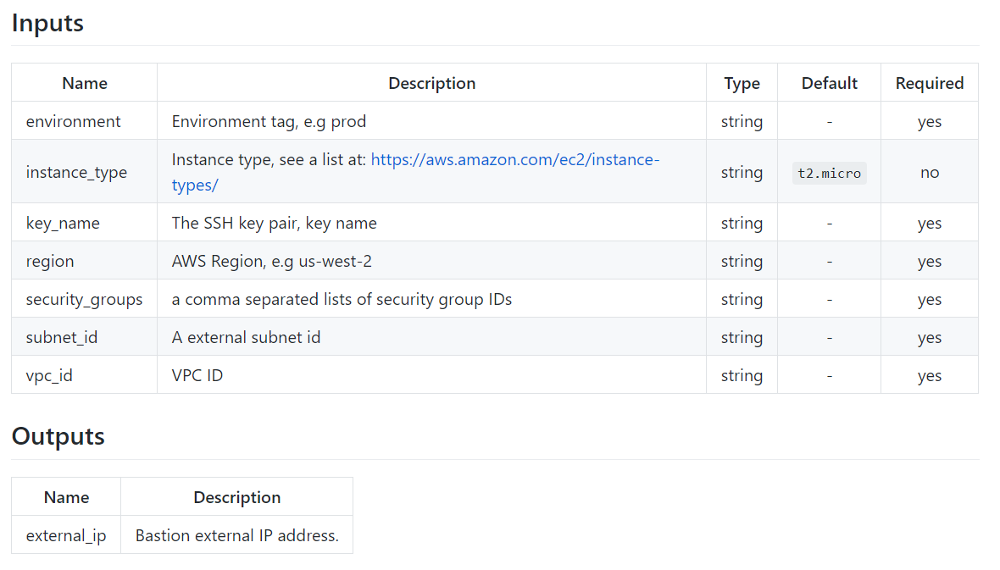
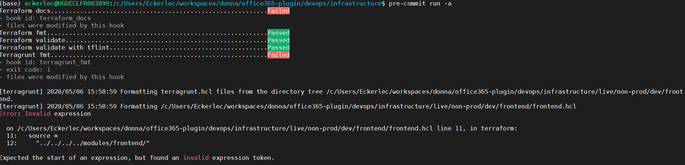

## Part 2: Keep your Infrastructure Code Clean!

### Retro

In [part-1](link) we took a short look on Haufe`s cloud journey and how Terragrunt can boost your Terraform modularization by use DRY Terraform code. In the this part of the series, we take a look which tools from the Terraform community could support your daily work to keep your Terraform code [clean](https://www.amazon.de/Clean-Architecture-Robert-Martin-2016-12-10/dp/B01N2GDUQ9), smiliar to keeping your app code clean.

### Generate automatically Documentation with Terraform-Doc

**What I get from it?**

[TF-Docs](https://github.com/segmentio/terraform-docs) generates and updates documentation for Terraform modules automatically, for input and output variables. This helps when you decide to split Terraform code ( something you can do with Terragrunt ) into a lot of small composable modules. You can choose between various output formats like markdown text or tables. Therefore you can just add it to your readme.md files in your repository for each module. With that TF-Docs is a consistent shortcut to keep your module documentation up to date on the same place where the code is, without writing it.

This is how it looks like as a sample markdown table:
{: width="100%"}

**How does it work?**

TF-Docs is a utility tool written in Golang which is available by MIT license. After local download you can run it via bash, or how we see later, add it via pre-commit to your git workflow.

It supports terraform v0.12.

Install it with brew or linuxbrew*:
```bash
brew install terraform-docs
```
*If you use Windows, [WSL](https://docs.microsoft.com/de-de/windows/wsl/install-win10) is an easy way to use it.*

Run it this way to get a markdown text:
```bash
terraform-docs markdown .
```
Run it this way to get markdown table:
```bash
terraform-docs markdown table .
```

TF-Docs prints the description of your variables and outputs, as following sample shows:

This code ...:
```bash
variable "environment" {
  description = "Environment tag, e.g prod"
}

variable "region" {
  description = "WS Region, e.g eu-central as default"
  default = "eu-central-1"
}

output "public_ip" {
  value = "${aws_eip.bastion.public_ip}"
  description = "Bastion hosts external IP address"
}
```

... outputs to this documentation:
```bash
# This is a Sample Readme

Lorem ipsum dolor sit amet, cum sint soluta instructior ut, eleifend efficiantur eam in. Cu tota splendide sed, mel discere appellantur cu.

<!-- BEGINNING OF PRE-COMMIT-TERRAFORM DOCS HOOK -->

## Inputs

| Name | Description | Type | Default | Required |
|------|-------------|:----:|:-----:|:-----:|
| environment | Environment tag, e.g prod | string | - | yes |
| region | AWS Region, e.g eu-central as default |eu-central-1 | string | - | yes |

## Outputs

| Name | Description |
|------|-------------|
| public_ip | Bastion hosts external IP address.|

<!-- END OF PRE-COMMIT-TERRAFORM DOCS HOOK -->
```

**What I have to consider?**

I personally think it is a best practise to add it as a githook to your git workflow, to use it in a consistent way. If you are a small team, you may not benefit as much from it as you would if you are platform team which shares the code with multiple teams. Also you could say, Terraform for itself is always an always-up-to-date document. Nevertheless with .md integration it works nicely!

### Run Security Scans with Terraform-Sec

**What I get out of it**

[TF-Sec](https://github.com/liamg/tfsec) performs vulnerability tests for your Terrafrom configuration in the following way:

- Checks for sensitive data inclusion across all providers
- Checks for violations of AWS, Azure and Google security best practice recommendations
- Scans modules (currently only local modules are supported)
- Evaluates expressions as well as literal values

The complete provider specific tests are listed [here](https://github.com/liamg/tfsec#included-checks).

**How does it work?**

The tool is written in Golang and supports terraform v0.12. Install it with brew or linuxbrew. If you use Windows the [WSL](https://docs.microsoft.com/de-de/windows/wsl/install-win10) is a easy way to run bash commands:

```bash
brew tap liamg/tfsec
brew install liamg/tfsec/tfsec
```

It works by scanning your directory recursively by running it on your terminal or the terminal from your ci/cd tool. You can choose between varrious output formats like JSON or jUnit.

Below you will find an example issue with S3. TF-Sec gives you a list of all findings, an explination per finding, the issue id and a link to get more information about each listed issue.

**Terraform Code:**

```bash
resource "aws_s3_bucket" "my_secure_bucket" {
    bucket = "my_bucket" 
}
```

**TFSEC Report:**

```bash
Problem 1
      
[AWS017][ERROR] Resource 'aws_s3_bucket.my_secure_bucket' defines an unencrypted S3 bucket (missing server_side_encryption_configuration block).

      /tfsec_test/s3_bucket.tf:1-3

           1 | resource "aws_s3_bucket" "my_secure_bucket" {
           2 |   bucket = "my_bucket"
           3 | }
           4 | 

      See https://github.com/liamg/tfsec/wiki/AWS017 for more information.
      
```

You can also choose to [ignore](https://github.com/liamg/tfsec#ignoring-warnings) specific issues by adding a flag to your Terraform code.

```bash
resource "aws_s3_bucket" "my_secure_bucket" {
    bucket = "my_bucket" 
     #tfsec:ignore:AWS017
}
```

Additionally, you can also [disable](https://github.com/liamg/tfsec#disable-checks) specific checks for all modules.

**What I have to consider?**

If you run this tool and have fixed the promoted issues, it does not mean you are fully protected afterwards, which is clear. But you can add it as an additional step to your CI/CD pipeline with the single command  "```tfsec .```" and you then have then made the world a bit safer place ;)

### Keep your Terraform Code Clean with Terraform-Lint

**What I get from it?**

On your IDE or in an editor like VS Code, you can snap in Terraform-Lint for several programming languages as well as for IaC syntaxes like the Hashicorp language HCL linters. The good thing about [TF-LINT](https://github.com/terraform-linters/tflint) is, it is a part of the other open source tools shown here in the article, and you can integrate it as a githook the same way as the other tools. Main advantagie is that it validates provider specific issues which ```terraform/terragrunt validate, plan or apply ``` doesn`t find.

**How does it work?**

No suprise, this is like all other tools written in Golang and supports terraform v0.12. You can install it with brew or linuxbrew:

```bash
brew install tflint
```

TF-Lint inspects all configurations under the current directory by default:

```bash
tflint .
```

It has rules for Azure as well as for AWS: AWS rules have been further developed by the community. [Here](https://github.com/terraform-linters/tflint/tree/master/docs/rules) you find a list of the rules. Below, you get a sample for how it works when you run it:

**Terraform Code:**
```bash
resource "aws_route" "my_route_table" {
  route_table_id         = "rtb_for_something"
  destination_cidr_block = "10.0.1.0/16"
}
```

**TFLINT Report:**
```bash
1 issue(s) found:

Error: The routing target is not specified, each aws_route must contain either egress_only_gateway_id, gateway_id, instance_id, nat_gateway_id, network_interface_id, transit_gateway_id, or vpc_peering_connection_id. (aws_route_not_specified_target)

  on template.tf line 1:
   1: resource "aws_route" "foo" {

Reference: https://github.com/terraform-linters/tflint/blob/v0.11.0/docs/rules/aws_route_not_specified_target.md
```

You can run it as well as all the other tools locally, or in your pipeline as an additional stage like following blueprint example shows:

.gitlab-ci.yaml:
```yaml 
stages:
- lint

terralint:
  stage: lint
  image:
    name: "$CI_REGISTRY/my_cicd_image"
  script:
    - tflint .
  tags:
    - my-runner
```

**What I have to consider?**

TF-Sec support specific TF versions in certain [ways](https://github.com/terraform-linters/tflint/blob/master/docs/guides/compatibility.md).

### Integrate all the Terraform Helpers in One to your Git Workflow with Pre-Commit

**What I get from it?**

[Pre-commit](https://pre-commit.com) enables you to add all the listed utility tools to your git workflow. More Terraform integrated tools can be found as ready-to-use githooks on github within this project [pre-commit-terraform](https://github.com/antonbabenko/pre-commit-terraform/blob/master/README.md). Besides the tools I already explained, pre-commit-terraform also uses the default Terraform function with *"terraform fmt"* for formatting and *"terraform validate"* for validatation as well as the same for Terragrunt.

[Here](https://pre-commit.com/hooks.html) you see the complete list of general available githooks.

**How does it work?**

To install the pre-commit tool and all the Terrform helpers as dependencies run:

```bash
brew install pre-commit gawk terraform-docs tflint tfsec coreutils
```

To install the pure pre-commit run following command:

```bash
brew install pre-commit
```

After installation you can add a '.pre-commit-config.yaml' for pre-commit configuration to your local git root and configure each tool. Following sample lists the tools configuration from this article:

```yaml 
---

repos:
- repo: git://github.com/antonbabenko/pre-commit-terraform
  rev: v1.30.0 # Get the latest from: https://github.com/antonbabenko/pre-commit-terraform/releases
  hooks:
      - id: terraform_docs
        name: Terraform docs
        description: Inserts input and output documentation into README.md (using terraform-docs).
        require_serial: true
        entry: terraform_docs.sh
        args: [--args=--with-aggregate-type-defaults]
        language: script
        files: (\.tf)$
        exclude: \.terraform\/.*$

      - id: terraform_tfsec
        name: Terraform validate with tfsec
        description: Static analysis of Terraform templates to spot potential security issues.
        entry: terraform_tfsec.sh
        language: script

      - id: terraform_tflint
        name: Terraform validate with tflint
        description: Validates all Terraform configuration files with TFLint.
        entry: terraform_tflint.sh
        language: script
        files: (\.tf|\.tfvars)$
        exclude: \.terraform\/.*$
```

Afterwards, you can run pre-commit with the specific command in your terminal as a test. It is also executed in the background before you commit or push as soon as you have added it as a githook. Below you see a sample screenshot of how the report looks like after execution:
{: width="100%"}


**What I have to consider?**

You need to like to work with terminal tools and the git command line: I really believe that you can boost your collaboration for IaC, by using these little helpers.

### Testing your Terraform Modules as Units

I haven't had time to take a deep look into it yet, but if you heavily rely on Terraform, the community ecosystem also has Unit-Test-Frameworks to offer. Terraform offers to write Golang unit tests for custom [plugins](https://www.terraform.io/docs/extend/testing/unit-testing.html), [Terratest](https://github.com/gruntwork-io/terratest) enables you to write Golang unit tests for your Terraform code and include Docker, Helm, and more. Terratest can also be added as a githook[https://github.com/gruntwork-io/terratest/blob/master/.pre-commit-config.yaml] or to your ci/cd. As an alternative, [kitchen-terraform](https://newcontext-oss.github.io/kitchen-terraform/getting_started.html) is a Ruby based test framework.

### Summary

In this series, we have seen how Terraform community tools can expand your IaC ecosystem and boost your scalability. Terragrunt helps you to get DRY code for your Terraform modules, which can be useful if you think about sharing, reusing and providing infrastructure. Pre-commit-terraform gives you the ability to enhance security, linting, testing and documentation within your git workflow for your team or teams. In addition, the tools are easy to add to your ci/cd pipeline, like we saw with the example of Terragrunt and Terraform-Lint, by adding a Docker Container to your pipeline and running a single bash command. 

If you are responsible for one monolthic product with only 2 environments like dev and prod, Terragrunt has less impact on your scalability. It is different, if you share IaC for multiple environments, services, teams and accounts. If and how much these tools helping you to scale also depends on how heavily you work with Terraform and whether you view IaC as a critical part of your software development skill portfolio.
