Physical access has been slow to move to the internet age.  
This post provides a hands-on overview of the Doordeck platform and its integration capabilities.   

# A new paradigm 

The humble key has been with us for millenia.  
In the last few decades, it has been replaced by magnetic and NFC access cards.  

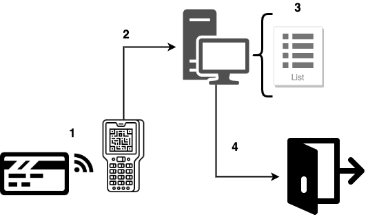
> Typical card access system

Access cards work in a pretty simple way.  
1. The card goes near the reader, prompting a read of its unique identifier. 
2. The reader relays the identifier to a central controller device (usually a computer), via fixed wiring, where... 
3. it is checked against the whitelist of card identifiers.   
4. If the card is in the whitelist, the controller instructs the door's lock to open. 
  
Though more flexible compared to keys, card-based systems leave a lot to be desired.  
Cards can be lost or stolen as easily as keys. Once that happens, there is no way of preventing unwanted access without 
manually removing the card id from the whitelist first. Cards do not "recognize" an owner.  
In addition, card-based systems are usually closed and installed on-premise. This makes them hard to manage and automate centrally.  
If not offered out of the box, extensibility (one-time access, instant revocation, complex automation...) may be impossible.    

The Doordeck platform <sup>[1](#footnote_1)</sup> builds on top of the [already installed offline access card infrastructure][19] and 
makes it extensible via an API platform.
This becomes possible by combining the capabilities of Android / iPhone platforms with public/private key cryptography.

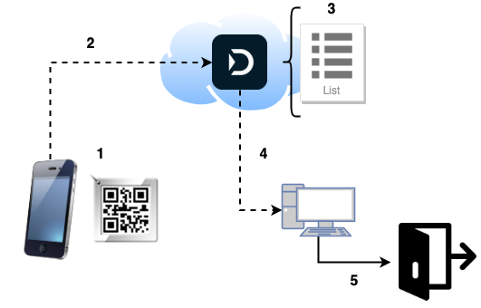

1. An NFC-enabled mobile phone goes near the [Doordeck tile][20] (or the camera scans the QR code printed on it).  
2. The device makes an API call, requesting access. The call's payload is the tile's id, signed with the user's private key. 
This means "user X wants to open door ABC, associated with tile Y". 
3. The server checks the request against a number of possible rules (user allowed for this door, blackout times,...). 
4. If successful, it instructs the access controller to... 
5. unlock the door.  

In this model, each user is identified by a public/private keypair. Depending on the access mode (direct or as a service), 
the keypair is generated on the Doordeck server or the mobile device. 

Let's see all of this in action through a hands-on example. 

# Security as a service

The underlying Doordeck entity model is quite simple.
 
```
+-------+         +--------+
|       |*       *|        |
| User  +---------+ Site   |
|       |         |        |
+-------+         +--------+
    |*               1|
    |                 |
    |                 |
    |                *|
    |             +--------+        +-------+
    |            *|        |1    0-1|       |
    +-------------+ Lock   +--------+ Tile  |
                  |        |        |       |
                  +--------+        +-------+
```

* A Doordeck User has access to a number of Sites (i.e. buildings).  
* Each Site has a number of Locks (doors). The User is explicitly permissioned for each one of them.
* Each Lock can be associated with a Tile. This is effectively an identifier for the door.

For a test of the API we need to do 3 things:  
1. Create a user account with Doordeck, 
2. associate the new account with a door (a demo one, for now), and 
3. unlock it!

We will be calling the [staging version][5] of the API.

## Creating a user account

This is fairly easy at the [registration portal][3].  
After logging in, the web application's home screen looks rather sparse; we are not yet associated with any locks.

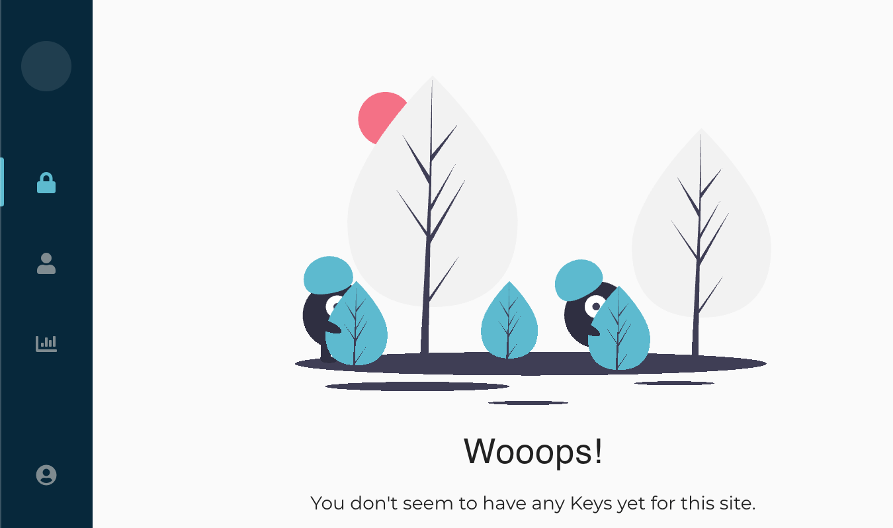
> Doordeck user portal screen

## Associate with the demo door

First we need to discover our user's identifier.  
Let's call the [login endpoint][4], replacing the `EMAIL` and `PASSWORD` with your credentials from the registration portal.  
```bash
curl 'https://api.staging.doordeck.com/auth/token/' \
      -X POST \
        -H 'content-type: application/json' \
        --data-binary '{"email":"EMAIL","password":"PASSWORD"}' \
        | jq -r '.authToken'
```
Copy the printed token and paste it in the [debugger of jwt.io][2].  
This will show us the internal identifier of the User.

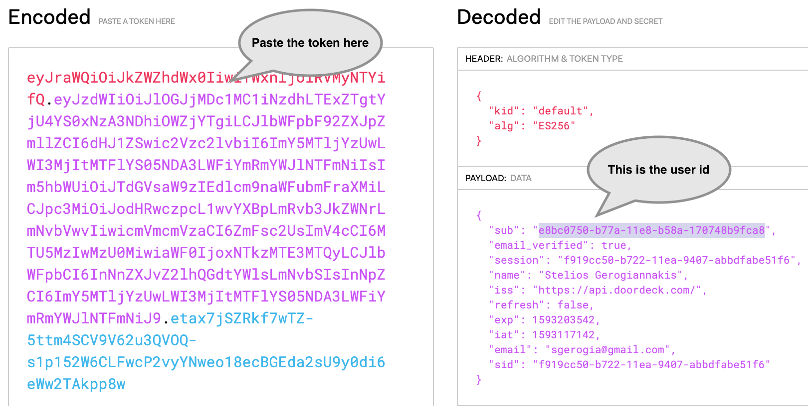
> User id in the authentication token

To associate with the demo door, we will use a [simple web form][6], which exists to facilitate testing.  
Paste your user id and click Submit.

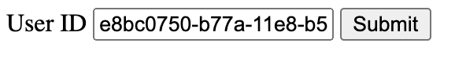
> Associate with demo door

You can verify the association by refreshing your [home screen][7] in the web app. 

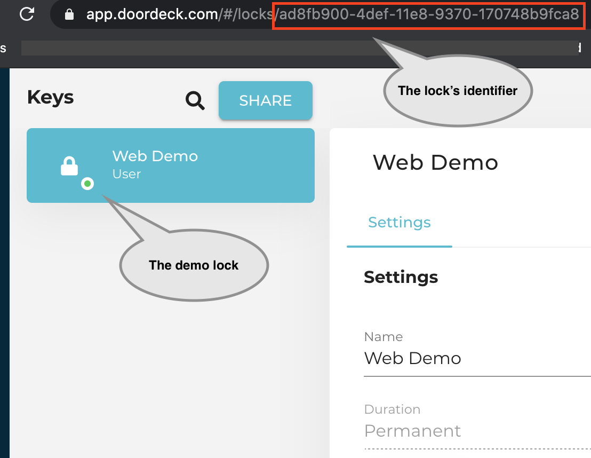
> Demo door in the web app

In a real-life scenario, the task of associating a User to a Lock, would be done by an admin, using the relevant 
lock update [API call][25]. 

You are all set to...

## Unlock your first door

On making a [login API call][4], each user is issued with  
* an `authToken` to call the non-sensitive API endpoints, and 
* a `privateKey` to sign a JWT authentication payload for sensitive operations like [unlock][8]. 

When sending a signed authentication payload, the Doordeck server imposes a time limit of up to 60 seconds from the time of 
signing to making the API call. This time constrain serves to prevent replay attacks.   

This security feature also makes it hard to test the API by hand; one needs to be typing super-fast.  
For this reason I have created the following utility script, which  
* takes in your credentials, 
* logs in to Doordeck,
* signs a JWT authentication payload, and
* unlocks the demo door.

<details markdown="1">
  <summary><b>Click to expand script</b></summary>

```bash
#!/bin/bash

echo "Please provide your Doordeck user credentials"
read -p "Email: " USER
read -s -p "Password: " PWD

DEMO_LOCK_ID="ad8fb900-4def-11e8-9370-170748b9fca8"

echo "Retrieving token for user $USER..."

read AUTH_TOKEN PRIVATE_KEY < \
  <(echo \
    $(curl 'https://api.staging.doordeck.com/auth/token/' \
      -X POST \
        -H 'content-type: application/json' \
        --data-binary '{"email":"'"$USER"'","password":"'"$PWD"'"}' \
        | jq -r '.authToken, .privateKey' \
      ) \
   )

echo $PRIVATE_KEY \
  | base64 --decode \
  | openssl pkcs8 -nocrypt -inform DER -outform PEM -out privatekey.pem

read USER_ID < \
  <(arrTOKEN=(${AUTH_TOKEN//./ }); echo ${arrTOKEN[1]} \
    | base64 --decode \
    | jq -r '.sub'
    )

IAT=$(date +%s)
EXP=$((IAT + 60))

echo "Preparing JWT auth. payload..."

HEADER='{"alg":"RS256","typ":"JWT"}'
BODY='{"iss":"'"$USER_ID"'","sub":"'"$DEMO_LOCK_ID"'","nbf":'"$IAT"',"iat":'"$IAT"',"exp":'"$EXP"',"operation":{"type":"MUTATE_LOCK","locked":false,"duration":5}}'
HEADER_B64=`echo -n $HEADER | base64 | sed 's/+/-/g;s/\//_/g;s/=//g'`
BODY_B64=`echo -n $BODY | base64  | sed 's/+/-/g;s/\//_/g;s/=//g'`
SIGNATURE_B64=`echo -n $HEADER_B64.$BODY_B64 | openssl sha256 -sign privatekey.pem | base64 | sed 's/+/-/g;s/\//_/g;s/=//g'`
JWT=`echo -n $HEADER_B64.$BODY_B64.$SIGNATURE_B64`

echo "Unlocking demo door..."

curl "https://api.staging.doordeck.com/device/$DEMO_LOCK_ID/execute" \
  -X POST \
  -H "Authorization: Bearer $AUTH_TOKEN" \
  -H "Content-type: application/json;charset=UTF-8" \
  --data-binary "$JWT"

```
</details>
  
Save the above script as an executable shell script and open a browser to the [demo door's web page][9].

Run the script, switch to the demo door's page and... voila!


> Door unlocking sequence

# Security as a Platform

Doordeck takes the concept of secure access further by offering an integration platform. 

This allows third parties and developers to offer access automation as an add-on service through their existing systems 
and applications.  
The applications range from [tenant experience applications][10], offered by large property managers, to
centralized [industrial facility management][11] to vanilla [office management][21].  

The conceptual entity model of the Doordeck platform is slightly different.

```
+-------+        +-------+         +-------+         +--------+
|       |*      1|       |*       1|       |*       *|        |
| App   +--------+  App  +---------+ Admin +---------+ Site   |
| User  |        |       |         |       |         |        |
+---+---+        +-------+         +-------+         +--------+
    | *                                                 1|
    |                                                    |
    |                                                    |
    |                                                   *|
    |                                                +--------+        +-------+
    |                                               *|        |1    0+1|       |
    +------------------------------------------------+ Lock   +--------+ Tile  |
                                                     |        |        |       |
                                                     +--------+        +-------+
``` 

* The Doordeck User (as described in the previous section) is the administrator of...
* the Application, registered with the Doordeck platform.  
The Application has a number of...
* App Users, which it has previously onboarded and authenticated.  
The Application takes care of uniquely identifying App Users to Doordeck (id, e-mail...).  
* The Doordeck Platform allows these App Users access to Locks, by issuing ephemeral security keys.    

Let's see how that works end-to-end, using the staging API.

## Registering the application

The integrator Application needs to identify itself to the Doordeck API. <sup>[2](#footnote_2)</sup> 

We start by registering the application in the [Doordeck portal][12]. 

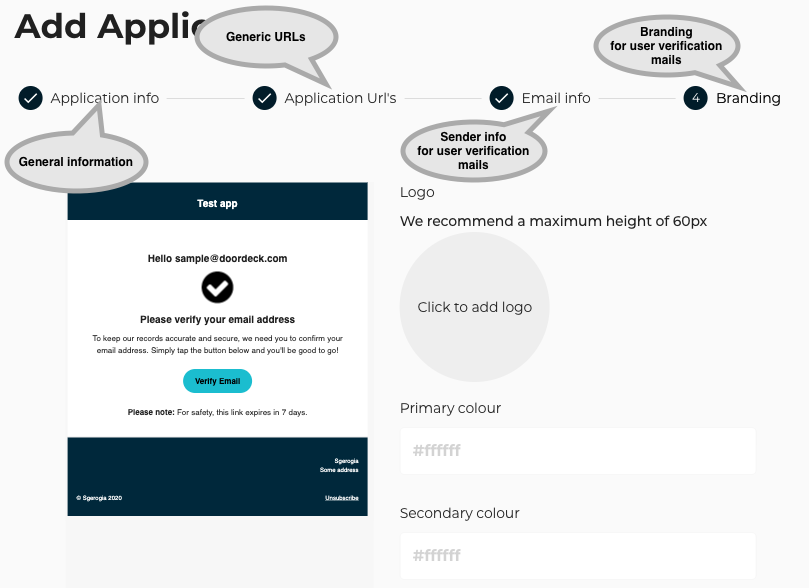

### Application identity

The application uniquely identifies itself to the API using a URL.  
This is called `Auth domain` in the Doordeck portal. Once defined, it will need to be specified verbatim in the `iss` 
field of all JWTs sent to the API.

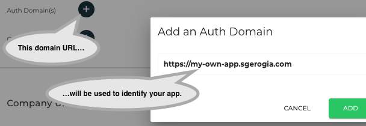
> Adding the application's external identifier

### Application security

We will also need to upload the public key of the application.  
The application will sign JWTs with its private key as an authentication step every time it calls the Doordeck API.

The developer portal requires the upload of the public keys in [JWK format][13].  
For test purposes, this can be generated manually at [https://mkjwk.org/][14], making sure to only select an algorithm 
from the [relevant RFC-mandated list][15] (e.g. RS256).  
The website can also generate the keys in PEM format. We will needd PEM to automate the local signing of the payloads.  

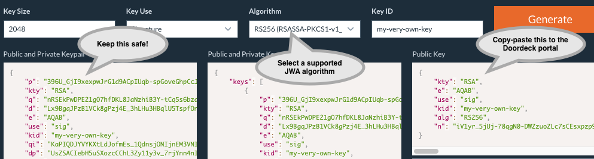
> Manually generating a JWK 

Alternatively, if you have  
* [Java 14+ installed][16] and 
* the [lokey Python tool][18] 

you can take a shortcut and generate the keys using the following little script.  
The script    
* downloads the mkjwk JAR from [Github][17], 
* generates a 2048 bit RSA key named `my-key`, 
* creates files `fullKey.jwk` and `publicKey.jwk` in the current directory, and
* creates `privateAppKey.pem` and `publicAppKey.pem` derived from them.

<details markdown="1">
  <summary><b>Click to expand script</b></summary>

```bash
#!/bin/bash

curl -L -o json-web-key-generator.jar https://github.com/mitreid-connect/json-web-key-generator/releases/download/json-web-key-generator-0.8.2/json-web-key-generator.jar

java -jar json-web-key-generator.jar -t RSA -s 2048 -i my-key -u sig -p -o fullKey.jwk -P publicKey.jwk

cat fullKey.jwk | lokey to pem > privateAppKey.pem

cat publicKey.jwk | lokey to pem > publicAppKey.pem
```
</details>

Paste the public JWK (`publicKey.jwk`) in the Doordeck portal. This will be used to verify your application's API calls. 

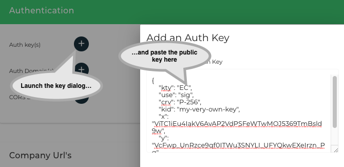
> Adding the integrator application identifier

Save the PEM files because we will need them when we...

## Generate an application JWT

As we saw in the previous section, upon [user login][4], we receive a private key with which to sign API call JWTs.  

The case of an Application making API calls is not much different.  
The Application signs the JWT with its private key and defines the App User details (name, e-mail...) in the JWT's body. 
Since this is a trusted Application, the App User details are also trusted. 

The following script assembles, tests and saves such an authentication token using  
* the Application's auth. domain,
* a user e-mail provided by you,
* the `privateAppKey.pem` file generated previously, and
* assuming that the signature algorithm is `RS256` and the Application's key is named `my-key`.

Save the script somewhere as `step1.sh` and run it.

The generated authentication token will be valid for 43,200 sec (i.e. 12 hours).

<details markdown="1">
  <summary>Click to expand script</summary>

```bash
#!/bin/bash

echo "Please provide your Application auth. domain"
read -p "Domain: " DOMAIN
echo "Please provide your Application User's e-mail"
read -p "E-mail: " EMAIL

IAT=$(date +%s)
EXP=$((IAT + 43200))

echo "Preparing the authentication token JWT..."

HEADER='{"alg":"RS256","typ":"JWT","kid":"my-key"}'
BODY='{"iss":"'"$DOMAIN"'","iat":'"$IAT"',"exp":'"$EXP"',"aud":"https://api.doordeck.com","sub":"'"$EMAIL"'","email":"'"$EMAIL"'","email_verified":true,"telephone":"+441234567890","telephone_verified":true,"name":"Name '"$EMAIL"'","locale":"en-gb","zoneinfo":"Europe/London"}'
HEADER_B64=`echo -n $HEADER | base64 | sed 's/+/-/g;s/\//_/g;s/=//g'`
BODY_B64=`echo -n $BODY | base64 | sed 's/+/-/g;s/\//_/g;s/=//g'`
SIGNATURE_B64=`echo -n $HEADER_B64.$BODY_B64 | openssl sha256 -sign privateAppKey.pem | base64 | sed 's/+/-/g;s/\//_/g;s/=//g'`
JWT=`echo -n $HEADER_B64.$BODY_B64.$SIGNATURE_B64`

echo "Validating the application JWT. You should see the user details printed below..."

curl -X GET \
  https://api.staging.doordeck.com/platform/auth \
  -H "Authorization: Bearer $JWT" 

echo -n "$JWT" > auth.token
```
</details>

## Authenticating the device

The 3rd party application on the App User's phone needs to unambiguously and securely identify the user and her phone to 
Doordeck before unlocking a door.  

To achieve this, the [Doordeck mobile SDK][22] generates a new [Ed25519 keypair][23], when the user logs in to the device.  
This is sent to Doordeck, "registered" against the App User's "profile" and comes back as a signed certificate.  
This proves  
* to the SDK that the server responding is indeed the Doordeck API, and
* to the Doordeck API that the device belongs to a previously authorized App User (in subsequent unlock attempts).  

To emulate these steps manually, we can utilize the [Pynacl Python library][24], for generating and handling Ed25519 key material.  
After installing Pynacl, save the following Python 2.7 script as `ed25519.py` in the current working directory; we will be 
calling its methods.

<details markdown="1">
  <summary>Click to expand Python script</summary>

```python
import sys
from nacl.signing import SigningKey
from nacl.encoding import Base64Encoder

def generate_keys():
    sk = SigningKey.generate()
    vk = sk.verify_key
  
    f = open("private_base64.key", "w")
    f.write(sk.encode(Base64Encoder()))
    f.close()

    f = open("public_base64.key", "w")
    f.write(vk.encode(Base64Encoder()))
    f.close()

def sign_message():
    f = open("private_base64.key", "r")
    sk_base64 = f.read()
    f.close()

    message = sys.stdin.read()

    sk = SigningKey(sk_base64, Base64Encoder())
    sig = sk.sign(message).signature
    sys.stdout.write(sig)
```
</details>
‍

Let's pretend that the App User has opened the 3rd party mobile application.  
The SDK generates an Ed25519 keypair and sends the public key to the Doordeck API, along with the current App User's details.
   
We have already constructed and saved an authentication token from the previous script, so we will re-use that token.

<details markdown="1">
  <summary>Click to expand script</summary>

```bash
#!/bin/bash

TOKEN=`cat auth.token`

echo "Generating the ephemeral key..."
python -c 'import ed25519; ed25519.generate_keys()'

echo "Submitting the ephemeral key..."
curl -X POST \
    "https://api.staging.doordeck.com/auth/certificate"  \
    -H "Authorization: Bearer $TOKEN"  \
    -H 'content-type: application/json'  \
    --data-binary "{\"ephemeralKey\":\"`cat public_base64.key`\"}" > certs.json

USER_ID=$(cat certs.json | jq -r .userId)

echo -n "The userId is: "
echo $USER_ID
echo -n $USER_ID > user.id

CERTS=$(cat certs.json | jq .certificateChain)
echo -n "$CERTS" > cert.chain
```
</details>

‍This script (let's save it as `step2_1.sh`) does the following  
* Generates a new ephemeral key 
* Submits it to Doordeck
* Prints back the Doordeck UUID for the particular App User and saves it for the next step, and
* Saves the certificate chain of the ephemeral key (again, for the next step). <sup>[3](#footnote_3)</sup>

If the App User's e-mail is a valid one, then she will receive a confirmation mail like the following

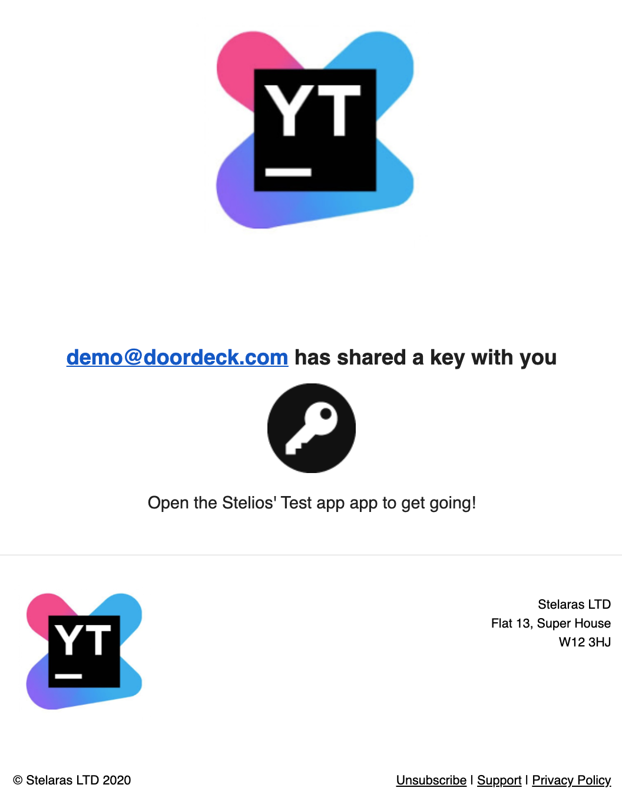
> Key sharing e-mail confirmation
 
Like before, we will need to...

## Associate the App User with the demo door

Go to the [web form][6], paste the App User id printed from the script you have just run and click Submit.


> Associate with demo door

And now we are again ready to...

## Unlock the demo door

The following script (let's call it `step_2_2.sh`) is using all of the artifacts we gathered in our previous steps.  
Namely, it loads  
* the authentication token, identifying the Application and providing the App User details
* the UserId and Certificate chain, proving that the user device can be positively identified by a known ephemeral 
Ed25519 keypair
* the private key of the Ed25519 keypair, for signing the unlock request and closing the security "loop". 

<details markdown="1">
  <summary><b>Click to expand script</b></summary>

```bash
#!/bin/bash

LOCK_ID="ad8fb900-4def-11e8-9370-170748b9fca8"

echo "Loading token, user id and cert. chain..."

TOKEN=`cat auth.token`
CHAIN=`cat cert.chain`
USER_ID=`cat user.id`

IAT=$(date +%s)
EXP=$((IAT + 60))

echo "Preparing door unlock payload..."

HEADER='{"alg":"EdDSA","typ":"JWT","x5c":'"$CHAIN"'}'
BODY='{"iss":"'"$USER_ID"'","sub":"'"$LOCK_ID"'","nbf":'"$IAT"',"iat":'"$IAT"',"exp":'"$EXP"',"operation":{"type":"MUTATE_LOCK","locked":false,"duration":5}}'
HEADER_B64=`echo -n $HEADER | base64 | sed 's/+/-/g;s/\//_/g;s/=//g'`
BODY_B64=`echo -n $BODY | base64  | sed 's/+/-/g;s/\//_/g;s/=//g'`
SIGNATURE_B64=`echo -n $HEADER_B64.$BODY_B64 | python -c 'import ed25519; ed25519.sign_message()' | base64 | sed 's/+/-/g;s/\//_/g;s/=//g'`
JWT=`echo -n $HEADER_B64.$BODY_B64.$SIGNATURE_B64`

echo "Unlocking demo door..."

curl "https://api.staging.doordeck.com/device/$LOCK_ID/execute" \
  -X POST \
  -H "Authorization: Bearer $TOKEN" \
  -H "Content-type: application/json;charset=UTF-8" \
  --data-binary "$JWT"

```
</details>
 
Open a browser to the [demo door's web page][9].

Run the script, switch to the demo door's page and watch the door being unlocked.

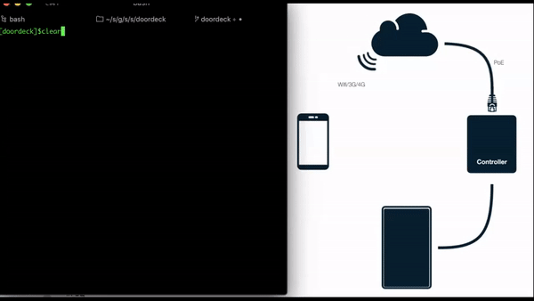
> Door unlocking sequence

# Parting thoughts

Connecting physical access to the online world is a necessity.  

As expected there are various other systems attempting to achieve this. 
These range from adding mobile access as an [afterthought][27] to high capex costs for [Bluetooth readers][28] to 
complete [door hardware replacement][29].

Doordeck occupies a sweet spot in the physical access vertical, as it [balances][30] 3 almost competing priorities:    
* security, 
* extensibility both for integrators and for expansion to [other][31] [sub-verticals][32], and 
* minimizing capex by re-use of existing physical infrastructure.

As organisations find a new modus operandi post-Covid (socially and financially), the Doordeck platform will provide 
solutions to many of the new challenges they face.

## Footnotes

1. <a name="footnote_1"></a>Full disclaimer: I am an angel investor in Doordeck. 
2. <a name="footnote_2"></a>This section is a condensed version of the guide found [here][1].
3. <a name="footnote_3"></a>Calling this script repeatedly for the same App User will trigger the [Verify Ephemeral Key with Secondary Authentication flow][26].  
This will be signaled by the API with an HTTP 423 return code. If you are just testing, it might be easier to repeat `step1.sh` with 
a different user e-mail.


  [1]: https://doordeck.com/developer/authenticating-your-users
  [2]: https://jwt.io/#debugger-io
  [3]: https://app.doordeck.com/#/register
  [4]: https://developer.doordeck.com/docs/#login-v1
  [5]: https://developer.doordeck.com/docs/#environments
  [6]: https://api.doordeck.com/demo/
  [7]: https://app.doordeck.com/
  [8]: https://developer.doordeck.com/docs/#unlock
  [9]: https://demo.doordeck.com/assets/
  [10]: https://www.sharplaunch.com/blog/tenant-experience-software-app/
  [11]: https://en.wikipedia.org/wiki/Facility_management
  [12]: https://developer.doordeck.com/
  [13]: https://tools.ietf.org/html/rfc7517
  [14]: https://mkjwk.org/
  [15]: https://tools.ietf.org/html/rfc7518#section-3.1
  [16]: https://gist.github.com/gwpantazes/50810d5635fc2e053ad117b39b597a14
  [17]: https://github.com/mitreid-connect/json-web-key-generator
  [18]: https://github.com/jpf/lokey
  [19]: https://doordeck.com/how-it-installs
  [20]: https://doordeck.com/blog/unlock-with-a-touch-doordeck-becomes-the-first-keyless-solution-to-use-native-nfc-on-iphone
  [21]: https://en.wikipedia.org/wiki/Office_management
  [22]: https://github.com/doordeck?q=sdk
  [23]: https://en.wikipedia.org/wiki/EdDSA
  [24]: https://pynacl.readthedocs.io/en/stable/install/
  [25]: https://developer.doordeck.com/docs/#share-a-lock
  [26]: https://developer.doordeck.com/docs/#register-ephemeral-key-with-secondary-authentication
  [27]: http://www.controlsoft.com/controlsoft-mobile-access.asp
  [28]: https://www.getkisi.com/how-it-works
  [29]: https://tapkey.com/ 
  [30]: https://doordeck.com/features
  [31]: https://doordeck.com/product-integrations/smart-printers
  [32]: https://doordeck.com/product-integrations/smart-elevators