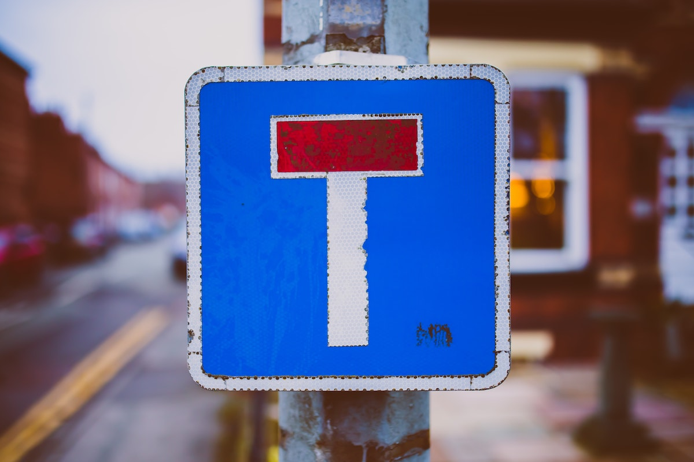

In the 2nd instalment on angel investing 
I cover the rest of my personal framework  

> You can find the 1st part here
 
# Letter I

> Photo by Thea M. on Unsplash

Qualifies the What

Innovation
Defensible moat

# Letter D

> Photo by Arthur Mazi on Unsplash

2 aspects here, completely orthogonal

## Delivery

The How of the business

## Due diligence

This is the Why not

# Bonus - Letter T 

> Photo by Jonathan Farber on Unsplash

2 different aspects again 

## Team 

This is the Who

For some people this is the most important

### Experience

Presentable
Eloquent
Pedigree e.g. Cazoo

### Complementary

### Passion 

# In the next episode

> Photo by Mollie Sivaram on Unsplash

Talk about 

incentives
platforms 
yourself as an angel 

and some closing thoughts 

## Footnotes

1. Full disclaimer: I am an angel investor in Doordeck. 

  [1]: 