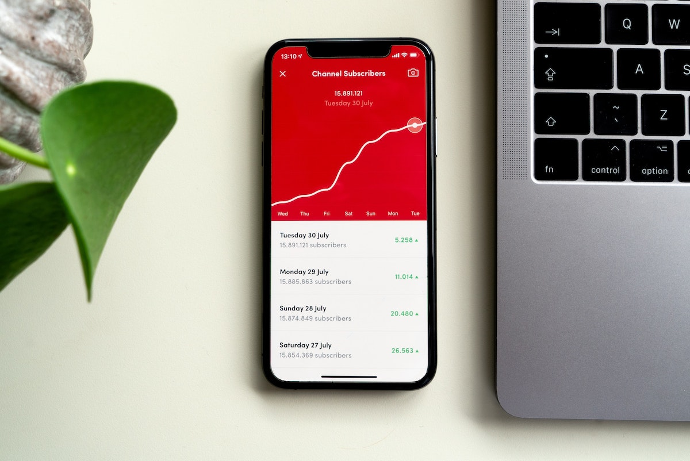

In this multi-part series, I am capturing my learnings as an outsider to the world of angel investing.  
I am using some fundamental concepts to build a simple thought framework.  

# Prologue

## Why these posts

A few years back, a friend was advocating angel investing (a.k.a. seed stage investing). When someone smarter than me 
talks about something, I tend to pay attention.  

I quickly discovered that it was completely different to my core domain, software engineering. New concepts, different 
concepts, complicated concepts; at least in my head.  

And ideas!  
So many different business ideas, all with the potential to conquer the world. Or will they?

There was no manual, no documentation, no all-knowing community in [StackOverflow][39] to tell you "Nope! That won't work".  
Just trial and error, with a [feedback loop][40] measured in years.

Hence, I decided to write down these articles.

## Who they are for

To be honest, primarily for me.  
I have found that my thoughts "crystallize" much better when I explain or I write them down. 
Not to mention that explaining something in a digestible way forces you to understand it better yourself.  

By consequence the intended audience is also someone like me.  
Clueless, or with some limited knowledge in the domain of business operation. But yet interested in investing, business 
foundation and the mechanics of value creation. 

So to keep things simple, let's say this is a long letter to myself, 5-6 years in the past. 

## What they are 

These posts are my understanding of the concepts and the mechanics.   
This has been acquired through reading, discussions, observations and interactions with early-stage companies.

However:  
I am not a professional investor, nor a VC partner.  
I am not a successful startup founder.  
I have not even been an early startup employee.

So all of these are effectively opinions and observations of an outsider.

## What they are not / Disclaimer

By consequence of the above, nothing in these posts constitutes investment advice. Let me repeat: Not. Investment. Advice.

Private equity is unregulated, opaque and completely [illiquid][36].  
Let's also not forget 2 other facts:   
* the startups that succeed are almost a [rounding error][37], and
* the world is brimming with scammers.

In other words, there are much better parking spots for your money.

Also, nothing in these posts constitutes endorsement or disapproval of anything or anyone. I may offer some examples to 
make a point, but they are exactly that: examples.  

Finally, the opinions are only mine.  
They do not represent those of my present or past employers.

## Credits / TL;DR

All credit goes to [Nick Ogden][35] and his very insightful [presentation to SyndicateRoom][34]. Really helped me 
convert my scattered thoughts into something which resembles a framework. 
 
If you only have a few minutes to spare, just skip all these articles and watch his presentation instead. 

# Intro

> Photo by Med Badr  Chemmaoui on Unsplash

A business is a very complicated system.  
A lot of different and opposing "forces" need to be kept at an optimal equilibrium. A successful business is even more so.  
Contrary to the popular myth that it ["only takes a good idea"][1] to succeed, the reality is somewhat different. A 
new business has a lot of things stacked up against it.   

Of course, we intuitively know that [a number of ventures thrive][2], some in a huge way. So much so, that in the last 
15 years there is a global ["startup cult"][41].  
The digitization of everything has lowered the barrier to entry for new businesses. But technology alone is not enough. [1](#footnote_1)  

Any new startup-in-the-making has a number of "lenses" to be viewed with. These can help determine its probability of success.    
In the whole lifecycle of the business (from fledgling idea to small to large venture) all of these aspects become 
equally important. But not at the same time.   
Their "weight" of importance changes at different stages and for different "stakeholders". [2](#footnote_2)   
Some of these lenses have an outsized weight at the beginning, some later on.

These different aspects are captured in 4 + 1 letters:  
**PAID T**  
Or PAID Tons, if you want to remember it.  

This and the follow-up articles will go through each letter and introduce each aspect.

# Letter P

> Photo by Lauren Fleischmann on Unsplash

The letter P stands for the **What** of the business.  
In [product management][42] lingo this is the user **Problem** that it solves. In other words, how would one describe 
the business in a couple of sentences? What is the core idea?

In concept-stage ventures this initial definition is one of the most important bits. For example, this is the foundational 
piece of info required in order to be considered for an [accelerator][66] or for seed stage investing. 

This "What" be further broken down in 2 parts.

## Problem

> Photo by Hans-Peter Gauster on Unsplash

This probably needs little clarification. The business **must** be solving a **real user problem**. 

Let's start from the word 'problem'.  
The world around us is full of inefficiencies, sometimes to the point of injustice. These range from the most fundamental 
(e.g. access to education) to the most complex aspects of life (e.g. access to financial services, buying a house).  
A business idea with any hope of success must identify and attempt to address one or more of these [needs][43].

This is not as easy as it may sound.   
It requires observation of user behaviour, identification of friction points and lateral thinking, in order to arrive at 
an insight for the underlying need.   
Frameworks like [JTBD][18] are useful as an indication of whether the business is addressing a symptom or a real problem. [3](#footnote_3)

The second word to clarify is 'real'. Though there is no hard-and-fast definition here.  
A real problem is something which    
* is causing "pain" to the user, 
* ...and she is maybe putting effort into overcoming it,
* there is a lack of satisfying solutions, and 
* there is a number of people with the same need.

This is an initial bellwether whether there would be a market for the business' offering.  

On the other hand it makes for a dubious start when the business is trying to solve problems that are not there. These 
could be either insignificantly small everyday nuisances or having already been solved (and the founder does not 
know about). [4](#footnote_4)

Of course, like with everything in life, the answer to the above is not black and white. Technology and digitization are 
great levellers, creating a [4th industrial revolution][44].  
The founders may be ahead of their time and have identified a [future user need][45]. Or they have identified a 
[polished solution][17] for a domain filled with sub-par alternatives.  

## Type of business

The second aspect of the "What" is the type of the business.

Not all ventures are created equal.   
Depending on *exactly what* they are doing, they come with their own specific challenges, economics, potential returns 
and required skill-sets. [5](#footnote_5)

Needless to say that  
* these categories are my own classification, 
* they do not cover everything under the sun, and 
* not every business out there will fall neatly in a single category.

### Produce  

> Photo by Chanita Sykes from Pexels

This is probably the simplest type of business, generating some agricultural produce (or basic manufacturing product).  
Think of a vegetable or animal farm, a vineyard or manufacturing plastic straws. It may look very simple, but it may be 
covering a genuine need or introducing a new variety in an underdeveloped market. [6](#footnote_6)

A produce type of business requires 2 basic things:  
* Capital  
A farm or a factory are [capital intensive][7]; one needs to do a lot of preparation and investment up-front.
* Know-how  
As a corollary of the above, one needs to have a knowledge of the domain. You cannot just create an [MVP][8] of a 
vineyard, if you don't know what you are doing. It would take [4 years][9] at best to realize you made your first mistake.

### Peddle  

> Photo by David Emrich on Unsplash

Or else: Buy things low, sell them high. This type of business is as old as mankind itself.

Commerce is moving online at a relentless pace. With many directories of [producers][49] and [suppliers][50], the 
barrier to entry has lowered significantly, especially in the developed world. [7](#footnote_7)  
Businesses in this sector no longer need a lot of capital to start and there is a glut of producers and products to pick from. 
This results in a business model easy to replicate and with potentially large competition.  
Almost always, this leads to low profit margins.  

In order for buy-and-sell businesses to succeed and scale, they need to get some things right.    
* **Attract customer's attention**  
A.k.a. marketing spend. In the online world this means bidding on Amazon or Google search keywords. This is effectively 
an ["arms race"][12], where the deep-pocketed win. This means upfront spend and lower longer-term margins.    
* **Big market**  
Being in a huge market (preferably with [inelastic demand][15]) helps a lot. The year 2020 has provided a text-book 
example of such a market: [PPE][16].  
* **Niche market**  
Sometimes there is a market which is so niche, that the few sellers get the buyers' undivided attention. Like people's 
personal tastes, this could be anything: from [sneakers][13] to [Decentraland real-estate][14]. 
* **Deep knowledge**  
The above points can be combined into a necessary trait for the trading business itself: it needs to have deep knowledge, 
in order to succeed. Knowledge of [tastes][51], knowledge of trends and knowledge of marketplace mechanics.  
This will allow the business to successfully predict market trends and front-run them. 
* **Exclusivity**    
Sometimes it helps to have exclusivity over a market with high demand.  
For example, being a regional representative and reselling products or software. Especially if the product does not have 
an alternative, exclusivity keeps out the competition and creates a single supply source.  
* **Inventory turn-over**  
The sooner items "fly off the shelves", the sooner capital returns to the bank account as revenue.   
Capital sitting idle, tied up in physical inventory, really hurts buy-and-sell businesses. This is especially true if 
the inventory has a ["negative carry"][52] (e.g. storage and maintenance costs) and ["time decay"][53] (e.g. spoils/rots).
Careful inventory management and being resilient to demand shocks is key here. 

This section has focused a bit on internet retail.  
However at their core, many-many business models out there is a version of buy-low-and-sell-high. These can be things as 
diverse as  
* [IT body-shops][46]: hire person by the month, sub-contract by day 
* [co-working spaces][47]: lease building by the year, rent desks by the month
* [rent-to-rent][48] schemes: rent property by the month, sub-let by room or by day

All of them are pretty much subject to the same differentiating factors outlined above. 

### Process  

> Photo by Digital Buggu from Pexels

These businesses facilitate, automate and in general make more efficient an existing process or service. I will call 
these "service companies" [8](#footnote_8)  

The automated process can be truly anything.  
[Automating payment setup and collection][17], medical image data analysis, online stock purchases, air ticket 
reservation, you name it.  
These ventures have identified an aspect of everyday life or a business process which is complex, convoluted and 
time-consuming. Almost always using technology as a leverage, they digitize and streamline the steps, reducing human 
intervention as much as possible.  

Initial costs of setting up service companies are generally lower than their ["meatspace"][54] counterparts. However, 
over the medium term, they still need to invest heavily in 3 things:  
* Creating the service software. Chances are a [COTS][55] system does not already exist, otherwise the process 
automation would have already been [commoditized][56].
* (Most importantly) Marketing and sales, and
* (More often than not) [Subsidising sales prices][19]

The reason that sales are so important is that, like with everything else, technology has lowered the barrier to entry 
for everyone. Therefore after the initial insight of identifying the problem and marketing the solution, anyone can attempt to 
solve it, possibly better.  
This is to say that being a front-runner service company does not necessarily guarantee success by itself.  
Having the first-mover advantage is good. At some-point a competitor service company will emerge, with more efficient 
use of technology or better customer pricing.   
The only outcome of this is that undifferentiated service companies sooner or later have a [price race to the bottom][20]. [9](#footnote_9) 
 
### Product  

> Photo by CardMapr on Unsplash

Let's start with the [textbook definition][24]  
> a product is an object or system made available for consumer use; it is anything that can be offered to a market to 
> satisfy the desire or need of a customer... A service is also regarded to as a type of product.

A "product business" is producing and offering something much more complicated than the physical products defined in 
the **Produce** section.

In this case a product is the clever *combination, layering and packaging* of simpler tools and services, so that the 
whole is more valuable than the sum of the parts. This could be a physical item (e.g. iPhone, Google Glass) or an online 
offering (e.g. [Medium][25]).

It is worth unpacking the above terms for a second.  
* **Combination**  
It usually takes some non-trivial engineering effort, software and hardware, to combine and glue together the existing "lego
bricks" and then fill in any cracks. 
* **Layering**  
The different components of the product cannot just be thrown together. There has to be a logic and a sequence in the 
way the user interacts with them. 
* **Packaging**  
Packaging is not just about a glossy box and bright colors. It takes upfront, user-centric thinking to creat a sleak 
design and a seamless experience. Expose all the power and benefits of the underlying components, without allowing the 
"stitches" to appear.  

The above are much easier said than done. However, the value of a product company lies in the excellent application of 
these principles.  
Getting these things right, unlocks a range of advantages for the business.  
* **Branding**  
There is no better differentiation from the competition, than a product which is great to use.
* **Customer loyalty**  
Other than price, the customer has little-to-no incentive to change for another product, which is 
perceivably inferior. [10](#footnote_10)
* **Monetization**  
A good product is something that the customer is willing to pay for. A loyal customer is a solid base 
for the company to continue layering monetizable services and offerings as extras. Think of the AppStore layered on top 
of the iPhone.

Needless to say that product businesses are [human-capital intensive][7], more so than others. The range and [density][57] 
of talent needed for a successful product is much higher.  
So, attracting, retaining and growing the right people is critical.   

### Platform  

> Photo by Carles Rabada on Unsplash

In the business model "pecking order" platforms sit at the top step. 

Let's see a [textbook definition][26]  
> A platform is a business model that creates value by facilitating exchanges between two or more interdependent groups, 
> usually consumers and producers.

This definition can be somewhat misleading to the fact that some of the biggest and most recognizable companies in the 
world right now are platforms. Some examples, off the top of my head:   
* Amazon Marketplace and Alibaba, matching merchants and buyers
* Airbnb et al, matching home-owners with vacationers
* Uber et al: matching car owners with riders

and the list goes on.

At the heart of a platform's success is the ability to create and maintain a [network effect][27].  
The more participants on the platform (both on the supply and demand side), the better the quality of the product/service 
offering.  
It might be easy to think that a platform is just a beautiful website. [11](#footnote_11)  
It is way, way more than that. 

A platform needs to get **a lot** of things right, to even be mildly successful.  
* **Acquisition**  
A platform is worthless without successfully acquiring both supply (merchants, providers) and demand (buyers, 
consumers) in large and balanced numbers. Imbalances in the acquisition process result at best in [economic distortions][28] 
and at worst in participants just not bothering. 
* **Process & Product**  
A platform combines the best of both a Process/Service and a Product.   
But 2, 3 or multiple times; a platform is a separate service and a separate product for all different participants 
(merchants, consumers,...). And all of this on steroids, as the platform needs to continue expanding its reach, in order 
to maintain and enhance its network effect.  
So all the considerations of the previous sections apply here, many times over, in order to build trust and loyalty in 
all participants.
* **Branding and marketing**  
Attracting large numbers of participants is not easy. Especially if they exhibit completely different characteristics as
[marketing cohorts][59]. A merchant's attention is drawn by completely different things to a customer's. And marketing is 
a constant fight for attention.  
In the ideal end state, the platform brand becomes synonymous with the marketplace. [12](#footnote_12)  
To get there the company needs to fight a multi-front marketing war.
* **Customer support**  
People are unfortunately not [rational][60] economic and behavioral actors. A large number of people interacting with 
anything is a hidden liability (due to mistakes and bad behavior).  
No amount of technology can be a substitute for top-notch support and problem-fixing from the get-go.  
* **Economics**  
A platform is essentially its own micro-economy.   
Just like any economy, of any size, it needs constant monitoring and curation, especially if pricing is determined by 
[market forces][62]. Curation can be anything from [actor incentives][61] to outright regulation of supply/demand. This 
will ensure that there are no imbalances of pricing.

Getting all of the above right is pretty damn hard.  
So the term ["unicorn"][29] is quite befitting of successful platforms, just for their rarity. 

### Patent & Royalties

> Photo by Wallace Chuck from Pexels

This is an interesting one and a bit of an outlier.  
A patent / royalties business is built around one or more "discoveries". These discoveries can be truly anything: 
from a patented scientific invention in biochemistry to material engineering to mining rights to an innovative disaster 
shelter. 

The business then  
* licenses out the manufacturing and commercialisation of the "thing" to other entities, and 
* receives part of the proceeds either as a percentage of sales or as fixed royalties.  

2 great multi-billion examples here are [Arm][30] (licensing computer chip designs) and [Franco Nevada][63] (licensing 
mining rights).  

The key thing to note about royalties businesses is that they depend almost entirely on the rule of law for their 
survival. Once a discovery is in the public domain (e.g. a chip design or a new gold pocket), the only thing that stops 
competitors or governments from seizing it for free is the enforcement of [IP law][31] and contracts.  
This can be a problem, especially if the company operates in countries offering [weak protections][32]. 

Also worth noting that [franchise business development][33] is a huge part of this category.      
Franchises are almost always consumer-facing, usually offering an at-first-sight simple service (e.g. MacDonalds and 
American-style fast-food, DPD and [last-mile logistics][38],...). Behind the scenes they are usually complex businesses, 
due to processes, refined supply chains, financing, etc.  
Almost always franchise businesses spend heavily on marketing and branding.  
Customer loyalty and differentiation from competitors is key.

Patent and royalties businesses usually have a lot of upfront costs (purchasing rights, filing patents, legal expenses,...).  
Depending on the business domain and the part(s) of the world in which they operate, their "discovery" may be 
well-protected from the competition. Or maybe not.  
In the not-so-often case they get it right, their extremely low operational overheads make them very interesting. 
[13](#footnote_13) 

# In our next episode

> Photo by Charles Deluvio on Unsplash

In the next part of this series, I will cover numbers and projections, a.k.a. letter A.  
Stay tuned!

Part2 is [here][67].
Part3 is [here][68].

## Footnotes

1. Otherwise all software developers would be successful business people.
2. In the startup world the "stakeholders" are: [Founders and Enterpreneurs][3], 
[Accelerators and Incubators][4], [Investors and VCs][5]. 
3. One quick, naive, example.  
Here are 2 invented problem statements / observations, for the same user in a developing country.  
"The user cannot access education content on her smartphone to get a degree"  
"The user cannot access education opportunities to improve her livelihood"  
The second one may be more generic but contains a key insight as to the "why" the user cares about tele-education in the 
first place. There are many ways of improving one's livelihood, starting with education.   
4. It always helps if the founder(s) themselves have a personal affinity to the problem space. 
It is hard to know, e.g., the real needs and pains of pet owners, without having a pet yourself.  
5. And, funny enough, most of the business type names also start with P. 
6. Two examples, off the top my head:  
* Until recently, the luxury hospitality sector in East Africa was looking for local certified organic produce; there was 
not a single local farm producing it.
* Anecdotally, the Nigerian market has an insatiable craving for balloons for festive occasions. Yet, until recently
there were few to no local producers, despite the fact that [rubber grows natively][6]. Huge amounts are imported, 
subject to large customs duties.
7. In the not-so-distant past, in order to trade, one needed to have  
* a physical store to display and store the goods (i.e. upfront capital spend and unelastic, recurring expenses) and 
* personal relationships with suppliers (where do you go to buy X?).  
With everything found online and the ability to [outsource inventory management][11] these requirements have vanished.
8. Not to be confused with the alternative meaning of the term: [body-shopping and consulting][23]. 
9. A great example of this race is payments in the UK.  
[OpenBanking][21] has been a huge leveller, lowering the barrier-to-entry in the payments service space. This has lead to an 
explosion of service companies and a rapid price competition, to the point of [almost being uneconomical][22]. 
10. As the driver of any German car can happily attest.
11. A.k.a. ["Build it and they will come"][58].
12. Think how so many businesses now describe themselves as "The Airbnb of...". Or the fact 
that any form of ride-sharing is an "uber". What does this say about the dominance of these platform brands?
13. For example, Franco Nevada has a (admittedly frothy) [market cap][65] of $35 billion with 
only [29 employees][64] (as of Nov 2020).

  [1]: https://businesstown.com/300-best-small-business-ideas/
  [2]: https://www.heytempo.com/london-top-startups-to-work-for-in-2020/
  [3]: https://swombat.com/2013/6/4/startup-founders-vs-entrepreneurs
  [4]: https://blog.hubspot.com/sales/incubator-vs-accelerator
  [5]: https://www.startups.com/library/expert-advice/angel-investors-vs-venture-capitalists
  [6]: http://www.rubberstudy.com/nigeria
  [7]: https://www.investopedia.com/terms/c/capitalintensive.asp
  [8]: https://www.agilealliance.org/glossary/mvp/
  [9]: https://www.struttandparker.com/knowledge-and-research/how-easy-is-it-to-plant-my-own-vineyard
  [10]: https://www.inc.com/magazine/201603/burt-helm/pharmapacks-amazon-warehouse.html
  [11]: https://dclcorp.com/blog/inventory/6-benefits-outsourcing-inventory-management/
  [12]: https://en.wikipedia.org/wiki/Arms_race
  [13]: https://www.latimes.com/business/la-fi-sneakers-wall-street-stockx-reseller-20190419-story.html
  [14]: https://www.bbc.co.uk/news/av/stories-45275461
  [15]: https://www.economicshelp.org/blog/531/economics/inelastic-demand-and-taxes/
  [16]: https://www.hse.gov.uk/toolbox/ppe.htm
  [17]: https://gocardless.com/
  [18]: https://jtbd.info/2-what-is-jobs-to-be-done-jtbd-796b82081cca
  [19]: https://www.cpgdatainsights.com/measure-sales/subsidized-sales-missing-link/
  [20]: https://investopedia.com/terms/r/race-bottom.asp
  [21]: https://www.openbanking.org.uk/ 
  [22]: https://ordohq.com/pricing/
  [23]: https://en.wikipedia.org/wiki/Consulting_firm
  [24]: https://en.wikipedia.org/wiki/Product_(business)
  [25]: https://medium.com/
  [26]: https://www.applicoinc.com/blog/what-is-a-platform-business-model/
  [27]: https://www.investopedia.com/terms/n/network-effect.asp
  [28]: https://en.wikipedia.org/wiki/Platform_economy
  [29]: https://en.wikipedia.org/wiki/Unicorn_(finance)
  [30]: https://en.wikipedia.org/wiki/Arm_Holdings
  [31]: https://en.wikipedia.org/wiki/Intellectual_property
  [32]: https://en.wikipedia.org/wiki/Intellectual_property_in_China
  [33]: https://www.investopedia.com/terms/f/franchise.asp
  [34]: https://youtu.be/wcg0gKO_Vyk?t=2294
  [35]: https://www.altfi.com/people/nick-ogden
  [36]: https://investinganswers.com/dictionary/l/liquid-market
  [37]: https://review42.com/what-percentage-of-startups-fail
  [38]: https://drivers.dpd.co.uk/become-your-own-boss
  [39]: https://stackoverflow.com/questions
  [40]: https://blog.hubspot.com/marketing/feedback-loop
  [41]: https://medium.com/@gabriellainga/the-cult-of-the-entrepreneur-5e361ef4a844
  [42]: https://en.wikipedia.org/wiki/Product_management
  [43]: https://www.nngroup.com/articles/user-need-statements
  [44]: https://en.wikipedia.org/wiki/Fourth_Industrial_Revolution
  [45]: https://dubbl.it/
  [46]: https://en.wikipedia.org/wiki/Body_shopping
  [47]: https://en.wikipedia.org/wiki/Coworking
  [48]: https://www.propertygeek.net/article/rent-to-rent-the-ultimate-guide/
  [49]: https://www.alibaba.com/
  [50]: https://www.salehoo.com/blog/12-directories-for-the-best-dropshipping-wholesale-suppliers
  [51]: https://www.inc.com/magazine/201603/burt-helm/pharmapacks-amazon-warehouse.html
  [52]: https://www.investopedia.com/terms/n/negativecarry.asp
  [53]: https://www.investopedia.com/terms/t/timedecay.asp
  [54]: https://www.urbandictionary.com/define.php?term=meatspace
  [55]: https://en.wikipedia.org/wiki/Commercial_off-the-shelf
  [56]: https://www.investopedia.com/terms/c/commoditize.asp
  [57]: http://www.hightechinthehub.com/2014/09/talent-density
  [58]: https://www.quora.com/Where-does-the-phrase-If-you-build-it-they-will-come-come-from-What-does-it-mean
  [59]: https://yourbusiness.azcentral.com/cohorts-marketing-24888.html
  [60]: https://study.com/academy/lesson/the-rational-actor-model-of-decision-making.html
  [61]: https://en.wikipedia.org/wiki/Incentive
  [62]: https://www.tutor2u.net/economics/topics/market-forces
  [63]: https://www.franco-nevada.com/
  [64]: https://www.owler.com/company/franco-nevada
  [65]: https://www.investopedia.com/terms/m/marketcapitalization.asp
  [66]: https://www.sitepoint.com/if-youre-considering-startup-accelerators-read-this/
  [67]: https://sgerogia.github.io/Angel-investing-Part-2/
  [68]: https://sgerogia.github.io/Angel-investing-Part-3/
  