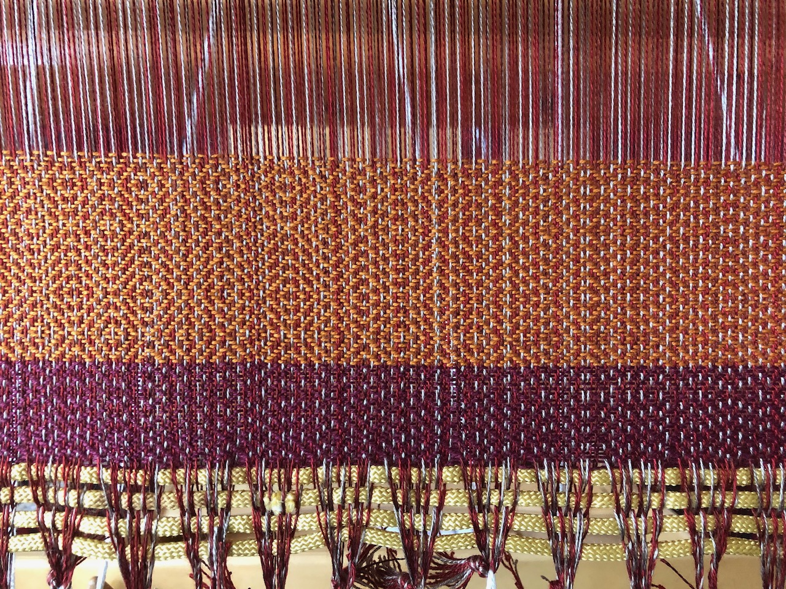

The most fundamental forms of textile creation began—and still thrive—with the simplest of tools. Spinners are fond of observing that all you need to make yarn is [a stick and some fluff](https://medievalspinning.wordpress.com/tools-for-medieval-and-sca-spinning/). Knitters work with two sticks; crocheting uses just one (but it has to have a hook at one end). Looms can be huge and complicated, but the early looms that left behind their archaeological traces were essentially just frames to hang threads on, and weights to give the threads some tension. With these simplest of tools—one scarcely would even call them "mechanisms"—all of the world's string and cloth was made until fairly late in the modern era.

These kinds of very simple tools rely on repetition: the motion of pulling a loop through another loop; the rhythm of attenuating a length of wool, twisting it into yarn, and winding it onto a spindle; the passage of a thread over and under a sequence of other threads. Time is the scalable quantity here: when you have pulled a hundred loops, you have another quarter inch of fabric; when you have spun a foot of yarn, and another foot, and another, slowly but perceptibly the finished yarn gets longer. The attentive patience needed to complete a task of this kind is not only absorbed in continuing the repetition but also in accepting the total duration of the task, and in accommodating that duration in the overall patterns of life. If it takes 5, or 20, or 100 hours to create a piece of cloth or a garment, the half-life of that material—its horizon of usefulness—must be similarly long. 

Such tasks wear their "design" very lightly and at the level of custom rather than of individual creativity. The skill it takes to spin a consistent yarn with specific qualities of strength, lightness, warmth, and loft is considerable, but in traditional contexts that skill wasn't typically exercised in the service of what we think of as "innovation" or "creativity", but rather with the aim of producing the form that was needed for the purpose at hand: upholstery, undergarments, sails, and so forth. The design of a yarn that is suitable for making stockings, or sailcloth, or a tapestry, requires significant attention to the fiber preparation, the spinning technique, the methods of finishing the yarn, but the individual artisan does not need to derive these qualities afresh or make a new set of decisions for each fresh effort: they are part of the skill that is acquired and passed on as traditional knowledge. 

These fiber tools are differently attuned towards economies of scale. With a crochet hook or knitting needles, the cloth grows from a single stitch, one stitch at a time, and each fresh stitch is an independent increment of labor. At every moment, the artisan retains more or less complete freedom of action concerning the next stitch, but they also control—at that moment—only the next stitch. In weaving, the weaver spends significant time at the outset setting up the apparatus: deciding on the length and width of the woven cloth, measuring out the right number of warp threads of the right length, and connecting them to the complex mechanism of heddles and reed and treadles by which they can be lifted and lowered to make the chosen pattern. Once the warp is on the loom, a single motion of the shuttle creates an entire row of interlacements between warp and weft, patterned according to the destiny established by the warping process. The actual weaving goes by swiftly and each extra inch, or foot, or yard of cloth takes only a small increment of additional time: the real investment is in the initial setup. This kind of weaving is, in this sense, an industrial process. And compared to the crocheter or the knitter, the weaver has more difficulty exercising agency at the level of the individual "stitch". This may be why for some, tapestry weaving is so appealing: it too focuses the artisan on the locality of movement, the scope of a single action, locating the design process back in the incremental actions rather than front-loading it so thoroughly.

{:height="100px"}
