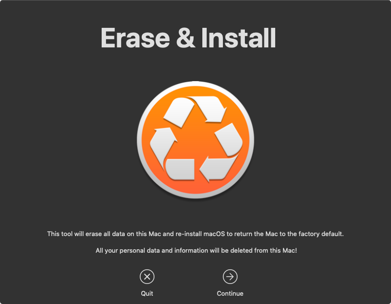
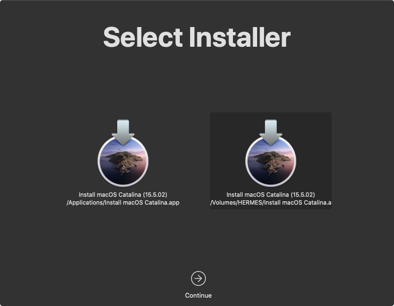
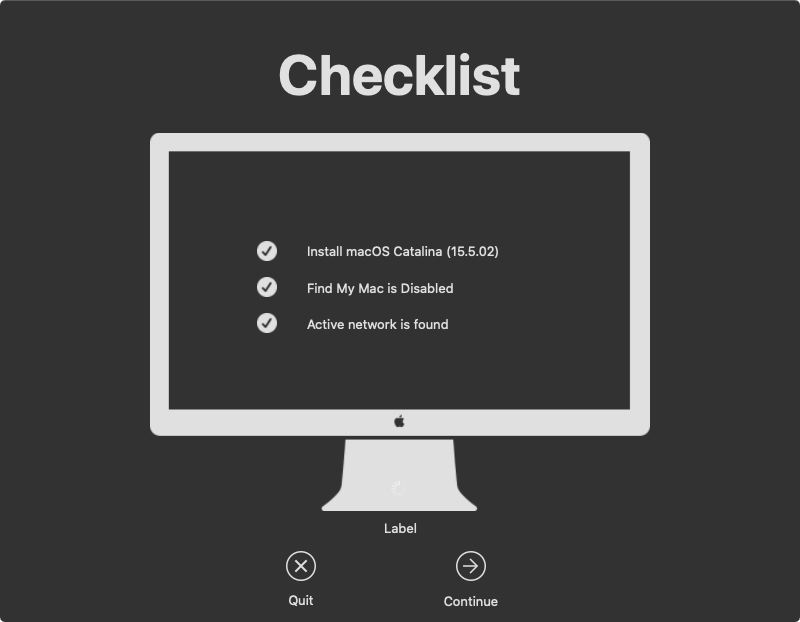
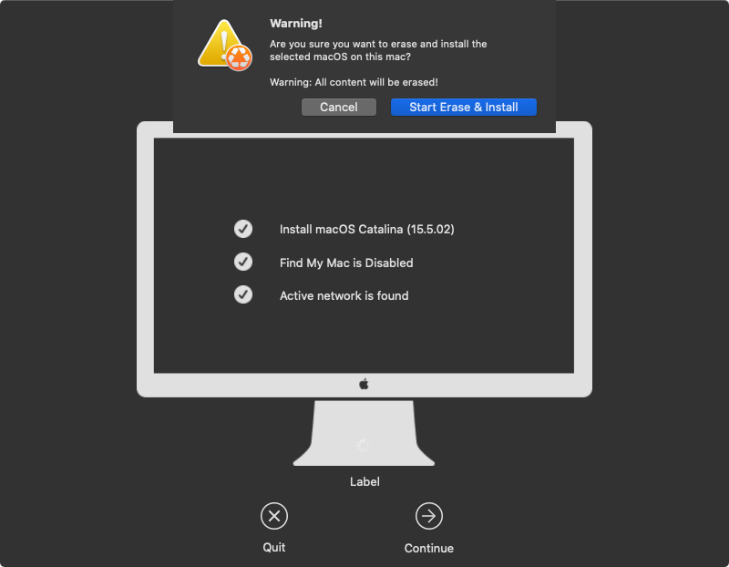
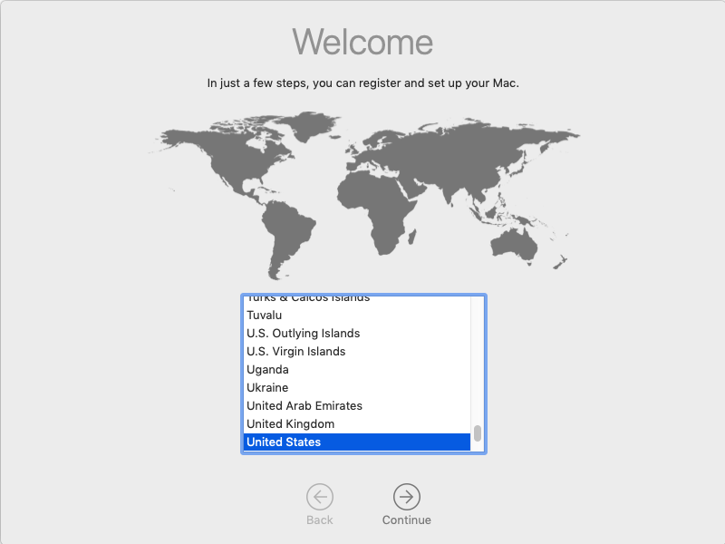

# Using the EraseInstall.app
Created: 2020-06-23  
Version: v2021.01.1

## About this Guide

Use this guide to quickly reformat a Mac back to factory settings utilizing a locally available copy of the macOS installer app and the EraseInstall.app tool.

This guide can be used for a Mac that is having trouble hitting the ABM activation servers during an Automated Device enrollment setup process.

## What is EraseInstall.app

EraseInstall.app for macOS is designed to allow users to easily erase the HD on their Mac and install a fresh copy of macOS.

The application is a wrapper around the command `startosinstall`.

## Pre-requisites

- USB Thumb drive of at least 16GB
- A copy of the [EraseInstall.app](https://bitbucket.org/prowarehouse-nl/erase-install/downloads/EraseInstall-1.2.1_897.pkg) utility
- A copy of the latest [macOS Installer](https://apps.apple.com/us/app/macos-big-sur/id1526878132?mt=12) app compatible with recent Mac hardware.
- A Mac that has already gone through SetupAssistant manually and a local user account has been created.
- Mac Connected to the internet via Wi-Fi or Ethernet.

## Process Overview

1. Build the USB Drive
2. Getting the Mac Ready
3. Running EraseInstall

## Process

### Running EraseInstall

Once the Mac is on the desktop, run the EraseInstall app.

1. Plug the USB into a Mac that you would like to reformat.
1. Open the USB drive.
1. Launch EraseInstall.app by double-clicking on it.
1. Once launched, you should see the following screens.
1. Select **Continue**
    
    

1. If there are multiple macOS installers select the one that is on the USB drive that was created earlier and press **Continue**.

    

1. The checklist should come up and show all checkmarks. Press **Continue**.

    If EraseInstall is unable to locate the macOS Installer on the USB drive open **Finder.app** and copy the installer from the USB drive to the `/Applications` folder on the Mac. Then, run the EraseInstall app again.

    

1. A Warning dropdown message will appear, press the **Start Erase & Install** button to begin the process.

    

1. You should see a **Preparing ...** status and then a percentage completed dialogue.

1. Once the preparation completes, the Mac should automatically reboot and begin the reinstallation process.

    

1. Once the installation completes, the Mac should reboot and be back at a fresh factory install.

1. Once booted, the Mac should be at the Welcome window.

    
