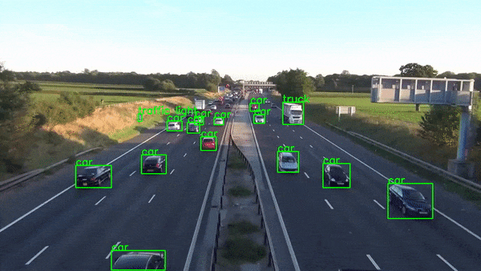

<h3><I>Hands-On Guide to implement real-time object detection system using python</I></h3>

---------------------------------------------------------------


---------------------------------------------------------------

The Self-Driving car might still be having difficulties understanding the difference between humans and garbage can, but that does not take anything away from the amazing progress state-of-the-art object detection models have made in the last decade.

Combine that with the image processing abilities of libraries like OpenCV, it is much easier today to build a real-time object detection system prototype in hours. In this guide, I will try to show you how to develop sub-systems that go into a simple object detection application and how to put all of that together.

### Python vs C++
I know some of you might be thinking why I am using Python, isn't it too slow for a real-time application, and you are right; to some extent.

The most compute-heavy operations, like predictions or image processing, are being performed by PyTorch and OpenCV both of which use c++ behind the scene to implement these operations, therefore it won't make much difference if we use c++ or python for our use case here.

But again, it is just a prototype that has very little infrastructure code and overhead attached to it. If you wish to learn production-grade real-time implementation I would suggest python is not the way to go, at least not yet.

### Reading The Video Stream
Your input video stream source can be anything, you might want to read from your webcam, or parse an already existing video, or from an external camera connected to the network. No matter what the problem is OpenCV is the solution. In this example, I will show how to read a video stream from youtube or a webcam.

<figure>
    
    <figcaption>You can create a Video Stream to feed your application using OpenCV.</figcaption>
</figure>

### Reading from YourTube
For your prototype, you might not want to go out and create a new video, but use one of many available online. In such a case, you can read the video stream from youtube.

```
import cv2 # opencv2 package for python.
import pafy # pafy allows us to read videos from youtube.
URL = "https://www.youtube.com/watch?v=dQw4w9WgXcQ" #URL to parse
play = pafy.new(self._URL).streams[-1] #'-1' means read the lowest quality of video.
assert play is not None # we want to make sure their is a input to read.
stream = cv2.VideoCapture(play.url) #create a opencv video stream.
```

### Reading from WebCam
Sometimes you just want to look at your own face. for such cases feel free to use the internal WebCam.

```
import cv2
stream = cv2.VideoCapture(0) # 0 means read from local camera.
```

### Reading IP Camera
If you are building an application that will be deployed on a server your camera will have an IP address from which you can access the Video Stream.

```
import cv2
camera_ip = "rtsp://username:password@IP/port"
stream = cv2.VideoCapture(camera_ip)
```

### Load the Model
Machine learning engineers today are spoiled for choice or should I say confused by choice. There are many great object detection models out there each with its pros and cons. To keep things simple we will go with YoloV5 as it provides us with fast inferences which are critical for our real-time application. You can also look into other models like FasterRCNN.

<figure>
    
    <figcaption>As per Yolov5 paper, it is the fastest model in the market right now.</figcaption>
</figure>

We can directly load the model from the PyTorch hub, the first time you run the code it might take few minutes as it will download the model from the internet, but next time onwards it will be loaded directly from the disk.

```
from torch import hub # Hub contains other models like FasterRCNN
model = torch.hub.load( \
                      'ultralytics/yolov5', \
                      'yolov5s', \
                      pretrained=True)
```

### Scoring a Single Frame
As the saying goes, “journey of thousand miles, start with a single step”, so we can say “Parsing of a video stream, starts by a single frame”. So let us see how we can score and parse a single frame.

The device we use to perform the inference makes a huge difference in our inference speed, modern deep learning models work best when working with GPU’s so if you have a GPU with a CUDA kernel it will improve your performance by a huge margin. In my experience system with even a single GPU can achieve 45–60 frames per second, where a CPU might give you 25–30 frames at best.

```
"""
The function below identifies the device which is availabe to make the prediction and uses it to load and infer the frame. Once it has results it will extract the labels and cordinates(Along with scores) for each object detected in the frame.
"""
def score_frame(frame, model):
    device = 'cuda' if torch.cuda.is_available() else 'cpu'
    model.to(device)
    frame = [torch.tensor(frame)]
    results = self.model(frame)
    labels = results.xyxyn[0][:, -1].numpy()
    cord = results.xyxyn[0][:, :-1].numpy()
    return labels, cord
```

### Plotting Boxes over the Frame
Once we have scored the frame, we would need to plot the identified objects along with their boxes over the frame before writing the frame into the output stream. To do this we can use OpenCV's image processing toolkit.

```
"""
The function below takes the results and the frame as input and plots boxes over all the objects which have a score higer than our threshold.
"""
def plot_boxes(self, results, frame):
    labels, cord = results
    n = len(labels)
    x_shape, y_shape = frame.shape[1], frame.shape[0]
    for i in range(n):
        row = cord[i]
        # If score is less than 0.2 we avoid making a prediction.
        if row[4] < 0.2: 
            continue
        x1 = int(row[0]*x_shape)
        y1 = int(row[1]*y_shape)
        x2 = int(row[2]*x_shape)
        y2 = int(row[3]*y_shape)
        bgr = (0, 255, 0) # color of the box
        classes = self.model.names # Get the name of label index
        label_font = cv2.FONT_HERSHEY_SIMPLEX #Font for the label.
        cv2.rectangle(frame, \
                      (x1, y1), (x2, y2), \
                       bgr, 2) #Plot the boxes
        cv2.putText(frame,\
                    classes[labels[i]], \
                    (x1, y1), \
                    label_font, 0.9, bgr, 2) #Put a label over box.
        return frame
```

Once done this function would produce output something like this.

<figure>
    
    <figcaption>You can try to have different colors for different objects.</figcaption>
</figure>


### One Function to Unite Them All
Sorry for the Lord of the rings reference, but yes, now we bring it all together into a single call function that performs the entire operation in a loop.

So let's go over the steps that our main function will have to perform to successfully run the application.

Create a Video Streaming Input.
Load the model.
While Input is available, read the next frame.
Score the frame to get labels and coordinates.
Plot the boxes over the objects detected.
Write the processed frame onto the output video stream.
Six simple steps to operate, although we will add some infrastructure code to help us make the application more robust, the basics are the same. So let's do it.

```
"""
The Function below oracestrates the entire operation and performs the real-time parsing for video stream.
"""
def __call__(self):
    player = self.get_video_stream() #Get your video stream.
    assert player.isOpened() # Make sure that their is a stream. 
    #Below code creates a new video writer object to write our
    #output stream.
    x_shape = int(player.get(cv2.CAP_PROP_FRAME_WIDTH))
    y_shape = int(player.get(cv2.CAP_PROP_FRAME_HEIGHT))
    four_cc = cv2.VideoWriter_fourcc(*"MJPG") #Using MJPEG codex
    out = cv2.VideoWriter(out_file, four_cc, 20, \
                          (x_shape, y_shape)) 
    ret, frame = player.read() # Read the first frame.
    while rect: # Run until stream is out of frames
        start_time = time() # We would like to measure the FPS.
        results = self.score_frame(frame) # Score the Frame
        frame = self.plot_boxes(results, frame) # Plot the boxes.
        end_time = time()
        fps = 1/np.round(end_time - start_time, 3) #Measure the FPS.
        print(f"Frames Per Second : {fps}")
        out.write(frame) # Write the frame onto the output.
        ret, frame = player.read() # Read next frame.
```

You should take all these components and pack them into a nice class which can be called along with the URL and output file you wish to write the output stream onto. Your final product will look something like this.

<figure>
    
    <figcaption>A 60 FPS output stream of processed video in real-time.</figcaption>
</figure>

### Conclusion
Of course production level real-time applications are way more complicated than this, but this guide does not intend to teach that. It is to show you the amazing power of Python which allows us to build such a complicated application prototype in hours. The possibilities from here are only limited by your imagination.

You can check the full code and more such awesome applications on my <a href="https://github.com/akash-agni">Github</a> profile.