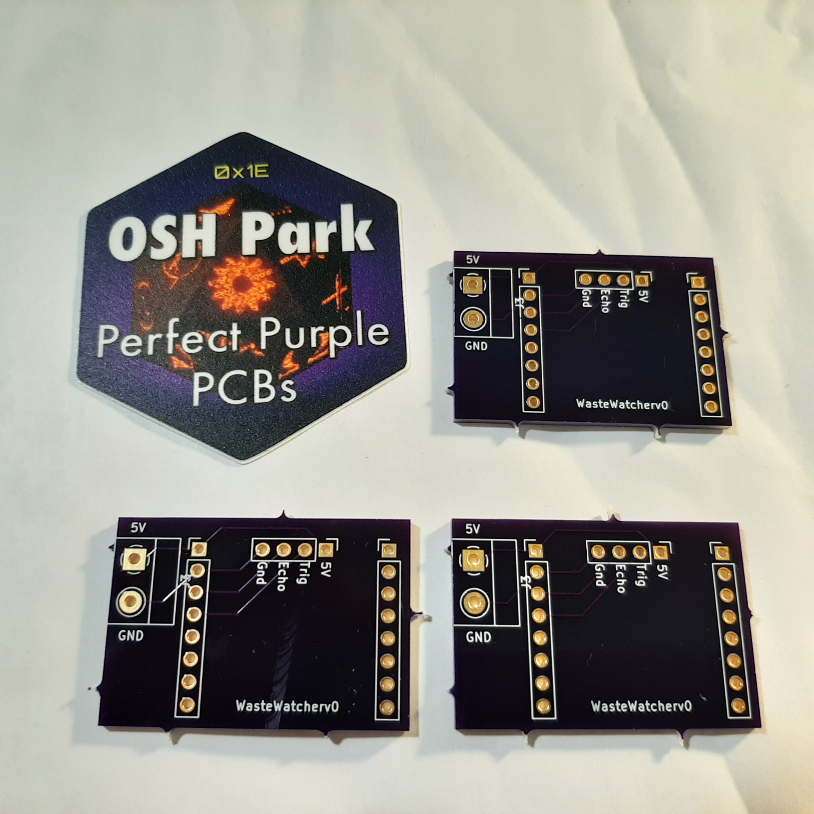
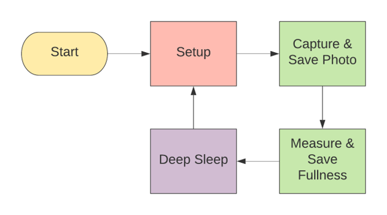

Hi all! I took a break last month so I could focus on other things, but now I'm back. Having breaks with long projects like this is super nice and maybe even necessary. After taking a step back I realized that I really want to make sure we have a solid foundation before moving on to developing applications for ZotBins Community Edition. That foundation is the [Waste Watcher](https://github.com/zotbins/waste_watcher) and the [ZBCE API](https://github.com/zotbins/zbce_api) repositories, because applications are all built upon those two. The Waste Watcher collects real-world waste related metrics and the ZBCE API's help store, manage, and send the data with it's LAMP stack. In this blog, I will revisit some of our progress related to these two repositories.

### PCB Update 🔬
The PCB's I designed came in! In the [February Blog](https://zotbins.github.io/zbceblog/february2021update/), I talked about designing my custom PCB on KiCAD. After 2 weeks or so I finally got the PCBs I ordered. Here they are:

I soldered my female header pins and two-terminal screw connector. The quality on these PCBs are pretty good and I didn't have any difficulty at all when soldering. However, I still had to sand off the sharp little knobs on the sides of the PCBs, probably an artifact from some type of CNC milling process.

Overall, I was really pleased with the PCB's however I am still not done yet. These PCB's are still extremely basic and could have a few extra improvements. The first improvement I plan to make is to add the ZotBins logo on it just to make it look pretty. Another thing I plan to do is to also add some extra pin connections so I could also make room for connecting more sensors or other circuits.

### Waste Watcher Power Problem Conclusions ♻️

*Warning: This section is a bit technical*

This took me a while to debug, but I believe I solved most of the problems with powering the Waste Watcher. The main problem was operating time, I wasn't getting a long enough operating time without replacing the batteries. To review, the Waste Watcher is my sensor module which currently uses the ESP32CAM and an HC-SR04 ultrasonic sensor. I have been designing the circuit to make the entire sensor module portable with rechargeable NiMH batteries. Here is what the Waste Watcher is made of:

**Calculations**

Let's start with some calculations that help estimate the total operating time. First off, I have a 2800 mAh power source (3 AA batteries in series). Next I have two operating modes for the Waste Watcher operation that draws different amounts of current:
1. Deep Sleep Mode (6 mA current draw for 1800 seconds per total execution loop time)
2. Active Mode (740 mA current draw for ~10 seconds per total execution loop time)

From there I estimate the average current draw of one total execution loop, which is 10.06 mA calculated from the following equation below.

By one execution loop I am referring to the unique sequence of tasks that the software has to execute before repeating the same. This is represented by the following diagram:

OK, so I have the average current draw (10.06 mA), and I also have my total power capacity (2800 mAh). So now, I just need to divide the power capacity and average current draw to estimate the total operating time, which is 278.5 hours.

**Problems and Solutions**
Even though my estimated operating time before replacing the batteries was 278.5 hours. My actual operating time was only 19 hours!

After a lot of research and investigation (some of which were covered in the previous blogs), I can confidently conclude what the exact problems were and what solutions are effective. I say this because after implementing some of my solutions my operating time became 204 hours!

Problems
1. Voltage drop of batteries below operating voltage of ESP32CAM
2. Voltage leaking during deep sleep
3. Flash LED Operation Longer

Solutions
1. (Implemented) Add a 5V boost converter to the circuit
2. (Implemented) Call function [rtc_gpio_hold_en](https://docs.espressif.com/projects/esp-idf/en/latest/esp32/api-reference/peripherals/gpio.html#_CPPv416rtc_gpio_hold_en10gpio_num_t) in Waste Watcher script to enable a hold function which causes pads to latch to current values of GPIO pins (so LOW signal values will stay LOW and not go to HIGH)
3. (Not yet Implemented) Use [FreeRTOS](https://freertos.org/) to implement a strict scheduling system

**Future Improvements**

Even though I improved the operating time from 19 hours and 204 hours, it still doesn't reach my estimated time of 278.5 hours. And even then, I still think there are some improvements to be made.

The main problem is the active mode and the use of the flash LED consuming a large amount of current. To remedy this, in the future, I plan to do some software upgrades to do the following:
1. Detect lighting conditions to limit the amount of times flash LED is used
2. Use FreeRTOS to make the active mode operation even shorter (through strict time scheduling and ability to asynchronously run tasks)

With this, I think the Waste Watcher system would be pretty solid. Overall, this was a fun, but also painful journey, but I'm glad I was able to improve the Waste Watcher system.

### ZBCE API 💻
First, off I would just like to thank the growing amount of contributors to this repository. We have made some significant progress and now have 10 supported API's in our [develop branch](https://github.com/zotbins/zbce_api/tree/develop). Here is a high level description of each of the endpoints.

1. `/bin-info`: post and get bin information
2. `/bin-info-all`: quick way to get all bin information in the database
3. `/weight`: post and get weight data
4. `/weight-all`: quick way to check all the weight data in the database
5. `/fullness`: post and get fullness data
6. `/fullness-all`: quick way to check all the fullness data in the database
7. `/usage`: post and get usage data
8. `/usage-all`: quick way to check all the usage data in the database
9. `/image`: post in image into our webserver and also fetch the image as well  
10. `/metric-csv`: helps download a specific metric (eg. fullness) as a CSV file

Of course, all these endpoints are not finalized. We still have a lot of tweaking to do to make sure that the server is reliable. That being said, our first release should come out soon!

### Git Best Practices with Branches 🌿

I've been using git a lot lately, but was never really taught the best practices of using [git](https://git-scm.com/). For those of you who don't know what git is, it's basically a protocol that allows developers to keep track of different versions of their code. It also allows them to see a timeline (or branch) of what changes they made. When it comes to git a popular tool is [Github](https://github.com/), where a lot of open source projects are hosted on. The biggest advantage is the collaborative aspect of git. However, when a lot of people are contributing changes to your repo (or pull requests), it can be very hard to try to keep your project code consistent and robust. With that, a lot of projects adopt the git flow model as seen below:

  

This graph and a lot of good information comes from a [blog post](https://nvie.com/posts/a-successful-git-branching-model/) from [Vincent Driessen](https://nvie.com/about/). The main features of this flow is having a develop branch, some release branches and feature branches. This allows the master/main branch to stay robust and avoid introducing any new bugs. Release branches are also nice since they allow us to apply the [Major.Minor.patch versioning system](https://en.wikipedia.org/wiki/Software_versioning). I'll be adopting these models for the Waste Watcher and ZBCE API repositories from now on because it's super neat and organized!

### What's next? 🌱
- Preparing for small scale manufacturing
- Create open-source kits for communities/individuals to deploy their own waste metrics system
- Waste Watcher Upgrades
    - Adding a weight scale
- ZBCE API
    - Repo Rebranding. We want to call it Middleware Mycelium instead.
    - Transition out of Flask. Need to explore other http server options and possibly using MQTT

Want to help? Join our [Discord Server](https://discord.com/invite/mGKVVpxTPr) and collaborate with us!  

---

Thanks for reading and have an awesome day.
-- Owen
