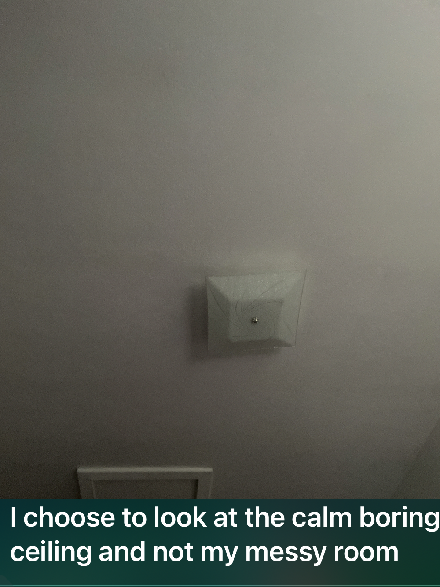
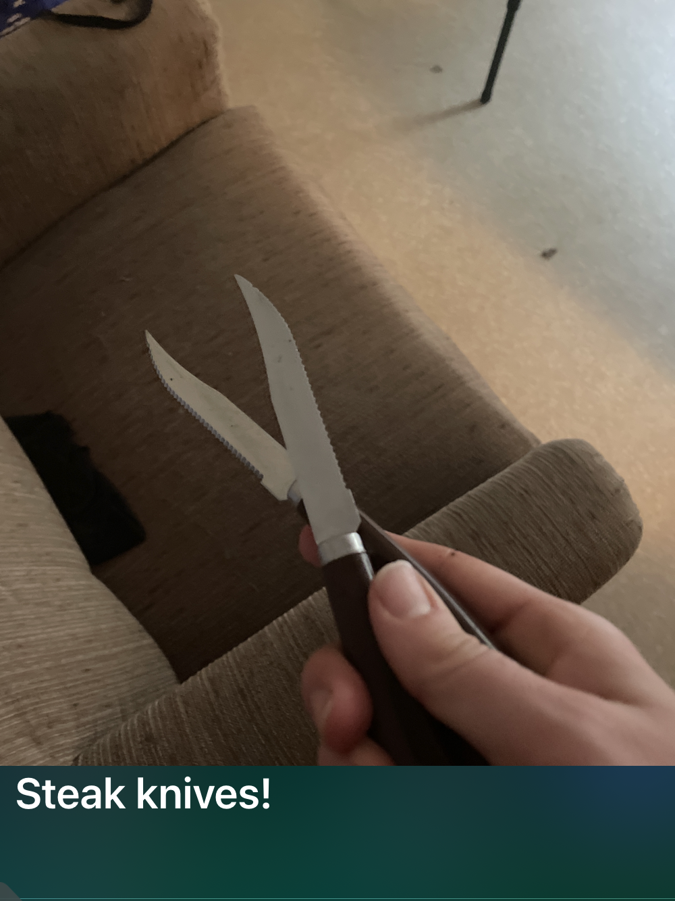
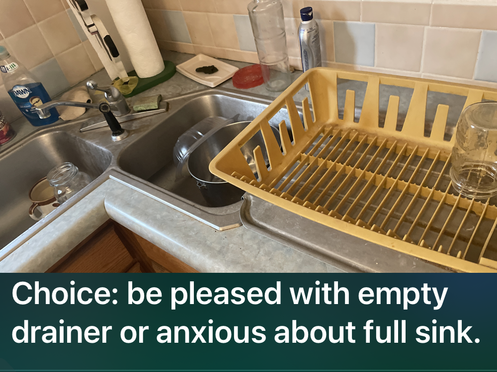

4/28/21, 06:10
Good morning sleepy!
It's an excellent day for poetry
And living with ADD
And chronic pain yippee
 

[audio of tweet](../images/Good morning_Wed_28_Apr_2021_06_11_00_-0500_.m4a)

4/28/21, 06:20
I can't remember
One whole stanza
From one moment
To the next
Time to check
If notifications
are a fix 

[audio of tweet](../images/Fixing workflow_Wed_28_Apr_2021_06_20_17_-0500_.m4a)

4/28/21, 06:26
Time to go with the obvious solution: go get my other camera phone and take a picture of the tweet as I make it so that I don't have to remember 

[audio of tweet](../images/Remember_Wed_28_Apr_2021_06_26_28_-0500_.m4a)

4/28/21, 06:33
One of the features of living with ADHD is that you end up bug fixing your blog post process before can you put pants on for the morning. Priorities are not a thing. 

[audio of tweet](../images/Bug fixing_Wed_28_Apr_2021_06_34_07_-0500_.m4a)

4/28/21, 06:57
In the past half hour, I have mysteriously acquired a shirt, shoes, coffee, and listened to three songs. 

[audio of tweet](../images/Morning preparations_Wed_28_Apr_2021_06_57_47_-0500_.m4a)

4/28/21, 07:00
Time to start noticing things. I notice a lot of crumbs or on my kitchen. Since they're dirty and not just messy, cleaning up the crumbs is first to do. 

[audio of tweet](../images/Crumb clean up_Wed_28_Apr_2021_07_00_46_-0500_.m4a)

4/28/21, 07:03
The cats will be gathering for their food 

[audio of tweet](../images/Feeding cats_Wed_28_Apr_2021_07_03_42_-0500_.m4a)

4/28/21, 07:06
Cats fed. Come back to tidying up crumbs. But there's a lot of clean dishes mixed in, so it makes sense to empty the dish drainer first. 

[audio of tweet](../images/Dish drainer_Wed_28_Apr_2021_07_07_02_-0500_.m4a)

4/28/21, 07:09
Found a bunch of steak knives I had borrowed for my grandparents and need to return 

[audio of tweet](../images/Steak knives_Wed_28_Apr_2021_07_09_58_-0500_.m4a)

4/28/21, 07:12
Also found a spoon that belongs to my grandparents and not to me 

[audio of tweet](../images/Grandparents spoon_Wed_28_Apr_2021_07_12_38_-0500_.m4a)

4/28/21, 07:18
Rolling right along with an empty drainer 

[audio of tweet](../images/Empty drainer_Wed_28_Apr_2021_07_18_42_-0500_.m4a)

4/28/21, 07:21
As I go along, it's important to remember to pat myself on the back for every little achievement. If I congratulate myself for what I am doing instead of focusing on how much there is to be done, everything goes a lot better. 

[audio of tweet](../images/Congratulate yourself_Wed_28_Apr_2021_07_21_38_-0500_.m4a)

4/28/21, 08:11
I have aquired a full dish drainer again, by moving all of the dirty dishes through my sink and the cleaning process into the drainer.  Go me! There was also an interlude where I delivered crumbs to the chickens and petted the low rooster in the pecking order for five minutes so he would calm down and stop attacking me. 

[audio of tweet](../images/Full drainer_Wed_28_Apr_2021_08_11_50_-0500_.m4a)

4/28/21, 08:17
If I get rid of distractions, it's easier to notice things. Getting rid of the piles of dirty dishes makes it easier to notice crumbs on the counter top. 

[audio of tweet](../images/Crumbs on the countertop_Wed_28_Apr_2021_08_18_41_-0500_.m4a)

4/28/21, 08:23
It's important to practice being pleased with a process rather being pleased with an outcome. If I delay being happy until after hi complete a task, I practice being angry and self judgmental call throughout the task and it is nearly impossible to switch to being pleased when the task is done instead I took another task and go for it. However, if I practice being pleased at the process, And encouraging myself, I get to be pleased immediately and stuff feels like it magically gets done. 

[audio of tweet](../images/Process over product_Wed_28_Apr_2021_08_23_59_-0500_.m4a)

4/28/21, 08:29
One of the challenges of tending to an apartment it's so far today I probably touched removed at least 100 things, and on bad days everyone of those touches send a shooting pain up my right hand into my shoulder. Fortunately today is a good day. I am and fortunately I was able to spend the last week programming this documentation process so that writing captioning and taking these pictures does not involve me touching anything or having to think too hard about it. 

[audio of tweet](../images/Pain_Wed_28_Apr_2021_08_29_37_-0500_.m4a)

4/28/21, 08:35
The next thing I can deal with is my burn bucket. All of this is fire starter for the furnace, but I've been avoiding packaging it and just been stuffing more and more paper into. I need to take it out and put it in plastic bags. 

[audio of tweet](../images/Emptying the burn trash_Wed_28_Apr_2021_08_35_43_-0500_.m4a)

4/28/21, 08:47
The burn trash has been converted into for plastic grocery bag's of paper 

[audio of tweet](../images/Paper burn_Wed_28_Apr_2021_08_47_33_-0500_.m4a)

4/28/21, 08:50
While I'm on the subject of paper, I might as well repackage the two overflow buckets as well. 

[audio of tweet](../images/Overflow buckets_Wed_28_Apr_2021_08_50_42_-0500_.m4a)

4/28/21, 09:23
Baba black sheep have you any burnables?
Yes, sir, yes, sir, nine bags full.

Also I found to Bill statements that I accidentally threw away instead of filing. 

[audio of tweet](../images/Burnable trash_Wed_28_Apr_2021_09_23_27_-0500_.m4a)

4/28/21, 09:53
My kitchen is clean, and my arm is throbbing. Time to put on the wrist brace. 

[audio of tweet](../images/Wrist brace_Wed_28_Apr_2021_09_54_13_-0500_.m4a)

4/28/21, 10:15
I am falling into the trap of wanting a clean apartment now instead of wanting two clean my apartment to the best of my ability's and work within my abilities. 

[audio of tweet](../images/Outcome_Wed_28_Apr_2021_10_16_01_-0500_.m4a)

4/28/21, 11:36
This clean bathroom floor is brought to you by the podcast seen and not heard.

It is far easier to clean when there is something else taking my attention off upsetting about cleaning.

https://open.spotify.com/episode/32VaivS5vkVjezSpwrLTvh 

[audio of tweet](../images/Clean bathroom floor_Wed_28_Apr_2021_11_36_26_-0500_.m4a)

4/28/21, 11:59
Drinking another coffee 

[audio of tweet](../images/Drinking coffee_Wed_28_Apr_2021_11_59_54_-0500_.m4a)

4/28/21, 14:50
So much to do all the time on a farm 

[audio of tweet](../images/Log_Wed_28_Apr_2021_14_51_07_-0500_.m4a)

4/28/21, 14:53
And there is always a kitty around to help 

[audio of tweet](../images/Kitty_Wed_28_Apr_2021_14_53_41_-0500_.m4a)

4/28/21, 14:56
The plum tree is blooming 

[audio of tweet](../images/Plum tree_Wed_28_Apr_2021_14_56_31_-0500_.m4a)

4/28/21, 15:11
5...6..pick up sticks 

[audio of tweet](../images/Picking up sticks_Wed_28_Apr_2021_15_11_27_-0500_.m4a)

4/28/21, 15:23
The bridge building is going quite well 

[audio of tweet](../images/Building the bridge_Wed_28_Apr_2021_15_23_14_-0500_.m4a)

4/28/21, 20:22
Time to bed down the chickens for the night 

[audio of tweet](../images/Chickens_Wed_28_Apr_2021_20_22_37_-0500_.m4a)

