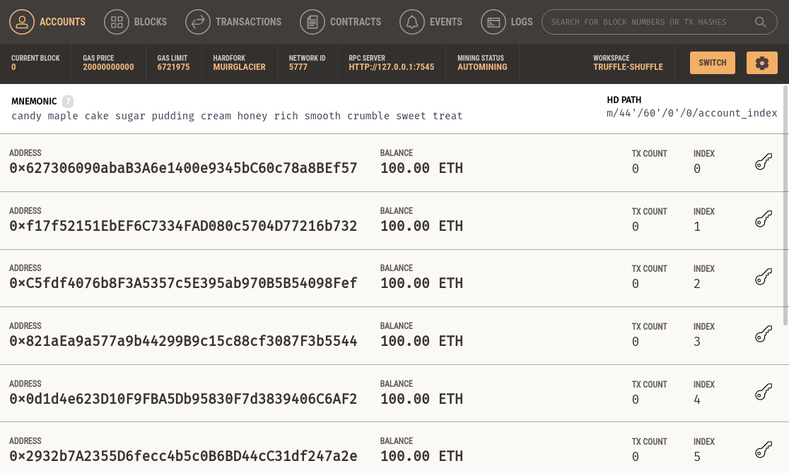
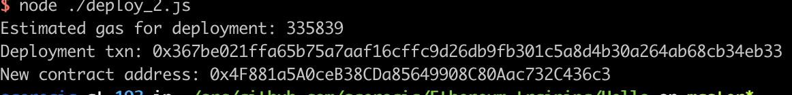
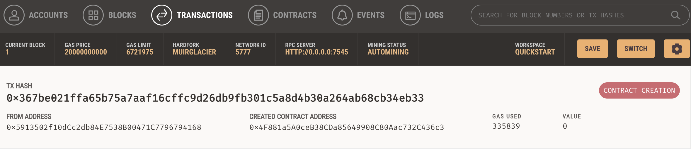
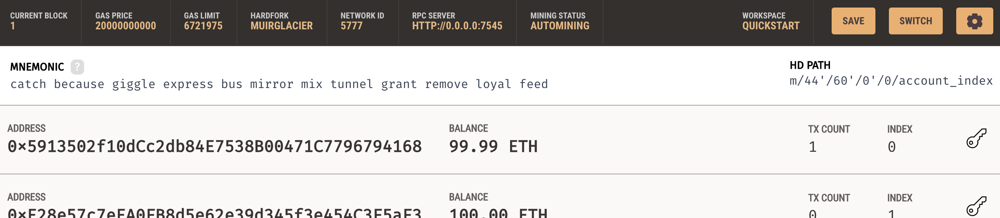
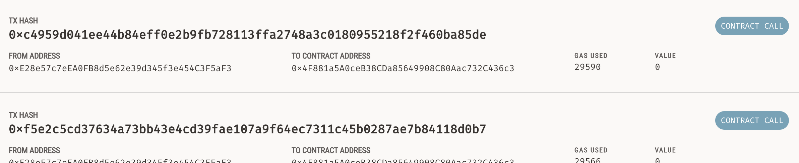
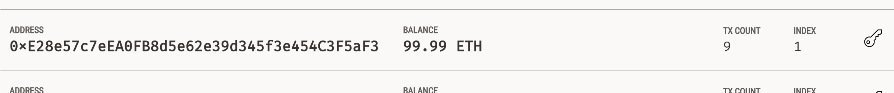

In this step-by-step blog post I will go through the simplest possible smart contract using the Ganache Ethereum emulator.

# A coating of Ganache

[Ganache][1] is an in-memory [full Ethereum node][2], loaded with utilities to facilitate local testing and debugging.  
It can have a number of different test blockchains (called workspaces), each with its own pre-loaded testing accounts. 
Most importantly, the built-in Ethereum miner lazily mines blocks only when there are new transactions, rather than every 
few seconds. This greatly helps keep "log noise" to a minimum.   

Installing on a Mac is a simple [download][3] or a simpler [Homebrew][4] `brew install --cask ganache`.  
Let's create a [quickstart workspace][5].  
This starts a node listening on port 7545, mining a local blockchain. The blockchain is "seeded" with 10 accounts, each 
pre-loaded with 100 Ethereum.

We will also need to have the latest [Node.js][6] installed (e.g. by `brew install node`).

# The contract 

Clone locally the [hello_ethereum][7] project from Github.  
Run `npm install` to get the 2 dependencies:  
* the Solidity compiler (`solc`). This also determines the supported version of the [Solidity language][18].
* the Web3 library (`web3`). We will use this to deploy and communicate with our smart contract.

Let's quickly examine the contents of our [Hello smart contract][8].  
* It defines an internal variable to store the message...
* which is initialized atomically in the [constructor][9] (i.e. globally once, upon deployment).
* There is a reader method `getMessage`, which returns the current value of the message.    
  It is worth noting that this is marked as [`view`][10], which makes it "free" to call. 
  Remember that most smart contract actions in Ethereum require the caller to spend [gas][11]. 
* Finally, there is a writer method `setMessage`, which changes the "state" of the contract (i.e. the message). 

# Compiling and deploying

The rough outline of the steps to deploy a smart contract are as follows:  
* Compile the Solidity code into the [ABI interface and EVM bytecode][12].  
  The `solc` compiler takes a JSON object defining all the compilation parameters, including the source code itself.
* Create a Contract object based on the compiler output.  
  This output contains the ABI and EVM as separate JSON fields.
* Create a "deploy contract" transaction and send it to the target node (in our case, the local Ganache node).  
  The transaction needs to be sent (and hence paid for) by one of the accounts already created by Ganache.
  
These steps are captured in the script [`deploy.js`][13].  
After updating the [account][14] from which to deploy the contract (i.e. pay the gas fee), you can execute it with
`node deploy.js`.  
The output will look something like this.  

We can verify the deployment transaction in Ganache.  

We can also see the reduced balance of the deployment account, after paying for the deployment cost.

# Interacting with the contract

Now that the contract is deployed we can call its 2 methods.  
The getter is "free" to call, whereas the setter requires the caller to pay some gas.

To call an Ethereum contract we need a [Contract][15] instance.  
The instance is defined by the Contract's interface (i.e. the methods it exposes, in ABI) and the address where it is 
deployed in the blockchain.  
We can get the ABI by compiling the Solidity code, whereas we have the deployed address from the deployment message and the 
Ganache transaction log.

Some sample commands to interact with the contract are in the script [`interact.js`][16].  
After updating the contract and caller account [addresses][17], you can execute it as many times as you want with `node interact.js`.  

We can verify the message update transactions in Ganache.  

We can also see the updated balance of the account making the API calls.

# Parting thought

This post is by no means an Ethereum deep-dive, nor does it aspire to be one.  
The intention is to provide a one-stop starting point, if you want to get started with Ethereum smart contracts. 

Happy coding!

  [1]: https://www.trufflesuite.com/ganache
  [2]: https://ethereum.org/en/developers/docs/nodes-and-clients/
  [3]: https://github.com/trufflesuite/ganache/releases
  [4]: https://brew.sh/
  [5]: https://www.trufflesuite.com/docs/ganache/workspaces/the-quickstart-workspace
  [6]: https://nodejs.org/en/
  [7]: https://github.com/sgerogia/hello_ethereum
  [8]: https://github.com/sgerogia/hello_ethereum/blob/master/Hello.sol
  [9]: https://www.tutorialspoint.com/solidity/solidity_constructors.htm
 [10]: https://docs.soliditylang.org/en/v0.4.24/contracts.html#view-functions
 [11]: https://ethereum.org/en/developers/docs/gas/
 [12]: https://medium.com/@eiki1212/explaining-ethereum-contract-abi-evm-bytecode-6afa6e917c3b
 [13]: https://github.com/sgerogia/hello_ethereum/blob/master/deploy.js
 [14]: https://github.com/sgerogia/hello_ethereum/blob/master/deploy.js#L39
 [15]: https://web3js.readthedocs.io/en/v1.2.11/web3-eth-contract.html#
 [16]: https://github.com/sgerogia/hello_ethereum/blob/master/interact.js
 [17]: https://github.com/sgerogia/hello_ethereum/blob/master/interact.js#L32-L42
 [18]: https://docs.soliditylang.org/en/v0.8.6/
  