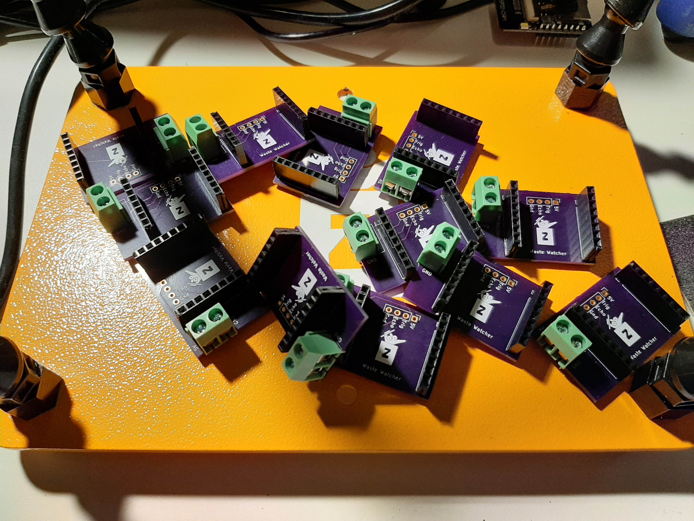
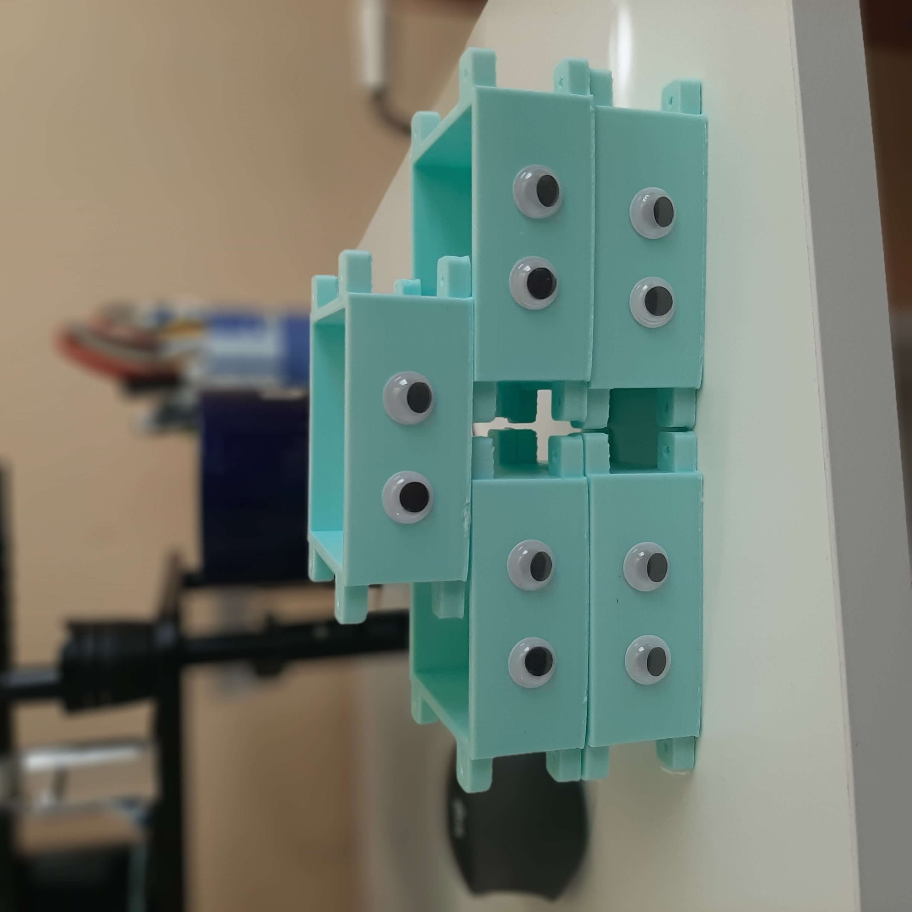

Hello! Another short and sweet blog here for this month. This month I was exploring possible ideas for a Zero Waste Competition using our Waste Watchers.

## Building 10 Waste Watchers 🗑👀

To experiment with how well this project can scale I wanted to see how easy it would be to build 10 waste watchers. After designing the PCB's and the 3D printed enclosures for the [Waste Watcher](https://github.com/zotbins/waste_watcher), I can happily say that small-scaling manufacturing is pretty manageable. We can easily build enough Waste Watchers for a community center or classrooms. However, I will acknowledge large-scale manufacturing for university campuses and cities will still require some better manufacturing techniques. The biggest bottle necks are hand-soldering the PCB's and 3D printing. Hand-soldering PCB's may have to stay, but 3D printing the enclosures can definitely be replaced with other manufacturing techniques such as laser cutting or CNC routing. This will probably be something to consider in the far future.  

Below are some of the progress photos of building the 10 [Waste Watchers](https://github.com/zotbins/waste_watcher). I have finished soldering all 10 PCB's that I ordered from OshPark and also printed out 5 Waste Watcher Enclosures so far. 5 more to go!

## Zero Waste Competition 🥇

Using the 10 Waste Watchers, I plan to distribute them to members in the [ZBCE Discord](https://discord.gg/mGKVVpxTPr) and host a Zero Waste Competition. The purpose of this is to bring together a community of individuals and encourage zero waste practices through a friendly competition. In this competition we want to help users understand their waste stream better through concrete data. We also want to help improve the Waste Watcher and ZBCE API to further the impact of this project.

Here are some brief notes about this competition.

- Starting on September
- Each contestant will deploy their Waste Watcher
- ZotBins Bot will give daily/weekly updates on each waste watcher
- Contest will last for a month/30days
- Leaderboard for
- Prizes (1st, 2nd, 3rd)
    - $50, $25, $25, Gift card of the following options:
        - Amazon
        - Starbucks
        - more options to come

As a reminder the two metrics we will be collecting from the [Waste Watchers](https://github.com/zotbins/waste_watcher) are bin fullness and photos. With that, I'm hoping to do some exciting data analysis.

Two Data analysis portions:

- short-term analysis for feedback
  - who's in first place
  - who's recycling the most
- long-term analysis for feedback
  - overall how much waste we reduced for fullness
  - overall what type of waste we threw away the most for example
    - 💧water-bottles
    - 🍌bananas

----
As always, thanks for tuning in!

-- Owen Y.
