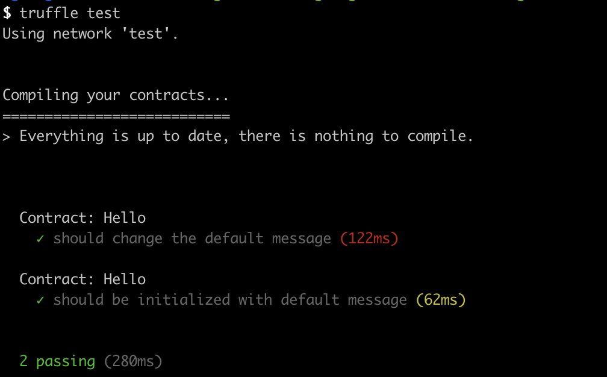
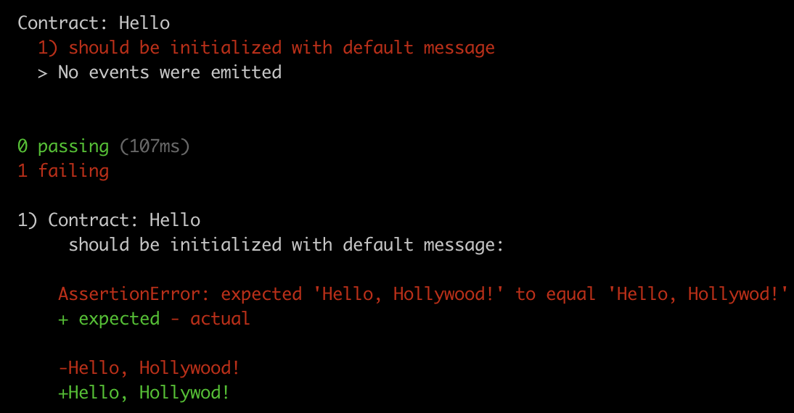
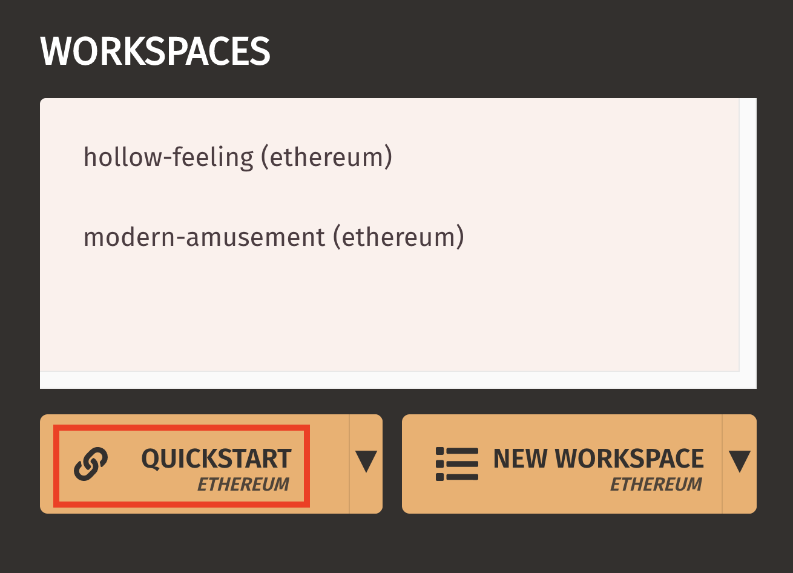
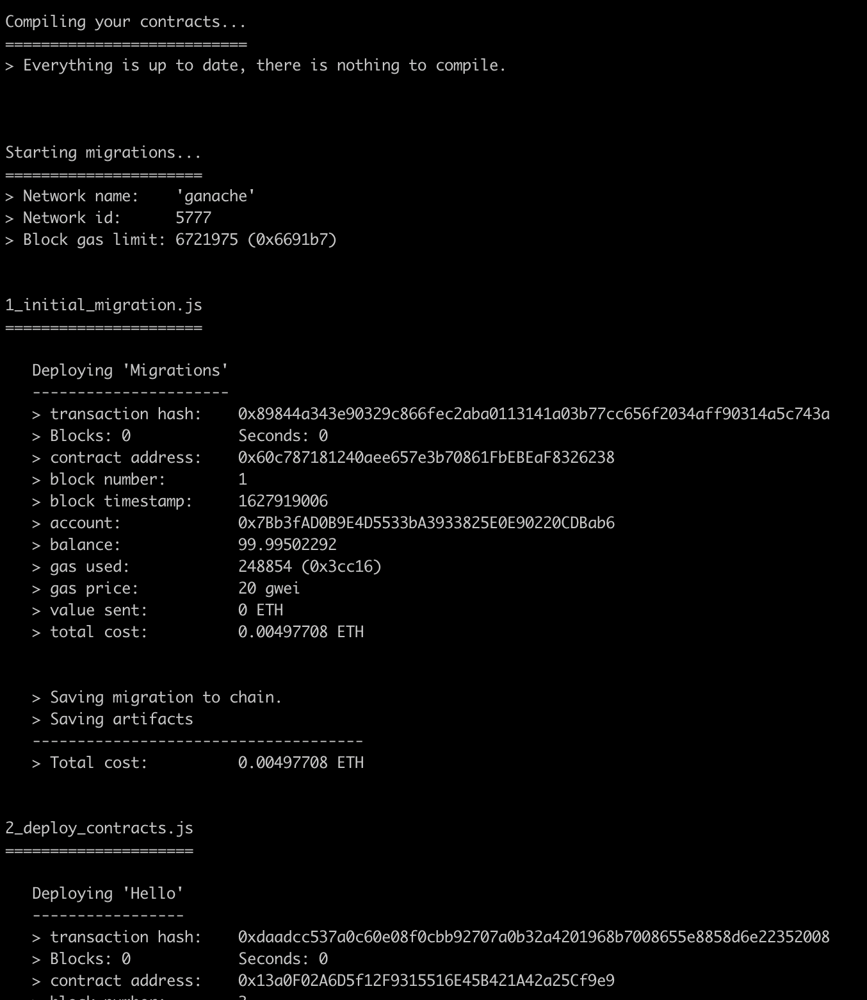
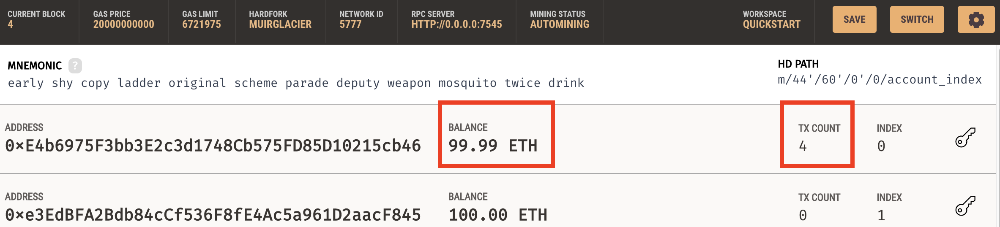
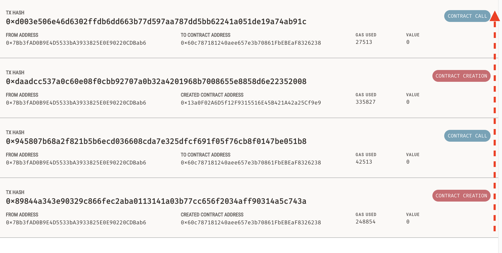
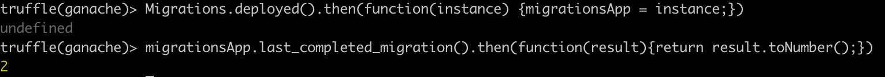

Continuing from the previous article, I will cover how to use the Truffle framework to facilitate development, testing and deployment 
of Ethereum smart contracts.

# A box of Truffles

Revisiting the [previous article][3] on creating a smart contract, we can immediately see a number of things that we 
would need to have an effective production deployment pipeline.  

* Scaffolding  
Solidity is a relatively new language, which moves [pretty fast][4]. Solidity contracts have the additional 
  constraint of [complexity][6] [being expensive][5]. This makes Solidity programming effectively an optimisation 
  problem. <sup>[1](#footnote_1)</sup>  
  Therefore creating new contracts needs an easy way to quickly "scaffold" together optimal coding patterns and libraries.  
  
* Testing  
Although a smart contract is inspired by object-oriented programming (classes encapsulating code and state), initializing 
  one involves deployment to a blockchain. The same applies to resetting the internal state as part of a [CI][9] pipeline.  
  This calls for a dedicated testing framework.

* Tracking of smart contracts  
Each deployment of a smart contract (i.e. instantiation) results in a new persistent blockchain address to keep track of.  
  In the highly volatile pre-production environments (during active bug fixing and feature addition), tracking many 
  different instances of a smart contract by hand is impossible. 

* Promotion through environments  
This is a corollary of the above. As a contract's logic evolves and new versions are created, we need a way to keep 
  track what is deployed where. I.e. "our DEV environment has been upgraded, but our UAT not yet". In addition, most 
  non-trivial applications will require the "co-ordinated" deployment of more than one smart contracts. This will be a
  familiar concept to people performing [database migrations][10]. 

[Truffle][1] is the answer to all the above; a development framework and testing environment facilitating the 
[SDLC][2] of Ethereum smart contracts. 

* Scaffolding  
  Truffle introduces the concept of [boxes][11]; a way to quickly initialize a project with Solidity contracts, libraries 
  and front-end code.

* Testing  
  It offers a [framework][12] to auto-deploy smart contracts before each test execution to isolate side-effects. 
  Unit testing itself is based on [Mocha][18] and [Chai][19]. 

* Tracking of smart contracts  
  Truffle keeps track of deployed contract addresses across environments. It has the option of a simple [file-based][12] 
  mechanism or a more flexible queryable [database][13].

* Promotion through environments  
  Truffle defines a smart contract-based mechanism to follow what has been deployed in which environment ([migrations][14], 
  in Truffle parlance). The mechanism is very similar to what [database migration][15] tools use internally. Here Truffle 
  is using the blockchain as a migration state storage mechanism. <sup>[2](#footnote_2)</sup>
  
After this "sales pitch", let's [install][17] Truffle (e.g. by `brew install truffle`).

# The project 

In a new folder, run `truffle unbox sgerogia/hello_truffle_box`.  
This command uses Git to fetch the [box project][20], reads the [box descriptor][21] and executes the commands inside it.

This project is a repetition of the 'Hello world' contract, built in the [previous article][3]. I created a new
Truffle project (`truffle init`), added the Hello contract, along with unit tests and, for ease of use, I packaged it as
a [box][11].

Let's quickly examine the contents of the new project.  
* It has a [`contracts`][22] folder, where we can see `Hello.sol` (our contract), alongside `Migrations.sol` (Truffle's 
  migration supporting contract).
* The [`migrations`][23] folder contains the commands executed in sequence each time the contract(s) in our project are 
  deployed to an environment. 
* The [`test`][24] folder has 2 examples of Javascript-based unit tests of contracts.  
* Finally, the [`truffle-config.js`][25] contains the `ganache` network definition pointing to a local running Ganache node.

# Compiling

Compiling, testing and deploying are straight-forward command-line operations.

`truffle compile` is the first thing to do. You will notice that the command creates a `build` subfolder;  this is where 
Truffle keeps its metadata about the project.

Let's try running the tests (`truffle test`).  
  
You will notice that, by default, Truffle is using the `test` network. This is an in-memory blockchain emulator, using 
the same engine as the Ganache app.

Changing the assertion in one of the tests, will yield an error like the following  


# Deploying 

Let's deploy the contracts to our Ganache app and see what happens behind the scenes. 

First we need to create a clean Ganache workspace (or reset an existing one).  


In a terminal running in our project's folder, let's migrate our contract.   
`truffle migrate --network ganache`  
We can see the results of the deployment of the 2 contracts: first `Migrations`, then `Hello`.  
  

By default, Truffle is using the first account it finds in Ganache to perform the deployments (and charge for the cost 
in ether).  


Going into the Transactions tab of Ganache, we can inspect what has happened on the blockchain. 
The transactions appear newer first.  
  
We can see that we have  
* 2 "contract creation" transactions, for the 2 deployed contracts, and
* 2 "contract call" transactions. We will see what these are in the next section, where we are...

# Interacting with the contracts

In the same project folder, let's open a new terminal with a Truffle console  
`truffle console --network ganache`  
This loads an "enhanced" Node.js console, with some convenient abstractions over the [Web3][26] library. 

First let's see what those 2 "contract call" transactions where. Let's type  
```
Migrations.deployed().then(function(instance) {migrationsApp = instance;})
migrationsApp.last_completed_migration().then(function(result){return result.toNumber();})
```  
  
We can see that the value of the [`last_completed_migration`][27] field is `2`. This corresponds to the filename prefix 
of the [`migrations` files][28]. It tells Truffle "next time you migrate for this project and blockchain environment, 
continue from this file". In other words the numeric part of the filename is for Truffle, the rest is for readability.  

Now let's call our own contract, by typing  
```
Hello.deployed().then(function(instance) {helloApp = instance;})
helloApp.getMessage()
```
  
Getting the value is much more straight-forward when in the context of Truffle.

Finally, let's update the contract's value.  
`helloApp.setMessage("Hello from Truffle!", {from: accounts[1]}).then(function() {return helloApp.getMessage();})`  
We are calling the contract from the 2nd account in Ganache (`accounts[1]`). Because updating the contract's state 
involves mining a block (i.e. some delay), we verify the updated value (`helloApp.getMessage()`) inside the return of 
the [promise][29].

# Parting thought

And that's it!  
In this post we got a taste of the Truffle framework and how it facilitates the SDLC of smart contract programming.  

Happy coding!

## Footnotes

1. <a name="footnote_1"></a>Let's contrast this with the opposite trend in cloud computing.  
   The falling [cost][7] of [compute][8] (compared to cost of engineering time) makes code optimisations almost an after-thought.    
2. <a name="footnote_2"></a>An instance of "eat your own [dog food][16]". 


  [1]: https://www.trufflesuite.com/docs/truffle/overview
  [2]: https://en.wikipedia.org/wiki/Systems_development_life_cycle
  [3]: https://sgerogia.github.io/Hello-world-Ganache/
  [4]: https://github.com/ethereum/solidity/blob/develop/Changelog.md
  [5]: https://docs.google.com/spreadsheets/d/1m89CVujrQe5LAFJ8-YAUCcNK950dUzMQPMJBxRtGCqs/edit#gid=0
  [6]: https://www.lucassaldanha.com/ethereum-yellow-paper-walkthrough-3-7-gas-and-payment/
  [7]: https://redmonk.com/rstephens/2019/08/01/iaas-pricing-patterns-and-trends-2019/
  [8]: https://redmonk.com/rstephens/2020/07/10/iaas-pricing-patterns-and-trends-2020/
  [9]: https://www.atlassian.com/continuous-delivery/continuous-integration
  [10]: https://cloud.google.com/architecture/database-migration-concepts-principles-part-1
  [11]: https://www.trufflesuite.com/boxes
  [12]: https://www.trufflesuite.com/docs/truffle/testing/testing-your-contracts
  [13]: https://www.trufflesuite.com/docs/truffle/getting-started/compiling-contracts#build-artifacts
  [13]: https://www.npmjs.com/package/@truffle/db
  [14]: https://www.trufflesuite.com/docs/truffle/getting-started/running-migrations
  [15]: https://en.wikipedia.org/wiki/Schema_migration
  [16]: https://en.wikipedia.org/wiki/Eating_your_own_dog_food
  [17]: https://www.trufflesuite.com/docs/truffle/getting-started/installation
  [18]: https://mochajs.org/
  [19]: http://chaijs.com/
  [20]: https://github.com/sgerogia/hello_truffle_box
  [21]: https://github.com/sgerogia/hello_truffle_box/blob/master/truffle-box.json
  [22]: https://github.com/sgerogia/hello_truffle_box/tree/master/contracts
  [23]: https://github.com/sgerogia/hello_truffle_box/tree/master/migrations
  [24]: https://github.com/sgerogia/hello_truffle_box/tree/master/test
  [25]: https://github.com/sgerogia/hello_truffle_box/blob/master/truffle-config.js#L37
  [26]: https://web3js.readthedocs.io/en/v1.4.0/
  [27]: https://github.com/sgerogia/hello_truffle_box/blob/master/contracts/Migrations.sol#L6
  [28]: https://github.com/sgerogia/hello_truffle_box/tree/master/migrations
  [29]: https://developer.mozilla.org/en-US/docs/Web/JavaScript/Reference/Global_Objects/Promise