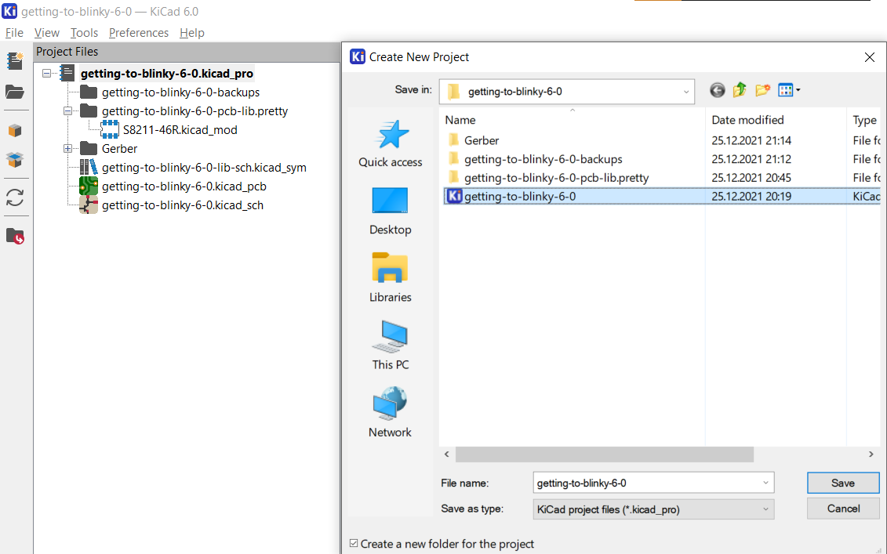
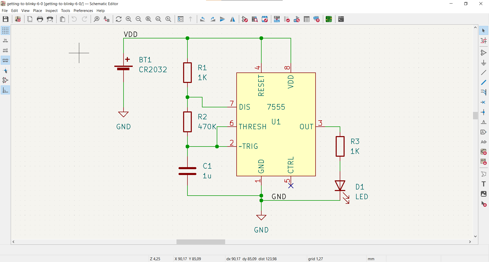
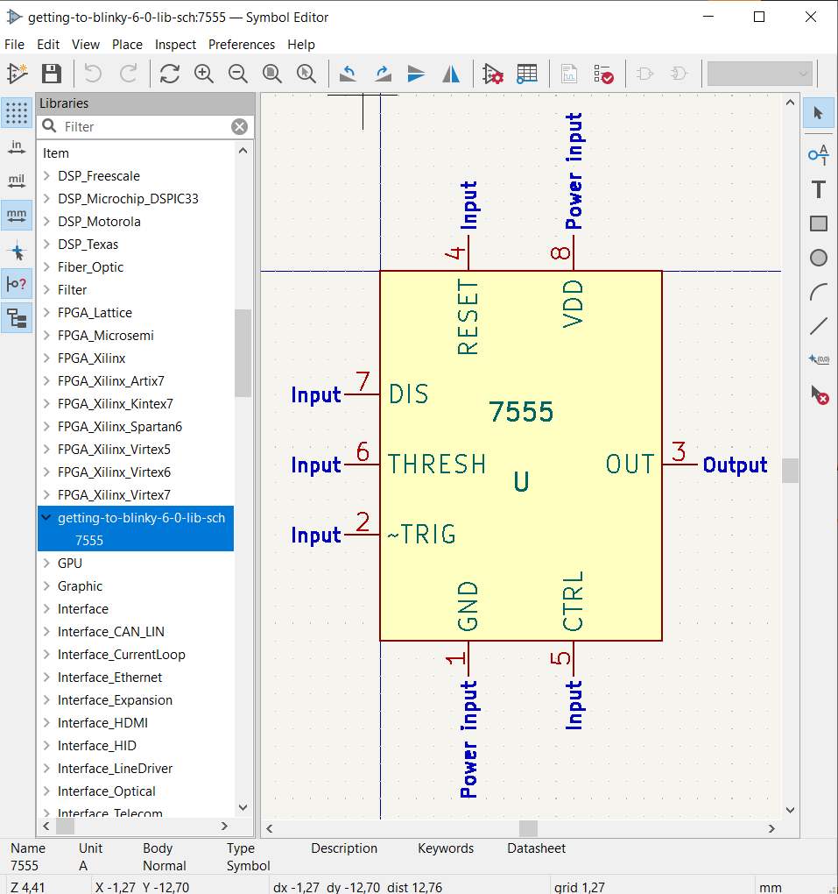
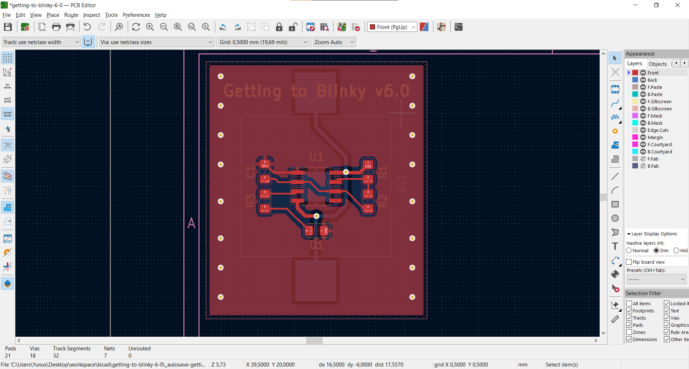
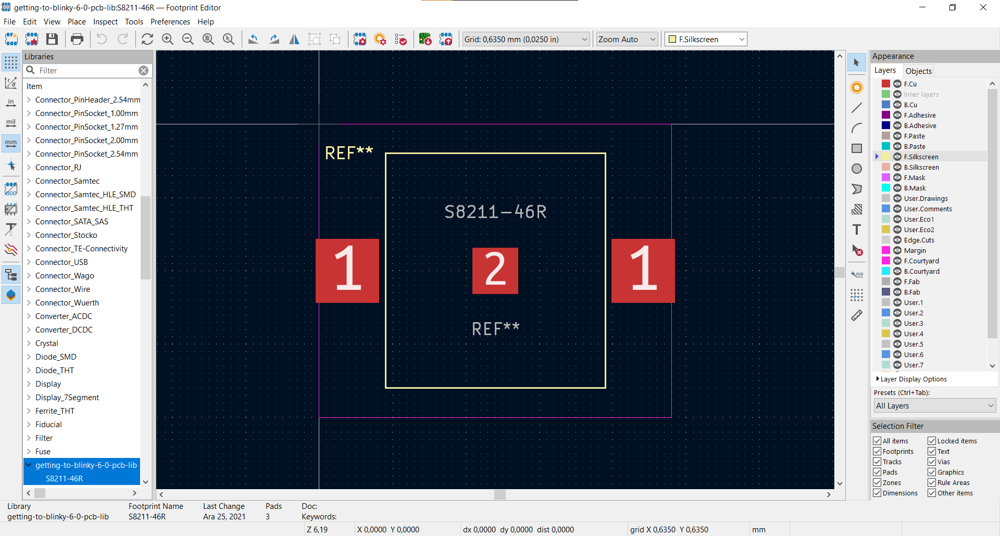
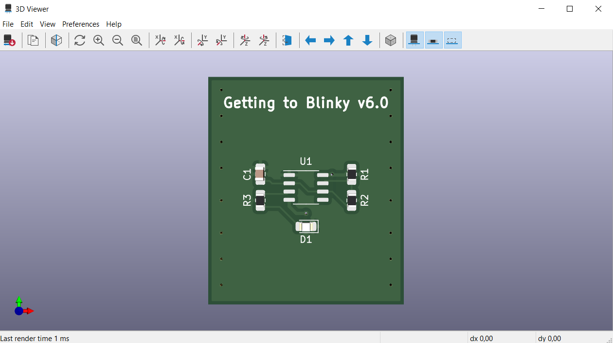

## Introduction

In this post we will discover the KiCad tutorial by Contextual Electronics.

## The Setting Up the Environment

Download the open-source, free to use KiCad application from the official website, for your preferred OS: https://www.kicad.org/

## Get to the Tutorial

The tutorial is available at: 

<iframe width="560" height="315" src="https://www.youtube.com/embed/BVhWh3AsXQs" title="YouTube video player" frameborder="0" allow="accelerometer; autoplay; clipboard-write; encrypted-media; gyroscope; picture-in-picture" allowfullscreen></iframe>

## Milestones from Tutorial

### 1. Create a Project

### 2. Create a Schematic

### 3. Create a Schematic Library

### 4. Create a Layout

### 5. Create a Footprint Library

### 6. Your First PCB!

## Resources

<a href='../resources/getting-to-blinky-6-0.zip'>Project Source File</a>
