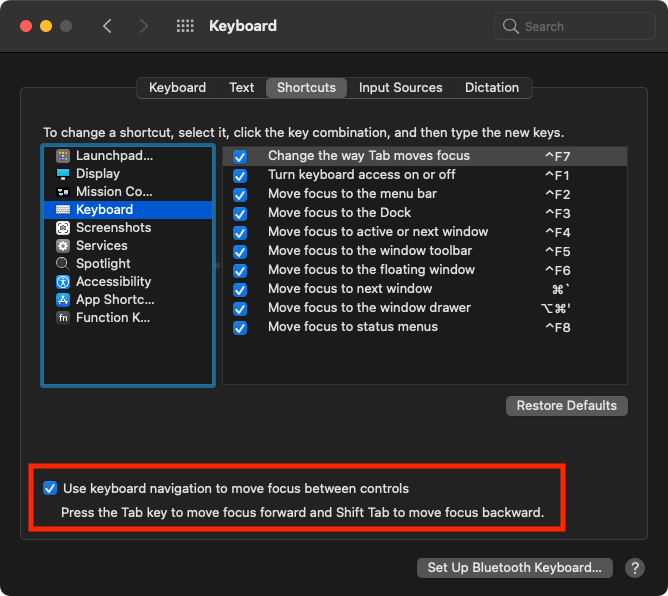

# Select a Dialogue Button on macOS with Your Keyboard
Created: 2021-02-14  

## About

This guide shows you a few different ways to select a user dialogue window button just using your keyboard.

## Options

### Option 1

Using the `↩` will, by default, always select whichever button is in focus.

### Option 2

Several dialogue windows will allow you to simply press `⌘` + `first_letter_of_button`

### Option 3 - My Favorit One 😁

1. Go to `System Preferences > Keybaord > Shortcuts`

2. Check the box next to **Use keyboard navigation to move focus between controls**
    
    

3. Now, you should be able to `⇥` between dialogue buttons and use `space` to select the button.

    
    