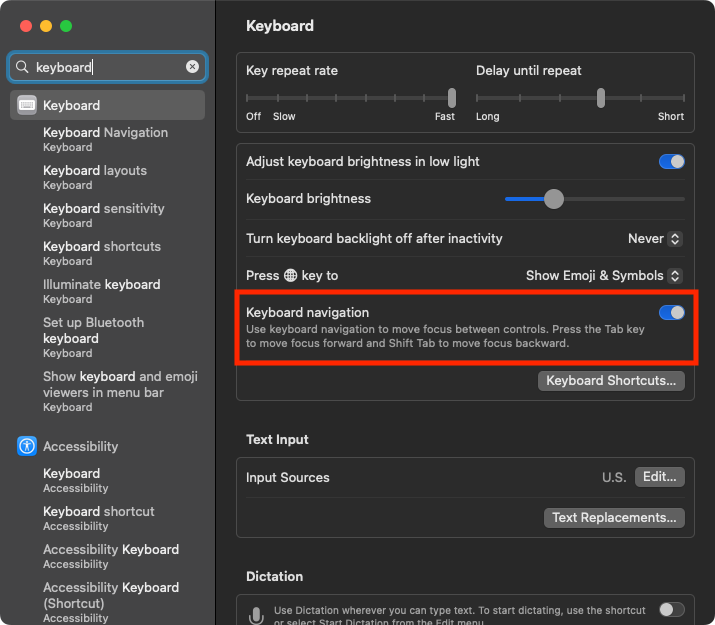

This guide shows you a few different ways to select a user dialogue window button just using your keyboard.

## Options

### Option 1

Using the return (`↩`) key will, by default, always select whichever button is in focus.

### Option 2

Several dialogue windows will allow you to simply press `⌘` + `first_letter_of_button`

### Option 3 - My Favorit One 😁

*Update: 2023.01.19*

#### macOS Ventura and newer

1. Go to **System Preferences**

1. Got to Keyboard settings.

1. Toggle the **Keyboard navigation** option.
    
    

1. Now, you should be able to `⇥` between dialogue buttons and use `space` to select the button.

#### macOS Monterey and older

1. Go to **System Preferences**

1. Click Keyboard.

1. Click Shortcuts.

1. Check the box next to **Use keyboard navigation to move focus between controls**.
    
    

1. Now, you should be able to `⇥` between dialogue buttons and use `space` to select the button.

    
    
