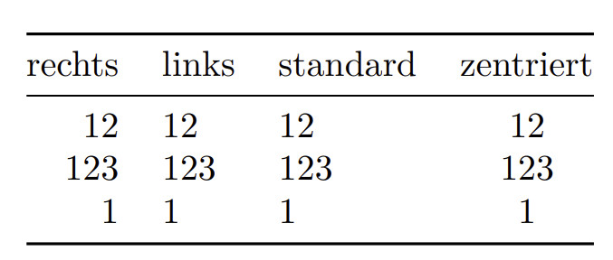

## Motivation

Ein YAML-Header vereinfacht die Transformation des .md-files in das
gewünschte Ausgabeformat. Angestrebt ist, dass im Terminal lediglich 
`pandoc mein_file.md --citeproc -o output.fte` ausgeführt werden muss.

## Header für kurze Texte

Für Texte wie kleine Rechtsfälle oder Essays reicht ein kurzer Header
mit Titel, Name des Autors und Angaben zur Bibliographie. Folgendes
Beispiel dürfte das wesentliche abdecken.

```yaml
---
# Angaben für das Deckblatt
title: Titel
author: Verfasser
date: 23.02.2022

# Angaben zum Inhalt und zur Darstellung der Bibliographie
bibliography: Bibliographie.yaml
csl: chicago-note-bibliography.csl

# Angaben zum Layout
output: 
    pdf_document:
        latex_engine: xelatex
    fontsize: 12pt
    papersize: a4
    lang: de-CH 
---
````

Der Header bietet die Möglichkeit, Kommentare einzufügen. Kommentare
helfen einem, die Funktion bestimmter Teile des Headers zu verstehen,
wenn man sich zu einem späteren Zeitpunkt wieder mit dem Text
beschäftigt.
Kommentare werden mit einer Raute gekennzeichnet.

Zu den Elementen des Headers im Einzelnen:

* *Angaben für das Deckblatt*: Diese Angaben sind wahrscheinlich
  selbsterklärend.
* *Angaben zum Inhalt und zur Darstellung der Bibliographie*: Der
  Eintrag `bibliography` gibt an, in welcher Datei die bibliographischen
  Angaben abgespeichert sind. Wie eine solche Datei erstellt wird, ist
  in einem separaten Beitrag dargestellt.

  Der Eintrag `csl` legt die Darstellung der Belege und des
  Literaturverzeichnisses fest. Entsprechende Vorlagen finden sich
  beispielsweise unter [https://www.zotero.org/styles].
* *Angaben zum Layout*: In diesem Block wird das Ausgabeformat
  gesteuert. Grundsätzlich bietet Pandoc die Möglichkeit, ganz
  unterschiedliche Textformate zu erstellen. Standardzielformat dürfte
  wohl jedoch ein PDF sein. Zum erstellen des PDF muss angegeben werden,
  mit welcher *latex_engine* das PDF erstellt werden soll (diese wird
  durch die lokale LaTEX-Installation zur Verfügung gestellt). Für das
  erstellen von deutschsprachigen Texten hat sich `xelatex` bewährt.
  Diese Engine kann gut mit den deutschen Umlauten umgehen.
  
  Mit der `fontsize` wird die Schriftgrösse in Punkt festgelegt. Die
  `papersize` gibt die Grösse des "Papiers" in der Ausgabe an.

  Der Eintrag `lang` legt die Sprache des Ausgabedokumentes fest. Dies
  ist wichtig für die Steuerung der Trennungen und für die Darstellung
  von Sonderzeichen.

## Umfangreichere Formatierungen

Umfangreichere Arbeiten wie zum Beispiel Seminararbeiten brauchen
Formatierungen, die über die oben dargestellten hinausgehen. So muss zum
Beispiel ein Inhaltsverzeichnis oder ein Abbildungsverzeichnis erstellt
werden können. Oft gibt es auch Vorgaben bezüglich der Ränder oder des
Zeilenabstands.

### Inhaltsverzeichnis

Ein Inhaltsverzeichnis kann mit dem LaTEX-Befehl `\tableofcontents` an
der gewünschten Stelle eingefügt werden. Damit die LaTEX-Engine den
Titel für das Inhaltsverzeichnis in der gewünschten Sprache ausgibt,
muss der YAML-Header angepasst werden. Zwischen dem Kommentar `# Angaben
zum Layout`und der Zeile `output:` muss folgender Inhalt eingefügt
werden:

```yaml
header-includes:
    - \usepackage[german]{babel}
```

Damit wird das LaTEX Packet `babel` eingebunden. In den eckigen Klammern
kann angegeben werden, in welche Sprache die LaTEX Standardtexte
übersetzt werden sollen. So ist sichergestellt, dass das
"Inhaltsverzeichnis" so und nicht "Contents" heisst.

Falls man die Titel gerne nummeriert hat, ist der Pandoc-Befehl
anzupassen. Er muss dann den Parameter `--number-sections` beinhalten.

### Seitenränder

Eine präzise Steuerung der Seitenränder ermöglicht das Packet
`geometry`. Dieses kann analog zum Packet `babel`eingebunden werden. Die
Seitenränder werden dann als Parameter in den eckigen Klammern
definiert.

```yaml
\usepackage[a4paper,
            left=2cm,
            right=3cm,
            top=4cm,
            bottom=3cm]{geometry}
```

Im Beispiel wird der linke Rand auf 2cm, der rechte Rand auf 3cm, der
Rand oben an der Seite auf 4cm und der untere Rand auf 3cm festgelegt.
Die Werte sind beliebig wählbar und könnten auch in anderen
Masseinheiten angegeben werden.

### Mehrspaltiges Layout

Es ist möglich, den Text in ein mehrspaltiges Layout zu setzen. Dazu
muss im YAML-Header das Packet `multicol` eingebunden werden. Das geht
gleich, wie die anderen Pakete.

```yaml
\usepackage{multicol}
```

Im Text muss dann an der Stelle, an der der mehrspaltige Text beginnen
soll, der Befehl `\begin{multicols}{2}` eingefügt werden. Dort wo das
mehrspaltige Layout wieder endet muss der Befehl `\end{multicols}`
eingefügt werden. 
Der Text kann dabei nicht nur zweispaltig gesetzt werden.

Falls der Abstand zwischen den Spalten zu klein sein sollte, kann er mit
dem Befehl `\setlength{\columnsep}{48pt}` im YAML-Header angepasst
werden. Es kann natürlich ein anderer Wert als `48pt}` eingesetzt werden.

### Zeilennummerierung

Falls im Text die Zeilen nummeriert werden sollten, ist auch dies
möglich. Für diese Aufgabe ist das Packet `lineno` im YAML-Header
einzubinden.

```yaml
\usepackage{lineno}
```

Die Option `[modulo]` nummeriert die Zeilen nur, wenn sie ein Vielfaches
von fünf bildet.

### Bildlegenden und Abbildungsverzeichnis

Um in Markdown Bilder einzufügen, verwendet man den Befehl 
``. 
Dies führt für die Ausgabe eines PDF standardmässig zu einer
Bildunterschrift "Bildlegende".

Ein Abbildungsverzeichnis kann erstellt werden, indem man an der
gewünschten Stelle den Befehl `\listoffigures` einfügt.

Falls statt Bilder Grafiken eingefügt werden sollen, ist es möglich,
diese mit [TikZ](https://ctan.org/pkg/pgf) zu erstellen. Dazu muss im
YAML-Header das entsprechende Packet eingebunden werden. Damit die
Grafik mit einer Bildlegende versehen werden kann, muss zusätzlich noch
das Packet `caption` geladen werden.

```yaml
\usepackage{tikz}
\usepackage{caption}
```

Die Grafik wird dann beispielsweise folgendermassen in den Text
integriert:

```markdown
\begin{figure}
  \centering
    \begin{tikzpicture}
      \node[draw] (0) {Test Node};
    \end{tikzpicture}
  \caption{Eine Beispielgrafik}
\end{figure}
```

Falls jedoch umfangreichere Datensätze visualisiert werden sollen,
empfiehlt es sich, den Text in [RStudio](https://www.rstudio.com/) zu
erstellen.

### Tabellen und Tabellenverzeichnis

Tabellen in Markdown sind auf den ersten Blick nicht so leicht
zugänglich. Aber auch Sie werden als reiner Text eingefügt. Der folgende
Code zeigt die möglichen Formatierungen.

```markdown
| rechts | links | standard | zentriert |
|-------:|:------|----------|:---------:|
|   12   |   12  |     12   |       12  |
|  123   |   123 |    123   |      123  |
|    1   |     1 |      1   |        1  |
```

Dieser Code führt zu folgender Tabelle:



Der Übersicht willen sind im Code-Beispiel die Spalten schön
ausgerichtet; dies ist aber nicht nötig.

Um die Tabelle zu beschriften, ist unterhalb der Tabelle der Befehl
`:Table Tabellenbeschriftung` einzufügen. Aus diesen
Tabellenbeschriftungen kann mit dem Befehl `\listoftables` ein
Tabellenverzeichnis erstellt werden. Das Tabellenverzeichnis wird dabei
genau an der Stelle eingefügt, an der der Befehl im Text steht.