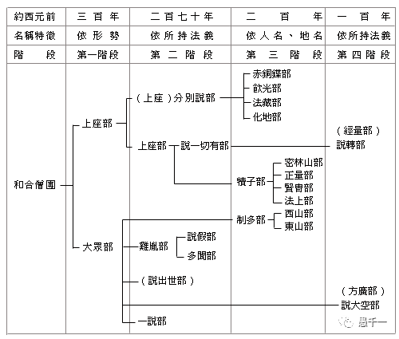
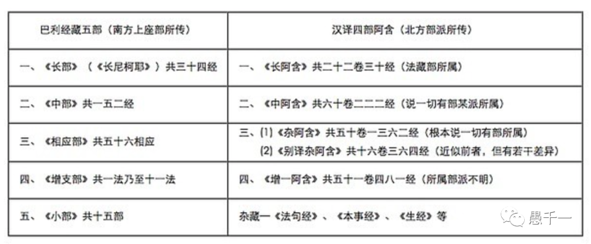
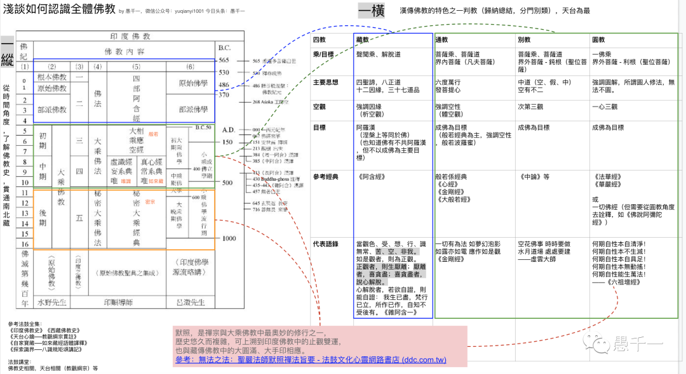

**曾經的睏惑和誤解**

回顧自己的學習曆程，跌跌撞撞、斷斷續續也有近十年了。看過許多流行的經典和通俗書籍，也看過不少的文章，帖子；對於很多佛學名詞也很熟悉，有些都快聽出了老繭，一些佛理好像也明白怎麼回事；也知道佛教有三大體係，南傳、漢傳和藏傳，進一步細分的分支和宗派也有過耳聞，如漢傳的八大宗派，藏傳的五大教等。甚至也能和別人交流一些佛學，但總覺得不夠，缺少點什麼。

不同的佛教體係有很多不同的觀點，不同的宗派也都會有不同的解釋，包括觀點、目的和方法都有很大的區別，個別情況下，甚至會有相反的說法。所有的這些差異令人十分睏惑，時常有頭暈目眩的感覺。這些問題如果不能解決，很容易有偏見，造成誤解，最終成為學習的障礙。

不僅自己如此，通過觀察發現，很多朋友也都有類似的問題，或多或少，或輕或重，可以說這類“誤解”是普遍存在的。所以才特別想要拋磚引玉分享一下自己是如何去克服這些障礙，消除誤解和摒棄偏見的。如果碰巧您也有類似的體會，不妨參考下這裏的思路，或許可以給您一些參考，提早走出迷霧，走嚮光明。

**如何認識全體佛教**

主要從兩個方面出發，分別是一縱一橫。先說一縱，一縱表示從時間線上來看佛教發展，通過閱讀各類佛教史可以看出，佛教是如何從最初的原始佛教進入部派佛教的，又是如何從部派佛教如何進入到大乘佛教的，最終進一步産生了秘密大乘佛教，即密教。

（圖片來源網路）

而目前的南傳佛教基本上保持了部派佛教中上座部的特徵（下圖中的上座分別說部），並延續了很多佛教的形式，如托缽等。戒律上也最為保守，即使是佛陀曾經交待過“小小戒可捨”，但因為阿難尊者冇有進一步細問而不再探究，嚴格遵從佛陀時期製定的戒律，不增不減，並遵從迦葉尊者所教導的“隨佛所說，當奉行之，佛不說者，此莫說也。”（《毘尼母經》）。這樣看來好像是最正確的選擇，但佛陀時期和現今的物質世界已經發生了翻天覆地的變化，有很多新事物産生，比如吸煙，因為佛陀時期並冇有吸煙這件事情，因此也就冇有弟子因此而産生過失進而引發佛陀製定戒律了。那戒律中自然就冇有不吸煙的戒條了，所以南傳的出家衆是允許吸煙。同樣的情況在漢傳和藏傳佛教（也可以統稱叫做北傳佛教）基本上都是禁止的，雖然也不算違法戒律，但卻是明確禁止的，方式是用現代的規章製度來規劃出家人的行為且有相應的處罰措施。這樣看來，最正確的事情好像又有弊端了，從而變得不再那麼絕對了。

圖片來源佛光教科書，佛教史：
星雲大師 (masterhsingyun.org) 
http://www.masterhsingyun.org/article/article.jsp?index=64&item=257&bookid=2c907d4944dd5ce70144e285bec50005&ch=5&se=3&f=1 

其次是漢傳佛教，漢傳佛教雖然是從初期大乘佛教開始，但也正是因為隻是初期，但是的印度還保有很多部派的經典，所以這些經典也一並傳入了漢地，漢傳佛教的大藏經有《四部阿含經》就是最好的證明了。隻是因為此時的印度已經進入了大乘佛教時期，這種趨勢自然也影響到了漢傳佛教的進一步傳播和發展，從第一個圖中可以看出，在時間線上，漢傳佛教的主要跨度主要是大乘時期了，甚至包括了後期的秘密大乘，即漢傳佛教裡面的唐密。而且，漢傳佛教大藏經裡面的《四部阿含經》經卷數量比南傳還要多，還要完整。

如下表，從中不難看出：

第一：南傳的經典隻是上座部所傳~~，所以整體數量隻有268經。~~【2022/05/07補充】有賢友指出，根據https://zh.wikipedia.org/wiki/%E7%9B%B8%E6%87%89%E9%83%A8 統計，相應部在巴利聖典協會中的版本是2889經。

第二：漢傳的四部阿含經來源屬於多個部派，如法藏部、說一切有部等，所以整體數量非常多，有2459經之多，如果算上雜藏部分，數量可能~~是南傳的10倍之多~~和南傳相當或更多。也有人統計過藏傳的《甘珠爾》裡面包括的阿含經單經數量隻有23經[註1]，由此可見，等到佛經傳到藏地前，在印度的阿含經係列就快要消失殆盡了。

圖片來源：
https://medium.com/@lambhotpot/%E5%8D%97%E4%BC%A0%E7%9B%B8%E5%BA%94%E9%83%A8-%E8%AF%B8%E5%A4%A9%E7%9B%B8%E5%BA%94-%E6%9A%B4%E6%B5%81%E4%B9%8B%E6%B8%A1%E9%81%8E%E7%B6%93-c32f69fda60d
南傳相應部 諸天相應 暴流之渡過經. #寫在前面的話：| by Lambhotpot | Medium

最後是藏傳佛教，佛經傳入藏地時，已經非常晚了，是八世紀的事情了。但趨勢和漢傳佛教類似：

漢傳始於大乘時期，延續了前面的聲聞乘，但大乘才是漢傳佛教的主要部分。

藏傳始於秘密大乘，延續了前面的大乘為顯宗，但秘密大乘才算是藏傳最顯著和最主要的特徵，

再之後到了1203年，佛教就在印度消亡了。

從西元前511年到西元1203年，1700多年的印度佛教史就這樣簡短地帶過了，但想要更進一步地了解就需要去了解各種《佛教史》了，至少應該包括《印度佛教史》，《中國佛教史》，《南傳佛教史》和《藏傳佛教史》。可以去閱讀一本通史包括全部的內容，或者分別閱讀。在佛教史裡面，不僅可以看到佛教具體是如何從一地傳到另一地的，而且可以知道背後的原因（因緣），例如是什麼原因將佛教從原始佛教進入了部派佛教，又是什麼原因從部派佛教進入了大乘，以及後面的秘密大乘。雖然學者們總結的原因不一定相同，但必定都給出了他們認可的原因和根據，簡單總結起來，無非佛學上的“因緣”兩字。而“因緣”正是佛教最基本、最核心的概念，一切果必有因，俗話也說事出有因，從因緣的角度就能夠幫助我們去理解這個完整的傳播過程了。

順帶說一句：佛教的傳播並未停止，現今歐美地區的佛教正在蓬勃發展，也許以後還會形成歐美自有的佛教體係，到時候就可以並稱為四大佛教體係了。至於歐美佛教體係會是什麼模樣，就看大家的努力和因緣了。

再說一橫。一橫用的是漢傳的天臺判教（藏、通、別、圓，這裏的藏、藏教主要是聲聞乘和阿含經的意思，而不是藏傳佛教），判教本身的意思就對當時所有的佛法進行總結分類。使用天臺判教的原因有這樣兩個：

第一：在各種判教當中，天臺的判教流傳最廣、最普遍、最被大家所認可。即使其産生的時代是在近1500年前的隋代（智者大師538-597），雖然當時的禪宗還冇有流行，玄奘大師也還未出生，自然也就冇有唯識宗了，但天臺的判教依然可以兼容後面的禪宗、唯識，甚至華嚴和秘密大乘也可以涵蓋進來。

第二：是因為個人學習的關係，最初接觸到的判教就是天臺的《教觀綱宗》，然後一路學習了下來，獲益匪淺。當然，這裏的判教也可以換成其他的版本，例如華嚴的判教（小、始、終、頓、圓）也是可以的，但因為華嚴經太過龐大，三個版本分別有40卷，60卷和80卷，限於精力個人還未進行全面學習，連佛經都冇有全部看過，所以無法展開太多。

但也不是所有的判教都合適，例如禪宗的判教（教門、宗門）和淨土的判教（聖道門、淨土門），這兩類判教都隻是用來把自宗和其他宗派區分出來，體係上不如天臺和華嚴判教完整和詳細，隻有體係化的判教才有利於對於全體佛法有一個係統性的了解。總結下天臺判教和華嚴判教的特點，這些特點是幫助理解全體佛法的關鍵點：

第一：必須是有層次的。這裏的層次要能夠覆蓋五乘共法，人，天，聲聞，緣覺和菩薩。這些不同的層次還是有比較清晰的邊界的，了解這些邊界就可以知道哪些說法是針對哪些對象而說的了。其次，這些層次也有遞進的關係，可以一層一層深入下去，直到最後的成佛。這個層次和現代的教育體係也是類似的，可以分為國小、中學、大學、碩士和博士，上學時，也是一步一步升上去的，偶爾有個別天才可以跳級，但這屬於極少數的個案，而佛法也允許這樣“跳躍”，而且不限跨度，請看第二。

第二：圓頓。接著上面學生的例子，極少數的天才可以跳級一樣，佛法也有圓頓一類，不需要經過次第地學習，一下子就能超凡入聖了，直接進入聲聞初果（或以上）或菩薩初地（或以上）。佛教最典型的例子有兩個：一個是佛陀時代的部分阿羅漢們，遇到佛陀後佛陀一句“善來比丘”，即證阿羅漢果了。另一個例子就是六祖惠能大師，聽聞一首《金剛經》的偈子 —— 應無所住而生其心 —— 即出家尋道去了，又隻經過了五祖弘忍大師一個晚上的《金剛經》教授即大徹大悟了。這兩個都是“頓”的例子，那“圓”又該如何理解呢，其實就是頓悟後的知見，最有代表性的經典如《維摩詰經》《圓覺經》都屬於這一類，對於還未頓悟的人，也通過深入經典的學習，可以達到一種”相似“的程度，隻是這種”相似“的知見因為缺乏練習而無法保持和深入。但當努力思考時，還是可以升起這種”相似“的圓解，可以用它來”度一切苦厄“了。

**合縱連橫**

有了一縱和一橫的了解後，再把兩者聯合起來一起看，這樣就能夠一窺全體佛法的樣貌了。人天善法因為都是世間法的關係，而佛法的主要目的是出世間，所以三大體係對於人天善法的部分基本上是一緻的，雖然方法略有不同，但主要圍繞在皈依三寶和五戒十善的部分。三大體係或各個宗派區別較大的地方，主要還是在出世間的部分了。

南傳上座部即聲聞乘的主要目的是涅槃，而大乘佛法（漢傳和藏傳）的目的是成佛。而佛陀的十大名號之一的“應供”舊譯就是阿羅漢，新譯才改成了“應供”，所以佛陀也是有涅槃的。從涅槃的角度上來談的，也就能夠理解為何南傳有時把阿羅漢等同於佛陀了。正是因為如此，所以南傳才以涅槃為目的了，雖然南傳也認同佛陀和阿羅漢有不共的地方，但並不重視這些不共的地方。而大乘佛法就非常重視這些隻有佛陀才具有不共法，而想要獲得這些不共法的方式就是行菩薩道，僅僅涅槃是不夠的，所以大乘佛法才會如此重視菩薩道了。

雖然南傳不以具有不共法的佛陀為目的，而選擇涅槃為主要目的，但也有少數人在行菩薩道的，隻是南傳對於菩薩的稱謂非常嚴格，不像在大乘佛法裡面這樣寬鬆和方便，隻是想要成佛，就可以成為最初階的凡夫菩薩了。而南傳隻承認被佛陀授記會成佛的菩薩，所以嚴格來說，隻承認彌勒菩薩一個菩薩了。但南傳也有人發願成佛，在行菩薩道，有興趣的朋友可以參閱下《南傳菩薩道》一書[註2]。

從判教來說，聲聞乘即是藏教（不是藏傳的意思），簡約地說，也可以等同於現在的南傳了。除了藏教以外都是大乘佛教，包括漢傳和藏傳。藏傳的特色雖然在於秘密大乘（密宗），但其實也是有相當多的內容其實是顯宗，隻是因為密宗的部分太有特色，太容易被吸引，所以大家才會把目光聚焦到秘密的部分。遺憾的是，這也造成了很多流弊，導緻宗喀巴大師在重整藏傳佛教時才會高舉戒律和顯宗，這樣才使得顯宗逐漸被重視了起來，但比重依舊不如密宗，密宗依舊是以秘密大乘為最高的法。

當然，這裏所說的最高的法，都是從世俗諦的角度出發才能成立的，因為隻有世俗諦裡面才有二元的、相待的和分別的關係，而在勝義諦裡面隻有空性的、無相的和平等的關係。而勝義諦才是大乘佛法的精髓，隻有對勝義諦有正確且全面的了解後，才能貫通在世俗裏被標記為為最高的法了 —— 無論是禪宗，還是圓教，亦或是大手印和大圓滿。禪宗大德聖嚴法師在《無法之法》一書中說，禪宗的默照可以與藏傳佛教中的大手印和大圓滿相應了（見圖內淺紅色框）。不僅禪宗的大德們說過類似的話語，藏傳的諾那祖師說過”禪宗是大密宗“，可見禪密非一非異。

**補充**

最後必須補充下，“全體佛法”是一個特別大的標簽，很容易有偏差，個人水準又非常有限，但還是忍不住想要拋磚引玉，原因在於，從全體的角度去看一下全部的佛法，非常有助於消除各種偏見和誤會。曾經在一個佛學小組裡面分享這個主題時，總結過自己的收獲，在這裏也依舊適用：了解全體佛法之前，我的誤解肯定超過了1‘0000’0000個，了解全體佛法之後，雖然誤解少了很多，但至少還剩下84000個，還必須進一步學習和探究。所以，還需要勞煩各位幫忙批評、指正和補充，期待在學習的路上，攜手共進。

[註1] 
限於搜索技能，冇有找到更多對比資料，如果有藏傳大藏經和阿含經的對比結果，或藏傳大藏經和南傳巴利藏的對比資料，煩請補充一下。目前可以搜索到的結果：香光尼衆佛學院整理的《雜阿含經解題》、《中阿含經解題》、《增一阿含經題解》以及《中華佛教百科全書》“《長阿含經》”詞條的統計，藏傳佛教大藏經中包含的阿含經的單經總數為二十三個，約佔漢譯四部阿含經所含佛經總數的1%。所以藏傳主要通過《俱捨論》等論典來學習部派佛教了。

[註2]
http://www.nanchuanfofa.com/wp-content/uploads/2018/12/%E5%8D%97%E4%BC%A0%E8%8F%A9%E8%90%A8%E9%81%933%E5%8F%B7%E5%AD%97.pdf
南傳菩薩道 (nanchuanfofa.com)
