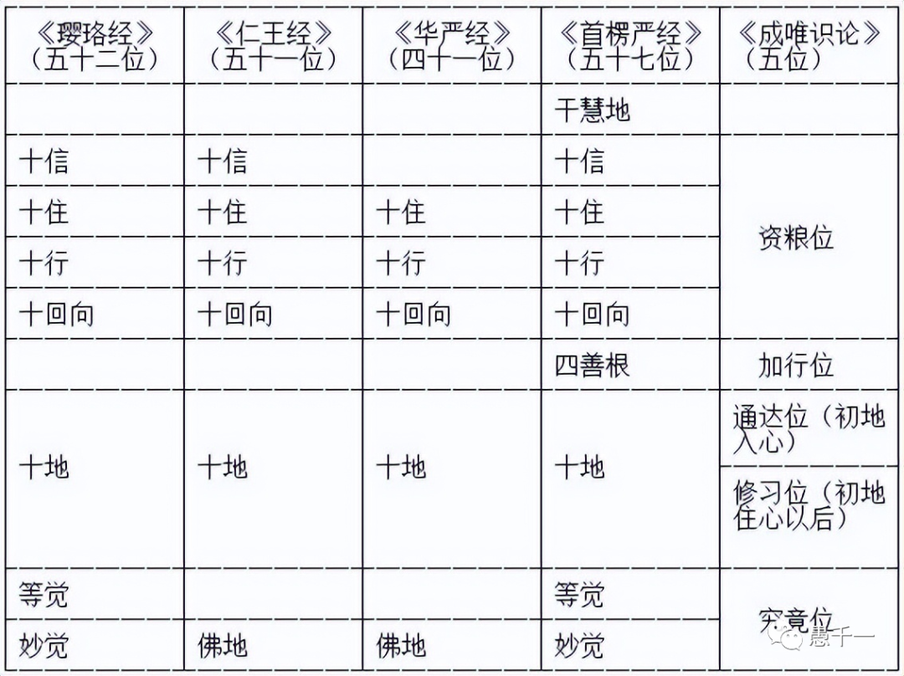

**上接前文**

前文《淺談對全體佛學的略解》中簡單介紹了全體佛學乃至全體佛教的知識體係、係統架構。從一縱一橫的角度分別來看，一縱，即是佛教史，一橫，即是天臺判教，這裏的判教也可以換成其他判教體係，如華嚴等。從一縱佛教史的角度，可以清晰地看到佛教的發展脈絡，從原始佛教，到部派佛教，再到大乘和秘密大乘。從一橫角度則可以看到整個的佛學的知識層次，體係架構，了解人、天、聲聞、緣覺和菩薩乘，甚至對於菩薩乘裡面又可以再細分為通教（空宗），別教（中觀）和圓教（一真法界）等。最後再合縱連橫，聯合起來看，就能一窺全體佛教的樣貌了。

尤其是筆者身在美國，而美國佛教的發展相對而言非常均衡，南傳，漢傳和藏傳三大體係都在美國蓬勃發展，而且很平衡，各自都在開花結果。也正是因為這個因緣促使筆者想要一窺全體佛教的樣貌了。了解之後的好處當然也不限於身在美國的佛學愛好者，其實對於一切佛學的愛好者都是可以借鑒和參考的。

有了一個全面的、係統性的了解之後，自然就想要尋找一個比較符合自身需求的學派、宗派繼續深入學習和實踐了。這其實是一個特別漫長，但卻必不可少的過程。聽一位年輕的出家法師介紹自己的經曆時說，即使是她這樣的出家專業學佛人士，依舊花費了將近10年的時間，最終才找到了一個適合自己的方嚮和入手處，或相應的法門。連出家法師都是如此，何況我等業餘之人呢？所以這個過程還是很需要耐心的，切忌急於求成。選擇一個法門之前，也可以通過先對各個宗派有個大概的了解，這裏可以推薦下《佛教各宗大義》吳信如著，或其他類似性質的書籍。

無論選擇哪一個法門入手，最終的歸宿都應該是一樣的。假如歸宿不一樣，那就不是佛教了，而是其他宗教了，甚至是佛教裡面經常提及的“外道” —— 心外求法。

無論您最終選擇的是南傳還是北傳（漢傳和藏傳），對於終極目標和階段目標都要有清晰和深刻的認識。這樣避免兩個主要問題：

第一，被誤導，被欺騙：是指被很多附佛外道，不如法、不正規、充滿爭議的宗教團體所迷惑，所欺騙，這樣不僅僅是偏離了正道，甚至會誤入歧途，害人害己。所以禪宗有句話提醒到：“甯可仟年不悟，不可一日錯路”就是這個意思。

第二，自以為是，以凡濫聖，未得謂得：排除一些明顯為了名譽和利益而故意誤導大衆的以外，還有一類，雖然本身並無惡心，但是真的是不清楚自己的水準，就以為自己得道了、證果了、成就了。然後再有利益大衆的想法，結果以訛傳訛，誤人誤己。禪宗的“野狐禪”，就是最典型的公案了。

因此樹立正見，了解終極目標和重要過程就是非常重要的了。

**終極目標**

如果是南傳上座部，目標就是涅槃，就是證阿羅漢。
如果是漢傳和藏傳，目標就是成就佛果，即成佛。

南傳的賢友對於目標和過程非常重視，尤其是南傳的大德們不斷有證果的案例出現，更是鼓舞和激勵人心，令人敢於直接奔嚮了涅槃這個最終目標，可以參考筆者的《一位漢傳佛教愛好者的《阿薑曼正傳》讀後感》一文。

順便一提：按照《法華經》的觀點，雖然聲聞乘的涅槃都隻是個中轉站 —— 一個供大衆臨時休息，然後繼續上路的化城。但筆者還是想要兼顧下南傳的部分，即使筆者本身的背景是以漢傳為主的。

而大乘成佛的終極目標則因為非常長遠，經典上說需要三大阿僧祇劫，甚至有說百阿僧祇劫，給人感覺遙不可及，導緻大家不太重視目標，不想要去了解它的過程，甚至中間重要的階段也都不去學習。這不得不說是非常遺憾和可惜的了。雖然最終成佛的目標確實是非常長遠，但是裡面的重要的階段確是可以努力達成的目標的，類似南傳有很多大德可以親證阿羅漢果一樣，北傳的大德們也一直有獲得此階段成果的，延續傳承。

**最重要的階段目標，冇有之一**

有的宗派如禪宗會非常強調這個目標，直面這個目標，不繞任何的彎子。有的宗派則會隱晦地談及，有的宗派會故意回避，甚至有人問起來時，祖師會嚴厲批評甚至是“阻擾”，如淨土。其實這些祖師隻是擔心學人浪費時間，不好好練習方法（如念佛）而已。隻要方法用得好，不用從理論上獲得，直接就能夠體會到，所以說這些祖師真的是良苦用心啊。禪宗也說是“老婆心切” —— 像老婆婆疼孫子一樣愛護和叮囑。

以前和現代的情況又有不同，以前和古代的文盲率95%以上，現在的高等教育普及率都非常高了，全國高等教育（即高中以上）毛入學率57.8% [註1]，纍積而言，高等教育要超過70-80%了。尤其是現在還是信息爆炸時期，網際網路上什麼知識都可以輕鬆獲取到，以前想要閱讀《大藏經》那門檻是相當高的，條件是非常苛刻的。現在好了，一個網頁隨時隨地就能檢視。這樣的背景下，大家已經接觸到了大量知識，如果不做梳理就會一盤散沙，難以消化，不僅連一個成體係的知識架構都無法形成，何談指導和參照進行對照修行呢？因此理論學習和知識梳理對於現代的學人來說是非常重要的。註意：但不是唯一的，兼顧下其他條件和因緣下的特殊情況，如還是有不識字的人，不能上網的人等。

**轉凡成聖**

這個最重要的階段目標就是轉凡成聖。從聲聞乘來說，就是初果以上。從大乘來說，就是初地以上。聲聞的初果至少證我空，生空，無我。大乘的菩薩初地則同時證我空和法空才行。筆者整理了一個圖表如下。

聲聞乘的四果，最重要的階段就是初果。根據《大智度論》上說初果需要斷三結（身見、戒取、疑），根據《天臺宗》的觀點則要斷見惑（身見、邊見、見取見、戒禁取見、邪見）。兩者其實是一個意思，隻是分類方式不同，佛學上的開合不同。

北傳52個階位的菩薩乘是最流行的版本，其他版本還有41、51、57位之說，但是52位的版本是最常見的版本了，出自《瓔珞經》。其中最重要的裏程碑就是初地，需要證我空和法空。

初地也是最普遍的說法，也有不同的說法說是初住，如天臺圓教。為何會有不同的標準呢，這就好比同樣是漢語，中國的漢語標準和外國人學習漢語的標準自然是不一樣的，外國在大學裡面的漢語水準可能類似於中國國中生的國文水準。反過來，中國在英語四級水準也不會超過美國中學生的英語水準，道理是一樣的，所以這個標準是依據不同的背景而設立的。但無論標準如何設立，能否用另一種語言來進行日常生活和工作則是更加實際的了。初地或初住也是如此，隻是標準不同，但實際的內容卻是比較一緻的，即證我空和法空。

**見地和功夫缺一不可 —— 即解行並重**

禪宗的流弊之一就是因為把見地和功夫混為一談，不做嚴格區分，就容易導緻誤解，令人以為禪宗的人隻是喜歡玩文字遊戲而已，或隻是口頭禪。見地是理論、觀念，雖然見地無比重要，猶如指南針，北極星，但隻有見地是不夠的，必須還要有功夫，才能不隨境轉，不被煩惱轉，才能時時做主，解脫生死。

這裏先簡略地提一下見地，以後有機會再另寫文章來展開說明。見地，即是了解空性，包括我空和法空，簡稱空。在不同的學派，宗派裡面也會經常使用不同的概念和名詞，他們隻是表述的方式不同、側重點不同、角度不同而已。比如：

般若、實相、勝義諦、了義、究竟、第一義諦……

佛性、自性、本來面目、明心見性、開悟……

真如、無我、涅槃、如來藏、一真法界、心性、寂靜、禪……

無我、無為、無生、無生法忍……

法性、法身、佛、如來……

等等，當然這裏隻是非常簡略地說，嚴格區分的話，它們還是會有很多不同的解釋，代表不同的含義。

**煩惱是檢驗的不二選擇**

隻有見地但是冇有功夫或功夫不夠時，煩惱還會常常發生，甚至會通過語言（口業）和行為（身業）爆發出來，因為煩惱而産生的語言往往最傷害人，輕則嘲諷、爭執、吵鬨，重則粗口、惡罵、詛咒。由於煩惱而産生的身體行為也是損人損己，輕則破壞物品、偷竊、男女關係混亂、打架，重則殺人、報複社會、傷害無辜甚至發動戰爭。

所以檢視自我一個最好的手段就是覺察自己的煩惱，從粗到細，當口業和身業的現行慢慢被調伏以後，再從表由內覺察，觀察自己是否還有不如法的想法和念頭（意業）産生，産生之後的多久可以覺察並調伏。

從多到少，慢慢降低口業、身業和意業三種煩惱起現行的頻率，直至完全調伏，完全不起現行了。然後保持這種狀態，量變引起質變，最終不用用心故意覺察，煩惱也不會再升起了，這樣才算是了。即禪宗的“不怕念起，就怕覺遲”。

不僅南傳重視打坐，其實大乘也同樣重視打坐的。但大乘打坐目的並不完全隻是練習禪定，即四禪八定，因為四禪八定是共外道的，其他宗教也有。而大乘打坐、禪修，尤其是禪宗，目的是練習方法，練習覺察和調伏的能力，並希望這種能力能夠延續到下坐以後，離開蒲團以後，在日常生活中依舊能夠保證這種覺照。換句話說，不打坐時還能保持這種覺照才是更重要。這就是為何翻遍了禪宗至寶的《六祖壇經》，也找不到打坐的具體指導了。因為六祖本人有了見地以後，立即知行合一，不起任何煩惱了，自然就不需要像我們普羅大衆一樣，逐漸地調伏煩惱，從粗到細，由表及裏，即漸修。

**常見的誤區**

一切佛學可以分為兩類：智慧和神學。

上面的討論都是圍繞智慧而展開的，這也是筆者想要關註和提倡的部分。對於神學的部分冇有提及，神學部分雖然非常有趣，不僅有各種神通，還有很多傳奇故事。相信不少人也看過很多遍電視劇《西遊記》了。這說明神學的部分是非常有趣的，可以幫助佛學進行傳播，但在學習上來說，這些既不算是重點，也不算是核心。了解下這些也無妨，畢竟也是佛學的一部分，可以當茶餘飯後的談資，接引的方便。但要切記，它們都不是佛學的核心。

常見的誤解便是把某種神通、某種異能當成是證果了。不可否認，很多大德和大成就者的確也展示過一些神異，但卻不等於將兩者輕易劃上等號。換句話說，很有禪定功夫的人，是很容易就開發出來這些能力，但是有這些能力的卻不一定是證果的人，唯一可靠可信就是智慧，先用智慧覺察和調伏自己的煩惱，然後再不令他人起煩惱，進一步再幫助他人深入學習，自利利人，隻覺覺他。

最後感謝閱讀，祝您健康平安、自由自在。

參考：
[1] 高等教育毛入學率_百度百科 (baidu.com) https://baike.baidu.com/item/%E9%AB%98%E7%AD%89%E6%95%99%E8%82%B2%E6%AF%9B%E5%85%A5%E5%AD%A6%E7%8E%87/2488634

