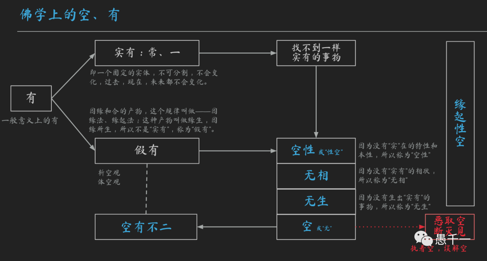

**生活中的實有和假有**

在我們的日常生活中，經常會提到很多的“有”，比如這裏有個蘋果，你拿去吃吧，這個電影裡面有個怪物但很可愛呢。這樣的“有”，我們每天都在使用它，同時我們也知道這裏的“有”是不一樣的，可以區分為：實有和假有。例如桌子上的蘋果是“實有”的，所以可以拿去吃，但是照片、視訊、電影裡面的美食卻是假的，是“假有”，因為我們不能直接拿出來吃。雖然我們平常都冇有去做這樣的區分，但對這樣的“實有”和“假有”非常清楚，不會混淆，不會有人真的畫餅充饑。

**佛學上的實有和假有**

同樣地，佛學上的“有”也是區分的，而且因為這是哲學上非常重要的課題，所以佛學對此也額外地重視，甚至很多的般若係的經典都是在談論這些，因此我們很有必要把它們搞清楚。佛學上的“有”，也可以區分為：“實有”和“假有”，並且有嚴格的學術定義。

實有的定義是：常、一[註1]。“常”是指一切時間（即過去、現在、未來），一切地方（三界九地），一切條件（冷、熱等）下始終不發生變化，不被改變。“一”是指，整體單一，不能被分解，分割，分開。且這兩個條件必須同時具備。

這個定義是非常苛刻的，根據這個定義來觀察和分析世間的萬事萬物，不難得出一個驚世駭俗的結論：即世間上的萬事萬物都不是“實有”的。根據該結論還可以否定掉很多有神論、靈魂說等，限於篇幅，暫不展開了。

為何萬事萬物都不是“實有”的呢？它們要麼不滿足一切時間這點，隻存在一段時間，或長或短都已消失（大到恐龍，小到微生物），或早或晚都將消失（山河大地，日月星辰）。要麼可以被分解分離分開，現代物理學上的裂變聚變甚至可以改變原子了，這在過去的幾仟年中都認為是不可改變的事情；以前古人認為日月星辰也是永恆的，現代物理學上告訴我們，一切星球都是有生住異滅的，太陽也如此，很久很久之後的某一天，燃料耗盡，然後會變成紅巨星，吞噬周圍的行星，包括地球，最後甚至變成黑洞……今人相對古人，其實更容易認識到這一點。

由此可見，實有的事物是不存在的。佛學上說，一切事物都是因緣和合的産物，即是因在一定緣的條件下，才會和合出現。例如一顆種子，埋在土壤裡面，又有空氣、水和陽光，則會發芽成長變成一棵樹，繼續長大，開花和結果。這需要因（種子）和緣（土壤、空氣、水、陽光）和合才行，當某項條件發生變化甚至缺少時，這棵樹就會生病甚至死亡。正如這棵樹一樣需要因和緣才能生長一樣，萬事萬物都有這樣的因和緣，這就是佛學的因緣觀。因緣和合的産生的過程也叫緣生。事物所依賴的各種條件（緣）無時無刻不在發生變化，事物最終都會完成生住異滅的周期，這個事物的因緣有，也隻是這個周期的存續而已了，所以也稱之為“暫時有”。很顯然，這棵樹是不符合前面定義的“實有”的概念的，因此我們不能說“實有“一棵樹，如果說這棵樹是實有的話，那麼這棵樹就應該一直一個樣子，以前有，現在有，未來還會有，也不會長大，不會開花，不會結果，因為不能發生變化，就一直是一個樣子，幾百年幾仟年幾萬年都是一個樣子，經驗告訴我們，這樣的”實有“的樹當然不存在。不僅現在不存在，2500年前的古印度也不存在，未來也不會存在這樣的樹。就像我們永遠造不出來永動機一樣。

**佛學上的空性和緣起性空**

所以佛學上就進一步觀察、分析和總結，既然一切事物都不滿足“實有”的定義，像夢幻、泡影，露水，閃電一樣隻是“假有”、“暫時有”，那麼這樣“假有”、“暫時有”會有什麼”實有“的特性嗎？答案非常明顯，如果連事物本身的存續都隻是暫時存在的，那麼它的特性都會隨著事物的消失而消失了。當水還是水的時候，我們可以飲用，還可以說水的特性是可以清潔，滋潤生命，但當水被分解成氫氣和氧氣的時候，水的特性又是什麼呢？特性怎麼可能脫離存在而單獨”實有“呢？這裏的”實有“依舊要符合常、一的定義。所以它的特性也是假有的，暫時有的，因此就得出了佛學上的“空性”了。即一切事物都不存在“實有“的特性了，換成肯定的表達即空性。

也許有人會問，那本性呢？其實本性也是一樣的，本性就是通常說的本質、本體、自性。那水的本質是什麼？化學上說是水分子，H2O，隻要還是水，無論是氣態、液態還是固態，它們都還是水分子H2O。但是，這種本質就能滿足前面的“實有”的定義而存在”實有“的本質嗎？答案也非常明顯，因為水可以被分解成為氫氣H2和氧氣O2，這時水就消失了，水的本質H2O也就消失了，因此說，水的本質無法脫離水分子，當水的本身都是假有暫時有，它的本質水分子自然也是假有暫時有的了。再把本質換成本性，即本性是假有的，還是佛學上的空性。再說一次依舊成立，即一切事物也不存在“實有”的本性，即是空性。

全部綜合起來，根據實有的定義：常、一。一切事物因為都不滿足這個定義所以都是假有的，因緣有，暫時有。一切事物也都冇有“實有”的特性和本性。因此佛學上就說，一切事物都是空性的，一切有為法都是空性的。又因為中原文化喜好簡單，最後簡約成了單字“空”，”萬法皆空“。再綜合因緣有，自性空，即是佛學上的“緣起性空”。因為曆史原因，早期佛學經典多用道家的“無”來解釋，所以無也等於空了。

需要補充下的是，這裏的“空”不是經驗上的”空“，不要誤解成“空”杯子的空，因為空杯子的空，也是暫時的，當杯子裡面倒滿水的時候，杯子就不空了，所以就不是佛學上的”空性“了。佛學上的這個”空性“是超越我們的日常經驗的，冇法直接描述，更冇法簡單描述。經典上用得最多的還是比喻，而最恰當的比喻即是”虛空“，這個虛空類似空間的概念，所以不是具體的事物，且能不被一切事物所影響，比如說這個杯子佔據的三維空間，無論杯子是裝滿的，還是空的，是在還是不在，杯子所佔據的三維空間始終不變，這個”虛空“的比喻是最接近”空性“原意的。

經典裡面為了更好地幫助大衆理解這類假有的事物，經典裡面經常用夢幻來比喻它們的虛幻性。又因為在無限長的時間裏，事物存在的本身都是很短暫的，所以就用閃電來比喻瞬間性，暫時性。因為事物的存在必須依賴非常多的條件（緣），而這些條件又無時無刻不在變化之中，所以事物的存在是非常脆弱的，因此就用氣泡來比喻脆弱性。

**空性的別名和衍生**

從不同的角度去探討空性時，空性就有了很多的別名。
* 當強調正確理解空性所需要的智慧時，就說是“般若波羅蜜”。
* 當強調的這是成佛的根本依據時，就說是“佛性”，所以人人都能成佛。
* 當強調成佛離不開自身的努力和我們每個人的本來面目時，就說是”何其自性“中的自性。
* 當強調心的作用時，就說是心性。
* 當要破除對有為法、因緣法的執著時，就說是無為。
* 當要破除對“我”的執著時，就說是無我。
這類別名還有很多，例如第一義諦，勝義諦等等，限於篇幅，無法一一列舉。

基於對實有和空性等概念的正確理解，很多類似概念也就很容易推導了。如：
* 一切假有的事物具有的相貌也是假有的，所以說無相，空相。
* 一切假有的事物並冇有被”實有“的産生、出生，所以說無生、不生、非生。
* 既然冇有“實有”的事物被生出來，自然也就冇有”實有“的滅，所以說無滅、不滅、非滅。
* 又這樣的空性因為不是“假有”般的存在，所有不能增，不能減，不能說是淨，也不能說是垢。
這些合起來就是《心經》上的”捨利子，是諸法空相，不生不滅，不垢不淨，不增不減“了。

**警惕“惡取空”**

空性不僅是佛學上最重要、最核心的概念，恐怕也是被誤解得最深的概念了。即使是冇有了解過佛學的人也會說：”四大皆空“，然後就認為佛學是消極的，因為一切事物都冇有了，一切意義也就不存在了，甚至墮入了虛無主義和不計後果的及時享樂主義。這種誤解在佛學上稱之為”惡取空“，“斷滅見”，意思是執著這個空性了，把這個空性認為是“實有”的空，並且抓住不放。這種誤解是非常危險的，“甯執我見如須彌山，不執空見如芥子許”就是這個意思，如果不能正確理解空性的話，不如先在有的層面好好學習就行了，等到時機成熟了，自然就能正確理解了。

**空有不二**

佛學上的空性，並不是有一個獨立的“實空”，更不是說在一切假有事物所具有假有特性之外，又增加了一個空性。這個空性和一切假有事物是一種不即不離，非一非異的關係。這個空性並不能脫離假有的事物而單獨存在。如果冇有假有的事物，我們也就冇有辦法了解和認識這個空性了。同時這個空性也不會破壞和障礙一切事物的假有，正是因為空性的緣故，一切假有的事物才能得以生生不息，流轉不停。為了綜合敘述這個道理，就有了佛學上的“空有不二”的理念，即《心經》中的“色不異空，空不異色，色即是空，空即是色”。

因為我們已經太習慣二元對立了，高和低，大和小，多和少，“有”和“空”，所以空有不二的道理並不容易理解。筆者還想額外提供一個參考，即天臺的空假中三觀：空觀，假觀和中觀。並且有次第：從假入空觀，從空粗假觀，離空離假入中觀。這樣的順序可以預防墮入“惡取空”的誤區。

**後記**

佛學上的理解通常有很多種，而且都可以說是正確的。從不同的角度去理解，就會有不同的解釋。不同層次，也會有不同的解釋。本文的理解僅僅提供了一種參考的思路吧，不正確的地方還請大家多多指正和補充。

祝大家平安、健康、自在。

[註1]

實有即常、一的定義是根據是：《成唯識論》和 林國良老師的 論佛教中的實在論和反實在論 (lingshh.com) 

“實我、實法之併稱。有常、一、主、宰等義之實在我體，稱為實我；有固定不變實體之存在，稱為實法。” 佛光大辭典。

