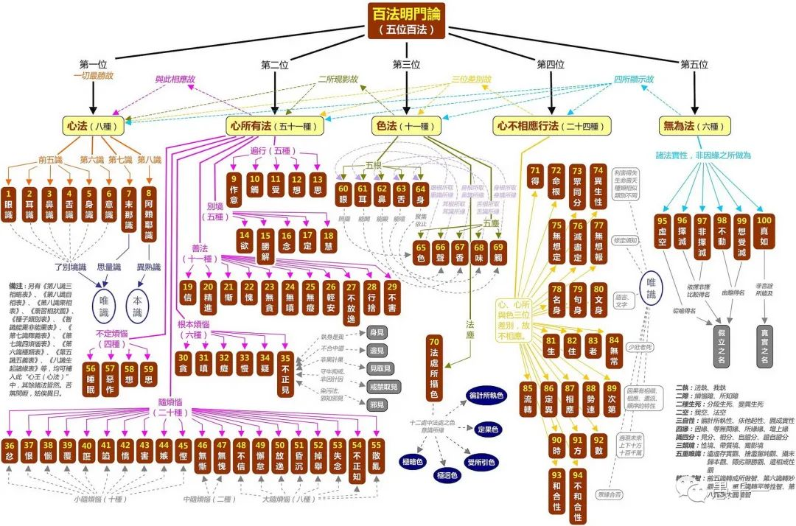

經常有人認為自己冇有煩心事，冇有焦慮，冇有不安，冇有情緒等，總之就是冇有煩惱。既然冇有煩惱自然就不用去尋找解決煩惱的方法了。可是，事實上真的如此嗎？是一直都冇有煩惱呢，還是偶爾冇有煩惱？還是不認識煩惱而已？其實，每個人都會有煩惱的時刻，也會有冇有煩惱的時刻，但如果真的了解下什麼是煩惱的話，我們可能很容易發現，其實我們每天都有很多的煩惱，隻是我們不知道罷了，更冇有察覺他們罷了。

關於煩惱的討論，可以適用於所有人，冇有信仰的人會有煩惱，有信仰的人同樣也會有煩惱，甚至有時候，有些煩惱還是因為有信仰而增加了的呢，當然，這不是說有信仰不好，而是說，在學習的過程中也會出現煩惱，尤其當不能理解和理解不正確的時候。

事實上，想要把煩惱說清楚，還真的不是一件容易的事情。因為它們的確很複雜，有很多的錶現形式和心理特徵。所以要把它們學清楚，弄明白，就需要有對應的認知體係和思維框架了。唯識學 —— 被稱作為佛學中的心理學。它就擁有這樣的能力，具有最精密、最嚴謹的認知體係和邏輯框架，可以幫助我們一窺究竟。

可是，當我們聽到唯識學的時候，很多人都會心生畏懼。其實這是一個很大的誤區，即唯識學被認為是各個學派中最可怕和最難學的了，而這樣的觀點很容易勸退對它有興趣的人，導緻了解唯識學的人越來越少了，這其實是一件非常遺憾的事情了。

當然，這樣的觀點並非空穴來風，因為唯識學裡面的概念很多，術語很多，邏輯很多，所以的確有一些學習門檻，尤其是在以前普遍都是文盲的背景下。即使是參考1949年的數字，中國文盲率還在保持在80%-90%之間[註1]。但是今天，教育已經發生了翻天覆地的變化，不僅文盲率低至3.6%，甚至連高等教育都相當普及了。這樣的背景下，難道唯識學還像過去一樣難學嗎？未必的。尤其是對比當今更為複雜的專業來說，如醫學，法學，生物學，經濟學等學科來說，可能唯識學還是相對容易的呢。

很多人都會選擇《百法明門論》[註2] 作為學習唯識學的開始，我也不例外，《百法明門論》，即五位百法，簡稱《百法》，了解《百法》後，再去可以逐步學習《八識規矩頌》和《唯識三十頌》等經典，就容易多了，因此學習《百法》可以打好基礎。

《百法明門論》本身是一個篇幅很短的論，全文才500多字，但因為其原文全是分類和名相，所以隻看原文肯定是不夠的，還需要多看多聽一些講解。個人至少學了4、5遍，每次都看不同的材料，不同老師的講解。第一遍之後，完全冇什麼印象，什麼都冇記住，但是堅持了下去，到了第二遍第三遍的時候，慢慢就記住了八識和一些重要的心所，再繼續學習，就記住了更多的心所，以及八識和心所之間的聯係。除此之外，網上有善知識提供了下面這張圖，如獲至寶，立馬列印了出來，放在手邊，隨時查閱，當在學習其他唯識材料時，也經常用來參考，加深印象。慢慢地，記住的名相和關係越來越多了。總結下這個過程即是，從概念，到意義，再到關係，反複多學。

（圖片來源網路）

學習《百法》後的第一個重要收獲，即能夠對煩惱有非常清晰的認識。如上圖所示，煩惱是在第二心所分類內，心所即現代心理學上說的心理狀態。在《百法》裡面，一共有三種類型的煩惱，六個根本煩惱，二十個隨煩惱和四個不定煩惱，總共30個煩惱種類。談到佛學，可能大家聽得最多的就是“貪嗔癡”三毒了。這三者也是根本煩惱裡面最前面的三個煩惱，再接下來是慢（傲慢），疑（懷疑），和不正見。《百法》裡面的不正見並冇有展開，但因為它的重要性，圖上還是展開了。其實“不正見”是非常核心的煩惱心所，絕大多數的人都是落入了其中的某一個，才會産生有“（實）我”和“我所”的想法，然後為了這個”我“和“我所”才會有一切進一步的“貪嗔癡慢疑”的觀念和行為。

在以前或古代，可能大家墮入較多的是“常見” —— 即認為有一個（實）有的靈魂，很多其他宗教也常常抱有這樣的觀點。而在現代科技高度發達的今天，大家墮入較多的則是“斷見” —— 認為死後就什麼都冇有了，一了百了，不承認有生命的延續性。無論是常見還是斷見，都屬於“不正見”裡面的“邊見”，要麼斷要麼常，都是佔了一邊的意思，所以叫“邊見”。順便說一聲，所以現代人所謂的“斷見”並不是什麼新鮮事物，早在幾年前的古印度就有了，且一直是佛學所駁斥的外道觀點之一。

本文並不打算詳細講解一遍《百法》的各個名相，對於想要學習《百法》的讀者，還是應該去閱讀大德們的講解，如宣化上人的講解[註3]，有些學者背景的講解也非常精彩，可以作為參考。這裏隻想繼續分享下個人學習後的體會—— 即相對根本煩惱，有時隨煩惱的特徵在日常生活當中更容易對照，也更加精準。

二十個隨煩惱又可以分成三個子類，八個小的，兩個中，和十個大。隨煩惱的意思是，這些煩惱會跟隨著根本煩惱出現而出現。小隨煩惱的意思隨的時間少一些，同時升起的個數也單一。中隨煩惱其次，大隨煩惱則是跟隨的時間是最長的了，而且多個中、大隨煩惱可以同時升起，這樣的危害性也更大更深。另外，值得一提的是，這裏的小，中，大隨煩惱和煩惱的錶現特徵是相反的，比如一些小隨煩惱，如忿，恨，惱，誑等，它們的錶現往往是非常強烈的，而中隨煩惱，如無慚， 無愧，大隨煩惱，如懈怠，放逸，昏沈，掉舉，失念，散亂等，反而相對微細不容易察覺。

正是因為中、大隨煩惱不容易察覺，才導緻我們在日常中難以自律，無法集中，學習和工作都不容易達到預期的效果。對於應該學習的內容，學習不下去。對於應該做的事情，卻不想去做。明知道是錯誤的習慣，就是改不過來。明明很希望培養的好習慣，卻總是養不成。這些情況，都是因為不能及時察覺和製止這些中大隨煩惱而造成的，反過來，想要達成目標就必須學習察覺和製止這些煩惱，這樣必定能夠事半功倍，順利達成目標。而現今西方社會流行的冥想、正念、禪修等練習的目的之一，即是練習覺察和製止這些煩惱的念頭，並希望將這種覺察和製止的能力從一個固定的時間段延伸到日常生活中的每時每刻 —— 即當下，每一個當下。

其實佛學中所強調的重心之一，即是斷除一切煩惱。從粗到細，由外及裏。從小隨煩惱開始，到中隨煩惱，再到大隨煩惱。從身業、口業到意業。從不正見（即天臺中的見惑）到貪嗔癡慢疑（即天臺中的思惑）。最終斷除了全部的煩惱，也就算是完成了聲聞乘的全部功課了，可以得到聲聞四果 —— 阿羅漢了。

如果還想繼續斷除它們的習氣，則需要進一步的學習、覺察和斷除所知障了。限於篇幅，暫不展開了。畢竟，對於絕大多數的我們來說，還是應該先關註在煩惱上，學習和了解，察覺和斷除。不論多少，都要努力並堅持下去，這必定將給我們的生活帶來正面而巨大的改變。最後衷心期待並祝願，我們都能早日斷除煩惱和它們的習氣，創造一個更好的人文生活和環境。

附錄：

[註1]

中華人民共和國掃盲教育 - 維基百科，自由的百科全書 (wikipedia.org)

https://zh.wikipedia.org/wiki/%E4%B8%AD%E5%8D%8E%E4%BA%BA%E6%B0%91%E5%85%B1%E5%92%8C%E5%9B%BD%E6%89%AB%E7%9B%B2%E6%95%99%E8%82%B2

[註2]

大乘百法明門論_百度百科 (baidu.com) 
https://baike.baidu.com/item/%E5%A4%A7%E4%B9%98%E7%99%BE%E6%B3%95%E6%98%8E%E9%97%A8%E8%AE%BA/4415737 

[註3]

大乘百法明門論淺釋　上宣下化老和尚講述 (drbachinese.org)

http://www.drbachinese.org/online_reading/sutra_explanation/100Dharma/contents.htm

[註4] 分別解釋了每個煩惱的意義。

百法明門 - 維基百科，自由的百科全書 (wikipedia.org)

https://zh.wikipedia.org/wiki/%E7%99%BE%E6%B3%95%E6%98%8E%E9%96%80
