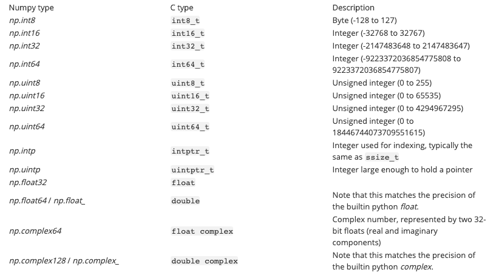
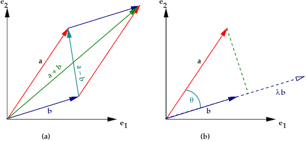
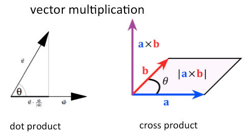

- __Numpy / api__ : [https://numpy.org/doc/stable/reference/index.html](https://numpy.org/doc/stable/reference/index.html)


What is Numpy?
-------------

NumPy is the fundamental package for scientific computing in Python. It is a Python library that provides a multidimensional array object, various derived objects (such as masked arrays and matrices), and an assortment of routines for fast operations on arrays, including mathematical, logical, shape manipulation, sorting, selecting, I/O, discrete Fourier transforms, basic linear algebra, basic statistical operations, random simulation and much more.

- numpy는 "numerical python"의 약자입니다.
Numerical Computing : 컴퓨터가 실수값을 효과적으로 계산할 수 있도록 하는 연구 분야. Vector Arithmetic : 벡터 연산 --> 데이터가 벡터로 표현되기 때문이다.

- numpy는 다양한 머신러닝 라이브러리들에 의존성을 가지고 있고, 일반 파이썬 리스트에 비해 강력한 성능을 자랑합니다.
성능 : numpy array >> python list(or tuple)

- python list와 비슷한 개념을 numpy에서는 numpy array라고 부른다.
파이썬 리스트처럼 여러 데이터를 한번에 다룰 수 있으나, 모든 데이터가 동일한 data type을 가져야합니다.

- C언어와 JAVA에서 사용하는 array와 비슷한 개념이며, 동적 할당(dynamic type binding)을 지원하는 파이썬의 리스트와 구조가 다릅니다.

참고 
> Scalar란?
Scalar는 방향은 없지만, 실수 공간에서 크기를 나타내는 값. (상수)

> Vector란?
Vector는 n 차원 공간에서 방향과 크기를 갖는 단위.
n 차원 공간에서의 벡터 x는 다음과 같이 표기하며, n 개의 원소를 가지고 있음.
정형 데이터에서 어떤 샘플의 데이터를 '특성 벡터'라고도 말함.


- Numpy의 특징

1) numpy array는 모든 원소의 자료형이 동일해야 한다.

(아래는 numpy array가 지원하는 data types)



2) numpy array는 선언할 때 크기를 지정한 뒤, 변경할 수 없다. list.append(), pop()을 통해 자유롭게 원소 변경 및 크기 변경이 가능하지만, numpy array는 만들어지고 나면 원소의 update는 가능하지만, array의 크기를 변경할 수는 없다.

3) 사실 numpy array는 C, C++로 구현이 되어 있다. 이는 high performance를 내기 위해서이며, python이 Numerical computing에 취약하다는 단점을 보완한다.

(아래 예시는 C언어와 파이썬의 코드 비교)

```python
/* C 코드 */
int result = 0;
for(int i=0; i<100; i++){
    result += i;
}
#파이썬 코드
result = 0
for i in range(100):
    result += i
```

4) numpy array가 python list보다 빠른 이유 중에 하나는 원소의 type checking을 할 필요가 없기 때문이다.

(아래 예시를 보자)

```python
/* C 코드 */
int x = 4;
x = "four";  // 실패
-> It is called, "Static type binding"

#파이썬 코드
x = 4
x = "four"
-> It is called, "Dynamic type binding"
```

(python list와 numpy array의 내부 구현 비교)


5) numpy array는 universal function(through broadcast)를 제공하기 때문에 같은 연산 반복에 대해 훨씬 빠르다. 데이터의 크기가 클수록 차이가 더 크다.

아래는 big_array라는 1000000개의 원소를 가지는 array를 만든 뒤에 for문을 돌면서 각 원소를 뒤집는 연산을 했을 때의 걸리는 시간과, numpy array에 있는 UFuncs(Universal function)을 사용했을 때 걸리는 시간을 측정한 것이다.
거의 1000배정도 차이가 나는 것을 볼 수 있다.

```python
big_array = np.random.randint(1,100,size=1000000)

%timeit big_array[::-1]
%timeit 1.0 / big_array
```


Numpy Basics
-------------
```python
#생성
arr = np.array(10)
arr = np.array([[1,2,3],[4,5,6]])
#차원
arr.ndim
#행, 열의 크기
arr.shape
#행 x 열
arr2.size
#arr2의 원소의 타입. # int64 : integer + 64bits
arr.dtype
#arr2의 원소의 사이즈(bytes) # 64bits = 8B
arr.itemsize
#itemsize * size # numpy array가 차지하는 메모리 공간.
arr.nbytes
```

Array Initialization(배열 초기화)
-------------
원소가 0인 array를 생성하는 np.zeros()
원소가 1인 array를 생성하는 np.ones()
특정 범위의 원소를 가지는 np.arange()
```python
#0/1이 5개 aray
np.zeros(5)
np.ones(5)
#0이 3*3
np.zeros((3,3))
np.ones((3,3))
#0~9까지
np.arange(10)
#10~99
np.arange(10,100)
```

Array Operation (like vector) --> Universal Function
-------------
- numpy array를 쓰는 가장 큰 이유는 vector처럼 사용할 수 있기 때문입니다.
> e.g. arr1 = np.array([1, 2, 3, 4, 5]) --> (1, 2, 3, 4, 5) # vector

- 그렇기 때문에 scipy, matplotlib, scikit-learn, pandas, tensorflow, pytorch 등 대부분의 데이터분석 라이브러리들이 numpy array를 사용합니다.
> 대부분의 데이터 분석 라이브러리들은 벡터를 사용하는데, 그 벡터가 바로 numpy array로 표현되기 때문입니다.

- 데이터 분석은 99.9% 데이터를 벡터로 표현하여 분석하기 때문에, 이 특징은 굉장히 중요합니다.
>벡터 == numpy array



- 두 벡터 A = (1, 2), B = (2, 1)이라고 할 때, 벡터의 연산은 다음과 같이 정의됩니다.
A + B = (3, 3)
A - B = (-1, 1)
A o B = 1x2 + 2x1 = 4 (dot product)



예제
-------------
>vector
```python 
v1 = np.array((1,2,3))
v2 = np.array((4,5,6))
#더하기 연산
v1 +-*/@ v2
```

>Broadcast
```python
arr1 = np.array([[1,2,3],[4,5,6]])
arr2 = np.array([7,8,9])
# [1, 2, 3] + [7, 8, 9] // [4, 5, 6] + [7, 8, 9]
arr1 + arr2
# [1, 2, 3] * [7, 8, 9] // [4, 5, 6] * [7, 8, 9]
arr1 * arr2
```

>Universal Functions
```python
#numpy array는 하나의 함수를 모든 원소에 자동으로 적용해주는 Universal Function이라는 기능을 제공한다. 
# 이 덕분에 모든 원소에 대해 같은 작업을 처리할 때 엄청나게 빠른 속도를 낼 수 있다.
arr1 = np.array([1,2,3])
arr1 * 2
1/arr1
```

>Indexing
```python
arr1 = np.arange(10)
#첫번째 원소
arr1[0]
#마지막 원소 
arr1[-1]
#앞에서 3개
arr1[:3]
arr2 = np.array([[1,2,3,4],[5,6,7,8],[9,10,11,12]])
#2,3번째 원소 = 7
arr2[1,2]
#3번째 컬럼 전체 = 3,7,11
arr2[:,2]
#2번째 row
arr2[1,:]
```

> Masking 
```python
mask = np.array([1,0,0,1,1,0,0])
data = np.random.randn(7,4)
#mask 만들기
mask_data = data[mask == 1, :]
#fancy indexing을 이용해서 masking
data[:,0] < 0
#array([ True,  True, False,  True,  True, False,  True])
#fancy indexing의 또 다른 방법
data[data[:,0] < 0, 0]
#0보다 작은 값들은 0으로 치환
data[data < 0] = 0
```

> Numpy Methods 
```python
mat1 = np.random.randn(5, 3)
#절대값
np.abs(mat1)
#제곱근(square root)
#복소스 type로 생성
comp1 = np.array(mat1, dtype =complex)
np.sqrt(comp1)
#제곱
np.square(mat1)
#지수값
np.exp(mat1)
#log값(자연로그:log의 밑이 음수가 될수없음)
np.log(mat1)
#상용로그
np.log10(mat1)
#이진로그
np.log2(mat1)
#부호찾기
np.sign(mat1)
#올림
np.ceil(mat1)
#내림
np.floor(mat1)
#존재하지 않는값 nan = not a number
np.isnan(np.log(mat1))
#무한대인지
np.isinf(mat1)
#코사인 연산
np.cos(mat1)
#사인 연산
np.cos(mat1)
#탄젠트 연산
np.tan(mat1)
```

> Reshaping , Concatenation

```python
#reshape
x = np.arange(1,10).reshape(3,3)
#transpose
x1 = x.reshape(1,9)

arr1 = np.array([1,2,3])
arr2 = np.array([4,5,6])
#arr1 + arr2
np.concatenate([arr1, arr2])
#수직
np.vstack([arr1, arr2])
#수평
np.hstack([arr1, arr2])
```

> 집계함수(Aggregation functions)
```python
#sum
np.sum(mat1)
#column별 sum
np.sum(mat1, axis=0)
#row별 sum
np.sum(mat1, axis=1)
#평균
np.mean(mat1, axis=0)
#표준편차
np.std(mat1)
#min
np.min(mat1)
#max
np.max(mat1, axis=0)
#최소값이 있는 index
np.argmin(mat1, axis=0)
#최대값이 있는 index
np.argmax(mat1, axis=0)
#row별 누적합
np.cumsum(mat1, axis=0)
#정렬
np.sort(mat1, axis=0)
#index정렬
np.argsort(mat1, axis=0)
```

> numpy 속도측정

```python
np.random.seed(0)

def reverse_num(values):
  output = np.empty(len(values))

  for i in range(len(values)):
    output[i] = 1.0 / values[i]
  return output

def cum_sum(values):
  total = 0.0
  for num in values:
    total += num
  return total

  big_array = np.random.randint(1,100,size=1000000)

%timeit reverse_num(big_array)
#   1 loop, best of 5: 2.21 s per loop
%timeit 1.0 / big_array
# 100 loops, best of 5: 2.34 ms per loop
%timeit cum_sum(big_array)
# 10 loops, best of 5: 174 ms per loop
%timeit np.sum(big_array)
# The slowest run took 6.48 times longer than the fastest. This could mean that an intermediate result is being cached.
# 1000 loops, best of 5: 746 µs per loop
```
 