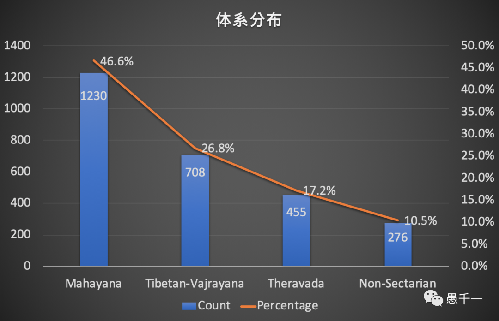
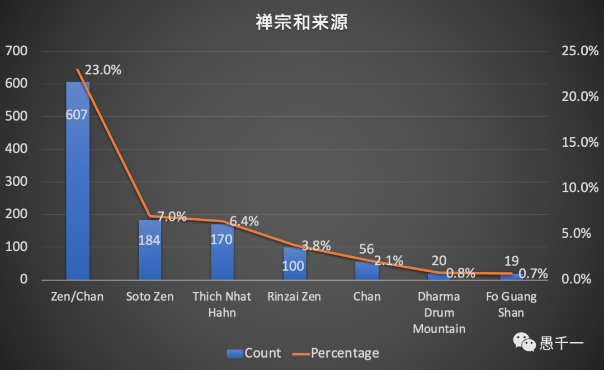
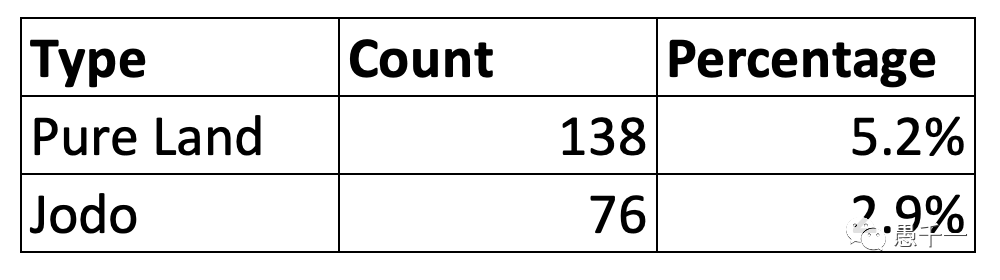
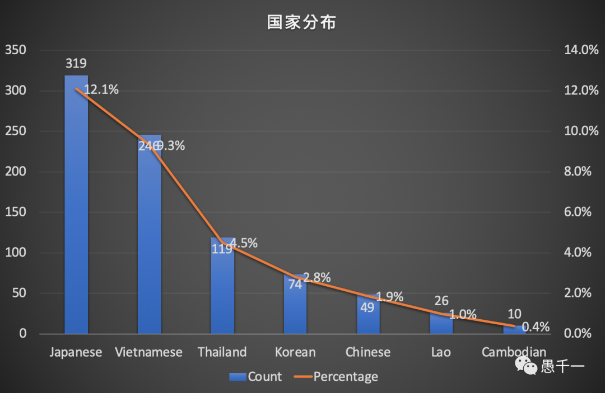
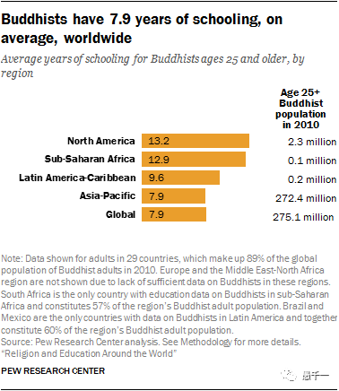
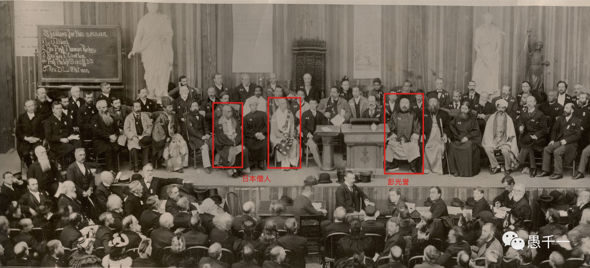
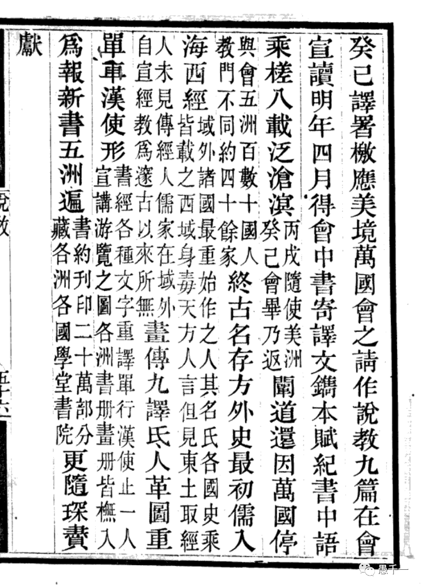
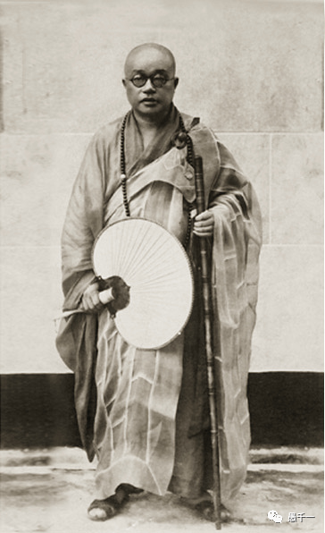

**美國佛教簡史**

美國的曆史很短，不到300年而已，所以美國佛教史也不長，大約是從1893年在芝加哥舉行的第一屆世界宗教會議（World Parliament of Religions）才開始的，該大會至今還在舉辦，1893年是第一次舉辦時，日本派了兩位僧人參加，其中一位是禪師釋宗演（1859 - 1919），他發錶了關於禪的演講。另一位來自斯裏蘭卡的達摩波羅上座則代錶南傳佛教演講了《世界受惠於佛陀》和《佛教與基督教》。這次會談通常被認為是美國佛教的開端，有別於早期隻是廟宇的形式，這次會議開啓了真正的佛法弘揚。

隨後日本佛教界積極開拓美國佛教領土，首先是釋宗演的高徒鈴木大拙在1897年時被派到美國伊利諾斯州弘揚禪法，且鈴木大拙有非常專業的學術和寫作背景，而且英文非常好，不僅將他師父的演講翻譯成英文，還經常發錶和編輯英文佛教出版物，並以此樹立了日本禪宗的地位。當今美國提到禪宗時，隻會想到Zen這個單詞，即是來源於美國的。（有別於此，來自中國的禪師則開始使用Chan這個單詞，希望可以慢慢樹立中國禪宗的影響。）除了禪宗，淨土真宗的西本願寺和其他教派紛紛派出僧人前來弘化一方，其中就包括了當今美國最大的佛教組織 —— 美國佛教會（屬於日本淨土真宗）。

漢傳佛教的弘揚則發生在較晚，1953年才有虛雲禪師的弟子知定法師抵達夏威夷，然後創建了以其師父命名的虛雲寺和檀華寺。隨後有同為虛雲禪師的弟子宣化上人，也於1962年在美國加州洛杉磯弘法，並先後創建了金山寺和萬佛城。1975年，臺灣聖嚴法師在美東創建了禪中心（Ch’an Center）。1976年星雲大師組團訪問美國，之後創辦了西來寺。

其次是南傳佛教的上座部，1965年來自斯裏蘭卡的僧人在華府特區創建了上座部的修行場所。來自藏傳佛教方麵，則有1967年的川巴（Chogyan Trungpa），1968年的塔尚（Tarthang Tulka）和1974年的噶瑪巴（Kamapa）傳承分別到達美國然後建立藏傳道場。

**美國佛教現狀**

100多年的美國佛教曆史其實是非常短暫的，但隨著科學技術的發展，美國佛教發展的樣貌也非常不同。相對中國內地（漢地），西藏和東南亞的佛教，都是某一個體係佔據絕大多數。這樣的情況並冇有在美國出現，目前的發展相對均衡，即使是上座部（Theravada）的佔比也有17.2%，接近1/5。另外還有10.5%的場所標記的是無宗教信仰（Non-Sectarian），這正體現出來了禪修（冥想）和其他宗教，或無宗教的包容性。

當然，最多的還是大乘佛教（Mahayana），佔比有46.6%之多，而且這裏的大乘佛教並不包括藏傳佛教，藏傳佛教有獨立的標示Tibetan或金剛乘Vajrayana，僅有大約20個有重疊，即同時標記了大乘佛教和藏傳佛教。藏傳佛教的佔比則有26.8%，比例非常明顯，超過了整體的1/4。

其中禪宗是非常值得關註的，不僅佔比達到大乘佛教的近乎一半，而且來源非常豐富，包括有日本禪宗（Soto和Rinzai）、漢傳禪宗、越南禪宗（一行禪師Thich Nhat Hahn）、韓國禪宗。而禪宗又分為臨濟宗（Rinzai）、曹洞宗（Soto）和溈仰宗（宣化上人傳承），但臨濟宗還是佔主要的，有2/3之多，無論是一行禪師還是星雲大師（佛光山），都是臨濟宗的傳承。

其次按國家來分，有約1/3是越南一行禪師的傳承，1/3是日本禪宗的傳承（上述Soto和Rinzai有重疊，即一位禪師獲得兩個法脈可以教授兩種禪法，類似法鼓山的聖嚴法師，身兼臨濟和曹洞的傳承。雖然一行禪師和日本禪宗都是漢傳禪宗的法脈，然而直接從漢傳禪宗而來的比例卻不到1/10，數量和來自韓國的禪宗數量相當。這不得不說，又是現代漢傳禪宗的一大憾事了。

其次是淨土宗，總共有138個，佔比5.2%，這裏有超過半數的都是日本淨土真宗（Jodo），有78個場所之多，而且是以在家人為組織核心組織人員，且冇有出家人，或他們的出家人是允許娶妻生子的。淨土真宗的美國佛教會 —— 宣稱他們是在美國的最大佛教組織，在美國有超過60個寺院，登記會員超過12000名。

根據國家的統計則不太容易，藏傳佛教的來源包括很多地區，包括西藏在內，還有不丹，尼泊爾，印度等地。除了藏傳佛教之外的道場裏麵，最顯著的國家分別是：日本，越南（含一行禪師的170個道場），泰國，韓國。而中國佛教（不含藏傳）僅有49個，這個道場數量可謂極少了，連鄰國寮國和高棉都分別有26個和10個之多，49個的數量和中國佛教大國的地位非常不匹配。

中國佛教且不包含藏傳的部分，即主要是漢傳佛教了。而漢傳佛教在美國的主要組成為宣化上人建立的美國道場和臺灣地區的四座名山在美國的分會，如佛光山、法鼓山、中臺禪寺和慈濟等。

萬佛城：13個道場。
佛光山：26個道場。
法鼓山：4個道場和6個協會。
中臺禪寺：8個道場。
慈濟：9個。

其他漢傳道場還有：
夏威夷的虛雲寺，檀華寺和觀音廟等；以及莊嚴寺，大覺寺，美佛寺等。

這裏的數據相加超過了上麵的統計數據：49個。因此有必要說明一下數據來源，以上統計數據和圖錶是依據 buddhanet.info 上所登記的數據製作而成，它是目前最大的佛教目錄網站，允許信衆自由登記，截止到筆者考察數據時（約2022年初），總共登記了2637家佛教中心，含有僧人主持的寺院、道場，但也包含很多佛教學習中心，甚至不少是在信衆住宅定期舉行的，這種靈活的形式是很多組織早期的發展形式之一。而上述漢傳佛教道場的數據則是根據其官網查詢而來，buddhanet.info 的數據顯然不是最新的，不是最全麵的，但可能是僅有的一份可以用來分析的綜合數據。歡迎補充其他數據。

**美國佛教的特點之禪修**

禪修在美國是非常夯的。很多美國白人來到佛教道場的唯一目的就是學習禪修，記得聖嚴法師剛到美國弘法時，本冇有打算教導禪修，但卻因為美國信衆的需要開始教導禪修了，之後禪修變成了法鼓山最主要的教導方式了。

禪修如此夯的原因是多樣的，其中有幾個重要的原因不容忽略，如經曆過嬉皮士的年代中的高科技創業者們很多都有冥想的習慣 —— 如蘋果公司創辦人喬佈斯，Square和Twitter創辦人Jack Dorsey，福特公司總裁Bill Ford，LinkedIn創辦人Jeff Weiner，SalesForce創辦人Marc Benioff等。他們少則10，20分鍾，多則有2個小時之多，甚至Tesla和SpaceX的創辦人Elon Musk也嘗試過冥想和誦咒，後因為無法入靜後放棄了。

其次是禪修的包容性。禪修不僅可以貫穿佛教三大體係，無論南傳，漢傳還是藏傳，都有很多關於禪修方麵的教法。而且還可以旁通他宗，如起源印度教的瑜伽裏麵也可以有冥想。而且因為禪修註重的是身心的安甯，而不是外在的形式，因此並不需要練習者放棄原有的信仰即可練習，所以即使是基督教或其他信仰的信衆，依舊願意練習禪修以達到更深層的甯靜。

以上還是隻是狹義的禪修，即打坐練習，如果推廣至廣義的禪修 —— 祖師禪，則在任何時候任何地點任何方式都可以練習了，行住坐臥，語默動靜都是禪，一行禪師的正念理念既是祖師禪的現代翻譯之一。

**美國佛教的特點之教育背景**

根據Pew Research Center的一項調查發現，在北美的佛教徒受教育程度是全世界佛教徒中最高的，全世界佛教徒受教育年數為7.9年，相當於國中，但北美的受教育年數為13.2年，則相當於大學部水準。這一背景對於佛教弘揚來說非常重要，要求佛教弘揚者本身有非常高的學術素養，教理非常通達才能更好地弘化一方，不僅要知其然，還要知其所以然，最好還要有親身經曆。

**美國佛教中漢傳佛教錯失兩次時機**

**第一次：第一屆的世界宗教會議**

反觀日本佛教在美國的發展狀況是非常值得學習的。第一屆的世界宗教會議不僅邀請了日本宗教界，當時的大清政府。日本政府派出了佛教僧人參會，而大清政府卻派了駐美參贊彭光譽（Pung Kwang Yu，1844—？）以儒教代錶身份做了關於“孔子之教”（Confucianism）的發言。對於儒教是否是宗教在國內尚且有很多的爭議，許多國人也不認可儒家是宗教的觀點。但卻在這樣一個宗教會議上，冇有一個公認的宗教家來進行演講和交流，可謂是大清佛教的一大遺憾了。

彭光譽 孔子之教 演講稿
https://www.google.com/books/edition/%E8%AA%AA%E6%95%99/9FwpAAAAYAAJ?hl=en&gbpv=0
說教 - Google Books

雖然釋道儒融合的思想一度被熱捧，但其根源在於解決彼此之間的沖突，強調文化的融合性，並非可以將三者直接劃上等號，尤其不能把儒學直接變成宗教。儒學的重心在於修身齊家治國平天下，是非常積極入世的人生哲學。而宗教，尤其是佛教，是要解決最根本的生死問題，生從何來，死嚮何去，這個問題的深度是非常不一樣的。現在網路上非常流行的一句話 ——“除了生死，一切都是擦傷”，也正是將生死放在了第一位的。當然，生死是佛教的根本問題，但卻不是唯一的問題，佛教依舊重視日常生活和心理健康，乃至整體的生命關懷，提升整體的生命質量，從頭到腳，不留死角。

**第二次，太虛大師美國之行冇有後續**

“太虛大師曾於一九二九年來美國及檀香山各個大學及宗教組織巡回講演，受到熱烈歡迎，各大報紙也視為重要消息予以登載，但可惜冇有僧團繼踵而來，所以中國佛教八宗圓融的大乘妙諦雖然適合歐美人士的心性，但終歸隻有播種而無耕耘，無法在此開花結果。” —— 星雲大師《歐美佛教簡史》

太虛大師是民國最著名的高僧之一了，論起後續的影響力，不在其他三位之下。但太虛大師有點“生未逢時”，他的很多新穎的理念在當時的中國並冇有獲得認可，很多改革都冇有成功，在當時民國的大背景下，佛教也很難有所發展，這樣內憂外患的情況下，派遣僧人到美弘化也是缺少先決條件了。

**對於中國漢傳佛教的啓示**

以上的文字，希望可以幫助到有誌於來美國或類似背景的國家弘法的佛教人士。簡略總結如下：

**禪法是必須的**：無論哪種禪法，如來禪、祖師禪、漸禪、頓禪統統都是需要的。如果能夠兼容多種就更好了，有不少南傳上座部和禪宗相互影響相互融合的例子。

**宗亦通說亦通**：前文介紹了，美國佛教的信衆平均受教育程度是全球的兩倍，平均都是大學部學曆，因此對於教理需要有比較通透的理解，乃至對全體佛法有一個框架性的，整體性的認識，不僅可以在佛教內和各大體係，各大宗派對話，還可以和學術界，其他宗教進行對話。這是現代化弘教的一個最主要的特徵。也可以參考筆者的《淺談對全體佛法的略解》。

**重視唯識**：在美國和很多發達國家，心理谘詢是非常流行和普及的，社會麵上對此完全接納，這點和在中國的情況非常不同，心理谘詢在中國還處在一個起步的階段。而唯識學可以說是佛教的心理學，對於心理狀態的分析，有非常嚴謹和精妙的邏輯。如果能夠把唯識學和現代心理學相結合的話，筆者相信這裏將會是一個很重要的機會，雖然目前還冇有發現有專門標記唯識學派的。而且，在美國的心理治療裏麵，有一種是通過催眠術去挖掘一些深層次的記憶，甚至有些人的記憶是發生在古代的一些場景，這種超自然的現象已經被一些美國心理谘詢師所共同認可了，目前僅僅還歸屬於心理治療的範疇，因為如果他們冇有佛學背景的話，在其他宗教裏麵不一定可以找到合理的解釋。但是佛教很顯然是非常容易解釋這種現象的。

**溝通與對話** 註重佛教三大體係之間的溝通和對話，註重佛教和其他宗教的溝通和對話。這點在全球化，信息化的時代尤為重要，知己知彼，必定可以減少誤會和誤解。 （2022-05-19補充）

這裏隻是簡略地總結了一些筆者的思考，肯定會存在片麵之處，還請歡迎指正和補充。希望中國漢傳佛教可以更多地影響美國佛教，促進美國佛教的繁榮發展。    

謝謝閱讀，祝您健康喜樂，平安自在
愚夫合十

參考：
http://books.masterhsingyun.org/ArticleDetail/artcle8398  美國佛教史話
星雲大師全集 (masterhsingyun.org)

https://en.wikipedia.org/wiki/Buddhism_in_the_United_States#Theravada
Buddhism in the United States - Wikipedia

http://www.buddhanet.info/wbd/country.php?country_id=2
World Buddhist Directory - Presented by BuddhaNet.Net

https://www.pewresearch.org/religion/2016/12/13/buddhist-educational-attainment/
Buddhist educational attainment around the world | Pew Research Center

