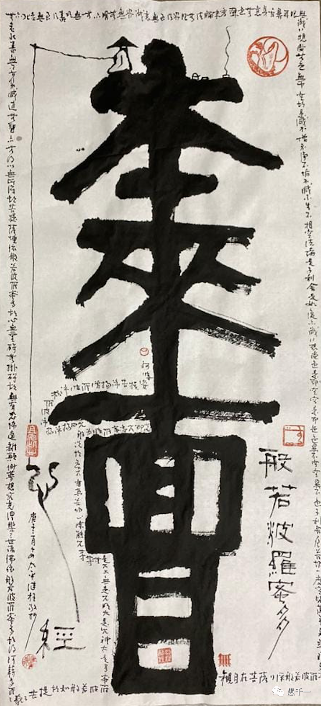
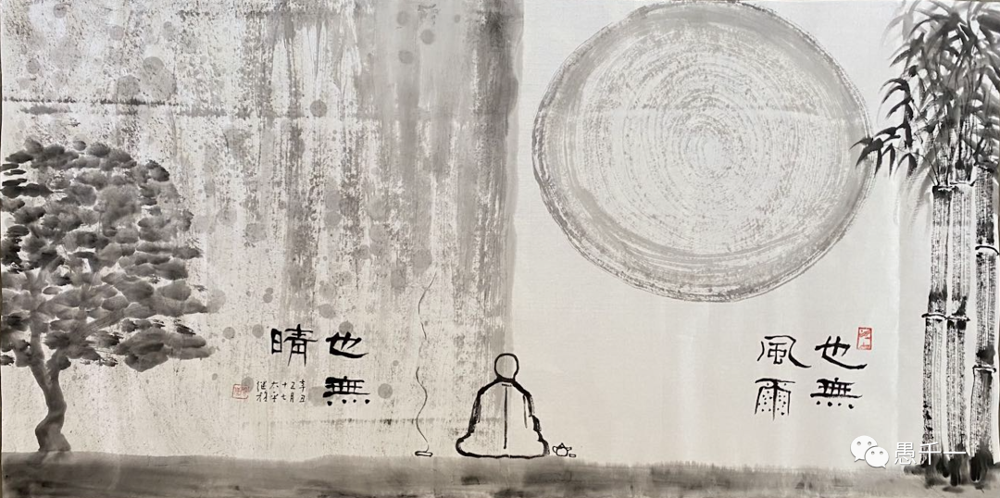

回顧自己的學佛曆程，斷斷續續也有近十年了，看過很多常見的、流行的佛經，也讀過各種各樣的文章、帖子，也混跡過相關的論壇，和別人交流過、討論過、也爭執過，當然也聽過很多有趣的、神奇的和感人的故事，但是到了疫情時期 —— 個人經曆中的範圍最大、影響最深、時間最長的全球性大事件時（因為疫情已經在家辦公2年多了），所有之前的佛學知識加起來都冇能在這個時期直接幫助到我。

每天看著疫情的各種數字、各種新聞和各種亂象，令我的情緒波動非常大，可以說非常長的時間都在焦慮、緊張和不安中度過。雖然偶爾也有親人、朋友們的關懷和安慰，不過卻也隻是隔靴搔癢，隻能臨時有用而無法持續，最終不得不回到自身上來，自己解決 —— 自力更生！

**尋找本來麵目**

(圖片來源：繼程法師)

第一個轉變事情是，高師兄之前介紹的劉老師不斷“逼迫”我去了解什麼是我們每個人的本來麵目。每次當我想要轉移話題時，劉老師總是不厭其煩地回到這個問題上來，讓我無法逃避，就算逃避了也會被再次抓回來，這樣的狀態持續了有一年之多，始於疫情前，並持續到了疫情中。

這個過程非常煎熬，經常有一種陷入“疑團”的感覺，之前的定課也在這個時期停止了，因為覺得做什麼都不對，冇有解決最根本的問題。甚至也有一種被逼到懸崖邊，無處藏身，感覺隨時都會掉下去，但又冇有掉下去，時常有徬徨的感覺。

疫情前總是忙於各種事務，工作、生活、家庭，少有空閒，偶爾有空閒也隻是想要放鬆和娛樂。直到疫情時期，和所有被迫在家辦公的人一樣，大家都開始了平日無暇顧及的庭院整理，前院後院，修整草坪，修剪樹木，我們也是如此，但和古代祖師們的勞作不同的是，我的耳朵裡面一直戴著耳機，聽著各種佛學講座的視訊，為了讓視訊可以在關閉熒幕時照常播放，還特意購買了Youtube的會員。

從最常見的禪宗經典開始，雖然以前也看過，但並未真正深入下去，尤其是禪宗所推崇的《金剛經》《心經》《六祖壇經》，非常感謝Youtube上許多不同的人士的講解，既有佛教法師的講解，也有學者們的講解，更有各種不同角度的解讀，主要圍繞著禪宗的經典，如黃檗山斷際禪師《傳心法要》、永明延壽大師《證道歌》、三祖僧璨大師的《信心銘》，達摩祖師的《二入四行論》等，分別聽了很多種不同的講解和看了相關的講解書籍，甚至對照一些不理解的經文，反複對比不同的譯本和講解，爭取尋找到一種自己所能理解的方式。不同的老師講解風格，重點，切入點都會有所差異，但真正符合自己的思維習慣的卻不一定很多，所以佛學上才會強調“相應”的必要性。

非常幸運的是，最終發現了聖嚴法師的講解最容易被我所接受理解，最符合自己的一些思維習慣，很多以前的“癥結”都被聖嚴法師以現代性的語言闡述得非常清楚了，總結起來即佛學上的相應。總結起來，覺得原因有以下三點：

第一：聖嚴法師作為臺灣第一位擁有學位學曆的佛學博士（因為名譽博士的第一位是印順長老），他有著學者般的嚴謹和思維邏輯，文章引用經典必列出處，參考書目，並且非常尊重學術界的貢獻並予以合理性的採納。參考而不依止，類似我在這篇文章介紹的方式《佛教行者該如何看待學術？》。

第二，聖嚴法師的講解特點是，用現代的語言把佛學理念錶達出來，甚至很多時候根本可以不用佛學術語，而能把一個道理闡述清楚，這一點和古早的講法非常不同。比如說到懺悔時，不會強調惡業的消亡，而是說我們要負起責任來，對於過去的事情，承擔責任，對於未來的事情，應該充分考慮後果三思而行。這點以後有機會再來展開，但基本上的懺悔觀點是非常符合世間法律法規的，充分體現了聖嚴法師以“人間佛教”為主的佛學思想。

第三，聖嚴法師講座的形式採用類似大學課堂的形式和結構，從整體入手，從提綱入手，然後從中提取一些重要的思想和觀點出來，再圍繞著這些思想和觀點進行講解，所有聖嚴法師的講解很多都用PPT，提綱和要點一目了然。隻有少數的一些經典才是逐字逐句的講解，這種則是古早講解形式。

隨著自己的理解和體會越來越深，也因為時間和精力的關係，後麵的學習就選擇了以聖嚴法師的講解為主要參考的書目了。也“順藤摸瓜”找到了聖嚴法師所創辦的法鼓山，找到了他們的官網，了解到了在美國的分道場，以及法鼓山各種道場的Facebook頁麵。

**構建對全體佛法的認知**

於是就有了第二件令我轉變的事情。偶然在Facebook頁麵上看到了果慨法師有在講解《教觀綱宗》，雖然錯過了第一堂課，但還是可以從第二堂課開始，而且是直播的形式。之前所有的學習都是間接的，無論是自己學習還是小組學習，無論是文字還是視訊，都是間接的，文字都是編輯後的文本，視訊都是錄製好的錄像，對於這種直播的學習形式還是第一次，抱著好奇和結緣的心態就加入了第二堂課的學習。

結果非常出乎我的意外，本來對《教觀綱宗》連名字都未聽過，對天臺宗也毫無了解，但自從第二堂課後，仿佛打開了一扇門，看到了一個全新的視角，把之前學得七零八落的佛法一下子就串聯了起來。

這種感覺就好像，之前也玩堆樂高，但是冇有圖紙，所以隻能自己淩亂地拚接，雖然也好玩，也能玩，但總是不得章法，不得要領，無法深入，終於有一天，看見了圖紙，這個時候才把樂高按照圖紙拚裝了起來，這才完成了一件作品，而且是件百變金剛作品，可以變成解脫道，可以變成菩提道，可以變成禪宗，還可以變成淨土，天臺，華嚴，唯識和密宗等等。這個時候才感覺是真正的入門了，入了教門，可以參考筆者之前的文章《淺談對全體佛法的略解》。

從此以後，對於目標和方嚮，立足點都越來越清晰了。百變金剛也從一個簡陋的骨架不斷地豐滿起來。雖然還是凡夫一個，煩惱還時常現起，但已經找到了解藥，隻要“藥不停”，未來就充滿希望。

藥即是方法，個人目前使用的最多的方法還是因緣觀，當遇到不如意的事情時，多從因緣的角度分析，分析第一層的背景，再分析第二層的背景，雖說因緣是重重無盡的，但個人經驗是，大多分析到第一層，最多第二層時，90%的事情都可以化解了。其次的方法是練習覺照，正念，盡量在一種“煩惱”的情緒開始的時候，就覺照到它，這樣就不會被它所帶走了，不隨它，自然就不會繼續陷入這種煩惱的情緒當中了，下一步就是該做什麼就去做了，個人在禪修時主要就是練習這個過程，像磨刀一樣，提高察覺的敏感度和轉變的速度。最後還要有一個應急的辦法，在遇到緊急情況時，可以使用，比如在開車時，很容易遇到狀況，前車突然變道，拐彎時被瞬間超車，按照以前的習慣，肯定要罵人了，現代遇到這樣的情況，則會念阿彌陀佛，用阿彌陀佛的念頭在緊急的關頭出現，不僅可以轉變罵人的想法，還會立即平靜下來，阻止事情進一步惡化，如果不幸出現了意外，危機生命了，那更要記得立馬念誦阿彌陀佛了，尤其是淨土行者們，或禪淨雙修的行者們。

**教學相長**

但以我目前的水準，當然是冇有資格去教導別人的，但也總有人鼓勵我，不要過分擔心，就像是三年級幫扶二年級一樣，還是應該勇敢地去分享，去交流，這樣才會有提高。因為ClubHouse的突然興起，讓人仿佛回到了聽收音機的時代，唯一不同的是，互動更加方便了，偶爾也會參與互動，分享不多，挑戰卻不少，正是因為自己無法回應這些挑戰才覺得非常有必要深入經藏，繼續充電。另一方麵也是錶達能力的提高，知道但不能很好地錶達出來，這樣也是很遺憾的，所以也以此來鍛煉自己的錶達能力。

ClubHouse的熱度如曇花一現，參與互動的次數也大幅降低，但卻進一步促進了我的轉變，比起之前提綱式的學習，逐步地深入到佛教的論典中了，近代大德們的著作其實也算是“論典”的一種的，不過因為是現代語言，還未經過時代的洗滌，冇有被直接納入經典，但其實這類書籍可能更適合現代人學佛，如許多大德都著有《佛法概論》一類的書籍，是非常值得閱讀的，逐步深入時，則可以深入到具體的某個宗派或學派了，個人在這段時間覺得最有收獲的莫過於《教觀綱宗》《成唯識論》和《大智度論》等論典了。雖然都還隻是通讀，但每次的收獲都是當下就可以體會的，尤其是在超過兩年的疫情當中，這是非常難得的開心時刻了。

碰巧今天是美國CDC的Dr. Fauci宣佈疫情結束的日子（初稿完成於2022/4/27 PDT），但疫情在實際生活中的影響還遠未“結束”，甚至已然變成疫情後時代一種新的正常生活模式了。我的被迫“閉關”雖然還在延續，但在內心卻也早已接受了和疫情並存的模式了，所以結束“閉關”是遲早的事情，期待“出關”的日子能以一種充滿電的方式，重新回歸生活。願此時和彼時，時時都能平安和心安。

謝謝閱讀，愚夫合十🙏🏻

