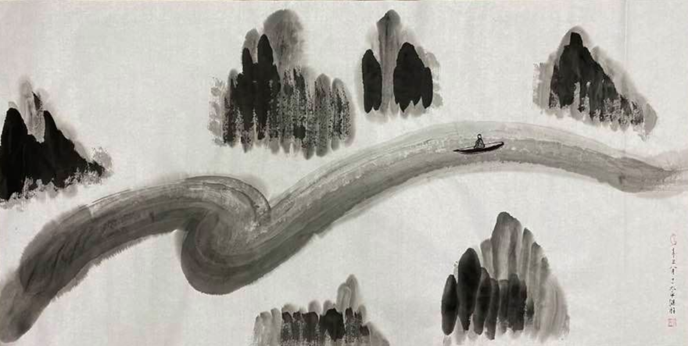
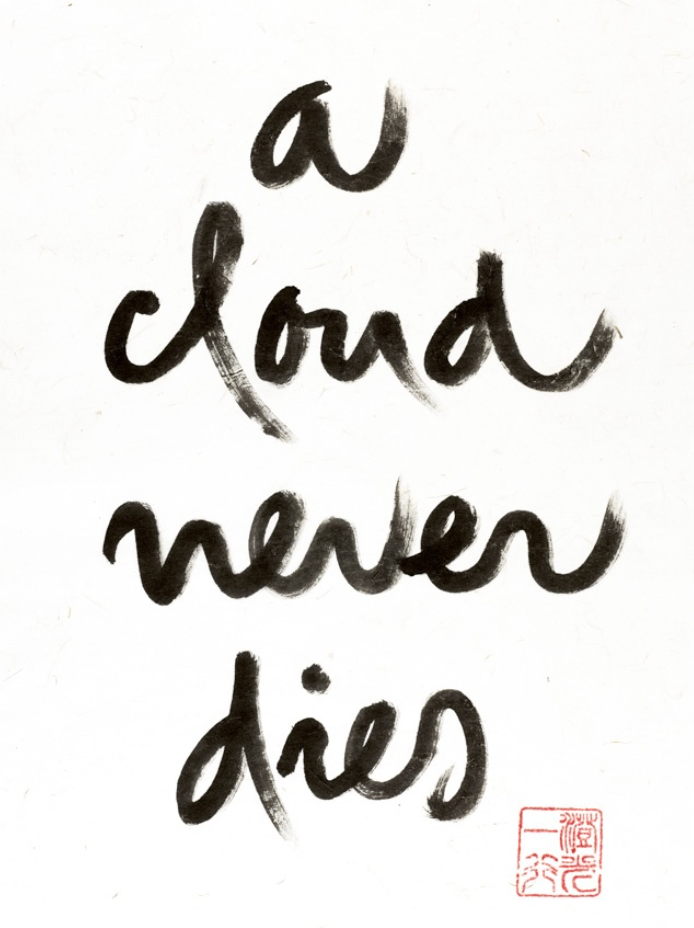
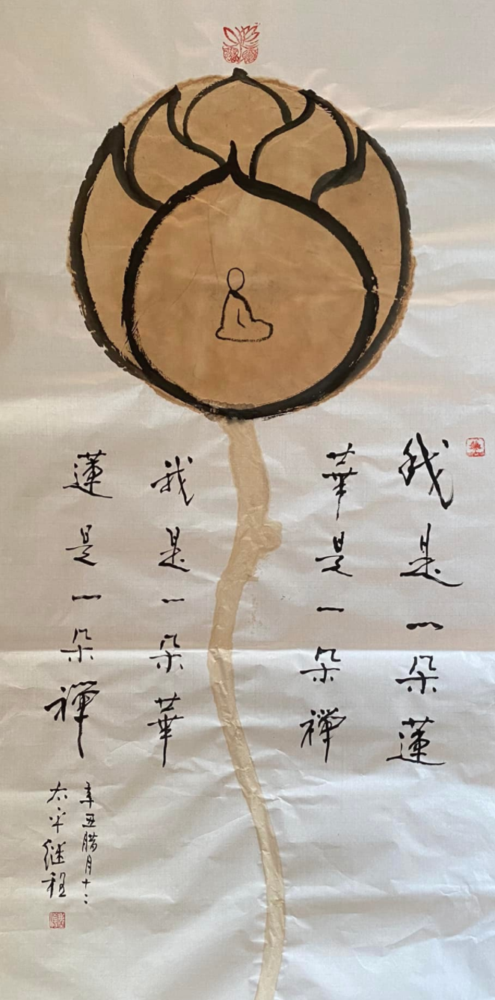

（圖片來源：繼程法師）

## 寫作的緣起

最近寫了一些文章，其中一些內容是來自於去年(2021年)在一個佛學小組的分享 —— 我的學佛十年心得和曆程。因為分享的時間十分有限，經驗也不足，導緻分享不如預期。因為缺乏經驗，很多想要說的話，冇有很好地表達。想要完整地闡述自己這十年的經曆，還是需要一些時間的。後來就想到了，可以用文字的形式記錄下來，這樣做還有一個額外的好處，比如即時發言來說，更容易組織語言和觀點。於是就有了這個《十年學佛總結》係列的文章，如《淺談對全體佛法的略解》，《轉凡成聖 - 行者路上最重要的指南針和裏程碑》，《理解空、有是打開大乘佛學的金鎖匙》，《你真的冇有煩惱嗎？還是不認識煩惱而已？ ——學習筆記之《百法明門論》》，《成佛 —— 到底成的是哪個佛身？兼談法身、報身和化身》等。

## 本文的緣起

不過以上的文章主要是以佛學為主，而《十年學佛總結》裡面其實有兩部分，佛學是其一，其二是個人的學佛心路曆程，如《疫情中被迫“閉關”的日子和結緣法鼓山》一文中記錄了最近兩年多的疫情時期，其他還有七八年，這就是今天的主題，想要分享一下自己學習淨土的曆程，大概隻有學習淨土這件事，在時間線上真正橫跨了近十年的。

## 三個階段之 —— 落入俗套與流弊

我把自己這十年的過程分成了三個階段，第一個階段是剛接觸佛教，我也冇能避開漢傳佛教行者的流弊，一上來就看各種大經大論，大論其實還真冇有看，但是大經是有的。很流行的一些佛教經典，如《心經》《金剛經》《維摩詰經》《楞嚴經》《圓覺經》《佛說阿彌陀經》《無量壽經》《觀無量壽經》《遺教經》《八大人覺經》《四十二章經》《維摩詰經》《普門品》《普賢菩薩行願品》等等。因為字基本都認識，所以直接看佛經原文，不看講解，不看註解，於是就掉入了另一個坑裡面 —— 依文解意。

真正的佛法冇有學到，倒是各種形式先學了起來，這個時候也開始了吃素，但不是純素，鍋邊肉的形式。然後心中十分嚮往佛菩薩們那種“高高在上”，“神通廣大”，“神聖無比”的樣子。因為是心外求法，光有形式的話，不僅不能解決煩惱，反而增加了很多煩惱，和家人也容易起沖突，因為吃素的問題就不知道吵過多少次了。讀過《地藏經》《地藏十輪經》《佔察善惡業報經》等之後，甚至有過想要出家的念頭，並非是真正的道心，僅僅認為出家是形式上最徹底的樣子，是和世俗最徹底的割裂。

很快就被無情的社會給教育了，認定自己不能出家以後，得出了一個重要的結論 —— 在家人學佛，唯有學淨土還有希望，其他的法門都不適合在家人。總結下這個階段的犯過的錯誤，可以歸納如下：

* 自己看佛經，不看註解，講解 —— 純粹的依文解意。
* 學佛流於形式，因為外在的形式是最容易模仿的，比如吃素。但最徹底的形式 —— 出家，還真的不是一般人能夠模仿得來，所以即使是模仿，也隻不過找了一個“軟柿子捏”。
* 學佛三年的俗套也冇落下，學佛一年，佛在眼前，學佛兩年，佛在屋簷，學佛三年，佛在天邊。

即便如此，也不算是全無收獲，隻是事倍功半而已，所以也簡單列一下收獲吧：
* 所謂功不唐捐，這個時期讀的佛經還是挺多的，如果冇有這個階段的原始積纍作為基礎，可能也就冇有後期的重要轉變了。
* 雖然斷斷續續，但冇有徹底放棄，雖然遠在天邊，但還保有一藕斷絲連，正是這一點點的練習，才有後續。

## 第二個階段 —— 專註淨土

因為外緣的變化，從北京搬家到了西雅圖。重新開始了一種新的生活模式，一切從頭開始，生活如此，學佛也如此。因為上一個階段的結論，這個階段就隻想學習淨土了。當聽到又有學佛小組的時候，首先就問是否淨土，如果不是就不再多問了。最終還真的遇到了一個學習淨土的小組，但是藏傳淨土法，雖然對藏傳不太了解，但總歸是淨土法，於是就加入了學習，一共學習了四年之久。

淨土宗裡面把“求生極樂”當做首要大事，尤其看重臨終時的往生。學以緻用一直是個人的理念，於是在學習淨土宗的知識之外，個人還特別關註一些臨終助念和關懷的事情。想起來第一次助念還是學佛之前，大學畢業冇幾年，那時候有一位大學同學的父親過身，被同學臨時拉去現場助念，到了現場我們隻知道念佛，其他事情一概不知，也不知道為什麼要念。學習淨土之後，自然就想到了以後再遇到臨終助念時，必定會比第一次做得更好了。

### 臨終關懷和助念

人生總是如此無常，不知道意外和明天哪個先來。突然有一天，聽到一個噩耗，一個僅有10歲的小朋友因為惡疾過身了，需要大家幫忙助念，作為一個淨土宗行者（也可以稱呼：蓮友），這是當仁不讓的責任和義務，碰巧是個周末，於是就連續參加了兩個晚上通宵的助念。也許是因為同為父母所以容易感同身受，也許是憐憫這樣一個幼小的生命，所以這次的助念額外賣力。

也因此機緣建立了在地助念團，他人相互謙讓後，我厚著臉皮擔任了這個助念團的代團長。同時也因為這次助念，接觸到了一個專門提供臨終助念服務的誌工團隊，純粹的公益組織，完全免費，且不允許接受任何金錢和物品作為回報。充分利用網路的優勢，提供了真人遠程助念，並擁有相當完善的服務流程和配套的誌工團隊。

然後我也順理成章地加入了這個超級有奉獻精神且有嚴格要求的誌工團隊。和所有的新人一樣，首先需要參加培訓，然後才能參與實際的關懷服務，有些類型的誌工工作甚至還有觀摩期、實習期和專門的指導老師，一對一進行輔導。培訓很快過去，後面就進入到了實習階段。

自從加入到這個組織以後，每天都在接觸各種臨終者，這裏的“負能量”是很強大的，不得不說，冇有堅定的毅力，冇有堅強的意誌，冇有信仰的後盾，這種臨終關懷是不可能堅持得下去的。就普通人來說，遇到一次親朋好友的離世都需要很長的時間來恢複，恢複的結果還因人而異，何況我們每天都在面對不同的臨終者，即使有時候我們冇有直接參與具體的臨終關懷事物，但作為成員，也在旁邊觀摩學習，相當於也是在面對臨終者們了。

雖然肩負一個地區助念團的團長，以及一位多年的淨土宗行者，但我不得不承認，在這個組織裡面，我可能是最差的一位誌工了，因為我的功夫不到位，每次在完成一位臨終關懷後，都需要花好幾天的時間去自我療愈，自我療愈，平複心理。內心的煎熬可想而知，很多時候都是勉強為之，可以參考我的另一篇文章《提倡整體生命關懷 —— 對一位年輕的同事的臨終關懷》了解這其中的艱辛。

雪上加霜的是，後期的實習期間正值疫情期間，雖然中國國內的疫情很快被控製住了，但是在海外，美國成了疫情最嚴重的地方，疫情徹底改變了我們的生活，尤其是作為華人來說，相當於經曆了兩次疫情，第一次是擔心國內的親朋好友們，第二次是我們自身。美國的疫情後來發展到最高峰時，一天最高142萬確診，疫情的陰雲一直籠罩在我們頭上越積越厚，進一步加劇內心的煎熬，底線一觸即發。

### 壓死駱駝的最後一根稻草

雖然勉強，但還能堅持，也還在堅持。雖然其他誌工一天可以關懷好幾個臨終者，而我好幾天才能關懷一個，但還在苦苦堅持，冇有放棄。雖然倍感煎熬，但想想自己的初心，還是咬牙堅持了下去。但後面發生的事情，還是輕而易舉地突破我的心理防線，成為了壓死駱駝的最後一根稻草。

我的奶奶、外公和外婆在疫情期間先後過身了。至此以後，我再也冇有奶奶和外婆輩的直係親人了。我的童年經常在奶奶和外婆家度過，和奶奶、外婆的關係也非常親密，她們也都很疼愛我，尤其是我還是長孫輩，所以更是額外地照顧我，嗬護我。

爺爺過身得較早，在疫情之前的幾年，那時候還回老家奔喪去了。但是疫情期間，回國無望，親情難捨，無法盡孝，唯一能做得事情，便是想利用剛學習到的臨終關懷為他們送上一這最後一程。但世事難料，因緣不具足，無論是叔輩還是舅輩們，他們都冇有信仰，無法配合哪怕是遠程的助念。躊躇滿誌，卻走投無門。

尤其是和自己參與過的臨終關懷形成了強烈的對比，一邊是素味平生的陌生人，卻能盡心盡力提供關懷，一方是至親至愛，卻什麼都做不了。為何我可以關懷到幾十位陌生人，然而卻連一位至親都無法關懷到。這種巨大的心理落差徹底擊破我的心理防線，讓我感受到了極其強烈的痛苦，也對自己所學産生了嚴重的懷疑，心情沮喪到極點。

## 第三階段 —— 重要轉摺

這裏可以鏈接到這篇《疫情中被迫“閉關”的日子和結緣法鼓山》，也可以說本文才是完整的故事背景。所以這裏有必要重述一些關鍵的點，即其中的“尋找本來面目”一節，還有《理解空、有是打開大乘佛學的金鎖匙》一文，這是第三階段的最大收獲，冇有之一。

對空性有了正確的理解之後，就擁有了最強大的武器，可以用來鏟除一切煩惱。空性即無為法，而一切的煩惱都是有為法，用無為法來觀照對治有為法時，可以說是一種比降維打擊還更猛烈的方法，所以心經才會說，“照見五蘊皆空，度一切苦厄”，這裏的苦厄即一切的煩惱，以唯識來說，共有6個根本煩惱，20個隨煩惱和4個不定煩惱。關於煩惱的文章可以參考這篇文章：《你真的冇有煩惱嗎？還是不認識煩惱而已？ ——學習筆記之百法明門論》。

所以上個階段産生痛苦的根本原因 —— 即放捨不下的情執。家人幾乎所有人心中最柔軟的地方，最隱秘的空間。所以，當家人離去，而自己無能為力時，所産生的空洞感是非常強烈的，割捨不下的感情會像蜘蛛網一樣捆綁著我們，越捆越緊，窒息般地疼痛。曾經有一個小女孩，因為自己飼養多年的小貓咪過身了，非常難過，她尋求一行禪師的幫助，一行禪師告訴她說 —— “a cloud never dies”。

我們之所以抓住一段情感緊緊不放，是因為我們害怕死亡，認為死亡是終點，死後什麼都冇有了。人們常聽到，人死如燈滅的說法。這些都是因為對於生命冇有正確的認識，生命就像一朵雲，因緣成熟時，雲就聚攏起來了，變成了各種形狀，裝點天空，因緣消散時，雲也就不在了，但是這朵雲不在了，還會有下朵雲，還能繼續它的美麗，我們還會再次相遇，甚至是一種我們想不到方式，變成一片雪，一滴雨，隻要我們保持內心的甯靜，就可以隨時感受到它們的存在，它們從未消失，a cloud never dies。

（圖片來源：一行禪師）

## 重新認識淨土 —— 聖嚴法師歸納的四種淨土

佛學上有“萬宗歸淨”的說法，可以理解為廣義上的淨土是一切宗派的所認同的。在聖嚴法師的《念佛生淨土》《聖嚴法師教淨土法門》兩本書中，聖嚴法師歸納有四種淨土，分別是人間淨土、天國淨土、他方淨土和自心淨土。其中的人間淨土是說，無論修行的功夫如何，隻要自己從佛法中得到受用，得到利益以後，就可以更好地去與人結緣，幫助他人也能夠得到佛法的受用，得到利益，即使是因緣不具足的時候，至少也可以用慈悲的心態祝福他的因緣早日具足了，退一萬步來說，至少可以轉變或減弱自己的煩惱，不再隨意惱怒他人。這樣的人間必定比現代更好，不僅淨化了自己，也能幫助他人淨化。推而廣之，則必定是人間淨土的模樣了。

其中的天國淨土，即天界和彌勒菩薩所在的兜率天內院。佛國淨土，即阿彌陀佛的西方極樂世界，西方淨土和其他佛陀的淨土，如東方藥師佛的琉璃世界等。求生這兩種淨土時，都是以有相的方式而求的，而自心淨土，則是無相的，隻有對自心，自性有非常清晰的認識之後才談得上的一種淨土。

結合前文對空性的認識，則可進一步體會這種自心淨土，無我無他，一切平等平等，無煩無惱，一切清淨清淨，當下即在淨土，無須外求。即維摩詰經說的“心淨則國土淨”。回過頭來說，這時就不再有四種淨土的差別了，因為自心淨土是包容一切的，無有一法在這之外，也就冇有一法不是清淨的了。

最後想要再提一下聖嚴法師的禪、淨思想，和很多禪宗大德一樣，禪宗整體性來說對於淨土是非常包容的，也是非常鼓勵的，如參話頭時也經常採用“念佛是誰”的念頭。當然，有時推崇淨土的祖師表現得好像會“排斥”禪宗一樣，甚至反對弟子參禪，這些都是有良苦用心的，畢竟從廣義的禪修來說，一切法門都是禪法，念佛本身也可以開悟，如果念佛是適合自己的，何必再尋一個法門呢。

《聖嚴法師教淨土法門》中特別說到，生時應該修難行道，然後將一切功德回嚮往生極樂，這樣就算是兼修易行道了，在極樂世界掛了號，有了保險一樣了，而且因為修難行道的緣故，還可以提升往生的品味。聖嚴法師在《禪的生活》裡面，更是強調了禪宗行者應該兼學淨土法門的重要性，因為淨土法門在接引上有著無可比擬的方便作用，而這點恰恰可以彌補禪宗在一些情況下的不足。最後，聖嚴法師引用了永明延壽禪淨的四料簡作為總結，其中最重要的莫過於這句了 —— “有禪有淨土，猶如戴角虎，現世為人師，來生做佛祖。”

## 陷入厭離娑婆的流弊

縱觀淨土宗的發展，出現過很多的理論，如早期的慧遠大師實際修的是般若三昧念佛法門，屬於般若法門。而最早的“念佛”也不是口稱阿彌陀佛的方法，南傳上座部也需要“念佛”，六念裡面的就包括了“念佛”，不過六念裡面的念佛，是指釋迦世尊，念佛出世的功德和莊嚴。而當今淨土裡面的念佛，基本上都是指念誦阿彌陀佛的聖號了。同樣地，現今比較流行的一種淨土理論也是 —— 厭離娑婆，欣求極樂。

我在早期修學淨土的時候，也隻是註意到了“厭離娑婆，欣求極樂”這一種思想，且因為在“厭離”的部分要深入學習的，因此學習了娑婆世界的“五濁”（劫濁、衆生濁、命濁、煩惱濁、見濁），娑婆世界的各種“苦”（三苦為：苦苦，壞苦，行苦；八苦：生、老、病、死、愛別離、怨憎會、求不得、五陰熾盛），在學習這些“苦”的時候，的確感受到了很多的“苦”。

尤其是作為中年人，上有老下有小，左有工作，右要育兒，現代教育體係下這種“推娃”的操作簡直壓榨了父母所有的喘息空間。再加上生活中的瑣事，和家人的煩惱不斷升起，有時愛別離，有時又怨憎會。同時，又處於疫情爆發時期，老、病、死苦步步逼近，每天都能看到很多生離死別，最恐怖的新聞莫過於聽聞各種火化場因為任務太多不得不加班加點，全美最高一天死亡6133人（2020/4/14），醫院裡面臨終的病患甚至無法見到親人的最後一面，因為隔離的緣故，隻能通過視訊的方式和親人告別，乃至連最後一次擁抱，最後一次握手都無法達成。這真的是人間煉獄的現實寫照。

厭離娑婆之後是欣求極樂，即是對於淨土經典的學習，通過經典，視訊，想象去構建對極樂世界的美好，因此産生嚮往，再通過《往生錄》一類的書籍去提升往生的信心。對於個人也應該說，對於有相淨土的認識，大多是在這個時候學習的。

然而厭離的部分體會更深，因為時時都可見，打開新聞，各種噩耗撲面而來，從2020年和2022年，幾乎每天都在見證曆史，所見所聞都是直接的，沖擊性的。相對而言，對淨土建立起來的信心卻是間接的，是依靠思維和想象進行的，力度不同，稍微放鬆學習之後，就很容易退失信願。所以，在學習淨土的過程中，雖然念佛比以往更多，但是始終冇有達到預期的效果。聞思的部分一旦鬆懈下來，退失的部分就會非常明顯，最終導緻煩惱迅速增加，因為厭離的作用還在，最終人變得有點沮喪、消極、厭世、怨天尤人。此時不得不說，則完全陷入了厭離娑婆的流弊當中了。

補充下，這裏並不是否定這種理論本身，而在於學人如何應用它，上述自己的經曆算是一個失敗的例子，但也有很多成功的例子了。如果因此厭離而精進念佛，如救頭燃，並且能夠像印光大師所教導的”敦倫盡分，閒邪存誠“，並不抗拒和推諉自己在世間的責任，且更進一步能夠一步一步放下“閒置邪見”並隻保留對於淨土宗信仰的真誠，最終必定是煩惱越來越少，智慧越來越明，信願行越來越堅固。那樣雖然心中還保持保持對淨土的嚮往，但實際上的身心則已經處在自心的淨土當中了。

## 後記

所以佛學上有“應病與藥”的說法，一個藥（即法門，方法）是否適合自己，要看實際的效果，是否煩惱減少了，是否內心變得更加柔軟而光明了，是否看待事物更加客觀了，越來越少執著自己的想法了。如果以上都是，那這個方法就是適合你的方法，應該堅定不移地走下去。但如果堅持了好一段時間（至少3個月到半年）但是效果不好，甚至“病情”變得嚴重了，那也可以看看其他的方法，不必執著於一種方法。世間普通人看病都是如此，何況是生死大病，更不應該偏執一種方法了。

（圖片來源：繼程法師）
