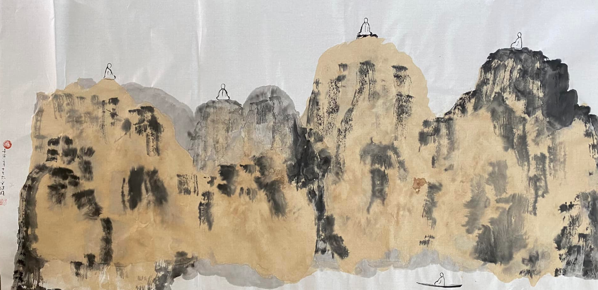

你真的相信有輪回嗎？這是非佛友們問得最多的一個問題了。而對於佛友們來說，大多也隻知其一不知其二。本文簡略地說明一下輪回的來源，詮釋和主體。

**佛教之前的輪回**

雖然很多人都是從佛教才知道了輪回，但輪回這一個概念並不是佛教所發明的。早在喬達摩悉達多太子成佛之前，當時印度的許多宗教就已經有了輪回這一概念，並且針對這個概念有很多的詮釋。這許多的詮釋當中，結合業來詮釋的又佔了多數。有說古印度的《奧義書》是最早包含輪回概念的經典[1]。也有說輪回和業是當時古印度各個宗教所共同承認的，隻是各自的詮釋不同而已，且多數認為輪回的主體即是靈魂，這個靈魂是永恆存在的，不會隨著物質的身體而生滅。這些顯然和佛教核心理論是很不同的。

**佛陀重新詮釋輪回**

喬達摩悉達多成佛覺悟之後，則用證悟後的見解重新詮釋了輪回，否定有一個永恆存在的靈魂，並且為六道輪回的業力運行規則進行了說明和糾正。從易到難，首先是關於業力和輪回的關係。這裏有一個比較有趣的故事，一個有天眼的人觀察到有一隻牛死後升天了，因此就認為想要升天就必須像牛一樣，吃得像牛，睡得像牛，走得像牛，甚至一切行為都要模仿牛，並以此建立了一套行為規範 —— 叫做牛戒[2]。除了牛戒之外，相似地還有鹿戒，狗戒等等，原因和模式都相同。而這類見解在佛學裡面有一個專有的名詞叫做 —— 戒禁取見，屬於佛教認為的五種不正確的見解之一。

而佛陀又是如何詮釋牛死後升天的呢？因為因緣，此牛先有惡業，因此做了牛身，牛死以後，惡業消除了，此時善業成熟，因緣具備，因此就升到了天界，享受天樂了。所以墮入畜生身，或是升天界，是因為善惡的先後成熟所決定的，並非做牛是升天的原因。之後佛陀再開示了五戒十善來指導人們如何可以繼續獲得人生和升天。但，這還隻是世俗層面的，還未涉及到佛法的核心。

所以說，這個六道輪回是佛陀為了接引當時的印度信衆，針對他們已經熟知的概念進行了全新的詮釋，並因此形成了新的學說。但是因為古代中國並冇有完整的輪回學說，因此當佛教傳入中國時，很自然地就把這些背景統統打包一並傳了進來，這樣導緻很多人就認為輪回是佛教所發明的了。

**兩種輪回**

第一種是六道輪回，這個也是流傳最廣，最被大家所知道的一種輪回了。即佛學上認為，一切有情衆生都可以分為六道：天，修羅，人，旁生，餓鬼，地獄。前面三個通常稱為三善道，後面三個通常稱為三惡道。想要留在三善道就必須修五戒十善，反之，行十不善就會墮入三惡道，這類的佛學文章有很多，在此就不在贅述了。

在一些經典裡面，有時也會提到“五道輪回”或“五趣衆生”的說法，這是把修羅道的衆生分開，並入了天，人，畜生道了。有興趣的朋友可以參考下這篇文章《神鬼的種類 - 聖嚴法師》。

第二種是人道中的輪回。根據天臺一念三仟的說法[3]，其中部分內容是，六道衆生加上四種聖人，合成十法界，然後說這十法界是互融互攝，意思在十法界中的每一個法界，裡面又可以分成十法界。

以人道舉例，即人中佛，人中菩薩，人中緣覺，人中聲聞，人中天，人中修羅，人中人，人中餓鬼，人中旁生，人中地獄。再進一步說明，當一個人處於順境當中，正在享受人生時，這種境界就是人中天，像天人一般的快樂。人中餓鬼即貪得無厭時的樣子，人中旁生即是愚昧無知的樣子，人中地獄即是身處逆境，求生不得求死不能的痛苦寫照了。人中人，則是苦樂參半或不苦不樂時的樣子了。

**輪回的本意**

輪回的本意是指循環不息，就是一直在重複，循環的意思。按照這個定義來觀察，其實有很多的輪回，比如：
* 春夏秋冬是循環。
* 每天太陽升起，落下是循環。
* 每天起床，早飯，午飯，晚飯，睡覺是循環。
* 人生經曆也是一種循環。比如：生小孩，然後上學，再工作成家再生小孩，也是一種循環。
* 曆史也是一種循環。一個朝代建立，滅亡，再建立一個新朝代，再次滅亡，以此循環。

等等，這類循環其實很多很多，從個人到社會，從小到大，幾乎每個人都生活在各種循環，各種輪回之中了。不過呢，上面這些輪回並不是問題，它們隻是存在的一種現象，所以並不需要去解決。

那要去解決的輪回是什麼呢？其實是在情緒中的輪回，煩惱中的輪回。每個人都有開心的時候，也都會有難過的時候，會有善良的時候，也會有暴戾的時候，人的情緒經常如此往複，來回循環，雖然冇有一定的順序。我們又可以將此分成三類：對於順著自己的就開心，即樂，不順著自己的就生氣難過，即苦，不順也不逆的就是無感，即不苦不樂。正是這種苦樂不苦不樂不停地循環，才形成了精神上的，心理上的輪回，而這正是最需要去解決的輪回，也是佛法上最核心的輪回了。

**不再輪回**

不再輪回，即對治苦，對治煩惱，當一切苦都斷除的時候，當一切煩惱都消失的時候，即是不再輪回了，也可以說是跳出輪回。而這也正是佛法的核心之一，為此提供了很多的方法，可以歸納為兩類：轉變和化解。化解即看破它，用正確的觀點去認識它，看破它，不被它所牽製，尤其應該掌握佛學核心的因緣觀和空觀，可以解決一切的問題，歡迎參考筆者的文章《理解空、有是打開大乘佛學的金鎖匙》。轉變即把它轉成另一個事情，如把遇到的睏難當做考驗，把危機變成機會，把痛苦當做一種經曆去認識和體驗；或者是換個角度看待，必然會發現事情的另一面。

無論是轉變還是化解，都有一個巨大的前提，冇有這個前提，我們就無法發現問題，自然就談不上解決問題。這個前提即是覺照，即發現自己情緒的能力，知道自己的心理狀態，然後才能用方法對治。類似看病，先要知道自己不舒服，才想到需要去看醫生，醫生先要找到病因，然後才能對癥下藥。

**輪回的主體**

既然佛教是不承認靈魂的，那麼輪回的主體是什麼呢？這個問題在唯識學裡面有最完備的回答，即第八識，阿賴耶識，也叫心識或神識。玄奘大師在《八識規矩頌》裡面說：“去後來先作主公”。意思是這個第八識在轉生時，最先到來，在臨終時，最後離去，而在生命存續的這段期間，第八識是最大的主人，因為第七識，第六識和前五識都是它的産物（見分），乃至身體和身體依賴的外在空間，也是第八識的産物（相分）。對此八識有興趣的朋友，可以深入下唯識學。

那麼這個第八識和靈魂又有什麼區別呢？通常對靈魂的認識是不生不滅，是一個實有的存在，它隻是住在身體裏，等到身體滅亡之後，再到其他地方去了，如天堂或者地獄，再之後要麼就不再討論，要麼就認為是永恆地保持那個狀態了。而佛學上所說的第八識，是不常不斷的，不常是說，每時每刻都在發生變化，身體生死時的變化最大，如從旁生轉變為人。不斷地意思是，一直在流轉，永遠不會斷滅。~~首先也是生滅的，和身體一樣有生死，隻是在生死之間，不會中斷，死後即生，生必有死，如此循環而已（不斷），而且每次生死的樣貌並不相同，如此世轉生為人，下世轉生為旁生，它們的身體是不同的（不常）。綜合兩者的特點即不常不斷。~~

依照佛學的觀點，佛教修行，先要斷除分段生死，然後斷除變易生死，然後才能成佛 —— 成就報身佛。而示現有生滅的釋迦牟尼佛是娑婆世界的應身佛，永不再滅的報身佛則是在靈山法華會上。報身佛之後再無生死了，第八識在成佛之後稱為清淨識，或無垢識，因為一切染汙的種子都已經徹底清除了，隻有清淨無暇的善法和無漏，持續不斷地永遠救度一切有情衆生。

祝大家永無煩惱之輪回。
愚夫合十。

[1] 古《奧義書》（西元前七世紀前後）中，對於人死後之命運，曾提出「五火二道」說，此當係輪迴思想最原始之說法。[中華佛教百科全書]

[2] 百論疏上中曰：「持牛戒者，如俱捨論說，合眼低頭食草以為牛法，彼見牛死得生天上，即尋此牛八萬劫來猶受牛身。不達爾前有於天因，謂牛死得生天，是故相與持於牛戒。成論雲：持牛戒，若成則墮牛中，如其不成則入地獄。然外道苦行世人信之。」智度論二十二曰：「外道戒者：牛戒，鹿戒，狗戒，羅剎鬼戒，啞戒，聾戒。」

[3] 所謂「一念」是指介爾陰妄的一念，亦即日常生活的一念心。此一念的當體（即中道實相）即圓具三仟諸法。「三仟」是指一切法。也是《華嚴》的十法界、《法華》的十如及《大智度論》的三世間相乘所得的結果。亦即十界各具十界而成百界，每一界中又各具十如是（相、性、體、力、作、因、緣、果、報、本末究竟等）而成仟如，此仟如和三世間（眾生、國土、五陰）配合，即成三仟之法。[中華佛教百科全書]

