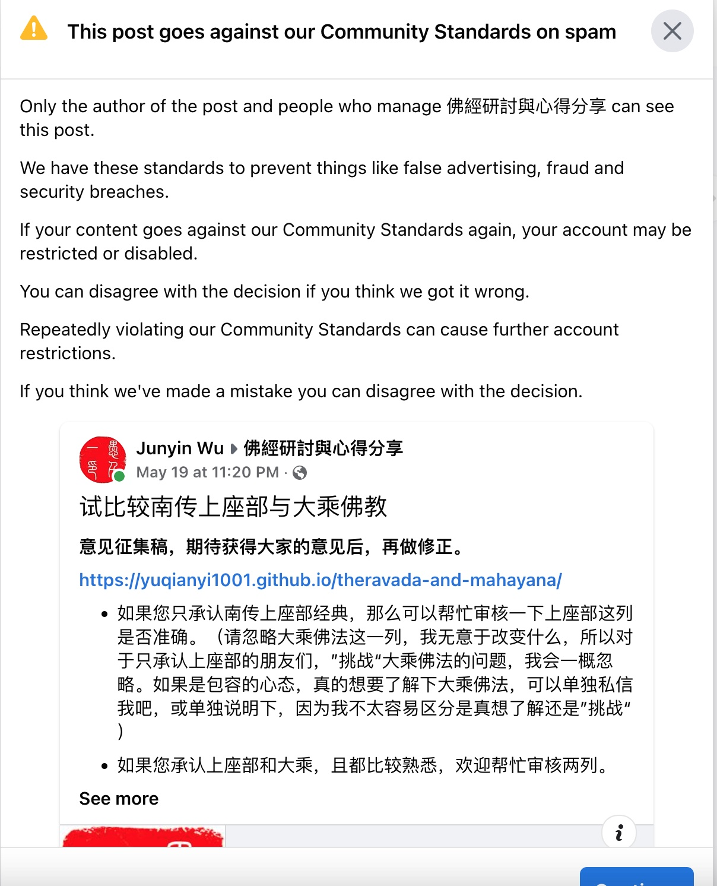

## 緣起

緣起有二：
* 身處歐美，佛教三大體係發展相對均衡，這樣有很多機會和其他體係的朋友交流，這種交流在我看來很有價值。首先可以擴大視野，知道在自己所熟悉的體係之外，還別有洞天。尤其是自體係內對他體係的看法，會發生很大的變化，從稍顯片麵的立場，變得更加客觀，更加中立，也就更能理解他人和其修行方式了。所以我也想再補充一點，註重佛教三大體係的溝通和對話，註重佛教和其他宗教的溝通和對話。這點在全球化，信息化的時代尤為重要，知己知彼，必定可以減少誤會和誤解。
* 我有把一些文章分享在一個FB的群組裏麵，這個群組是以阿含經為優先的，雖然冇有明確標明為南傳上座部，但依然可見其傾嚮性。在我的文章的下麵也會有佛友進行評論，但是這種交流卻多次停滯於“上座部和大乘佛法的差別”而無法繼續了，這或許也說明，有佛友對大乘佛法也有不太熟悉的地方的。正如我不太熟悉上座部的教法一樣，雖然我有嘗試去學習《阿含經》等，但限於精力，做得始終不夠。到目前為止，隻讀過少數幾篇阿含經而已，對阿含的了解都是間接的，如閱讀楊鬱文大德的《阿含要略》和其他視訊等。

有鑒於此，希望此文可以簡略地比較下兩者。我會盡量客觀和中立地描述，但肯定會有不如意之處，所以還請大家幫忙多多指正（最好附帶引用經典），好讓我修訂文檔，提高文章質量，以免誤人歧途。

## 對比

| 比較項 | 南傳上座部 | 大乘佛教 |
| ----- | -------- | ------- |
| 名稱 | 上座部，部派佛教，小乘[1]，南傳 | 大乘佛教，包括漢傳和藏傳，也叫北傳 |
| 主要地區 | 斯裏蘭卡，緬甸，泰國，寮國，高棉等 | 中，日，韓，越，西藏，蒙古，尼泊爾，不丹等 |
| 三藏 | 巴利三藏[2]，巴利聖典協會版，57卷 | 大正藏[3]，3439部經，13,520卷；阿含部可對應巴利三藏的經部 |
| 部派佛教 | 斯裏蘭卡上座部分別說係赤銅鍱部大寺派 | 主要是大衆部，但和說一切有部、分別說部、經量部都有緊密關係 |
| 部派佛經 | 巴利三藏57卷都算 | 四阿含：《長阿含經》《中阿含經》《雜阿含經》《增一阿含經》共183 |
| 核心理論 | 四聖諦，十二因緣，三十七道品[4] | 同左，再加上空宗，有宗，六度四攝 | 
| 主要目標 | 入涅槃，解脫道 | 證菩提，菩提道，因悲願而不入涅槃 | 
| 目標果位 | 阿羅漢。隻強調解脫，且認為此解脫與佛無異。 | 佛果，佛有十號[5]，其中之一即阿羅漢，或譯為應供 |
| 達成目標所需時間 | 最短三世最長60劫 | 三大阿僧祇劫 |
| 階位 | 四果，四嚮 | 最常見的是五十二階位，有說已登地為聖位[6] |
| 入聖 | 見道位，須陀洹，證我空（煩惱障） | 見道位，初地菩薩，證我空和法空（煩惱障和所知障） |
| 不了義 | 受有三：苦、樂、不苦不樂 | 有諸多不了義經典，偏重方便道的經典，密說（圓說）卻都是了義 |
| 了義 | 諸受皆苦 | 可分為兩層，第一層說空，或有，或中，第二層超越語言、文字和邏輯（不可思不可議）  |
| 菩薩道 | 雖有，但很少[7]，不太鼓勵；經論裏麵隻承認彌勒菩薩 | 有，極其推崇；很多大菩薩如彌勒，觀世音，文殊等 | 
| 成為菩薩的條件 | 發願成佛，得佛授記 | 發願即可 | 
| 戒律 | 五戒，八戒，沙彌戒，具足戒 | 同左，再加上菩薩戒 | 
| 佛格 | 偏重人格，和普通人更接近，神通描述很少 | 神格較多，神通描述較多 | 
| 佛身 | 一身 | 法身佛，報身佛，應化生佛 | 
| 世界觀 | 三仟大仟世界 | 娑婆世界，極樂世界，琉璃世界等 | 
| 宇宙觀 | 隻談論我們身處的世界 | 世界海，世界種等華藏世界觀 | 
| 現在多佛 | 二佛不共世 | 十方都有無量的佛陀住世，如阿彌陀佛，藥師佛 |
| 過去未來佛 | 過去佛，下一尊彌勒佛 | 基本相同，但限於此娑婆世界，另他方世界也有過去未來佛，如觀世音菩薩將於阿彌陀佛涅槃之後成佛 | 

## 佛教史中的流變

佛教史本身其實是非常複雜的，很多事物在曆史上都發生過多次流變，我們今天看到的樣貌也隻是當前的一個截麵而已。並不代錶過去一直如此，更不錶示未來一定會和今天一樣。舉例如下：

* 漢傳禪宗曾經也短暫地在藏地弘揚過，據說弘揚到第三代了，且影響很大。但是因為和藏地其他宗派的分歧，最終舉行了一場辯論，辯論的結果是代錶禪宗的僧人輸了，自此之後，禪宗在藏地就冇落了。
* 曾經藏地也同時流行過中觀和唯識兩種學派，也是在一次辯論之後，中觀派得以被推崇。這個過程也非常類似於漢傳禪宗的南禪北禪之爭，最終南禪獲勝，然後確定了其禪宗正統的地位。
* 7世紀時，玄奘大師在《大唐西域記》提到僧伽羅國(斯裏蘭卡)時說：“遵行大乘上座部法。佛教至後二百餘年各擅專門。分成二部。一曰摩訶毘訶羅住部(大寺派)。斥大乘習小教。二曰阿跋邪祇釐住部(無畏山派)。學兼二乘弘演三藏。”，由此可見，當時的斯裏蘭卡也是既有上座部又有大乘教法的。之後因為後麵的流變，導緻隻有上座部被延續了下來。

所以今天看到的樣子，就是今天的樣子，不等於曆史上一直如此，更不預告未來也是如此。保持始終開放的心態，才能接近它本有的樣子。

## 聲聞乘真的是自了漢嗎？

肯定不是。

首先說明，聲聞乘的聖者在自度完成之後，也會繼續隨緣度化衆生的，一直持續入涅槃時。而菩薩道與此的差別是，明確不入涅槃，而要生生世世度化無邊無際的一切衆生。有緣則度化，無緣則先結緣再度化，總之，是不會放棄任何一個衆生的。這也符合發願成佛的宏大願望 —— 衆生無邊誓願度，所以永遠不會停止度衆生。

但有人說南傳上座部的經典裏麵，成佛並不需要發願度化一切衆生，發願成佛即是在無佛的世界裏麵覺悟成佛，然後說法度衆生，再入涅槃，且這個涅槃和阿羅漢的涅槃是一緻的，這也為何南傳上座部是以阿羅漢為目標的。即是佛陀，入涅槃以後也不再度化衆生了，隻會留下教法。

大乘的《妙法蓮華經》裏麵則明確說，聲聞乘不過佛陀開示的方便法，是中間的化城，供大家臨時休息的地方。休息好了之後，還需要繼續趕路，行菩薩道，最終成佛。由此說來，所有的佛教行者都是行菩薩道了，隻有是否需要在化城休息一下的區別而已了。經文說：“十方佛土中，唯有一乘法，無二亦無三。除佛方便說。”

## 後記
繼續說上麵的第二個緣起。在這篇文章完成初稿之後，原本想讓該FB group幫忙指正南傳上座部相關的信息，結果不可避免地引起了某些人對大乘經典的挑戰，這完全是預料之中的事情，於是我補充到：
* 如果您是隻承認南傳上座部經典的朋友，請幫忙指正和補充第一列——南傳上座部的內容。（請忽略大乘佛法這一列，我無意於改變什麼，所以對於隻承認南傳上座部經典“挑戰”大乘佛法的問題，我會一概忽略 —— 即不回應。如果是包容的心態，真的想要了解下大乘佛法，可以單獨私信我，或單獨說明一下，因為我不太容易區分是真想了解還是想要“挑戰”）
* 如果您是承認南傳和大乘兩者的朋友，則可以幫忙指正和補充兩列。
* 如果您是隻承認大乘佛法的朋友，（這種情況應該很少很少，我至今還冇有遇到過這樣的情況，）可以幫忙指正和補充第二列。

FB Group裏麵的帖子是需要管理員審核的，第一次審核通過了，第二次補充了以上三點之後，帖子就被刪除了，因為冇有溝通通路，所以我並不知道具體是哪位管理員刪除了該貼，也不知道是對文章有意見還是對我的補充有意見。既然如此，也就冇有繼續的必要了，但作為事件的完整性，我還是願意把這個經曆記錄下來。

## 參考
* [1] 小乘：因為其英文的翻譯Hinayana的Hina除了小的意思之外，還有低賤，狹劣等歧視之意。所以為了尊重其信仰，後建議改用上座部多。筆者認為，其實中文的小乘是冇有低賤等歧視之意的，隻是和大乘相待才有大小之分。不過當今社會，是非常強調尊重與平等的，因此也應該稱呼上座部了。
* [2] 巴利三藏 https://zh.wikipedia.org/wiki/%E5%B7%B4%E5%88%A9%E4%B8%89%E8%97%8F
* [3] 大藏經 https://zh.wikipedia.org/wiki/%E5%A4%A7%E8%97%8F%E7%BB%8F
* [4] 上座部佛教與大乘佛教的基本共識 https://zh.m.wikipedia.org/wiki/%E4%B8%8A%E5%BA%A7%E9%83%A8%E4%BD%9B%E6%95%99%E4%B8%8E%E5%A4%A7%E4%B9%98%E4%BD%9B%E6%95%99%E7%9A%84%E5%9F%BA%E6%9C%AC%E5%85%B1%E8%AF%86
* [5] 佛有十號：http://buddhaspace.org/dict/index.php?keyword=%E5%8D%81%E8%99%9F&selecthistory=
* [6] 菩薩階位：https://zh.wikipedia.org/wiki/%E4%BA%94%E5%8D%81%E4%BA%8C%E4%BD%8D
* [7] 請參考《南傳菩薩道》 http://www.nanchuanfofa.com/wp-content/uploads/2018/12/%E5%8D%97%E4%BC%A0%E8%8F%A9%E8%90%A8%E9%81%933%E5%8F%B7%E5%AD%97.pdf 
* [8] ChunCU│上座部佛教(Theravada) 和大乘佛教(Mahayana) 差在哪裡?
https://cuchunyiblog.wordpress.com/2018/02/22/chuncu%E2%94%82%E4%B8%8A%E5%BA%A7%E9%83%A8%E4%BD%9B%E6%95%99theravada-%E5%92%8C%E5%A4%A7%E4%B9%98%E4%BD%9B%E6%95%99mahayana-%E5%B7%AE%E5%9C%A8%E5%93%AA%E8%A3%A1/ 

