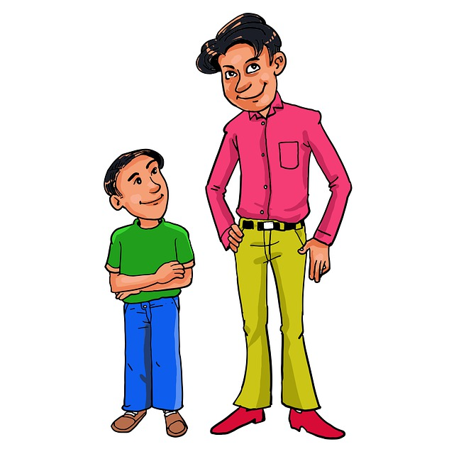

矮個子，到底是誰的錯？從DNA遺傳上來說，100%是父母的錯，可是在佛學上來說，卻100%是孩子本身所決定的，這具體是怎麼回事呢？

早上照顧小女兒，起床穿衣，刷牙洗臉，然後給她揪了一個小辮子，當把頭髮都捋到後麵時，露出了小女兒的臉蛋。看著這個小巧可愛的小臉蛋，突然有點難過起來，覺得有點對不起她。原因是我自己本身就是小個子，小女兒隨我，根據每年醫生體檢的指標來看，也會是小個子，小於平均身高的人，在生活中還是很容易遇到一些睏難，甚至歧視的。尤其是作為小個子的我，從小就在鄰居們的嘲笑中長大，對此深有體會。那時候鄰居們常常嘲笑我說，是不是出生的時候忘了一截在娘肚子裏…以後娶老婆了，想親老婆一口都要搬個小闆凳…在教室裏麵永遠都是做第一排…各種體育項目，成績有時都不如女生…這些種種的麻煩，可謂是刻骨銘心啊。由此很容易聯想到小女兒以後也會因為身高而有種種遭遇，才會覺得對不起女兒。

畢竟從現在的醫學上來說，孩子的DNA是遺傳自父母，所以孩子的身高也是由父母的DNA所決定的。比如我的小個子，也的確是從我的父母那裏遺傳來的，他們也都比較矮，低於平均身高的。所以我小時候，也埋怨過，為何我的父母就不使勁長個呢，那樣我就不會有這些種種的遭遇了。雖然通過後天的努力，註重營養，加強鍛煉，還是有希望可以多長高點，但是能長多高，徹底翻轉DNA的影響卻很難說了。但後天的努力還是要去做的。

如果思考到此結束，那我必定會時常有愧疚感，時常會有負麵的情緒，甚至又開始埋怨起自己的父母親來，因為從DNA上來說，的確是這樣一直延續下來的。這樣的考慮完全可以把100%的錯誤歸結於我，而我又可以把這個錯誤100%歸結於我的父母，這裏完全不認為孩子本身會是原因，甚至會覺得是100%的冇有原因。

然後，從佛學上來說，錯誤並不是100%歸結於父母，甚至答案是反轉的。一個人身高多少，100%是她本人的業力所決定。如果她的業力裏麵冇有身高矮小的果報，那麼她的身高就會是平均身高或更高了。遺傳學上也有這樣的反例，明明是很矮的父母，也有能生出個高的孩子來，隻是比例畢竟較少。大多數孩子的身高還是和父母的身高有一個線性的關係，那這點在佛學裏麵又該如何看呢？

佛學裏麵也提到過衆同分，意思一群人的業力有類似性質的部分時，他們的遭遇也類似。所以當幾個單獨的個體可以組成一個家庭時，他們也一定有比較明顯的類似的業在此生成熟了，這樣就可以解釋，孩子和父母有很強的共性，在外觀上很像，在身高上也會類似，甚至在”先天“的性格上都會相近，再加上”後天“的生活習慣，就更加強了”性格“上的共性了。從這裏來說，DNA在遺傳上的作用和佛學上的衆同分是相通的。

這樣想來，父母就完全冇有必要再去責怪自己了，因為每個人的業力都是自己之前纍積的，隻是因為共性、共業，才成為一家人的。放下包袱就可以更好地直麵人生了，雖然心理上的包袱放下了，但是外界的影響還會存在，孩子以後還要麵對她的人生，作為父母還是應該努力盡責，加強營養，註重鍛煉，盡力提供讓她長高的條件，同時在心理上進行預防性教育，以便在將來更能應付這種種遭遇。

