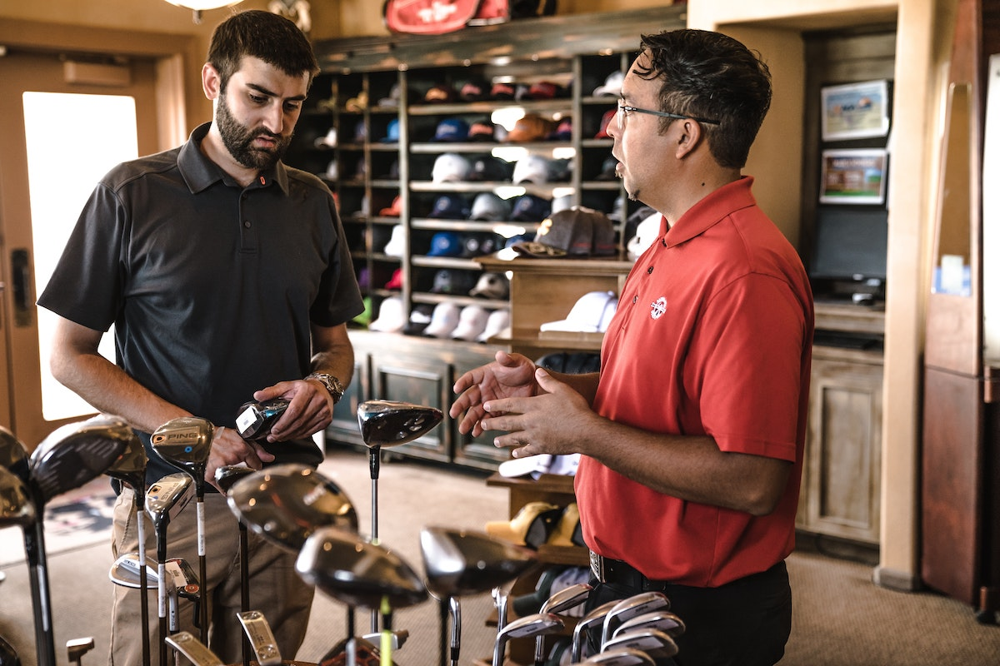

In the third instalment on angel investing, I am discussing the business' defensible moat and its distribution mechanisms.  

You can find the previous 2 parts [here][1] and [here][2].
 
# Letter I

> Photo by Thea M. on Unsplash

I stands for **Innovation**.  
In [part 1][1] (letter P) we discussed the "What" of the business. I.e. whether the business is  
* solving a Problem, and  
* creating a Product, improving a Process or creating a Platform.  
  
In this section we are considering how innovative the business is, in order to differentiate it from the competition.  

Let's look at the textbook [definition][3] of innovation    
> Innovation is commonly defined as the "carrying out of new combinations" that include "the introduction of new goods, ... 
> new methods of production, ... the opening of new markets, ... the conquest of new sources of supply ... and the 
> carrying out of a new organization of any industry". ... Some common element in the different definitions is a focus on 
> newness, improvement and spread.  

That was a long one!

The key word to note here is "Combination". Combination of existing technologies, services and processes. To better 
qualify this definition, there are 3 key questions to answer. 

* **How does it differ from everything else out there?**  
In almost all cases, the endgame is for the business brand to become the differentiating factor. Until the brand name is 
built, the business needs to attract customers. How is this product/service tangibly different to every other competitor?  
For example, the first [app-based banks][4] were truly innovative. Using a mobile device alone was a completely different 
approach to the formation of the banking relationship. It also caused a radical rethink of the [banking channels][14] 
model. [1](#footnote_1) This made them completely different, compared to incumbents.   
With the number of neobanks growing, both in the [personal][5] and [business][6] banking space, the "innovation 
differential" is inevitably becoming smaller and smaller.
     
* **What is the USP of this innovation?**  
This question is a corollary of the above.  
At its core, the innovation probably results in cost savings and a more [profitable operation][2] for the business itself. 
A "loss-making innovation" would sound like a 3-word joke. In the case of neobanks, the "single channel" innovation 
resulted in radically smaller operating costs (no branches, less staff, simpler IT systems).  
But what are the tangible benefits for the customer?  
Is the customer's life made substantially easier? [2](#footnote_2) Are there economic benefits and incentives 
for the customer? If the benefits are limited, is there a convincing story or ["higher purpose"][15] that the innovation 
embodies, which would do the trick?      
Are the incentives and business story enough for the customer to adopt the offering (and also abandon the competitors)? 
Will the customer's perception and experience be superior to other offerings? How will that be?

* **How hard is it to copy the innovation?**  
How complex is the new product/service to create? [3](#footnote_3) 
Once launched, how trivial would it be for a competitor to copy and launch?   
Is the differentiating factor the complex application of technology, back-end processes, supplier relations, sleek UI, 
all of the above? Is it by any chance something that is already covered by an existing patent, real or [troll][16]? [4](#footnote_4)   
How long would it take someone else to figure things out, implement and successfully launch?

You may have noticed that this section is full of questions and provides few answers. That is because there is no 
prescription for innovation. Instead, it is a slightly nebulous concept, sharing many similarities to the [economic moat][7] 
of mature companies.  
I think it is no coincidence that a lot of startups are touting Artificial Intelligence (AI) or blockchain and smart 
contracts as their innovation advantage in their pitch decks. These are equally powerful (when used correctly) as much 
as they are opaque to scrutiny from other stakeholders (when used incorrectly). They are easier to initially claim as 
innovative difference and harder to actually apply in practice. 

What is considered truly innovative purely depends on the particular circumstance and domain of the business. Just like with any 
defense structure - speaking of moats - you cannot prescribe what good innovation is in advance, before it is practically 
applied.  
But over time, you can kind-of guess a [good moat][8] when you see it.  

## And a word on invention

> Photo by ThisIsEngineering from Pexels

It is worth noting that invention is different to innovation. Again, going back to the [textbook definition][10]  
> An invention is a unique or novel device, method, composition or process...  An invention that achieves a completely 
> unique function or result may be a radical breakthrough. Such works are novel and not obvious to others skilled in the 
> same field.

There is a key difference between [invention and innovation][11]. A true invention is harder to market and achieve wide 
adoption in a short-to-medium timeframe.

This is because of two key reasons:  

* **Creation of new processes**  
We may not realise it, but almost every item around us requires a number of processes built and tailored around it. From 
safety usage guidelines, to manufacturing processes and equipment to supply chains and economies of scale. All of these 
"secondary things" are what make products accessible and profitable.  
A true invention may lack some or all of these from the get-go. 

* **Market recognition and adoption**  
Can the average customer be easily convinced to purchase the invention from day 1? If, according to the definition, an 
invention is *not obvious to others skilled in the same field*, what would it take to "make it obvious" for everyone? 
This is especially true if the invention is intended for the "man on the street" (B2C), rather than other businesses 
(B2B).  
Inventions require more time and customer education to be accepted, than innovations.

These points are **not** to say that businesses built around an invention are worthless. They merely highlight that the 
effort, conviction and dedication required by all stakeholders in invention businesses (founders and investors) are 
potentially much greater.   

Let's drive this argument home with a widely known example: Bitcoin.    
When the [Satoshi whitepaper][12] was first published in October 2008, Bitcoin had all the characteristics of an invention. 
If Bitcoin had been invented by a commercial enterprise, it would be impossible to market it as a money alternative, 
let alone true hard money. Other than a small group of cryptography enthusiasts, it was something completely new. That 
fictitious enterprise would have [probably gone bankrupt][13] for lack of traction, if viewed under a "conservative" lens.

Fast forward 12 years later.  
An ever growing number of *innovative* products and services are built around Bitcoin and
the blockchain: from smart contracts, to integration with the main financial plumbing, to exchanges and custodial 
solutions. Bitcoin now has firm and exponential traction with a growing part of the "market". [5](#footnote_5)    

# Letter D

> Photo by Arthur Mazi on Unsplash

The next aspect to consider is composed of 2 somewhat related aspects: **Distribution** and **Delivery**. 

These are the "Where" and the "How" of the business, namely     
* Where does the business "locate" its customers?
* Where and How does the business "meet" its customers?  
* How does the business "serve" its customers?

These are further broken down in a number of interrelated concepts. Let's give an example of a completely fictitious 
product to highlight and discuss these concepts. [6](#footnote_6)
 
> The business in question is using [OpenBanking][17] to allow one-click checkouts and payments in **physical retail stores**; the
> intention is to replace debit/credit cards.    
> When paying, the customer sees a QR code to scan with her smartphone. This triggers an [OpenBanking 
> authorisation][18] and completes the payment from customer to merchant. 

### Customer acquisition

> Photo by Melanie Pongratz on Unsplash

The first thing to consider is "locating" the customers. We touched upon the economics of customer acquisition when 
[discussing CAC in Part 2][21]. This section is about the mechanics and the rationale. 

#### Identifying customers

A business cannot realistically serve everyone from the get-go. At its first steps, it needs to focus on specific 
customer cohorts.  
In our payments business example above, the business would need to decide on the types of merchants it would go after 
initially (hospitality, small retail, super-markets,...) and focus on them.

Fundamentally, there are 2 ways of identifying and singling out the target customer cohorts (non-mutually exclusive).  
* **Quantitative**  
Using [cohort analysis][24] we can define the "depth and breadth" of the target market: behavioural aspects, income, age, 
  percent of population. In our specific payments example (in the b2b space) we would be looking for business characteristics 
  (size, revenue,...) to help us identify specific market segments to focus on.
* **Qualitative**  
In this approach, the business creates "abstract" [customer personas][25], which it is trying to serve.  
  This is a more fine-grained approach, with the customer profiles based on observation, experience and intuition. This 
  guides the thinking to perform a deep-dive on the potential customer's motivations, drivers, wants and needs. This 
  approach helps not only the product offering (what features to include), but also the marketing strategy. For example 
  in our fictitious payments business this would help us identify the customer [champions][26].

#### Customer location

Before a business can acquire its customers, the *target customers* need to *know* the business actually exists.
The customer acquisition medium needs to be as close as possible to the point that the need for the 
product or service materializes. The closer the "action" is to the "call to action", the most straight-forward the 
and immediate the conversion.    

* **Online**  
  This is the most obvious medium, with an ever-growing importance. Online acquisition occurs through content and references.       
  * **Push content**: These are advertisements in high-traffic websites and platforms (e.g. Facebook, TikTok, news sites), based on the 
    user's profile. Under this category we can also put [affiliate networks][27] and [influencers][28]; trusted third 
    parties generating content on behalf of the business.  
  * **Pull content**: The business is attracting attention based on the content it produces, i.e. content that customers 
    are actively searching for. E.g. blog posts that the business itself is creating, optimised for [organic SEO][29]. 
  
* **Offline**  
  The importance of offline acquisition is thinning over time; people come to see the real world as a disruption to
  their online reality. For specific non-digitally native customer segments (e.g. early [GenX'ers][30]), offline is still 
  a valuable medium. A sample list of offline channels
  * [PoS][34] "nudges": E.g. the salesperson asking if you would like to "install X to get points/discount" 
  * Traditional marketing: TV, radio and print advertisements, outdoor signage,...
  * Trade shows and conferences: This has traditionally been the most efficient way to get a lot of people's focused
  attention. It remains to be seen what will happen post-COVID.
  * In-person meetings and calls: From in-person [drug marketing][31] to pre-sales demos and "warming up" decision-makers 
    in the enterprise space

Another subtle (yet important) offline acquisition medium is "copy behaviour", especially in mass-market products and 
services.  
A stand-out product feature, making it easy for other customers to spot. Classic examples: [Apple headphones][32] and
[brightly coloured bank cards][33].

#### Conversion

From locating the customers to actually acquiring them can be a long way. The business needs to incentivise and shorten 
this path. 

The incentives can be any combination of personal customer motivation (e.g. social acceptance, joining a compelling 
brand story) to external nudges (like discounts and [freemium][35] offers). 
The conversion process itself must be as simple as possible to avoid potential customers having second thoughts.  

In either case, the whole conversion process needs to be closely monitored and measured. 
Going back to the discussion about [CAC][36], acquiring customers costs money.  
The 2 key important questions the business has to keep in mind are  
* How much does each customer cost me? 
* How do I know that I am not throwing money away?

If the business does not have a tight customer conversion feedback loop, it is almost guaranteed to just bleed money. 

### Customer service

> Photo by Jopwell from Pexels

Once customers join they need to be served and served well.   
The key concerns here are:   
* What will be the channels or touch-points through which the business serves its customers?
* How will the product/service be delivered and used by customers? Will the channel be a digital or a physical one? 
* Can the business confidently implement the channel and easily scale it, once it gains traction? 

Let's make these points concrete building on the example product above (OpenBanking physical payments).  
The service delivery channel stands out: mobile. The customers will be using a mobile app to scan the QR code and start 
the payment process. 

This electronic channel requires some specific skills from the company. Namely    
* Mobile development engineering: most likely adding support for both iPhone and Android
* UX design: ensuring a seamless user experience across all platforms 
* Backend systems engineering: secure communications end-to-end, data handling, connectivity to banks etc to fulfill the 
transaction.

We also need to consider the operational aspects of the system:  
* **App installation**  
Creating a mobile app requires distribution via the major [app stores][20]. This means 
  establishing a relationship with Apple/Google and ensuring that the app conforms to their T&Cs.

* **Customer support**  
The mobile app is the entry-point to the payment system for the consumer. It will also be the main channel of support in 
case things go wrong. The app must provide a straight-forward way for company support agents to 
communicate with (and solve issues of) the payer.

The payer mobile app is not the end of the story in this example. There is another distribution channel which is crucial 
for the success of the business: the "physical presence" in the merchant's store.  
This is a requirement for the generation of the QR code for the shopper.  
Generating the QR code could be done in a number of ways: a small tablet where the merchant types in the price, maybe 
something connected to the existing [POS terminal][19] or something else.

So the distribution "footprint" of our fictitious payments business is even larger.  
    
* **Merchant partnerships**  
The business will need to establish a partnership with the merchant, by giving them incentives to join the network. E.g. 
  initial discounts and promotions to new-joiners.  
This example business is in money processing, so there are legal requirements to assess the merchants' legality. This 
  requires [KYC][22] and [AML][23] processes to ensure merchants are fit to join the network.   
After they join, our business needs to make sure that the merchants stay partnered and connected.  
For this we would need to have a merchant engagement strategy, with regular communications, gathering of [NPS scores][37] etc.   

* **Device procurement and installation**  
If our fictitious business chooses a physical device to generate the QR code, it will need to create a supply chain to 
  get it to the hands of merchants. This device would need a well-designed process for design, production, ordering and 
  shipping. Delayed shipping of merchant devices would result in onboarding and activation delays. 

* **Merchant support**    
After the merchant has joined, the business needs to offer support.  
This support could come in a variety of forms: from FAQs and self-help guides, to dedicated account managers for large 
  accounts.

From this discussion it becomes clear that our fictitious business has all the characteristics of a Platform, as defined 
in [Part 1][1]. It needs to establish and maintain 2 separate distribution and delivery channels: one for Payers, one 
for Merchants.  
Failure to maintain either means a failure of the business. 

# In the next episode

> Photo by Kaique Rocha from Pexels

In the next (and final) installment of this series, we will talk about the letter T  
* **Team**, the "Who" of the business, and
* **Thesis**, your fundamental world-view as an investor. 

Take care!

## Footnotes

1. No channels to fall back on for redundancy, no ability to "paper over" technology's gaps with 
a visit to the local branch.
2. This question inevitably takes us back to the identification of a tangible [customer problem][1].
3. To be clear, I am not talking about complexity of usage. The product could be the most 
complex thing internally, but on the outside it should be [as simple as possible][9].   
4. If this is indeed the case, it *might* become a problem once the business grows in size and 
becomes successful. The existence (or not) of patents really does not matter in the early stages. Unless, of course, the 
business model is being built [around patents][1].  
5. I am using the word market in the widest possible sense: from companies and government 
institutions to the public. 
6. In this example and discussion, I am taking a naive view of things to keep it simple. 

  [1]: https://sgerogia.github.io/Angel-investing-Part-1/
  [2]: https://sgerogia.github.io/Angel-investing-Part-2/
  [3]: https://en.wikipedia.org/wiki/Innovation
  [4]: https://en.wikipedia.org/wiki/Neobank
  [5]: https://moneytothemasses.com/banking/the-best-app-only-bank-in-the-uk
  [6]: https://www.dumbfunded.co.uk/app-based-business-banking/#Quick-Compare-Business
  [7]: https://www.investopedia.com/ask/answers/05/economicmoat.asp
  [8]: https://en.wikipedia.org/wiki/Fortifications_of_Vauban_UNESCO_World_Heritage_Sites
  [9]: https://en.wikipedia.org/wiki/Antikythera_mechanism
  [10]: https://en.wikipedia.org/wiki/Invention
  [11]: https://www.uk-cpi.com/blog/the-difference-between-invention-and-innovation
  [12]: https://bitcoin.org/bitcoin.pdf
  [13]: https://hackernoon.com/the-amazing-story-of-cryptocurrencies-before-bitcoin-fe1b0e55155b
  [14]: https://howbankswork.com/banking-framework/channels/
  [15]: https://sujanpatel.com/marketing/7-companies-killing-brand-driven-storytelling/
  [16]: https://www.investopedia.com/terms/p/patent-troll.asp
  [17]: https://www.openbanking.org.uk/customers/what-is-open-banking/
  [18]: https://sgerogia.github.io/OpenBanking-Part2/
  [19]: https://en.wikipedia.org/wiki/Point_of_sale
  [20]: https://en.wikipedia.org/wiki/App_store
  [21]: https://sgerogia.github.io/Angel-investing-Part-2/#:~:text=Customer%20Acquisition%20Cost
  [22]: https://complyadvantage.com/knowledgebase/kyc/
  [23]: https://www.investopedia.com/terms/a/aml.asp
  [24]: https://clevertap.com/blog/cohort-analysis/
  [25]: https://www.usertesting.com/blog/customer-personas
  [26]: https://blog.close.com/b2b-sales-tips-internal-champions-decision-makers/
  [27]: https://www.investopedia.com/terms/a/affiliate-network.asp
  [28]: https://influencermarketinghub.com/what-is-an-influencer/
  [29]: https://www.techopedia.com/definition/5184/organic-search-engine-optimization-organic-seo
  [30]: https://en.wikipedia.org/wiki/Generation_X
  [31]: https://www.nih.gov/news-events/nih-research-matters/how-drug-marketing-may-influence-prescriptions
  [32]: https://www.businessinsider.com/why-are-apple-headphones-white-2016-5
  [33]: https://www.wired.co.uk/article/monzo-card-design
  [34]: https://www.investopedia.com/terms/p/point-of-sale.asp
  [35]: https://www.investopedia.com/terms/f/freemium.asp
  [36]: https://sgerogia.github.io/Angel-investing-Part-2/#:~:text=Customer%20Acquisition%20Cost
  [37]: https://www.hotjar.com/net-promoter-score/