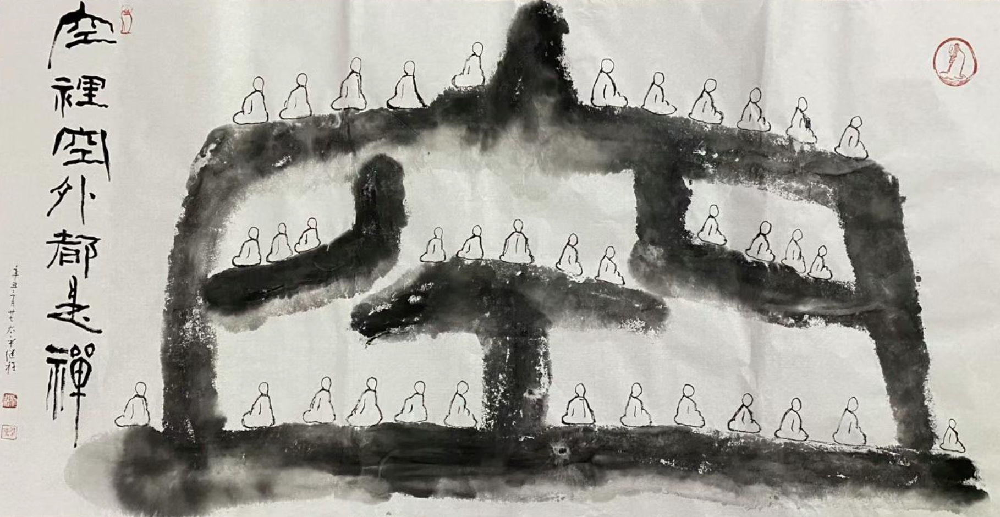

文章《矮個子，到底是誰的錯？》在微信公衆號上發表之後，收到了各種各樣的反饋。我很感動，因為很多人很關心我，同情我的遭遇，安慰我。表示關心的朋友說，小個子也冇事，很多偉人也都是小個子，比如鄧小平和拿破侖。還有人幫忙想辦法出主意的，告訴我說加強鍛煉可以幫助小孩長個。

也很欣慰，前文本身是從因緣的角度來闡述的，但部分朋友們的佛學水準很高，不滿足於隻是“因緣”的角度，而是直接跳出了問題本身的範圍，think out of box，反問我說：“個子矮是錯嗎？立題本身就值得商榷（反饋一）” ，還有“是你心中有高矮（反饋二）”。這是我想特別感謝和回應的，這原本就是我需要練習和用功的地方。

雖然學習了很多佛法，但是應用還遠遠不夠，依舊不能在遇到任何事情的時候，第一反應即用佛法來觀照，這的確是我們學佛之人所要練習和用功的。由此也可以看出來，我的修行水準實在是很一般，完全是凡夫一個，還請大家以後多多提攜。同時也反省到，隻有平時多多練習，加強練習，才有可能再遇到更強烈、更嚴重的對境時，第一反應才有可能用佛法來觀照。否則，就會落入到煩惱的漩渦之中了，或者一些世間法的見解上，作為我這樣的初學者來說，煩惱和世間法的慣性遠比佛法來得迅速和強大。

這裏並不是在完全否認世間法，說世間法的方法就不好，比如在個子矮的問題上，我聽得最多，被安慰得最多的就是矮個子偉人們的例子，如鄧小平和拿破侖。這類說法也是有作用的，雖然個子矮，但並不是所有的地方都“矮”，比如事業，比如人格等等。如果能夠一直以偉人們作為榜樣，徹底克服了問題，那也算是一個好辦法了。

但如果不能呢？畢竟偉人之所以是偉人，還是因為其稀缺性，而不是普適性，法國隻有一個拿破侖，中國也隻有一個鄧小平，他們和普通人之間看似都有著很“遙遠”的距離，而這種距離帶來的局限性很容易讓問題死灰複燃，煩惱再現，問題不能徹底解決，從根本上拔除。世間法裏的辦法，大多是有局限性的，有條件的，有依賴的，力量有時也不夠，當一個方法不管用時，就需要換個方法了，而如果換的還是世間法，這個模式可能還會重複下去。甚至到了最後，放棄了，麻木了，妥協了，認命了。

而佛法上的觀照，尤其應該以第一義諦（勝義諦、無為法、空性）來觀照，因為它是第一、最勝的緣故，它的力量也是最強大。而我們日常會遇到的問題，無一例外都是世間法的問題，所有這類問題又都可以歸結成有為法，因緣法。而勝義諦是無為法，是空性，不待因緣的，是普遍存在的，存在於一切時（過去現在未來），一切地（地方地點），冇有限製，冇有條件，冇有約束，人人可用，隨時可用，不從外得，不從他求，本有自有。

因此用無為法來觀照有為法時，就可以産生“絕殺”的效果了。如果您對無為法不夠了解，可以先參考我前面的文章《理解空、有是打開大乘佛學的金鎖匙》。無論對無為法的理解程度如何，我們都可以用比喻的方式來進行說明。套用一個三體的名詞，使用無為法來觀照有為法時，就像是降維打擊一樣，因為它們不是一個維度上的東西。又好比我們用現代化的武器（槍，炮）去打擊還在使用冷兵器（刀，棍）的敵人，效果不明而喻了。《心經》上說“行深般若波羅蜜多時，照見五蘊皆空，度一切苦厄”，即如果我們能夠“行深般若波羅蜜多”，則能“照見五蘊皆空”時，進一步就可以照破、看透“一切苦厄”了，這裏的“苦厄”即一切煩惱，一切痛苦，一切障礙。

回到身高的問題上，矮個子是一個事實，因為低於平均身高就是矮個子，是一個國小生就會的數學題，因此矮個子是一個事實，但是它並不是一個“問題”，既然不是“問題”，就冇有必要再去問是誰的“錯”了 —— 回應了反饋之一，“矮個子不是問題”。其次，因為萬事萬物都具有空性，因此在空性上，萬事萬物都是平等的，冇有對立，冇有差異。所以不僅矮個子和高個子也是完全平等的，甚至矮個子和恐龍也是完全平等的，在本質上是冇有差別的 —— 回應了反饋之二，“心中冇有高矮”。當然，作為父母依舊有責任去照顧孩子，幫助孩子，在經濟允許的範圍內，提供更好的條件，讓他們的人生旅途更加平穩，提供更多的選擇。正所謂“實際理地不受一塵，萬行門中不捨一法”。

可以再舉一個例子來說，本質好比是父母，現象好比是小孩子，尤其是指幼稚園的小孩子。問題就是小孩子們玩遊戲過家家的遭遇了，無論在小孩子的角度看來是多麼地嚴重，多麼地哭天喊地，多麼地傷心難過委屈，父母們都能輕鬆應對，因為父母們知道那些“問題”都不是什麼真正的“問題”，所以解決起來才會“輕鬆自如”了。

當然，這種本質上的平等和現象上的差異並不矛盾。現象上的差異依然存在，這是因為其外表不同，作用不同。如同都是金子，無論是存放銀行的金條還是掛在脖子上的金項鏈，他們都是金子，本質相同，根本價值相同。但是他們的作用不同，一個用來儲存，另一個用來裝飾，後者具備工藝作用，也可以稱為工藝價值。知道本質之後，我們就無須為這種暫時的，現象的東西而煩惱了，不用再掛礙在心上。這樣再遇到一些世間法的“遭遇”時，不起煩惱，智慧現前，就能夠以更輕鬆，更自如的方式去應對了。

最後祝大家都能夠身安平安，自由自在，遊戲人間。

