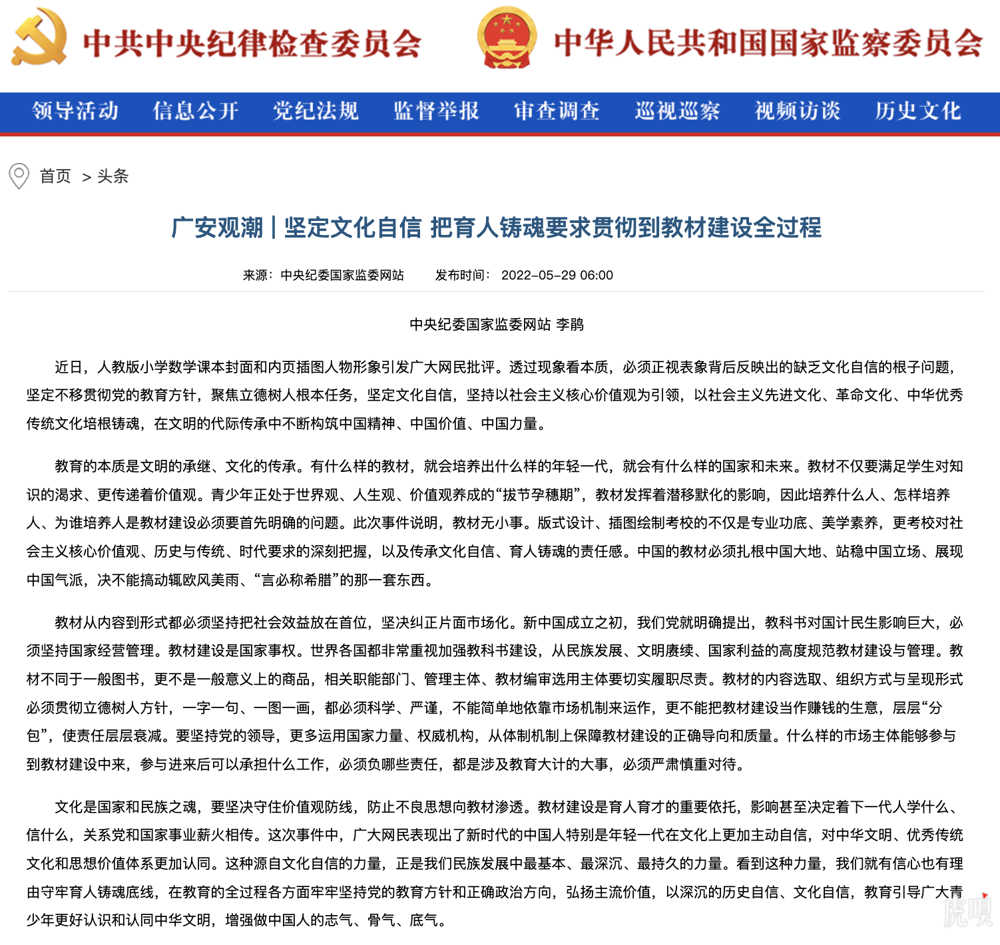

### 背景

**教材事件**

国内教材风波[1]出现后，群众反响异常强烈，因为问题之严重，实在是令人发指。没有任何一个现代化的国家，会允许在学生教材中出现涉嫌恋童癖的图片，会在非介绍生理结构的前提下，在数据教本里面出现裸露的生殖器。这是极其下三滥，极其恶劣的手段，必须追责，严惩不贷。因此，中纪委也再次强调了必须“坚定文化自信”，必须帮助青少年们培养和树立正确的世界观、人生观和价值观。

**个人背景**

作为一个身处美国的佛教在家居士，更有机会和其他宗教进行接触和交流，更容易从更广大的角度，国际化的角度看问题；尤其是对比出国之前的视野，的确开阔了不少，对于美国人的文化背景，价值观也有更深入的生活体会和切实感受；而当我再反思自己的三观时，作为一个土生土长的中国人，耳濡目染中国文化的人，也更容易从中发现中国文化中的宝贵之处。

基于以上两点背景，本文将尝试论证下以汉传佛教作为文化自信和文化输出的可行性。

### 中国文化到底是什么？

想要建立文化自信，必须先搞清楚中国文化到底是什么，由此才有可能再从中找到其优势所在，以此才能培养出真正的自信。以本人之见，中国文化无外乎释道儒三家。纵观历史，三教一直以来都是中国各个朝代的主流思想，有时是儒家，有时是道家，有时又是佛家。时而内道外儒，时而内佛外儒，甚至最终发展成为三教同尊的情况。而释道儒三教和合的景象早在北宋时期就开始了，宋孝宗写《原道论》提倡“以佛修心, 以老治身, 以儒治世” 就是最好的例证。虽然三家在内容都有修心、治身、和治世的部分，但论三家之长时，分别而论就是非常合适的了。不仅可以减少三教之间的相互诋毁，更可以团结一致为社会，为人民，乃至为国家而做贡献了。

鉴于本人学识浅薄，再加上精力有限，无法深入三教而分别阐述，仅仅是略懂佛教而已，而佛教中又以汉传佛教是本人学习和研究的重点，对于南传和藏传也只是蜻蜓点水般地接触过一点而已。但我还是特别想在进一步论述汉传佛教之前，事先说明一下主要态度 —— 中国文化本身非常包容，允许多种文化共存，甚至有大染缸的比喻，因此我的态度也是以开放包容融合为主，积极地为人民，国家，全社会，乃至全人类提供服务，之后再百花齐放、百家争鸣。因此当我提到以汉传佛教为文化自信和价值输出时，并不否认其他文化的价值所在，仅仅局限于本人的能力有限，无法全部展开。且术业有专攻，我们可以一并期待其他文化（儒家、道家等等）的倡导者们共同发挥其作用，帮助我们建立文化自信，乃至成为价值输出。

### 中国化是成为文化自信的先决条件

何为完成中国化？简而言之，即独立自主，才能不受制于他人，不被他人在牵引，更不会言听计从，失去独立思考和判断能力。在思想上必须具备独立而完整的自主体系。对于土生土长的文化而言，如道家和儒家，不存在中国化的问题，我们只需取其精华去其糟粕，继续发展其思想，融入当代知识体系，融入当代生活方式即可。

而对于起源他国的宗教，则必须首先完成中国化，才有可能成为文化自信的一部分。任何一种宗教，都不是一成不变的，发展停滞的，这样的宗教根本没有生命力。纵观历史，也根本不存在一个这样刻板的、僵化的宗教被其他文明直接接纳的例子，无一不是经历了漫长的发展才形成了当今众多宗教的样貌，显然当今宗教的形态也不会是一个终极形态，必定会继续发展，继续变化，这本身就是宗教发展的必然性，更是宗教生命力的体现。否则，一个处处受制于他人，被他人所引导的宗教组织，也就无法避免沦为政治博弈上的工具，乃至牺牲品了，甚至以宗教名义发动战争，更是违背了所有正统宗教造福全人类的初衷。

因此完成中国化，不仅是宗教自身发展的需求性，更是为了长治久安所需要解除的风险。而想要成为文化自信的一部分，则必须发展出更为先进、更为体系化和结构化的思想，以此才有可能成为文化自信的基石。一个落后的思想体系，一个不合时宜的僵化系统，怎么可能因此而产生自信呢？只有更强大，更先进的思想才有可能，只有青出于蓝而胜于蓝的发展，才有希望。

从这点上来说，佛教是一个非常好的榜样，非常正向的例子，尤其是汉传佛教。不仅有利于树立文化自信，更能够成为其他宗教的参考和模仿对象。汉传佛教早已彻底地完成了中国化是一个毋庸置疑的事实，无论是佛教界，还是学术界对此都有共识。这方面相关的参考材料和学术论文也都有不少研究成果，因此这里只简略地罗列如下。

### 、？？

（1）天台宗 —— 教观双美。汉传佛教的天台宗是第一个汉传佛教的宗派，以智者大师的三大部为宗，建立了完整的天台理论体系和实践步骤，有“教观双美”的美誉。很多人误以为汉传佛教没有次第化、层次化的思想体系，这完全是因为不了解天台才会有误解。天台宗不仅有完整的次第修行理论和实践指导，更有非次第的圆顿教法，不仅渐顿并存，且有圆教统摄所有教法。这样完整的、体系化的天台宗派是汉传佛教第一个里程碑式的发展例证。虽然天台宗创建于南北朝时期（420年—589年），距今约有1500年了，其独创的天台判教和修证体系依旧活跃于当今的佛教界和学术界。

天台判教可以帮助我们建立对全体佛教的理解[注2]，不仅是汉传佛教部分，甚至可以统摄佛教三大体系（南传，藏传，汉传），和一切宗派（无论是解脱道还是菩萨道，无论是禅宗还是净土等）。天台的禅法，不仅有次第禅法，如小止观，六妙门，更有圆顿的禅法，如摩诃止观，在圆顿的教义上，丝毫不逊色于后来的禅宗。当今南传的次第禅法，在欧美非常流行，而天台的次第禅法和南传教法非常接近，且因为其基于大乘思想的广博性，只会更加先进和完整。

(2) 禅宗 —— 最为超越。如果说天台宗是汉传佛教中国化的象征，那么禅宗就是中国佛教化的最佳体现了。自从六祖慧能之后，一花开五叶，又继而从五家发展成七宗，禅宗完成了将汉传佛教的普及化，禅宗不再是一种宗教，而是成为了独具特色一种禅文化。“平常心是道”，“佛法在世间，不离世间觉”，“行住坐卧皆是禅”，等禅宗名言，让佛法从一种专业人士从事的修行活动，普及成为广大民众日常生活中的智慧，以超脱的心态生活，以洒脱的精神入世，这种影响力可以说深入每一个人的骨髓，即使是不自知，也无法完全否认。

而又禅文化进而发展出来的茶禅文化，喝茶文化，更是从一种普通的饮品享受，升华成为了一种可以参禅悟道的方式，不仅丰富了广大群众的精神世界，也为很多文艺作品，影视作品提供了极其广大和深邃的创造空间。作为一个80后来说，曾经每个暑假必看的《西游记》更是一代人的集体记忆，这种文化烙印是非常潜移默化的，悄无声息地发生着影响着一代又一代的人。

日韩禅宗起源于中国禅宗，不仅完整地接收了禅宗的教法，更是将禅文化推向了一个新的高潮，在生活中创办了各种禅道，如茶道，剑道，花道，武士道，跆拳道，空手道。其初心无非都是希望通过在某一种技能中，去体会和参悟禅法。既然行动坐卧，语默动静都是禅，更何况是某一项可以用来生活甚至谋生的技艺呢？因此禅宗的思想是一切这类道法的核心基础，没有汉传禅宗，没有六祖慧能，就不可能会有禅文化。

禅文化的先进性和融合性不言而喻，相关的参考材料和学酥研究数不甚数，笔者只想结合自身的所见所闻和背景，略作补充。现代化的禅宗，也不仅仅是只有祖师禅了，也有次第禅（如来禅），而次第禅又可以再次连接到天台的禅法。广义的禅法，甚至可以代表全体佛教最核心的精神，无论南传，汉传，藏传，无一不重视禅法的实际修行，甚至禅法可以连接到其他宗教，如道家，印度教，萨满教，甚至有说天主教也有是禅修的。欧美流行的冥想更可以理解为禅修的一种，乃至在欧美地区占有绝对优势的iPhone在2021年都在Fitness+中增加了冥想的功能。放眼全球所有的正统宗教，如果有什么宗教方式可以连接所有宗教，团结所有宗教，其广度和深度都有足够的范围，除了禅修之外应该没有第二个了，虽然大家的叫法会有不同，禅坐、打坐、冥想，但方式却非常相近。因慈善不是宗教独有的，故不算。海外的禅修训练，完全不要求信众改变原有的信仰，即可去体验和实践，利用身心的安宁，从而更好地生活和工作，和完全不和原来的宗教信仰相冲突，甚至有可能帮助在原有的信仰上更进一步。也有很多人把禅修当做是一种普适性、非宗教性质的锻炼，和风靡世界的Yoga，太极拳一样了。

很多人误以为中国文化是落后的，是不符合和当代生活的。反观欧美，处于物质和科技文明的确更为先进的地方，对于禅的热爱是毫不逊色于中国曾经的佛教盛世。不仅如此，禅宗更是得到了美国最具叛逆精神的嬉皮士们的喜爱，他们学习禅法，研究禅诗，期待像禅师一样潇洒自如，这些不正是说明禅文化的先进性吗，不正代表了和科学发展的融合性吗？

（3）唯识 —— 最为缜密之逻辑。唯识学作为玄奘大师十七年印度留学的最重要的目的。不仅给中国佛教界带来最为精密和严谨的思想体系，更是终结了佛教界原有的诸多异说，统摄三乘教法，以理服人，以逻辑服众。同时也丰富和提升了中国古代的逻辑学，让我们从“白马非马”的简单逻辑，进入到一个具备完整性的逻辑学中。

为何要提唯识？两个原因：作为佛教心理学之称的唯识学有潜力帮助我们构建自己的心理学体系。其次作为最精密的哲学理论，完全有潜力发展出更先进，更具象的中国哲学体系。中国哲学体系因为之前缺乏逻辑性的阐述，经常和玄学混为一谈，导致很多人误以为哲学都是虚无主义，无用之学。恰恰相反，哲学类似于基础学科一样，对于思想体系和精神文明建设有着非常重要的基石作用。

哲学体系更可以跳出宗教的框架，从更高的角度来统摄一切的思想，其作用不亚于某个行业的最高标准。最高的市场竞争是标准之争，谁占据了市场领先地位，谁就能主导标准。当标准处于他人之手时，我们就永远也无法超越他们，因为他们会通过修改标准的手段，已达成他们排除异己，独享市场蛋糕的私心。于市场是丢失，于人心是损失。

心理学和心理咨询是物质文明高度发展下的必需品。物质文明的高度发展，社会压力接踵而至，社会现象和新闻都爆炸性地传播起来，与此同事，人们的心理建设却没有跟上，因此心理上，多数人都在承受压力，处于亚健康状态。这也是为何心理咨询在欧美有非常广大的需求，心理咨询在欧美也极其普遍，被广大人民所接受，早已纳入了医保范围，价格也相当昂贵。国内的心理咨询虽然还没有完全普及，却也在日益壮大，不断地发展，但其价格却相当不便宜，导致能够从中获益的人数非常至少。

普通心理学和宗教心理学的重大区别在于范围不同，范围不同则会带来力量的不同，深刻度的不同。普通心理学的范畴大多是生活上，家庭上，对于生死的问题要么不涉及，要么认识非常浅薄。而宗教心理学（含哲学）的第一步即使要探讨生从何来，死往何去的重大问题，“在生死面前，一切都是擦伤”，在一个无比重视生命权的今天，必须以一个更为开放和包容的角度去研究和探讨生死的本质问题。基于更大的范围，和更深的洞见，更严谨的逻辑，我们完全可以构建和发展出更具划时代意义的认知体系，乃至哲学体系。

### 文化自信不能脱离广大群众基础

无论是国家还是个人，在海外的我们都非常重视和维护中国人和华人的形象。当和其他种族，其他肤色的人在一起的时候，我们每个人真的不仅仅是代表了我们个体，都是国家形象，乃至华人形象的体现。

不得不说，欧美虽然是现代科技和物质文明的体现，但其中也不乏愚昧无知之辈，甚至会有人认为中国还在满清时期，脑袋后面还有一根常常的辫子。这种长期落后的印象是不可能短期消除的。

试想一下，在上个世纪的90年代，或千禧年之后的短暂时间内。当一个欧美人来到中国的时候，

我们不妨大胆想象一下，假设我们的文化自信是成功的，那该是一番怎样的景象呢？当我们因为工作和求学需求来到异国他乡时：

你走到世界上任何一个电影院，看任何一部电影？里面都在上演我们的文化，之乎子也，孔孟之道。

你走进任何书店，无论实体的还是网上的，到处都有是太极的logo，从风水到中医，从婚姻到育儿，无一不有。

从东讲到西，从南讲到北。记住是Chan而不是Zen，因为Zen是日本禅的音译，Chan是中国禅的音译。

你走在任何

就再也不会有什么狗屁问题说 —— 华人无法融入主流思想了？因为你的文化背景是更先进的，更强大的，你就是主流时，你因为事务来到他国异乡时，甚至可以说是为了传播其文化。