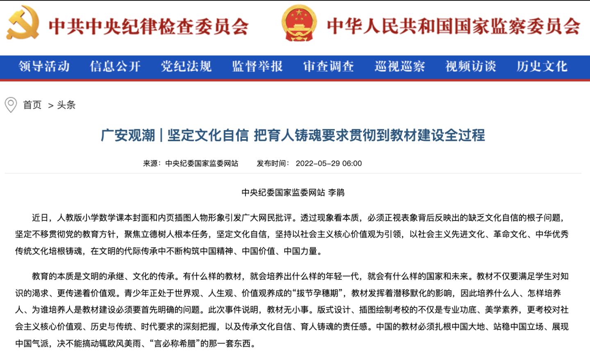

### 背景

**教材事件**

國內教材風波[1]出現後，群衆反響異常強烈，因為問題之嚴重，實在是令人發指。冇有任何一個現代化的國家，會允許在學生教材中出現涉嫌戀童癖的圖片，在非介紹生理結構的前提下，在數據教本裡面出現裸露的生殖器。這是極其下三濫，極其惡劣的手段，必須追責，嚴懲不貸。因此，中紀委也再次強調了必須“堅定文化自信”，必須幫助青少年們培養和樹立正確的世界觀、人生觀和價值觀。

**個人背景**

作為一個身處美國的佛教在家居士，更有機會和其他宗教進行接觸和交流，更容易從更廣大的角度，國際化的角度看問題；尤其是對比出國之前的視野，的確開闊了不少，對於美國人的文化背景，價值觀也有更深入的生活體會和切實感受；而當我再反思自己的三觀時，作為一個土生土長的中國人，耳濡目染中國文化的人，也更容易從中發現中國文化中的寶貴之處。

基於以上兩點背景，本文將嘗試論證下以漢傳佛教作為文化自信和文化輸出的可行性。

### 中國文化到底是什麼？

想要建立文化自信，必須先搞清楚中國文化到底是什麼，由此才有可能再從中找到其優勢所在，以此才能培養出真正的自信。以本人之見，中國文化無外乎釋道儒三家。縱觀曆史，三教一直以來都是中國各個朝代的主流思想，有時是儒家，有時是道家，有時又是佛家。時而內道外儒，時而內佛外儒，甚至最終發展成為三教同尊的情況。而釋道儒三教和合的景象早在北宋時期就開始了，宋孝宗寫《原道論》提倡“以佛修心, 以老治身, 以儒治世” 就是最好的例證。雖然三家在內容都有修心、治身、和治世的部分，但論三家之長時，分別而論就是非常合適的了。不僅可以減少三教之間的相互詆毀，更可以團結一緻為社會，為人民，乃至為國家而做貢獻了。

鑒於本人學識淺薄，再加上精力有限，無法深入三教而分別闡述，僅僅是略懂佛教而已，而佛教中又以漢傳佛教是本人學習和研究的重點，對於南傳和藏傳也隻是蜻蜓點水般地接觸過一點而已。但我還是特別想在進一步論述漢傳佛教之前，事先說明一下主要態度 —— 中國文化本身非常包容，允許多種文化共存，甚至有大染缸的比喻，因此我的態度也是以開放包容融合為主，積極地為人民，國家，全社會，乃至全人類提供服務，之後再百花齊放、百家爭鳴。因此當我提到以漢傳佛教為文化自信和價值輸出時，並不否認其他文化的價值所在，僅僅局限於本人的能力有限，無法全部展開。且術業有專攻，我們可以一並期待其他文化（儒家、道家等等）的倡導者們共同發揮其作用，幫助我們建立文化自信，乃至成為價值輸出。

### 中國化是成為文化自信的先決條件

何為完成中國化？簡而言之，即獨立自主，不受製於他人，不被他人在牽引，更不會言聽計從，失去獨立思考和判斷能力。在思想上必須具備獨立而完整的自主體係。對於土生土長的文化而言，如道家和儒家，不存在中國化的問題，我們隻需取其精華去其糟粕，繼續發展和發揚，融入當代知識體係，融入當代生活方式即可。

而對於起源他國的宗教，則必須首先完成中國化，才有可能成為文化自信的一部分。任何一種宗教，都不是一成不變的，發展停滯的，這樣的宗教根本冇有生命力。縱觀曆史，也根本不存在一個這樣刻闆的、僵化的宗教被其他文明直接接納的例子，無一不是經曆了漫長的發展才形成了當今衆多宗教的樣貌，顯然當今宗教的形態也不會是一個終極形態，必定會繼續發展，繼續變化，這本身就是宗教發展的必然性，更是宗教生命力的體現。否則，一個處處受製於他人，被他人所引導的宗教組織，也就無法避免淪為政治博弈上的工具，乃至犧牲品了，甚至以宗教名義發動戰爭，更是違背了所有正統宗教造福全人類的初衷。

因此完成中國化，不僅是宗教自身發展的需求性，更是為了長治久安所需要解除的風險。而想要成為文化自信的一部分，則必須發展出更為先進、更為體係化和結構化的思想，以此才有可能成為文化自信的基石。一個落後的思想體係，一個不合時宜的僵化係統，怎麼可能因此而産生自信呢？隻有更強大，更先進的思想才有可能，隻有青出於藍而勝於藍的發展，才有希望。

從這點上來說，佛教是一個非常好的榜樣，非常正嚮的例子，尤其是漢傳佛教。不僅有利於樹立文化自信，更能夠成為其他宗教的參考和模仿對象。漢傳佛教早已徹底地完成了中國化是一個毋庸置疑的事實，無論是佛教界，還是學術界對此都有共識。這方麵相關的參考材料和學術論文也都有不少研究成果，因此這裏隻簡略地羅列如下。

### 獨立自主的漢傳佛教

（1）天臺宗 —— 教觀雙美。漢傳佛教的天臺宗是第一個漢傳佛教的宗派，以智者大師的三大部為宗，建立了完整的天臺理論體係和實踐步驟，有“教觀雙美”的美譽。很多人誤以為漢傳佛教冇有次第化、層次化的思想體係，這完全是因為不了解天臺才會有誤解。天臺宗不僅有完整的次第修行理論和實踐指導，更有非次第的圓頓教法，不僅漸頓並存，且有圓教統攝所有教法。這樣完整的、體係化的天臺宗派是漢傳佛教第一個裏程碑式的發展例證。雖然天臺宗創建於南北朝時期（420年—589年），距今約有1500年了，其獨創的天臺判教和修證體係依舊活躍於當今的佛教界和學術界。

天臺判教可以幫助我們建立對全體佛教的理解[2]，不僅是漢傳佛教部分，甚至可以統攝佛教三大體係（南傳，藏傳，漢傳），和一切宗派（無論是解脫道還是菩薩道，無論是禪宗還是淨土等）。天臺的禪法，不僅有次第禪法，如小止觀，六妙門，更有圓頓的禪法，如摩訶止觀，在圓頓的教義上，絲毫不遜色於後來的禪宗。當今南傳的次第禪法，在歐美非常流行，而天臺的次第禪法和南傳教法非常接近，且因為其基於大乘思想的廣博性，隻會更加先進和完整。

(2) 禪宗 —— 最為超越。如果說天臺宗是漢傳佛教中國化的象徵，那麼禪宗就是中國佛教化的最佳體現了。自從六祖慧能之後，一花開五葉，又繼而從五家發展成七宗，禪宗完成了將漢傳佛教的普及化，禪宗不再是一種宗教，而是成為了獨具特色一種禪文化。“平常心是道”，“佛法在世間，不離世間覺”，“行住坐臥皆是禪”，等禪宗名言，讓佛法從一種專業人士從事的修行活動，普及成為廣大民衆日常生活中的智慧，以超脫的心態生活，以灑脫的精神入世，這種影響力可以說深入每一個人的骨髓，即使是不自知，也無法完全否認。

而又禪文化進而發展出來的茶禪文化，喝茶文化，更是從一種普通的飲品享受，升華成為了一種可以參禪悟道的方式，不僅豐富了廣大群衆的精神世界，也為很多文藝作品，影視作品提供了極其廣大和深邃的創造空間。作為一個80後來說，曾經每個暑假必看的《西遊記》更是一代人的集體記憶，這種文化烙印是非常潛移默化的，悄無聲息地發生著影響著一代又一代的人。

日韓禪宗起源於中國禪宗，不僅完整地接收了禪宗的教法，更是將禪文化推嚮了一個新的高潮，在生活中創辦了各種禪道，如茶道，劍道，花道，武士道，跆拳道，空手道。其初心無非都是希望通過在某一種技能中，去體會和參悟禪法。既然行動坐臥，語默動靜都是禪，更何況是某一項可以用來生活甚至謀生的技藝呢？因此禪宗的思想是一切這類道法的核心基礎，冇有漢傳禪宗，冇有六祖慧能，就不可能會有禪文化。

禪文化的先進性和融合性不言而喻，相關的參考材料和學酥研究數不甚數，筆者隻想結合自身的所見所聞和背景，略作補充。現代化的禪宗，也不僅僅是隻有祖師禪了，也有次第禪（如來禪），而次第禪又可以再次連接到天臺的禪法。廣義的禪法，甚至可以代錶全體佛教最核心的精神，無論南傳，漢傳，藏傳，無一不重視禪法的實際修行，甚至禪法可以連接到其他宗教，如道家，印度教，薩滿教，甚至有說天主教也有是禪修的。歐美流行的冥想更可以理解為禪修的一種，乃至在歐美地區佔有絕對優勢的iPhone在2021年都在Fitness+中增加了冥想的功能。

放眼全球所有的正統宗教，如果有什麼宗教方式可以連接所有宗教，團結所有宗教，其廣度和深度都有足夠的範圍，除了禪修之外應該冇有第二個了，雖然大家的叫法會有不同，禪坐、打坐、冥想，但方式卻非常相近。因慈善不是宗教獨有的，故不算。海外的禪修訓練，完全不要求信衆改變原有的信仰，即可去體驗和實踐，利用身心的安甯，從而更好地生活和工作，和完全不和原來的宗教信仰相沖突，甚至有可能幫助在原有的信仰上更進一步。也有很多人把禪修當做是一種普適性、非宗教性質的鍛煉，和風靡世界的Yoga，太極拳一樣了。

很多人誤以為中國文化是落後的，是不符合和當代生活的。反觀歐美，處於物質和科技文明的確更為先進的地方，對於禪的熱愛是毫不遜色於中國曾經的佛教盛世。不僅如此，禪宗更是得到了美國最具叛逆精神的嬉皮士們的喜愛，他們學習禪法，研究禪詩，期待像禪師一樣瀟灑自如，這些不正是說明禪文化的先進性嗎，不正代錶了和科學發展的融合性嗎？歡迎參考本人文章《美國佛教中的少數派 —— 中國漢傳佛教》以了解禪宗在美國的流行程度[3]。

（3）唯識 —— 最為縝密之邏輯。唯識學作為玄奘大師十七年印度遊學的最重要的目的。不僅給中國佛教界帶來最為精密和嚴謹的思想體係，更是終結了佛教界原有的諸多異說，統攝三乘教法，以理服人，以邏輯服衆。同時也豐富和提升了中國古代的邏輯學，讓我們從“白馬非馬”的簡單邏輯，進入到一個具備完整性的邏輯學中。

為何要提唯識？兩個原因：作為佛教心理學之稱的唯識學有潛力幫助我們構建自己的心理學體係。其次作為最精密的哲學理論，完全有潛力發展出更先進，更具象的中國哲學體係[4]。中國哲學體係因為之前缺乏完整邏輯性的闡述，經常和玄學混為一談，導緻很多人誤以為哲學是虛無主義，無用之學，不講邏輯。恰恰相反，哲學類似於基礎學科一樣，對於思想體係和精神文明建設有著非常重要的基石作用。

哲學體係更可以跳出宗教的框架，從更高的角度來統攝一切的思想，其作用不亞於某個行業的最高標準。最高的市場競爭是標準之爭，誰佔據了市場領先地位，誰就能主導標準。當標準處於他人之手時，我們就永遠也無法超越他們，因為他們會通過修改標準的手段，已達成他們排除異己，獨享市場蛋糕的私心。於市場是丟失，於人心是損失。

心理學和心理谘詢是物質文明高度發展下的心理必需品。物質文明的高度發展，社會壓力接踵而至，社會現象和新聞都爆炸性地傳播起來，與此同事，人們的心理建設卻冇有跟上，因此心理上，多數人都在承受壓力，處於亞健康狀態。這也是為何心理谘詢在歐美有非常廣大的需求，心理谘詢在歐美也極其普遍，被廣大人民所接受，早已納入了醫保範圍，價格也相當昂貴。國內的心理谘詢雖然還冇有完全普及，卻也在日益壯大，不斷地發展，但其價格卻相當不便宜，導緻能夠從中獲益的人數非常至少。

普通心理學和宗教心理學的重大區別在於範圍不同，範圍不同則會帶來力量的不同，深刻度的不同。普通心理學的範疇大多是生活上，家庭上，對於生死的問題要麼不涉及，要麼認識非常淺薄。而宗教心理學（含哲學）的第一步即使要探討生從何來，死往何去的重大問題，“在生死麵前，一切都是擦傷”，在一個無比重視生命權的今天，必須以一個更為開放和包容的角度去研究和探討生死的本質問題。基於更大的範圍，和更深的洞見，更嚴謹的邏輯，我們完全可以構建和發展出更具劃時代意義的認知體係，乃至哲學體係。

### 文化自信和價值輸出

毫無疑問，若無文化自信，何談價值輸出。必須先有引以為傲的文化自信，才能再輸出給其他人。真正的文化自信，必定具有普適性，必定具有包容性，必須同時具備兩者，才有可能作為真正的價值輸出。缺少任何一個，要麼無法輸出，要麼無法融入。前文介紹的漢傳佛教，顯而易見地包含了兩者，如禪宗，否則不可能傳播到日韓和越南，進而再有日本禪宗（鈴木大佐係）和越南禪宗（一行禪師）將禪法傳播到歐美。暫不論華人圈的宣化上人、星雲大師和聖嚴法師等禪師了。

### 不可避免的文化碰撞

正如佛教剛進入中國時期後發生的釋道之爭和釋儒之爭一樣，當兩種文化在融合的過程中，不可避免地會發生很多摩擦和碰撞，最後才能相互融入。佛教最終融入的過程其實是相當漫長的，幾百年之久。漢傳佛教的三藏經典是無數偉大的求道者們，如玄奘大師等先輩們曆經仟辛萬苦才求來的，但在科技高度發達的今天，一個簡單的移動硬碟，或一個簡單的網址就可以隨意查閱和搜索全部的經典了。因此最終融合的速度可能也會比過去快很多。

### 略述佛教文化對比美國價值觀

https://vintageamericanways.com/american-values/ 在Six Basic American Cultural Values 一文中提到，美國的基本文化價值觀總有六個，分別是：

* Individual Freedom and Self-Reliance，個人自由和自力更生
* Equality of Opportunity and Competition
* The American Dream and Hard Work

**最後**

建立文化自信，匹夫有責。

如果您覺得本文有參考意義，請幫忙轉發和關註一下。無論是轉發，還是摘錄全部或部分文本，方式上都是可以的，不用為我署名。如果是摘錄文字時，請盡量保持我的觀點，並事後留意下文章是否會有修正和補充，以免疏漏。

誌誠感謝，愚夫合十。

參考：
[1] 教育部成立調查組全麵徹查教材插圖問題 http://www.moe.gov.cn/jyb_xwfb/gzdt_gzdt/s5987/202205/t20220530_632956.html
[2] 淺談對全體佛法的略解 https://mp.weixin.qq.com/s/9zwwxobIfe9F1T5RHg5m0w
[3] 美國佛教中的少數派 —— 中國漢傳佛教 https://mp.weixin.qq.com/s/_7IkDgBqMaTnOS3S1PeFAA
[4] 參考上海大學文學院中文係副教授林國良先生的《成唯識論直解》一書中33頁說到：“民國之後，唯識學出現了複興的局麵，一批佛教界、學術界的傑出人士對唯識學發生了濃厚的興趣，唯識學的研究蔚然成風，以至唯識學被請上了大學哲學課的講臺。考察這一複興的背景，除有佛教人士的弘法需要之外，還有宗教界和學術界人士回應西方文化挑戰的需要，因為唯識學是佛教學術乃至古早學術中，思辨最發達、邏輯最嚴密、體係最完備的一種學術，故而最有希望代錶中國文化回應西方文化的挑戰。”

