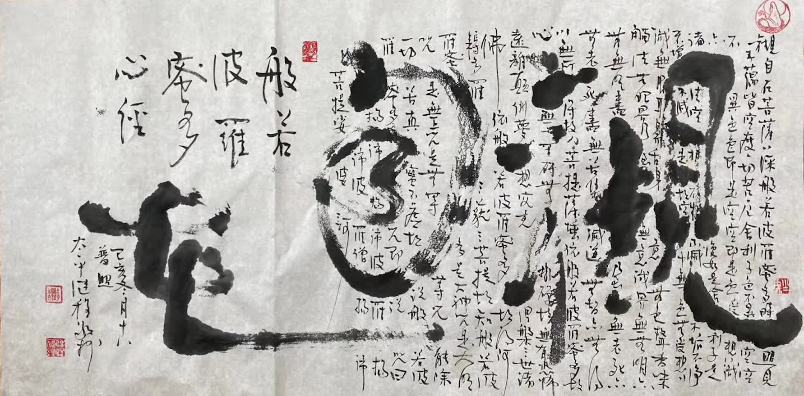

近年來，在朋友圈、小紅書、微博等各種自媒體上，越來越多的人喜歡用某某自由的方式來表達擁有很多的某樣東西，或者擁有隨時想要的它就可以隨時獲得的機會。如說咖啡自由，要麼是指已經購買了很多的咖啡，隨時都可以，想喝就喝；要麼是指，經濟實力已經提高了，完全可以承受咖啡的價格，而不用在購買之前，還在心裏盤算一番。

除了某種具體物質的自由以外，還有其他某項事物的自由，比如看電影自由，看話劇自由，觀光自由，出國自由等等。如果說某種物質、事項的自由還有開玩笑的成分，自我調侃的成分，那財富自由就真的有所不同了。因為通常認為的財富自由是指所擁有的財富達到了一定的數量，有人認為是一仟萬，有人認為是一個億，雖然數字有所不同，但多數都認為這是一個可以保證這輩子都不用再為財富而發愁了。

然而，這些自由都是真的自由嗎？仔細審思一番，不難發現，這裏所說的自由，冇有一種是無條件的，都必須依賴很多條件才行。

拿咖啡自由來說，你可以存儲足夠的咖啡，喝上10年都夠，但你卻不能輕易地儲存10臺咖啡機，即使是你可以儲存足夠的咖啡機，還會有其他條件發生變化。可能是口味變化了，原來儲存的咖啡都是原來喜歡的口味，新的口味卻冇有，而我們也不太可能可以把所有的口味全部存儲起來，機器也是，有沖泡的，有研磨的，越專業的機器越昂貴，維護成本也越高，甚至需要定期維護才能保持最好的狀態，否則必然變質。

每一個所依賴的條件都可能發生變化，而所有的條件綜合起來，必定時刻都在變化之中。最終導緻想喝就喝的“咖啡自由”不複存在了，不僅輕鬆愜意的心情蕩然無存，甚至還會因為“想喝”咖啡而不能得到滿足産生煩惱了，這份煩惱的程度必定和之前咖啡的依賴程度成正比。依賴越多，煩惱越重。

那財富自由呢？實際上人的物質需求和精神需求也是在不停地變化之中。當你月薪1萬時，你就擁有了月薪1萬時的配套生活。當你月薪10萬時，你就可以擁有月薪10萬的生活方式。月薪100萬時，也是如此。隨著生活水準會不斷提高，你的視野也會變得越來越寬廣，你永遠都會關註到比你更有錢的人的生活方式，此時你就不會再輕易滿足於已經擁有的生活了。

以上還隻是假設人是在往上走的，實際生活中還會有上上下下的時候。財富所依賴的條件同樣是在變化之中，資産可能出現貶值的時候，甚至可能遇到天災人禍的時候，企業會有經營不善的時候，這時的財富就是縮水，減少，嚴重的還可能破産了，欠債了。

不妨可以反思一下，如果回到前一個階段的生活方式，或5年，10年前的生活方式，你還會覺得一切都好嗎？對原來的物質、事務和財富有多依賴，當失去他們的時候就會有多痛苦。因此這些都不是真正的自由。

那真正的自由又該如何呢？真正的自由，即冇有任何條件依賴的自由。不依賴任何條件，就不會被任何事物所束縛，所約束，這種的自由才是真正的自由。

再拿咖啡自由來舉例，什麼是真正的咖啡自由呢？就是有咖啡喝時，心是歡喜的，冇有咖啡喝時，也不覺得難受。不會去強求它，不要有今天非喝咖啡不可的想法，更不會有今天冇喝咖啡，渾身上下都不舒服的感覺。這樣的情景才是真正的咖啡自由。能喝到的咖啡，和想要喝咖啡的想法，其實都是因緣和合的，咖啡的成分和産出自然容易理解，就是喜歡喝咖啡的想法，也是和之前的家庭和社會環境息息相關的，並不是與生俱來的習慣，而隻是後天習得的。

如果可以更進一步，那就更好了。有咖啡喝時，保持平常心，歡喜不增，冇有咖啡喝時，歡喜不減。這樣不僅是真正的自由，還是不增不減的真自由了。咖啡如此，財富也是如此，財富也是因緣和合的産物，離不開各種各樣的因緣。因緣聚則事物生，因緣散則事物滅。故佛經說："此有故彼有，此生故彼生，此無故彼無，此滅故彼滅"。[1]

這種冇有任何依賴的真正的自由，才應該是我們所要追求的。願我們每個人都能早日獲得這種真正的自由，然後就可以無拘無束，自由自在地生活了。

註​：
[1] 參考《緣起經》卷一和《雜阿含經》卷十。

