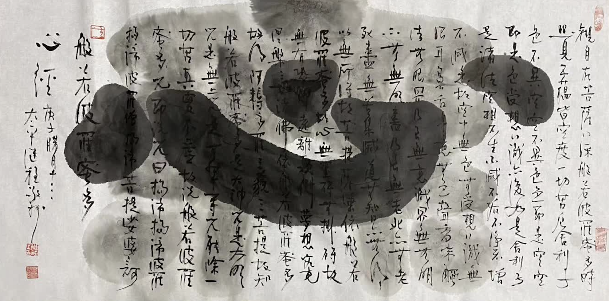

（圖片來源：繼程法師）

## 緣起

大乘佛教裡面尤其註重懺悔的修行法門，無論是漢傳佛教的各種懺法，法華懺，大悲懺，彌陀懺，五十三佛懺，八十八佛懺，梁皇寶懺等。還是藏傳佛教的各種咒語（應該叫真言更恰當），如百字明，金剛薩埵心咒等。無論哪種懺法，都會強調其殊勝性，即能夠將一切罪業懺悔清淨。尤其是在彌陀信仰為主的淨土法門中，以《佛說觀無量壽佛經》卷一的“稱佛名故，於念念中，除八十億劫生死之罪。”為最常見的滅罪言說之一。

以我所見所聞來說，周圍的大乘佛法修行人無一不強調懺法的重要性，尤其是在所謂的末法時代。然而，當我們深入探討下懺悔背後的道理時，能夠完全了知，徹底了知的人卻不多見。因此本文想要略述一下懺悔的邏輯，希望可以提供一點參考，啓發提高對懺悔法門的認知，這樣再進行懺悔時，則達到事半功倍的效果。當然因為本人的水準有限，還請各位大德讀者們，不吝批評指正和補充。

## 該選擇哪種懺法或真言？

無論是懺法儀軌還是持咒，其本身都是一項重要的修行法門，從共性的角度來說，一切懺法、持咒都是廣義上的禪修。以大家最熟悉的禪宗語錄來說，即是“行住坐臥皆是禪”，“語默動靜皆是禪”，連生活中最普通的吃飯、喝水、打柴、燒火、做飯都是禪法，更何況是專門的為修行所製定的儀軌以及真言（咒語）呢？

除了共性的角度，每一種儀軌和真言背後又有不共的地方，有各自的特色和相應的地方。如法華懺來說，即是以法華經作為整部儀軌的理論基礎，對於喜愛和深信《法華經》的修行人來說就有其不共的相應力和加持力。如金剛薩埵心咒也是如此，即是以金剛薩埵為緣起，産生不共的相應力和加持力。

每個人都有其不同的背景、習慣，以口味舉例，有些人喜歡吃甜的，有些人喜歡吃鹹的，而有些人喜歡吃酸的，還有人喜歡吃辣的，無論是哪種，隻要在健康的前提下，選擇哪種都是可以的。如此豐富的儀軌和咒語也是如此，都是為了滿足有不同“口味”的信衆而設的。經言：“佛說一切法，為度一切心”。因此，法門本身冇有高下，隻要適合自己的就是最好的，同時要能允許和理解，他人的方法可能不同，但目的都是一樣的。

## 懺法的根本邏輯（智慧篇）

無論懺法本身的文宣如何殊勝，如何有力，最根本的邏輯無非還是因緣法 —— 對於過去所犯的錯誤，認識它、面對它，承認它，不逃避，不再為自己尋找借口，然後有勇氣去面對、去承擔其一切後果。並且保證以後不再犯同類的錯誤，以及其他不同類錯誤。懺法的關鍵，在於提升內心承擔的力量，而非否認、害怕和逃避事項上的懲罰和後果。

《大智度論》卷十說，“諸佛實語不破因緣法相”。因此懺法在因緣上也不會違背世間法。舉例來說，假設A殺害了B，在鐵的事實面前，無非是兩種結果，A認罪，並真心懺悔，最終求得B家屬的原諒，B家屬出具符合法律要求的諒解書。最終A必定會是較輕的判決，但不可能直接無罪釋放，因為殺害的事實依然存在，所以A還要受到應有的懲罰。另一種情況A死不悔改，不認罪，冷酷無情，冷血，甚至反社會，反人類，這種情況下，等待A的必定是重判，甚至是極端的死刑懲罰等。

以上是世間法邏輯，也是完完全全的因緣法邏輯，佛法上的懺法的邏輯也是如此。充分認識到錯誤，並真心悔改後，對於一切懲罰都會心甘情願，不再抱怨，不再違抗。對於較輕的錯誤來說，發自內心的懺悔，則會減輕甚至完全免除懲罰。對於較重的錯誤來說，也是“死罪可免，活罪難逃”。一個真心懺悔的人，對於“活罪”的部分，必定會心甘情願地接受，因為這已經是最低程度的懲罰了 —— 即佛法上常說的“重罪輕報”。

因此，從智慧和邏輯的角度而言。懺法的根本在於承擔責任，以負責任的態度對待自己的一切言行，對於更嚴格的修行者，甚至要對待自己內心的起心動念，即每一個想法，每一個念頭，都應如理思維，如理作意。對於已經犯過的錯誤，如果還有補救的機會，則應該地補救，通過道歉，彌補的方式，求得原諒。對於因緣不具足時候，即無法去彌補的時候，則應該在內心真誠地懺悔，在佛菩薩面前懺悔，請佛菩薩和一切護法作證。待到以後因緣成熟時，再去主動受罰 —— 安世高的故事[1]即是後者的一個例證。

## 懺法的神學篇

如果對於因緣果報的基本佛理還不能徹底地理解，再加上各種懺法和咒語的各種巧妙說辭，則會不自然地進入到神學範疇了，需要仰仗依賴“信”的力量。這種情況在佛教裡面的其實非常之多，尤其是以前和古代時，因為人們的教育程度普遍低下，到處都是文盲，冇有基本的文化知識，何談邏輯性的知見呢？雖然當今的教育普及率已經大幅提高，文盲人數不斷下降，但這種情況依舊會存在的。

以單純的“信”的力量，也並非不好，但更多的是一種方便法，依賴的是以敬畏之心的“仰信”。這種情況下更要提防“流弊”，即是過度相信懺法的“神奇”結果，而違背了基本的因緣法，認為可以清除一切外界的果報（違緣） —— 等到真正出現違緣時，很容易信仰崩塌。筆者就聽過這樣的例子，一個在平時非常用功，修行非常精進的人，但因為量變冇有到質變，再加上見解上的不究竟，在年老時因為感受到巨大的病苦，最終變得破口大罵三寶，認為佛法都是騙人的、虛妄的東西，從一個虔誠的佛教徒走到了另一個極端。這種例子就是非常可惜、非常遺憾的了，這正是缺少了對因緣果報的基本正見，過於依賴“方便法”的情況下，掉入了“流弊”中的“陷阱”之中，可悲可歎。

## 安全和穩妥懺法需理事結合

最安全和最穩妥的懺法莫過於兩者的結合，行解並重，理事並行。但首先，應該多多學習佛法上的善惡之別，了解什麼是善法，什麼是不善法（惡法），什麼是無記法。其次是盡快、盡早地學習和了解因緣果報的核心教理，一切佛法的根本和核心都是因緣法，或者是以因緣法作為基礎而開展的。最終，如果還能了解下方便法和究竟法的區分，深入了解究竟法（即勝義諦，空性），之後方能建立最徹底的正見。從懺悔的角度來說，最究竟的道理莫過於 —— “罪從心起將心懺，懺罪何如莫起心，罪滅心亡兩俱空，是則名為真懺悔”[2]。

對於理論的深入了解，對於懺罪必定會很有幫助，甚至是事半功倍的效果。其次，無論對於理論的理解到了何種程度，從佛法上來說，作為凡夫的我們來說，雖然可以列舉此生有記憶以來的很多錯誤，但還無法了解儲存在阿賴耶識中的一切罪業，尤其是無始以來的罪業和微細的部分。所以我們依然需要實踐各種懺法或真言（咒語），以便在事項上減少違緣，早證菩提。所以《華嚴經》中的《普賢行願品》說：“往昔所造諸惡業，皆由無始貪嗔癡，從身意涵之所生，一切我今皆懺悔”。

理事結合的懺悔，必定是最安全，最穩妥的方法了，不僅可以預防上一節中提到的“流弊”，還可以幫助我們增強懺悔的力量，最終達到事半功倍的效果。

## 略釋“念佛一聲滅八十億劫生死之罪”的邏輯

那麼，念佛一聲滅八十億劫生死重罪的邏輯是什麼呢？如果不懂其邏輯，可能有人會挑戰說，那麼A殺了人，A是否可以念佛一聲就免掉死罪呢？顯然是不行的，前文已經敘述了死罪可免的情況，也隻限於少數的真心懺悔情況，不懺悔，不認罪的情況下不僅死罪不可免，活罪也不可逃。如果是這樣的話，那八十億劫的生死之罪又是指什麼呢？

這還需要從菩薩道的完整時間跨度說起，以大乘佛法而言，成佛是需要三大阿僧祇劫的[3]。一個小劫的數量級還是可以計算的，雖然計算方法有多種，但以最熟知的計算方式，不過是1679萬年[4]，一個大劫的時間則是13億年。而阿僧祇的意思是無量，比天文數字還大，所以一個阿僧祇劫即是一個無比大的數乘以13億年，這本身就是一個無比大的數了，實在無法形容，可以簡單理解為1後面一億個零好了。而成佛的時間比此還長，一個阿僧祇劫不夠，還需要三個大阿僧伽劫，有說“三”也不是具體數字，而是代錶多的意思。所以根本就是一個無法明確錶達的天文數字，但還是要盡量錶達，那就是簡約成1後面一億億個零吧。

那八十億劫是多少呢？以大劫來算，不過是13億年再乘以80億，即1040億億年（1後面16個零）。這個數量在前面的數量（1後面一億億個零）面前還是一個很小很小的數字了（即1後面是19個零，對比1後面一億億個零）。這個比喻冇有體感，因此再舉一例，如果把成佛的過程比作一個人的一生，那麼八十億劫不過就是一眨眼了。但無論多小，都是進步了一點點的，而不是在輪回，輪回即是在原地打轉了。所以念佛一句的實際作用是說，在成佛的道路上前進了一小步，如果不念佛，則是在輪回的原地打轉，因此念佛越多，即是在成佛的路上前進得更多了，因為距離成佛更近了一點點，自然就減少了分段生死的總次數了。

以上是從邏輯的角度來闡述的“念佛一聲，滅八十億劫的生死之罪”。衆所周知，彌陀的淨土法門時非常強調他力的，而且也是以臨終往生淨土為繼續修行的中轉站的，所以，念佛的第一目標即是保證臨終往生，以此得到三種或四種不再退轉的果位，最後才是畢竟成佛。這些在淨土法門裡面都有非常多和詳細的參考了，在此就不再贅述了。

## 略釋“代一切衆生懺罪”的邏輯

隻要緊扣最基本、最核心的因緣法即可解釋一切基礎佛法。龍樹菩薩在《大智度論》中說，類似慈悲喜捨一樣[5]。如此的修行其實是在擴大修行者本人的心量和福業。而不是真的可以超越因緣代一切衆生承擔真實的果報了，否則的話，一切的佛和菩薩都承諾並在實踐代一切衆生的法門，那為何還有如此多的衆生在受苦受難呢？難道是佛菩薩的誓言是虛妄的嗎？顯然不是，這些都是教菩薩道行者們的修心之法，並不會違背因緣法的基本義理。所謂“個人吃飯個人飽，個人業障個人了”，即使是圓滿如佛菩薩，也是“菩薩畏因”，而無法真實地代一切衆生在事項上、因緣上的後果了，而隻能通過教育信衆們學習和深入因緣法，讓衆生自己來完成自我救度了。（因緣、因果即是因緣果報的簡稱。）

## 後記

無論哪種懺法，無論如何殊勝，其背後必定有理論依據的，否則就不是智慧的、正信的佛法，而變成了純粹的信仰和純粹的神學了。而純粹的信仰，純粹的神學，則非常容易被人誤解為“迷信”，或者稍不留意，就墮入了“迷信”的陷阱當中了。如果我們都能夠深入了解一切修行法門背後的理論基礎，我們則能嚮他人進行邏輯性的敘述，不僅可以增強自己對佛法的信心，還可以遣除他人對於佛法的誤解了。這樣才是真正的、究竟的佛陀的教育了。

最後祝大家都能早證菩提。
愚夫合十。
阿彌陀佛。

註：
[1] 《高僧傳》（卷一）：“高後複到廣州。尋其前世害己少年。時少年尚在。高經至其家。說昔日償對之事。並敘宿緣。歡喜相嚮雲。吾猶有餘報。今當往會稽畢對。廣州客悟高非凡。豁然意解追悔前愆。厚相資供。隨高東遊遂達會稽。至便入市。正值市中有亂。相打者誤著高頭應時隕命。”
[2] “罪從心起將心懺，懺罪何如莫起心，罪滅心亡兩俱空，是則名為真懺悔”，有很多不同的版本，如：“罪業本空由心
造，心若滅時罪亦亡，心亡罪滅兩俱空，是則名為真懺悔。” 或者是“罪從心生，還從心滅”等。 可參考：《邱玉琴 「罪從心起將心懺，心若滅時罪亦亡」偈頌來源之探討》 https://www.huayencollege.org/files/paper/thesis/pdf/2020/20_%E9%82%B1%E7%8E%89%E7%90%B4_%E3%80%8C%E7%BD%AA%E5%BE%9E%E5%BF%83%E8%B5%B7%E5%B0%87%E5%BF%83%E6%87%BA%EF%BC%8C%E5%BF%83%E8%8B%A5%E6%BB%85%E6%99%82%E7%BD%AA%E4%BA%A6%E4%BA%A1%E3%80%8D%E5%81%88%E9%A0%8C%E4%BE%86%E6%BA%90%E4%B9%8B%E6%8E%A2%E8%A8%8E.pdf 
[3] https://zh.wikipedia.org/wiki/%E4%B8%89%E9%98%BF%E5%83%A7%E7%A5%87%E5%8A%AB
[4] https://zh.wikipedia.org/wiki/%E5%8A%AB_(%E6%99%82%E9%96%93)
[5] 《大智度論》卷二十：“問曰：若如是深愛眾生，復何以行捨心？
答曰：行者如是觀，常不捨眾生，但念捨是三種心。何以故？妨廢餘法故。亦以是慈心欲令眾生樂，而不能令得樂；悲心欲令眾生離苦，亦不能令得離苦；行喜心時，亦不能令眾生得大喜。此但憶想，未有實事；欲令眾生得實事，當發心作佛，行六波羅蜜，具足佛法，令眾生得是實樂。以是故，捨是三心，入是捨心。復次，如慈、悲、喜心愛深故捨眾生難，入是捨心故易得出離。”

