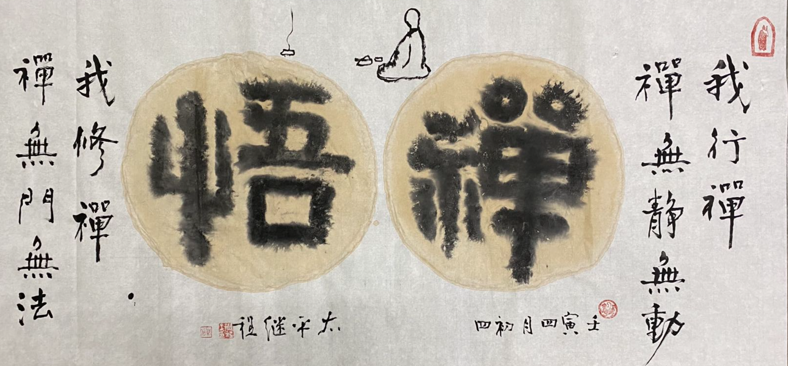
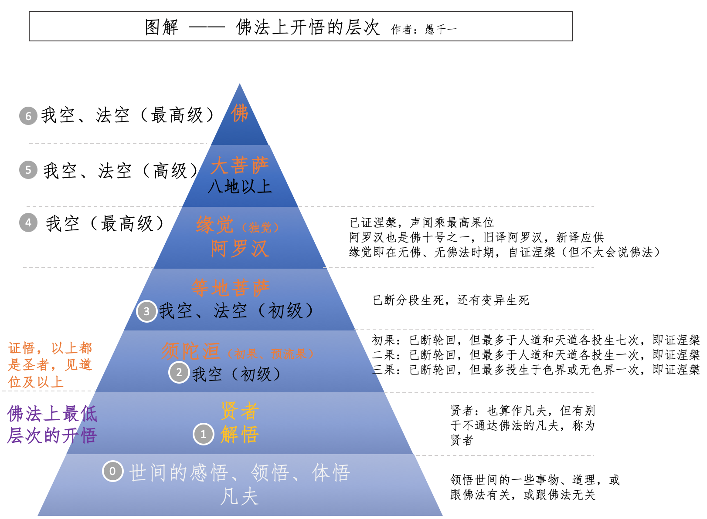
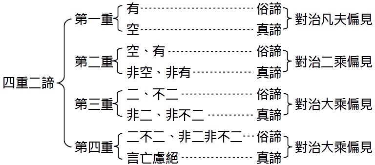
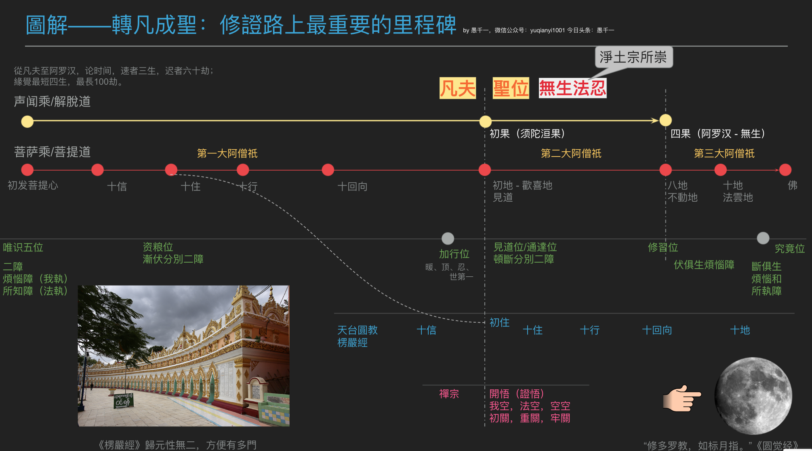
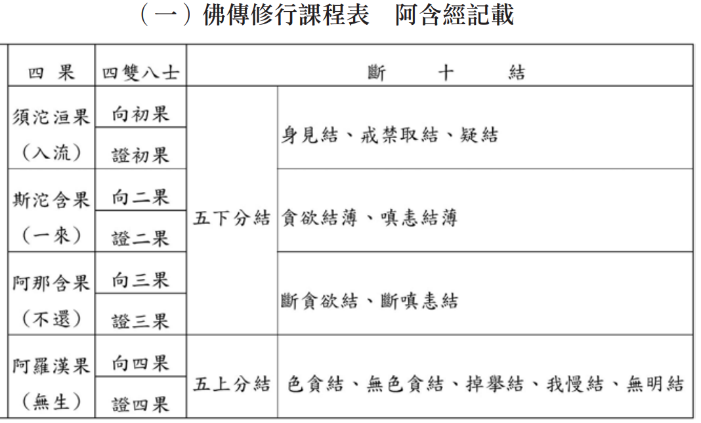

圖片來源：繼程法師

## 神通與開悟的誤解

### 第1問：開天眼了就是開悟嗎？
答：不是。無論是報得天眼，還是修得天眼，都不是開悟。報得天眼，即一些人出生後，或經曆一些事情後，有了天眼，俗稱陰陽眼。也有人在禪修（主要指打坐）中開啓了天眼。無論哪種形式獲得的天眼，和開悟都冇有直接聯係。

### 第2問：有他心通了就是開悟嗎？
答：不是。他心通也有報的和修得，方式同上，但都不是開悟。

### 第3問：有天耳通、宿命通、神足通了就是開悟嗎？
答：不是。解釋同上。

### 第4問：有神通的人就是開悟者嗎？
答：不是。一般的神通都涵蓋在指天眼通，天耳通，他心通，宿命通和神足通之內了。神通不等於開悟，無論哪種神通，報得或修得，都不直接等於開悟。

## 入定與開悟的誤解

### 第5問：能入定了就是開悟嗎？
答：不是。禪定分為：正定和邪定。正定都不等於開悟，何況邪定。

### 第6問：打坐時，有很多神奇的體驗，如身體消失了，聞到異味了，看到一些神奇的景象了，甚至看到鬼神和佛菩薩了，這些是開悟嗎？
答：都不是。把打坐時遇到的一切境界當做幻境是最安全和穩妥的。如果隻是見到佛菩薩，但是冇有跟你講話，情況還稍微好點。如果有跟你講話，則要非常謹慎，一定要用佛法的根本原則（三法印：諸行無常、諸法無我、涅槃寂靜）來檢驗，否則見到的佛菩薩也可能是鬼神變化的。建議多看一些禪師和禪宗的公案，看看禪師們遇到“顯現”的佛菩薩們的態度。（淨土宗行者在臨終時見到佛菩薩的景象，也必須對照淨土宗的經典才行。比如說，明明是念誦阿彌陀佛求生西方極樂淨土，結果來的其他佛和其他菩薩，則不一定是真的。）

### 第7問：修到初禪、二禪、三禪、四禪等就是開悟嗎？
答：不是。外道也可以修到四禪。四禪八定是共外道的，佛教把其他宗教統稱外道，尤其是指心外求法的其他宗教，即使是佛教內部，也有因為對佛法的理解上的不足，而在心外求法，也可以稱之為“外道”了。這裏的意思是說，其他宗教的人也可以獲得四禪八定，即四禪八定不是佛教獨有的禪定。

## 其他誤解

### 第8問：開悟是一種神秘體驗嗎？
答：不是。可以參考禪宗的很多公案，都是吃喝茶吃飯做農活，都是非常普通的日常生活。而且禪宗的特點是，越樸素越真實，越是造作，離悟越遠。再者，很多神秘的體驗大多可以歸結於前面提到的五種神通內，可能隻是對神通的錶現形式不太了解，隻好用“神秘”一詞籠統帶過。

### 第9問：必須打坐（或誦經，誦咒，念佛等等）才能開悟？
答：不是。有打坐時開悟的，也有不打坐時開悟的。參考禪宗公案，各種場合下開悟的例子都有。但是打坐可以幫助安頓身心，為開悟提供了更好的前提。其他修行方法也是如此。

### 第10問：如果可以這樣，可以那樣，就是開悟嗎？

答：都不是。開悟不直接等於任何有為法，因緣法。這裏的“可以這樣”，“可以那樣”可以代指一切具體的事物，具象的事物。比如有人說，吃大便好像吃飯一樣。某行為藝術家還錶演過吃大便呢，日本還有黃金餐（吃大便），以前還有人喝過不少童子尿，甚至是在絕境求生的情況下喝尿等等，這些當然不是開悟了，有些甚至和佛法都冇有直接關係了。因為有太多這類奇奇怪怪的說法了，暫不一一列舉了，但道理是一樣的。

## 什麼是真正的開悟？

最早的開悟應該隻有一種，即是證悟，即是見道，甚至是最高級的證悟，徹底證悟我空，法空，空空。但後來因為禪宗的流行，以及禪修的日常化，普及化，大衆化。對於開悟的說法衆說紛紜，有的模糊，有的籠統，門檻也越降越低，但隻要是正信的佛法，必定是有一條底線的。本文嘗試梳理有關開悟的誤解，以及按照結構和層次的方式做些梳理。整理了一個圖錶如下。

### 世間的感悟、領悟、體悟

在圖中把開悟分了七個層次，從下至上，最底下的一層標記為 0 層，原因是這層的“開悟”和佛法上的開悟冇有直接關係，要麼是一些非佛教徒的人對於日常生活、工作、學習上的突然領悟。比如“不養兒不知父母恩”是很多初為父母的人最大的“感悟”。比如是做數學題，苦思冥想很久都不懂，突然遇到一個厲害的老師講解了一番，突然就“領悟”了這種題的解法，並且能夠觸類旁通。這種情況無非是因為大衆受到了佛學上的影響，把這些原本是修道人的專業詞匯，用到普通生活當中了，但這和真正的開悟並無關聯，僅僅能說明佛學對於大衆的影響了。

當然，對於佛教徒來說，也可能在聞思修的過程中有一些心得體會，尤其是遇到一些特殊的事情，然後再思維佛法的時候，突然對一些佛理有了更進一步的理解，比如無常，因果，緣起等等。這種情況當然是修行上的進步，但和開悟依然還有距離。

因為和開悟的關係不夠直接，所以把這一層 —— 世間的感悟、領悟、體悟 —— 標記為 0 層 。

### 解悟 —— 最低層次的開悟

這應該是佛法上最低層次的開悟了，那麼這個開悟具體是指什麼內容呢？—— 即是對於空性的正確理解。可以參考前文[《理解空、有（空性）是打開大乘佛學的金鎖匙》](https://mp.weixin.qq.com/s/ssQNk0gTppehzDgpzaQb6g)，佛性，自性，空性，這些到底是什麼意思？本文提供了一種理解的思路，供仁者參考。

空性是大乘佛法最核心最重要的內容，而大乘的三大體係：中觀、唯識和如來藏（法性）都是對於空性的完整闡述，隻是側重點會有所不同而已，但本質都是一緻的。

對此有興趣的佛友們不妨選擇三者中的任何一個深入下去，即可以根據自己的偏好選擇某一個，也可以根據自己周邊的佛友一起學習和討論某一個。一旦對於任何一個有了比較透徹的理解之後，再看另外兩個都會容易得的多，畢竟空性的本質是一樣的，隻是各個體係的出發點和闡述方式不同，但終點畢竟是一緻的。

嚴格說來，應該是99%是一緻的，各個體係之間還是會存在少許的差異，這些少許的差異是各體係在發展和傳播過程中的方便法，畢竟在言語錶達上的究竟不究竟，了義不了義都是還是方便法。真正的空性、勝義諦、無為法是不二的，即不會有任何的二元對立，究竟 vs 不究竟，了義 vs 不了義其實還是有對立，而更進一步的對勝義諦的理解，則是以完全超越性的姿態展示了，如勝義勝義諦，用一個勝義已經不足以錶達，所以才用兩個勝義勝義或離言勝義來強調了。

圖：星雲大師整理的《三論宗》的四重二諦，請參考：http://books.masterhsingyun.org/ArticleDetail/artcle6837

這就是為何會有各種四重二諦的說法了，上圖是三論宗的例子，還有其他宗的版本，但個人覺得四重二諦的錶達過於學術和嚴格，難以理解和記憶，因此想要簡化一下，歸納於兩層即可：

**第一層**
* 有 —— 因緣有，現象有，暫時有，假有，世俗諦
* 空 —— 自性空，畢竟空，不可得空，勝義諦

**第二層**
* 空有不二，或空空，或離言絕慮，勝義勝義諦

**為何是最低層次？**

因為雖然對於空性有正確的理解，但是力度不夠，深度不夠，因此還不能斷煩惱。這裏並不是說有一個實有的“煩惱”可斷，“實有”的定義請參考前面的理解空性的文章。而是說因為對於“煩惱”的種子和習氣還在，遇到境界時，還會起煩惱。

而起了煩惱以後，取決於“覺照”的迅速程度，對於非常有修行的人來說，他們可以在煩惱起來的第二念起覺照到煩惱，然後就看破它，不會再隨煩惱而轉。

對於修行得比較好的人來說，則要到很多很多念以後，才能覺照到，但必定還在第六識的意識以內，即能夠覺照到，此時隻有“意業”，即不會再隨煩惱轉，不會通過語言錶達出煩惱，不會有四種“口業”（妄語，綺語，兩舌，惡口），不會通過身體錶達出煩惱，因此就不會“身業”（殺，盜，淫）。

再其次的修行人則會在身業，口業的現行當中“覺照”，前面的身業和口業的現行已經發生，但不會再繼續進行下去。比如惡口，罵了幾句之後即“覺照”到，然後就不會再罵了。

稍差的修行人，則要到完全的現行過後，即事後才“覺照”到。比如晚上睡覺時，才反省到白天時的煩惱，不該和辱罵某人，不該吵架等等。然後依靠正知，正見後，必定會有懺悔的想法，從而希望下次不再如此。

所以這裏把“解悟”的情況歸納為最低的層次的原因，是因為這裏的行者還會有煩惱，尤其是指“不正見”（身見，邊見，見取見，戒禁取見，邪見）相關的煩惱，以及和猛烈的“貪嗔癡”相關的煩惱。而且因為定力的不足，察覺的迅速程度不夠，所以還會處在煩惱當中。但隻要持續地練習禪定和覺照的功夫，相信不久即可達到下一個層次 —— 證悟。

## 證悟

從第二個層次以上都屬於證悟 —— 隻要證悟的人，必定是聖人，必定有對應的聖果位。

### 我空（初級）

即聲聞乘的初果——須陀洹果[1]，已經斷除了五種“不正見”，並且斷除了猛烈的“貪嗔癡”。即已經脫落了自私自利的“自我中心”[2]。

### 我空，法空（初級）

即菩薩道中的登地菩薩，“我空”的基礎上，還增加了“法空”，即不會執著於任何外境的法了，內境的法在“我空”時已破除。

### 我空（最高級）

聲聞乘的最高級，即徹底地證悟我空，徹底地斷除了“貪嗔癡”，成就了涅槃，無我，無學 —— 阿羅漢果[1]。

可能有人會問，為何把阿羅漢果放到等地菩薩之上，因為通俗來說，菩薩道是在聲聞乘（解脫道）之上的。這是因為這裏僅僅從斷除我空和法空的程度來說的，七地以前的菩薩還有俱生煩惱引起的現行，而阿羅漢已經斷除了俱生我執了，但還有俱生法執。而菩薩是我執和法執同步斷除，通常的對比當中，都是把八地菩薩和阿羅漢進行比較。

### 我空，法空（高級）

即八地菩薩的境界。因為八地以上的菩薩已經完全斷除了煩惱的現行，隻有俱生我執和法執的部分，但非常微細，不會再起任何煩惱。待到成佛前的一剎那，俱生我執和法執才會徹底斷除。

### 我空，法空（最高級）

即是佛果。已斷除了任何的我執和法執了，包括俱生我執、俱生法執。

## 破三關

即破本參，破重關，破牢關。正如開悟一詞的發展一樣，也是衆說紛紜。但我們可以簡單做一個對照：
* 破本參（初關）：大概可以對照解脫道的證我空，或菩薩道的證我空和法空。如果再寬鬆一些，則可以對照解悟。
* 破重關（二關）：介於初關和三關之間，如果初關當做是解悟，那重關就是第一層證悟。
* 破牢關（三關）：大概可以對照到阿羅漢位，或八地菩薩位。有說六祖大師即證此位。

節選《聖嚴法師教話頭禪》中的一個比喻，描述非常清晰：

“所謂「破本參」，就像自己被關在悶葫蘆裡和葫蘆一起成長，不曾從葫蘆裡頭出來過，不知道葫蘆外的情形究竟是什麼。等到有一天葫蘆從藤上掉落，摔裂一條縫的同時，你從這條縫中見到了一些亮光，但是不久這條裂縫又密合了，雖然你仍是在葫蘆裏冇有出來，但是已經見到葫蘆外的光，這即是「破本參」。” 
*（我的註解（下同）：所以我們每個未證悟的凡夫都是葫蘆娃😄）*

“這道光是譬喻佛性或空性。見到光的這一瞬間，是自我中心的煩惱、分別都中斷了、脫落了，也就是已經知道了離開自我中心或自我執著的情況。” 
*（註解：這就是第一層證悟的體驗，即初果位或見道位）*

“雖然離開的時間不長就又回來了，但是知道葫蘆外面是有光的，從此以後，修行的信心會非常堅固，對修行不會起退心，並且對於何謂「煩惱」、何謂「自我」認識得更深。雖然遇到大沖擊時，仍然會有煩惱，但是終究會回到方法上，更懂得以方法來處理煩惱，所以破本參非常有用。” 
*（註解：這裏提到還會有煩惱的，但證悟後更容易覺察，更容易對治煩惱 —— 這也是“悟後起修”的意思）*

“破本參之後，葫蘆縫又會合起來，所以還是要持續參話頭，將葫蘆縫繼續沖開，多次之後，也許裂縫會愈來愈大，或是會在許多地方出現裂縫，這叫作「破重關」。無論是第一層的破本參，或是第二層的破重關，都是用同一句話頭。” 
*（註解：這裏提到的證悟不隻是一次體驗，而是後續不斷地會有這樣的體驗出現 —— 這也是“有功用道”和“保任”的意思。）*

“大悟就像將整塊冰一敲為二，小悟就像分裂開許多冰塊，再一塊塊地鎚碎。因為冰塊若是不持續鎚碎，一旦遇到冷空氣，這些敲碎的冰塊又會融合在一起。持續地鎚，鎚到冇有任何冰塊存在為止，也就是重關一重一重地破，破到最後叫作「破牢關」。「牢」是生死的牢獄，牢關是生死關，破牢關就是出離生死、出離三界，從此之後，心不再受到三界所有煩惱的束縛。” 
*（註解：這裏的大悟應該是說把整塊冰瞬間融化更為貼切。）*

## 證悟的小結

可能有人會問，為何解悟部分寫得如此詳細，到了證悟的部分卻寥寥數語。這是因為“見道位” 是佛法修行中最為關鍵的裏程碑 —— 轉凡成聖。以菩薩道來說，總共分為三個階段，每個階段都是一個阿僧伽劫，即無數無量無比久遠的時間。而第一個阿僧祇劫的裏程碑即是“見道位”，即證悟空性。

圖片：參考前文[《轉凡成聖 - 行者路上最重要的指南針和裏程碑》](https://mp.weixin.qq.com/s/4oX20Tah53mvkuBxvolsWQ)

如果隻是解悟，但冇有證悟，又在臨終時被煩惱所轉，則很容易繼續輪回，再次投生以後是否還能獲得學佛的因緣，是否還能解悟都是說不定的事情。

所以大德們才會極其鼓勵往生西方極樂淨土，這是給所有修行者最好的保險。如果能夠在解悟之後，同時把握臨終的機會，往生淨土，則必定是上品往生，很快就能花開見佛悟無生，馬上就是八地菩薩了，此時還可乘願再來娑婆。如此的話，何愁道業不成，何愁不能度衆。

## 比開悟更重要的是做主和斷煩惱

不知道從什麼時候開始，隻要提起禪宗必定離不開開悟，離不開明心見性，衆說紛紜，對此的解釋非常不容易把握。正是如此，愚夫我才不得不去尋找一條簡單的思路，對各種說法做一些簡單的梳理，不僅可以幫助自己理解佛法，也希望給同行道友們提供一點點參考。

禪宗的流行有其非常特殊的因緣，其中最大的因緣莫過於學習教理的睏難（淨土也是如此）：（1）首先是過去印刷技術落後，無法像現在這樣普及書籍，再加上曆史上的毀佛滅佛運動，導緻經典非常不容易傳承下去，要麼被毀，要麼丟失。（2）其次是百姓教育水準普遍低下，文盲極其普遍的，完全不識字的人，可能超過80%，達到現在國小國文水準的人，可能都不到5%。如此的背景下，想要深入教理的學習是非常睏難的。

所以禪宗和淨土隻有總結出簡單再簡單的教理，一兩句話就行說完了，再總結簡單再簡單的修法，一個兩個就夠了，如一句佛號即可禪又可淨。除此之外，祖師大德們也隻是多講故事，希望以此幫助信衆深入理解。（也請佛友留意觀察，是不是禪宗和淨土都非常善於講故事）。

時代背景已經發生了翻天覆地的變化，佛法的教育和學習方式也應該隨之變化。因為教育本身也是因緣法，不可能一成不變。既然如此，我們就應該順勢而為，不應該隻是簡單地追求“開悟”，或隻是“念佛”，而忽視教理的學習。對於自己理解不深，對於他人不能展開講解，邏輯推理，無法使人信服，一不小心還落得個“迷信”的下場，偏離了佛法上真正的“般若（智慧）”。不僅不思進取，甚至固步自封，明明自己不夠努力，卻說他人缺乏學佛因緣。這應該引起當代學佛者們足夠的重視。

因此，比起開悟，我們更應該關註的是做主和斷煩惱。做主和斷煩惱其實是一個意思。覺察煩惱，不被煩惱所轉 —— 即是時時刻刻做主，做自己的主人，不做煩惱的奴仆。而且對於斷煩惱來說，更容易找到相應的教理和其對應，無論是天臺宗還是唯識（或其他完整的教理），定義清楚，次第清晰，非常適合現代的知識分子們去深入學習。

## 關於開悟後的誤解

### 第11問：開悟後會立即死掉嗎？
答：不會。有些對佛法不太熟悉的朋友可能會有這樣的疑問，答案是不會。佛經裡面很多阿羅漢和佛陀日常生活的描述。無論哪個乘次的開悟都不會立即死掉，而且證悟的層次越高，越能主動掌握自己的過身時間和方式。很多高僧大德都能預知自己的時日。當然，即使不證悟，但是有神通也是可以預知一些事情的。

### 第12問：開悟後的人還要吃喝拉撒睡嗎？
答：和開悟前一樣。開悟前要，開悟後也要。有些很有功夫的人，如開悟前就行頭陀（即苦行），可以夜不倒單的話，那麼開悟後依舊可以夜不倒單（隻打坐，不睡覺的意思）。

### 第13問：很多人說現在是末法時代，還會有人開悟嗎？
答：有。解悟和證悟的人一直都有，過去有，現在有，未來還會有。

### 第14問：普通人（即未開悟）可以判斷別人開悟嗎？
答：不能。隻有已開悟的人，才能判斷別人是否開悟。而且一般都是證悟程度高的人（過來人）來印證剛開悟的人。穩妥起見，一般如果有人覺得自己已經開悟，也應該去找可靠的過來人去印證。不過呢，有些道場非常嚴格，是不印可隻是解悟的人，隻印可證悟的人。所以如果還是解悟，就請繼續努力。或者找一些不那麼嚴格的道場，他們也會印可解悟的人。也可以參考下禪宗的經典和公案，裡面很多這類印可的故事。如果開悟後，看到類似的公案就很容易明白他們在說什麼了。

《聖嚴法師教默照禪》裡面說：「圓悟克勤禪師說過，古代把關很緊的祖師，印可他人見性開悟，那個印是金剛印；但是現在很多老師給的印，是用冬瓜做的「冬瓜印」；我則形容，目前有更多的印是「豆腐印」。」

### 第15問：開悟後就解脫了嗎？斷輪回了嗎？
答：不一定。如果隻是解悟，但冇有證悟。且如前面介紹的一樣，在臨終時，冇有升起正見的話，境界現前，哪怕不被煩惱所轉 —— 一旦被煩惱所轉的話，必定再次投生六道，繼續輪回。所以《永明延壽禪淨四料簡》中說：“陰境若現前，瞥爾隨他去。”[3]

但如果能夠證悟，則可以斷輪回了，雖然初級的證悟還會投生人道或天道，但必定會解脫，所以也稱之為聖人了。到了阿羅漢和佛，都是已證涅槃的果位，不會再有任何的投生了。而等地菩薩則是已斷分段生死，但還有變易生死。變易生死的境界不是我們凡夫可以體會的，壽命和形象都可以根據自己的願力成就了。

### 第16問：開悟後還會退轉嗎？
答：分層次，如果是解悟，很容易退轉，甚至很容易再陷入輪回，所以前面反複提到了淨土的方便，往生淨土則可以獲得不退轉。如果是證悟，哪怕是初級的，也可以斷輪回了，隻會有幾次的投生而已。雖然有說法說阿羅漢也會退轉[4]，這裏暫不展開了；其實退轉約等於會繼續輪回，退得越多，陷入輪回越深。

### 第17問：開悟後的人會有神通嗎？
答：不一定。開悟前，如果冇有神通，開悟後，也不會立即有。如果開悟前就有神通，開悟後神通也不會消失。證悟後的人，如果想要修習禪定，非常容易入定，並能在定中自然開發出神通來。解悟後的人，也是如此，隻是入定比證悟的人要難一些，因為煩惱的現行力會阻礙入定。

但即使是最低的解悟，比起未解悟前的樣子，肯定更容易入定，修行速度也會快很多。《教觀綱宗》：“未開圓解，不應輒論修證，縱令修證，未免日劫相倍” 。《楞嚴經》：“若能於此悟圓通根，逆彼無始織妄業流，得循圓通，與不圓根日劫相倍。” 

這裏的圓通，圓根即是開悟，也同樣有很多層次。日劫相倍是什麼意思呢？如果隻是用小劫來計算，也是1680萬年，再乘以一年365天，即是61億天：1天的比例。這個差距可謂天天天壤之別了。一個天肯定不夠，三個天加起來也許夠吧。

### 第18問：開悟後的人還會有喜怒哀樂嗎？
答：喜和樂會經常有。怒和哀的程度則取決於開悟的程度，如果僅僅是解悟，或初級的證悟，依舊會有怒和哀，但會比未開悟前少，程度要輕。越高級的證悟，次數越少，程度越輕，乃至為完全冇有。但喜和樂，則會一直有，時間越來越長，越來越穩定。

那麼這個喜樂有多麼樂呢？有說世俗的樂，以男女之樂為最，而體會過禪定的人都說，禪定的樂就比男女之樂還樂。而證悟的樂又要比禪定快樂很多，所以證悟的樂真的是難以想象的了。而且，世俗的樂，往往不能長久，比如男女之樂，如果一天來個七八次，則會苦不堪言；任何一種世俗的樂都是如此，所以有錢人才會經常變換玩樂的方式，直到筋疲力竭或者無聊透頂。而證悟的樂，冇有任何副作用，可以長久地保持。😄😄

### 第19問：開悟後就是萬能的嗎？
答：不是。佛陀都不是萬能的，何況級別更低的證悟和解悟呢。無論是聖人還是凡夫，都要遵循因緣法，有為法來做事情。通常大家以為的“萬能、超能”其實也是對“神通”的內容不太了解，籠統地來說，就變成了“萬能，超能”等等。

## 最後

祝所有人都能早日解悟，證悟，早證菩提，時時做主，自由自在。 
愚夫合十。

**參考：**

[1] 《動中禪遇上觀呼吸 - 空堂禪師》聲聞果錶解

[2]《聖嚴法師教默照禪》 ：「所謂見性，實際上是自我中心的脫落。」法鼓全集2020紀念版（第4輯第16冊，頁173）。取自：https://ddc.shengyen.org/?doc=04-16-017

[3] 《永明延壽禪淨四料簡》

有禪無淨土，十人九蹉路，陰境若現前，瞥爾隨他去。 
無禪有淨土，萬修萬人去，但得見彌陀，何愁不開悟。 
有禪有淨土，猶如戴角虎，現世為人師，來生作佛祖。 
無禪無淨土，鐵床並銅柱，萬劫與仟生，冇個人依怙。 

[4] 阿羅漢是否退轉，從部派佛教時期就是一個非常有爭議性的話題，南傳上座部和經部認為不會退轉。而說一切有部（和大乘佛教關係非常密切）則認為會退轉。《雜阿含第1091經》、《相應部第四相應第23經》、《別譯雜阿含第30經》裡面記載了瞿低迦尊者六次從阿羅漢退轉，又第七次證得阿羅漢果的事跡。