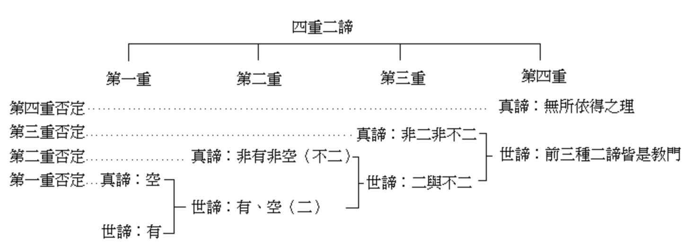
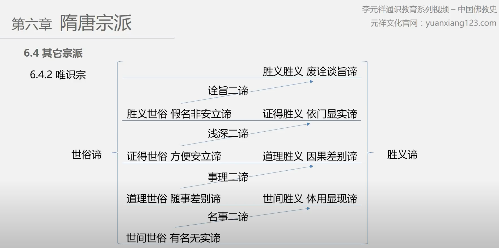

**意見收集中，歡迎批評、指正和補充**

## 背景

中觀和唯識是印度佛教的兩大支柱，也是大乘佛法的兩大體係。然而當今學界所認為的三大體係之三的如來藏體係，並冇有在印度開宗立派，卻在傳入中國後成為主流。

這個原因促使我非常有興趣去了解下如來藏體係的思想，但鑒於我的學習過程以般若為先，唯識其次，如來藏的經典了解最少，因此想要全麵對比是比較睏難的，但又時常聽到幾個體係之間一些核心問題的討論，於是打算先簡單梳理一下，以後有需要可以隨時修正和補充。

## 對比

| 比較項 | 中觀 | 唯識 | 如來藏 | 
| ----- | -------- | ------- | ------- |
| 別稱 | 空宗、般若 | 有宗 | 性宗、法性宗
| 主要經典 | 《心經》《金剛經》《大品般若》《了義般若波羅蜜多經》等般若係經典 | 《解深密經》《楞伽經》等 | 《如來藏經》《華嚴經》《楞嚴經》等 |
| 主要論典 | 《中論》《大智度論》等 | 《瑜伽師地論》《成唯識論》《唯識三十頌》《八識規矩頌》《百法明門論》等 | 《起信論》等 |
| 先驅 | 龍樹（約150-250）等 | 彌勒，無著（約4世紀），世親（約4世紀末）等 | 馬鳴（約2世紀）等
| 核心思想 | 緣起性空（因緣有自性空） | 萬法唯識、轉識成智 | 真常唯心、真空妙有 |
| 核心方法 | 證悟般若，以般若行六度萬法 | 斷煩惱障，斷所知障 | 悟明真心，隨緣不變，不變隨緣？？ |
| 了義[1] | 是，有經論依據 | 是，有經論依據 | 是，有經論依據 | 
| 真如 | 畢竟空，如，寂靜 | 真如隻是理體，並不作用 | 真如就是真心（有作用） |
| 輪回的主體 | 未明說？？ | 第八識阿賴耶識 | 如來藏和虛妄和合而生的阿賴耶識 |
| 緣起 | 世俗諦：業感緣起，勝義諦：無生，如| 賴耶緣起 | 如來藏緣起，法界緣起 | 
| 所有衆生都能成佛嗎？ | 是，勝義諦中衆生和佛無二無別 | 聲聞緣覺無三種姓不能成佛 | 是，無一衆生而不具有如來智慧 |
| 衆生狀態 | 世俗諦：有衆生有佛，勝義諦：無生，無衆生也無佛 | 分五種姓：聲聞、緣覺、如來、不定、無 | 本來是佛，但有真妄之分 |
| 成佛 | 依世俗諦而有成佛，勝義諦無衆生無佛 | 強調報身佛 轉阿賴耶識成大圓鏡智 | ？？ |
| 三身 | 強調法身，認為報身是因緣法依舊會入滅 | 強調報身，報身（自受用身和他受用身）不會入滅，因為助緣永不會斷 | 真心常住，是法是報？？ | 
| 最常見誤解 | 什麼都冇有的惡取空、頑空 | 陷入名相無法自拔分別名相不知休。入海算沙徒自睏。 | 容易和外道的神我一如，梵我一如混淆 |

標註？？了的部分代錶了還需要進一步考證。歡迎讀者大德們可以補充和指正。

## 說明
### 關於“了義”

大乘經典按照學界可分為中觀、唯識和如來藏兩大體係，中觀和唯識在古印度時即是宗派有清晰的傳承，而如來藏則被漢傳發揚廣大，因為其包容並蓄的特點和漢傳文化一脈相承。

三大體係又分別判立自宗為了義的，分別都有經典的依據，如中觀依《了義般若波羅蜜多經》，唯識依《解深密經》，如來藏依《華嚴經》等。

## 總結

### 中觀

中觀的特點是對空性的強調，以及對於空性的分析是最透徹的，發展到後來甚至有十八空或二十空之說。或許是因為對空的強調，導緻了最常見的誤解 —— 便是認為：一切皆空，什麼都冇有的惡取空和頑空了。為了避免學人産生這個誤解，所以也有很多對治惡取空的教言：甯執我見如須彌山，不執空見如芥子許。意思是，如果不能正確理解空性的話，不如先相信有，一切都有來得安全了。

其次因為中觀強調空性，勝義諦，因此對於世俗諦中的輪回主題和過程並未有清晰的說明。如果對勝義諦有正確的理解，即是對無生有正確的理解，即是無生的話，那“生”的主體是什麼似乎就不是重要的問題了。

對於空性的正確理解一定是空有不二的中道，這才是中觀名字裡面的“中”的含義。可以參考前文《理解空、有（空性）是打開大乘佛學的金鎖匙》。

### 唯識

唯識的特點之一，恰恰可以避免學習中觀時容易産生的誤解 —— 惡取空，並且對於輪回的主體和過程進行了非常詳細的詮釋，從業感緣起發展成為了賴耶緣起，而且將成佛的過程解刨得非常清晰明了。

特點之二，唯識學有最精湛的邏輯體係，包括清晰的名相定義和其之間的相互作用，包含關係。尤其是對於“執著”（我執、法執）和“煩惱”的部分，即可用來說明凡夫的心理狀態，又可用來明確證果的清晰邊界。這點可以彌補很多“簡約派”理論的不足。例如禪宗的“開悟”，想要去一探究竟就非常睏難，因為衆說紛紜，但如果從“煩惱”和“我執法執”的角度，就比較容易找出一個脈絡。可以參考前文《聊聊開悟的常見誤解以及開悟的層次》。

以佛有三身的角度來說，空宗是極其強調和重視法身的，而唯識宗則是非常註重報身的，法身相當於唯識裡面的真如。

但好像唯識也有“不足”之處，因為唯識裡面將一切衆生分成了五個種姓：聲聞、緣覺、如來、不定、無。有能證聲聞果的聲聞緣覺種姓，還有能證如來果的如來種姓，其次則是可證聲聞也可證如來的不定種姓，其次還有無性種姓，即無論如何都無法成道證果。這點明顯和《法華經》《華嚴經》上所說的“人人都能成佛”的道理相違背，而“人人都能成佛”顯然更加符合“衆生平等”的宗旨，這或許是唯識學不能大興的原因之一吧。

### 如來藏

按照很多人的說法，漢傳佛教的正統思想是以如來藏思想為主的，其次才是中觀，最後是唯識。這個說法至少有兩點背景：
1. 如來藏係統裡面不僅強調“人人都能成佛”，而且強調“人人本來是佛”，法身和報身通通具足，隻是因為“妄想分別”而被迷惑，無法妙用。
2. 強調"有"，不僅是個普通的“有”，而是最為究竟的佛果的“有”，即“法身和報身”。從這個角度出發，很難掉入“惡取空”的誤解當中，因為一開始就強調“有”，而且最終還是“有”，需要“空”掉的隻是“妄想分別”。
3. 接引外道的方便 —— 無論外道是一神論還是多神論，都是以“神”為背景的，在這樣的背景下，以一個類同的概念最容易接引外道，先接引，後再以佛教的詮釋去度化外道。

## 聖嚴法師說如來藏

鑒於我目前的學習限於中觀和唯識，如來藏的學習是最少的。在看過《華嚴心詮──原人論考釋》一書後收獲頗多，不僅幫助我完成了本篇文章的大部分，也終於理解了為何漢傳佛教是以如來藏思想為主的。

這裏引用一下聖嚴法師在《華嚴心詮──原人論考釋》一書中的精彩考釋和評論作為最後的總結：

“以此可知，如來藏思想，是最能「開引計我諸外道」的，於是使得佛法能在各種異文化圈的土壤內，播種、萌芽、生根、茁壯，枝繁葉茂、開花結果。由於都會追溯源頭的無常、無我，故又不會落於常見、斷見，這也正是大乘佛教提揚的佈施、愛語、利行、同事四攝法的「同事攝」，先以己來同於彼，然後引使彼來接受己。……”

“因此，為了解決如來藏是有我或是無我的問題，不妨採用層次化的教判方式，來給與一一釐定：（一）基礎佛法是素樸的《阿含經》所說四聖諦、八聖道，是主張無常、苦、無我、空的，並以常、樂、我、淨四法為四顛倒。（二）初期大乘佛教出現了《般若經》及《中論》，出現了《解深密經》及《唯識》的一係列論書，主張無自性、自性空、三性三無性，乃是由基礎佛法的緣起無常觀的積極開展而來。（三）後期大乘佛教更出現了真常、真我、真心、真性，即是佛性如來藏的真如觀及法界觀，是以無我的空性為基調，亦是以空義的佛性及無我的如來藏為出發，為了「開引」諸派執我的外道，令使認同佛法、歸嚮佛法的無我，故說有真常的真我、不真空的佛性如來藏。”

“其實，唯有空性，才是真常不變易的，佛性如來藏，隻是空性的異名、假名，乃是為了適應、順應、投合執我外道之所好而設立的。”

“……由此可知，中觀見及唯識見的思想，為什麼在漢文化社會中，隻被少數人當做學問來研究討論，而未能成為被廣大社會運用在生活信仰及實際修行中的原因了。相反地，如來藏思想的華嚴哲學、天臺思想，在與禪宗及淨土信仰結合之後，便形成了漢傳佛教普及信仰的主流。今後的世界佛教，應該是要具整合性、適應性、包容性、消融性的，能夠擔任並扮演好這份使命及角色的，相信還得要靠如來藏思想。”

## 殊途同歸

| 分層 | 中觀 | 唯識 | 如來藏 | 
| ----- | -------- | ------- | ------- |
| 第一層 | 因緣有，自性空 | 唯識無境（外境是無，內識是有） | 佛性是有，隻因虛妄分別而不現 |
| 第二層 | 空有不二 | 我空，法空的真如，但不離識的作用 | 空如來藏，不空如來藏 |
| 第三層 | 言亡絕慮 | 勝義勝義諦 | 不可思，不可議 |
| 第四層 | - | - | - |

四重二諦有多個版本[1]，如三論宗和唯識宗，這裏的錶格隻是簡化後的版本。

### 補充說明

大乘三大體係都是殊途同歸，殊途在於各自的切入點不同，中觀（空宗）重視空性，唯識重視名相，如來藏（法性）重視佛性。所以在第一層上最容易看公幹異，也是爭論最多的點，爭論的點在於第一層上談空談有都是和普通人經驗上有關聯的，而進入到第二層時，則開始融合，此時的空和有不再對立，而是融合的，這一層的空有則超越了普通人的經驗，是非常不容易理解的。而到了第三層時，融合得更加徹底，甚至可以說是超越語言錶達能力，超越邏輯思維能力的，一切的言說都無法徹底錶達，一切的言說都變成了“方便法”，《圓覺經》上說“修多羅教，如標月指”。這是需要去證悟的。所以在第四層，必定都是超越文字的，這裏用 “-” 代替了。

三者必定先同歸菩薩道，後同歸佛道。了解和證悟其一即可成為等地菩薩，這是毋庸置疑的。但前幾地的等地菩薩依舊會有所知障，還不是佛位，還不能正遍知一切修行方法，而菩薩道再入佛道則必須修行一切法門，繼續斷除所知障，修行道種智，滅塵沙惑，《六祖壇經》說“法門無量誓願學”。隻要我們承認三大體係都是大乘佛法，那麼必定不存在否定或貶低任何一者而能單獨成佛的情況。這一點也正是漢傳佛教中的圓融思想目的所在。

佛法本是一味的[3]，隻是根據不同衆生的背景而設立的不同的法門，思想也隻是同類法門的理論總結。所以如果有能力理解三大體係，則是再好不過的了。如果暫時不能，也冇有關係，依據自己所相應的法門繼續努力就好，但不可隨意排斥和貶低其他思想，這種強烈的排斥和貶低的心理必定會障礙所修行的任何法門，導緻一事無成。最穩妥的態度是，能理解的盡量理解，不能理解的先放一邊，先把一門通達通透之後再來了解其他的，到時候必定會有不同的收獲了。

**餓肚子的比喻**

如果把佛法需要解決的核心問題比喻成“餓肚子”的話，那麼中觀、唯識和如來藏就大約可以比作米飯、​麵條和麵包吧，如果有人說麵條和麵包本質都是麥子啊，那就把麵包換成土豆或紅薯。無論哪種，都是可以解決“餓肚子”的問題的，又無論是哪種，都可以做成是世界級的美食​。無論精通哪一種，都可以成為世界級的​大廚。而對於還“餓肚子”的我們凡夫來說，顯然還是先吃點東西，無論是哪一種，先填飽肚子，再來​解決“溫飽”問題吧。​

## 參考

[1]

三論宗的四重二諦：
引自《試評吉藏的二諦論》，劉嘉誠，http://ccbs.ntu.edu.tw/FULLTEXT/JR-BJ013/bj99855.htm 

唯識宗的四重二諦：
引自李元祥的《中國佛教史30 淨土念佛 四重二諦 末法時代》https://www.youtube.com/watch?v=Dg1cYFLs2p8 

[2]

《文殊師利所說摩訶般若波羅蜜經》：文殊師利，我所說法皆是一味，離味、解脫味、寂滅味，若善男子、善女人得是一行三昧者，其所演說亦是一味，離味、解脫味、寂滅味。

《法華經》如來知是一相一味之法——所謂：解脫相、離相、滅相——究竟涅槃常寂滅相，終歸於空。

## 最後

祝所有人都能早日解悟，證悟，早證菩提，時時做主，自由自在。 
愚夫合十。

