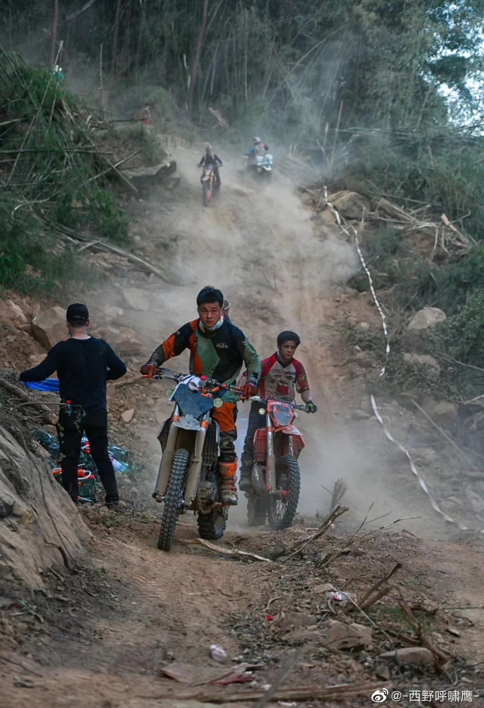
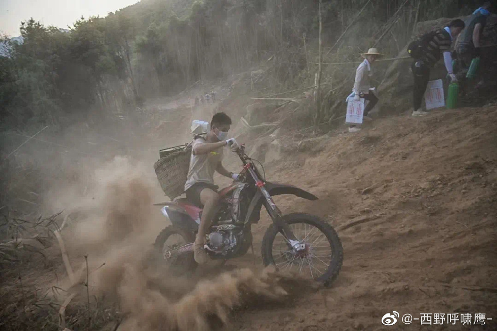

网上一直有为什么国外人少的调侃，大意是说，因为国外有很多人从事危险系数很高的运动，比如跳伞，滑翔、跑酷、无保护徒手攀岩、人体翼装飞行、洞穴探险等等。这类运动大多危险系数很高，很多普通人甚至连试一试都不敢，却有人以此为兴趣，以此为职业。这些运动都有一个共同的特点 —— 风险系数极高，随时都可能丧命 —— 每年都有因此丧命的人，从事这类运动的人并非不知道，而是愿意接受这个风险，承担这类后果。

佛法上经常讲，人身难得，佛法难闻 —— 意思是要大家珍惜生命，热爱生命，保护生命，不应该浪费生命，去从事很多无意义的事。作为一个学佛多年的人来说，自然而然地接受了这样的观点，这几乎也是现代社会对生命的共识。正因为此，所以我对极限运动的看法，基本上和浪费生命划上了等号。极限运动 = 浪费生命，这样的观点可能也不只是我一个人才有吧，多数的普通人对于极限运动也是持批评态度的，就算有些人觉得”无所谓“，但是当有自己的亲人 —— 兄弟姐妹，子女去从事该类运动时，真正的态度才会表露出来。

就我个人而言，虽然会坚持自己的观点，但也总会保持一定程度上开放 —— 偶尔也会愿意去听去看下不一样的观点和背后的故事。而最近就有几件这样的事情，正在慢慢地改变我的观点，把极限运动等同于浪费生命，逐渐变成了 —— 原来极限运动也能行菩萨道。

## 故事1 —— 重庆山火

重庆北碚山火[1]发生后，因为重庆山区特殊的地理环境，没有公路到达现场，山路也无法驾车，因为山路大多狭小曲折，汽车无法通行。这样的山路反而最适合摩托车，尤其是越野摩托车。在了解到救火的困难后，各地的摩托车友迅速响应，奔走在救火的第一线，帮助运送物资。而越野摩托车更胜一筹，毕竟其性能更好，灵活性更强，更加稳定，再加上摩托车友的车技，其作用更加突出。 #这些娃儿侠肝义胆# 这一话题更在微博成为热搜。

就连摩托车友们也调侃，平时越野总是被警察追查，没想到还能在关键时候挺身而出成为救火的英雄。由此可见，越野摩托也并未一无是处，在关键的时候也可以保家护国，令人民生命和财产免于被大火吞噬。我们能说这些勇敢的摩托车友们不是在行菩萨道吗？

图片来源见水印和https://weibo.com/5517771876/M2IOIetKa?refer_flag=1001030103_

## 故事2 —— 泰国睡美人洞救援行动

2018年6月23日，少年足球队“野猪队”和教练进入到睡美人洞里面游玩，结果因为暴雨水量过大而灌进洞里面了，将洞穴低洼的部分被水淹没，而洞穴里面非常之长，且在洞穴的末端连通了河流，野猪队被堵在了里面，他们找到一处较高的，没有被水淹没的位置等待救援。睡美人洞穴全长10多公里，为泰国第四长的洞穴，全世界最难导航的洞穴之一，因拥有崎岖、狭窄的通道，至今仍无人能走完全程。
受困地点距离洞穴有4公里之多，且2.5公里需潜水或游泳，专业潜水员单趟都必须花上6小时，何况是少年们。

虽然在受困的第9天，英籍洞穴救援人员瑞克找到了野猪队，并且证实了他们共十三人全部幸存。然后却始终想不到一个可行的、安全的救援方案。最后瑞克为主的外籍人员想到了一个可行的，但是风险极高的方案 —— 为了让被救者在潜水过程中保持镇静，居然给他们打麻药，让他们在全身麻醉的情况下，由专业潜水人员带出来 —— 潜水人员在救援的过程中，既要在浑浊的雨水中保持方向，又要照顾被救者 —— 因为被麻醉的风险，且是史无前例的方案 —— 救援者也无法保证带出去的人是死是活。一位外交官员提醒道，如果方案失败，这些救援者甚至有可能被严苛的泰国法律制裁，有坐牢的风险。

即便如此，这也是唯一的可行的方案。外籍救援者不顾个人安危，不计个人后果，只是不忍让少年们在洞穴里面活活等死，因为氧气含量越来越低，再等下去的话，所有人都会因为缺氧而死。

最终的结果是幸运的，受困的少年足球队和教练共十三人全部获救。参与救援的总人数有数千人之多，参与救援的国家也有数十个之多（包括中国），其中扮演了关键角色的还是几位洞穴探险者 —— 他们不仅在第一时间发现了受困者，还在最后制定出了唯一可行的方案，并实施了救援。

洞穴探险，洞穴潜水 —— 两项都是非常危险的极限运动。这几位探险者在介绍自己为何会喜好这项运动中，无一例外地提到了他们的不擅长团队合作，不喜欢喧嚣，内敛，自卑，反而在洞穴这样特殊的环境里面，可以让自己安定下来并沉浸其中。从描述上来说，有感觉他们把洞穴当成一个世外桃源，一个可以用来暂时逃避“现实”的地方。

但确实这样一群人，在这次的救援中扮演了关键角色，在几千人中，在各种官方机构都束手无策的情况下，排除万难救出了十三名受困者。我们能说这样的洞穴探险，洞穴潜水爱好者们不是在行菩萨道吗？

## 三百六十行，行行有菩萨

从广义的菩萨道来说，一切舍己救人的行为都是菩萨道。无论他们是否有信仰，无论信仰什么宗教。菩萨行者们总是在关键的时候挺身而出，不计个人得失救苦救难，我们能说这样的人不是在行菩萨道吗？这些人不是菩萨吗？ 虽然他们从事的运动风险极高，不被大多数人了解和理解，但是如果没有他们，也就没有了上面种种的救苦救难的事迹了。俗话说，三百六十行，行行有状元。从菩萨道来说，我们也可以说 —— 三百六十行，行行有菩萨。

最后补充一点，这里并无鼓励大家去从事极限运动的意思，毕竟珍爱生命，不做无谓的牺牲是现代社会对生命的共识。但现代社会也是极具包容性的。因为无论其风险有多高，终究还是会有人选择这类的兴趣爱好，选择这种危险的职业 —— 对于后者，我们不妨多多包容，多多疏导，多做保护，毕竟这类运动的专业度也极高，风险控制也一直在进步，也能成就和鼓励很多人，最终造福于全人类、全社会。

祝所有人都平安自在。 
愚夫合十。

参考： 
[1] “灾害面前，不当一个旁观者”——重庆山火救援现场的志愿者力量 http://www.news.cn/2022-08/25/c_1128947348.htm  
[2] 睡美人洞救援行动 https://zh.m.wikipedia.org/zh-cn/%E7%9D%A1%E7%BE%8E%E4%BA%BA%E6%B4%9E%E6%95%91%E6%8F%B4%E8%A1%8C%E5%8B%95 

