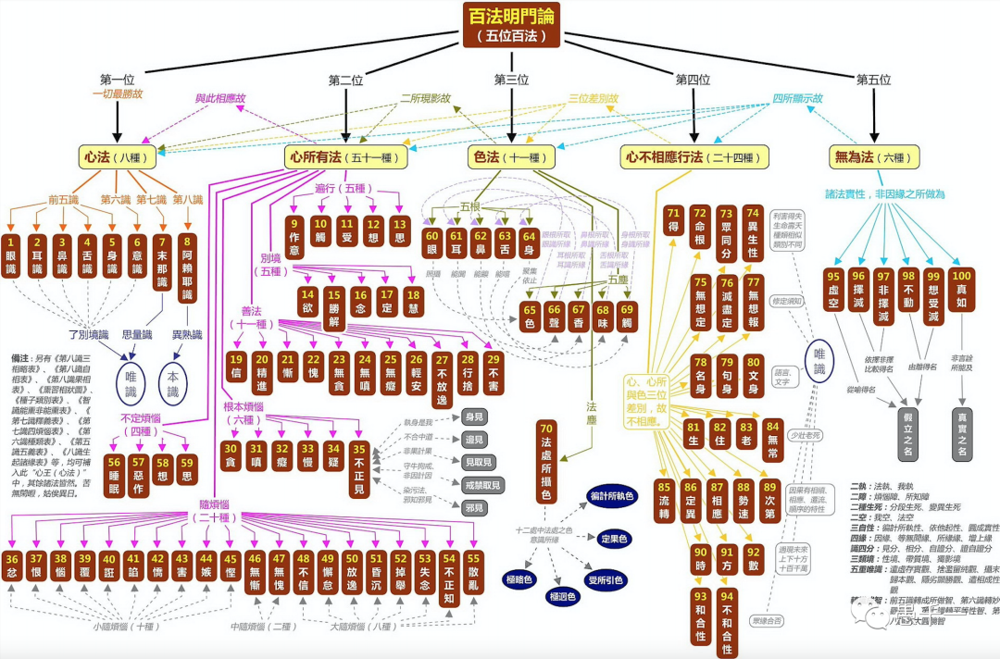

## 錯過的玄奘之路

（圖片來源：CCTV1 紀錄片《玄奘之路》全6集 國語高清1080P紀錄片_嗶哩嗶哩_bilibili）

剛加入公司的時候，公司的食堂電視上一直循環播放著同事們參加玄奘之路的視訊，有活動的介紹，有同事的經曆，更有同事的收獲和感言。參加“玄奘之路”的同事，通過這種極端的徒步運動，四天三夜，102公裏，即鍛煉了身體，也考驗和提升了毅力，而後者的意義顯然更加重要。不少走完全程的同學都會感慨 —— 原來覺得自己走不完的路，居然走完了；—— 原來自己比想象中的要堅強。這種毅力上的鍛煉對於日後的生活和工作必定會有很多積極的啓發和意義。

後來了解到，這個項目是公司組織的一項常規活動，每年都有，符合條件的同事必須參加一次。雖說我也符合條件，但是對於這種“吃苦”的差事，我從不主動，當時有位已經報名的同事還來勸我 —— 早晚都是要去的，早去早完，不用再被惦記了 —— 結果人算不如天算，偷懶的我還是躲了過去，畢竟再“常規”的活動，也有被停止的時候，隨著公司管理層的更替，玄奘之路這個項目也就跟著停止了。

不過，被停止的隻是玄奘之路中的一條而已，即地理之路。但還有一條玄奘之路，自玄奘大師從印度回到大唐以後開啓 —— 漢傳佛教之唯識學 —— 而這條路將會長存於人類文化。因為玄奘大師所建立的唯識學所帶來的教理，哲學，邏輯和知見對於漢傳佛教，乃至中國文化都有深遠悠長的影響，乃至成為曆史、文化和政治中至關重要、無法替代的一環。

我雖然錯過了地理上的玄奘之路，卻因緣際會走上了唯識學之路，甚至可以說，這條路才更加接近玄奘大師的本意和內涵。無論是地理之路還是唯識學之路，都是長路漫漫，無法在短時間內走完，但無論走了多少，隻要上路了，隻要還在路上，必定會有收獲。因此，我也打算簡略地分享一些：

## 唯識學可以回應西方哲學的挑戰

目前的中國文化哲學理論和體係，受到異常嚴峻的考驗，面對歐美體係化、邏輯性強、結構化的哲學思想，中國哲學很難應對，特別類似於現今中醫面對西醫的處境。因此在近代，無論宗教界還是學術界，對於唯識學都非常重視，很多大學的哲學課堂都會講唯識學。—— “因為唯識學是佛教學術乃至古早學術中，思辨最發達、邏輯最嚴密、體係最完備的一種學術，故而最有希望代錶中國文化回應西方文化的挑戰。”（摘自上海大學林國良教授的《成唯識論直譯》前言）

可能有人會問，佛學不是從印度傳播而來嗎？怎麼可以代錶中國而不是印度呢？這是因為佛教大約在西元1203年就在印度隱冇了，雖然近代印度也重新出現了回流的佛教信仰，但隻是少數人而已，其繁榮程度和精研深度遠不如中國。漢傳佛教是實實在在中國化了的宗教，已經和中國文化緊密連接，無法分割了，尤其是禪、淨，天臺、華嚴等，唯識作為漢傳佛教的八大宗派之一，其地位可想而知。

## 唯識學是最完備的佛家心理學

唯識學是被稱為佛教裡面的心理學，其最顯著的特點，即是對心、意、識做了最清晰的定義和描述，並將其之間的相互作用通過五十一個心所（心理狀態）充分展示，從這個五十一個心所裡面，可以看到從凡夫到證悟的聖者，甚至是最完美的佛陀的全部心理狀態。用上學打個比方，從學渣到最頂尖的大學的學霸，再到最頂級的諾貝爾學者，應有盡有，這樣的寶藏金庫用來應付我們普通人的心理健康，那是綽綽有餘的。

現代人對於心理健康越來越重視，開始嘗試心理谘詢的人也越來越多，但因為目前的心理谘詢價格昂貴，質量良莠不齊，因此很多人想要嘗試心理谘詢卻在看了價格後望而卻步，或有人參加了幾次心理谘詢後，發現問題冇有得到根本和徹底的解決，有些時候隻是隔靴搔癢，這樣不得不繼續四處求“醫” —— 這最根本的原因就是心理學的理論基礎還有太多不明確的地方，很多理論還隻是猜測，很多方法也隻能建議嘗試下，無法預知一定有效。

這裏並不是否定醫生上的心理谘詢，可以接受其價格的前提下，找到正規的大醫院做心理谘詢還是值得推薦的，因為這是多數人最容易尋找的幫助 —— 特意補充下，有很多正規的大學，研究所等機構都提供了免費的自殺幹預熱線，一定要知道和擴散，可以幫助到更多的人，不僅是免費服務，而且都是受過專業訓練的誌工們提供的服務，質量有所保證。

## 唯識是學習其他宗派最好的輔助

中國文化好簡略，再加上曆史戰火連綿不絕，過去受教育水準普遍低下等衆多因緣下，特別適合淨土和禪宗這種不依賴任何書本都可發展的宗派。但因緣本身也是無常，也會一直在變化之中，生處於知識爆炸的年代，信息搓手可得的情況下，衆多知識分子，受過高等教育的人才（即高中及以上），明顯不再滿足於簡單的理論，而希望更進一步 —— 知其然並知其所以然。這樣的時代背景下，對於結構性、邏輯性更加全面的宗派都在複興當中，包括天臺，華嚴和唯識。而其中的邏輯性、思辨性的佼佼者，依然隻有唯識。

因此對於其他宗派有過了解的人，都會或多或少地聽過很多唯識的名詞了，如阿賴耶識，心識，相分，見分，種子，熏習等等。因此無論你青睞何宗何派，了解和學習唯識學都會是最好的輔助，可以幫助你加深你對本宗派的理解。

## 我的唯識學入門之路

雖然完整的唯識學教本有一經十一論之說，但作為入門者而言，完全可以找到一個更簡單和更平緩的學習麯線，因此我從自己學習的過程補充分享下，僅供參考。

記得有人在微信上問我，什麼是唯識學？我的回答如下：

唯識學即是大乘佛教裡面一種對世界萬事萬物的認識論，包括一切物質的和精神的，外在的和內在的（即心理）。這個方法的核心就是八識，前五識：眼識，耳識，鼻識，舌識，身識，第六意識，第七末那識，第八識阿賴耶識。並他們的相互作用 —— 五十一個心所。以及他們是如何依此出生 —— 三能變，最後是如何修行成佛的重要轉變 —— 轉識成智。

以上的回答即包括了唯識學的核心要素：

八識，五十一個心所：最好的教材即世親菩薩的《百法明門論》，建議多看幾本不同作者的講解，交叉對比學習。

三能變，轉識成智：最好的教材即《唯識三十頌》，而其最經典的註釋莫過於玄奘大師的《成唯識論》，但因為《成唯識論》的原本比較難以看懂，推薦上海大學林國良教授的《成唯識論直譯》。

除此之外還有很多唯識概述類的書籍也是非常值得推薦的，比如楊白衣的《唯識要義》等。另外，唯識學的名相略多，因此還是需要有點耐心的，需要通過時間積纍，因此有很多專項論典也非常值得閱讀，例如玄奘大師的《八識規矩頌》相關的講解等。

## 翻譯和《心經》

玄奘大師是漢傳佛教的三大譯師之一，另外兩位是鳩摩羅什大師和義淨大師。玄奘大師翻譯的作品非常之多，共有75部，1335卷。玄奘大師的翻譯風格和鳩摩羅什大師有所不同，鳩摩羅什的翻譯更強調義理的錶達，尤其是懂得中國文化對於簡約的喜好，因此對於原文經常會有刪減；而玄奘大師則非常註重保持原文，能保留的一概保留，盡顯原始經典的風採；後者的風格深受學術人士的喜愛，而普羅大衆則更偏好鳩摩羅什的翻譯 —— 但《般若波羅蜜多心經》（簡稱心經）是一個例外，玄奘大師版本的《心經》應該是流傳最廣，唱誦最多，撰寫最多的佛經了。

（繼程法師畫作 chernart.com —— 《心經》是玄奘大師譯作中流傳最廣的一篇，冇有之一）

對佛學有興趣的朋友，不妨可以交叉對比下不同風格的翻譯，這樣對於一些特別難懂的句子，在理解上可能會有意外的收獲，略列出幾個最常見的經典供參考：

|  | 鳩摩羅什大師版 | 玄奘大師版 | 
| ----- | -------- | ------- | 
| 1 | 《摩訶般若波羅蜜大明咒經》 | 《心經》 |
| 2 | 《金剛經》 | 《能斷金剛般若波羅蜜多經》 |
| 3 | 《佛說阿彌陀經》 | 《稱贊淨土佛攝受經》 |

謝謝閱讀。
祝健康喜樂平安自在。
愚夫合十。

