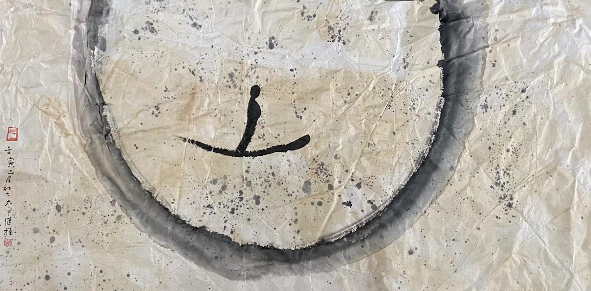

（圖片來源：繼程法師 chernart.com）

公理是一個邏輯學和數學上的概念，經常錶示無需證明即被大家承認的事實和基礎，而定理則不同，定理是可以用其他理論推導出來的，所以公理隻能被記憶，而定理卻經常用來被考試，要求完成其推導過程。

後來公理這個詞的應用範圍便慢慢擴大了，在生活中的使用也變得更多了，其含義也發生了變化 —— 即認為隻要公共群體所共同的理論和認知即可錶示是一個公理了（或也可稱為“常識”、“常理”）。比如在古代，大家認為我們所處的地球是平麵的，這就是那個時候的公理；太陽，月亮，星星等都是圍繞了地球而轉的，這便是著名的地心說，也是公理。甚至某個地區，某個民族都會有自己認可的公理，比如說漢人的認知裡面 —— 孝養父母 —— 便是最重要的公理之一了。

但公理都是正確的嗎？從過去的地心說到日心說，哪個是正確的呢？顯而易見，受過現代教育的人無一不認可日心說了。所以，也可以說日心說是現代的公理了。同樣的事情，大家對它的認知卻發生了變化，這裏變化的條件是因為科學技術的發展，由此可見，公理也不都是正確。

而真理則不同，真理是超越性的，即在任何時候，任何地點都必須成立才行。而佛學上的諸多理論，便具備了這樣的特性，比如因緣法（或叫緣起法），意思是一切事物都需要依賴其他條件才能産生，且必須是兩項以上的條件。由緣起法進一步推導，即可得出空性的理論了。（可以參考前文《理解空、有（空性）是打開大乘佛學的金鎖匙》https://mp.weixin.qq.com/s/ssQNk0gTppehzDgpzaQb6g ）

這樣的理論從2500年前的佛陀說明之後，後麵的一切發展都可以用來驗證這個理論，無論科學發展多麼高端，隻會更加證明這個理論的正確。所以我們找不到一個新事物産生隻有一個原因 —— 如果有，那就是還有未知的地方 —— 所以這裏理論還可以指引科研的不斷探索，不斷地去了解未知的“條件”和“原因”。

雖然我們的生活中離不開各種各樣的“公理”，但顯而易見，“真理”才是更加彌足珍貴的道理。我們應該勇於求知，充分了解這樣的真理，實踐這樣的真理，這樣大概可以說 —— 我們是在追求“真善美”了。

謝謝閱讀。 
愚夫合十。

