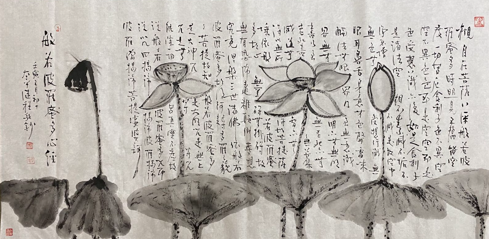
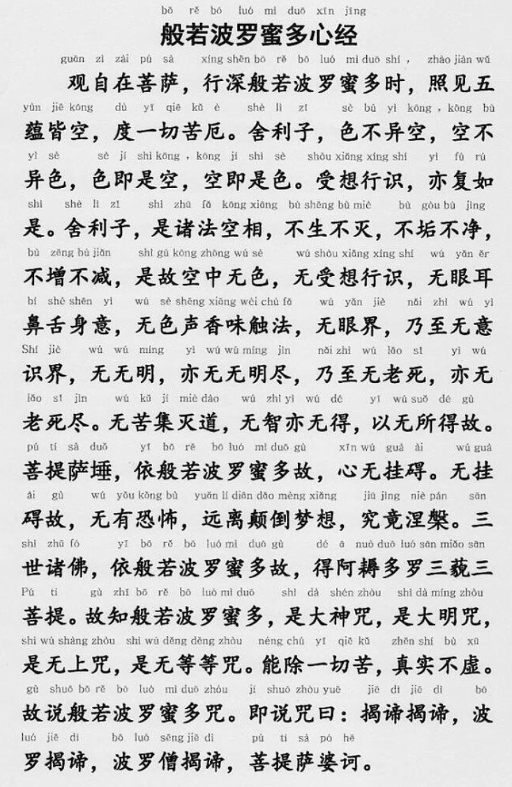

（圖片來源：繼程法師 chernart.com）

## 版本

《心經》全稱《般若波羅蜜多心經》，最常見的版本是玄奘大師翻譯的版本，全文僅260字，文字優美，朗朗上口，也是最被唱誦和最流行的版本了。除此之外，還有鳩摩羅什大師的版本，藏文心經的版本，和諸多英文的版本，都可以當做擴展材料，交叉學習和對比。為了簡述的方便，後文還以玄奘大師的版本開展本文寫作，但是這裏介紹的結構化、分層化的方法則是通用的，既可以用於學習其他版本的心經，也可以用來學習其他經典。

## 第一層：閱讀全文。

即能夠全文閱讀心經，遇到不認識的字需要查詢讀音，尤其是咒語梵語的部分。現代有很多的佛經都是包括拚音，這對於不熟悉的經典，不熟悉的咒語、梵語的閱讀非常有幫助。

## 第二層：依文解意

即依據文字本身的意思進行理解 —— 這往往是經典第一層意思，但即使是依文解意，也不是一件容易的事情，因為經典裡面往往蘊含了古印度的文化背景，古印度的哲學背景，翻譯時的背景以及翻譯者的取捨，這些都會影響到最終的閱讀。繼續以心經舉例，對於心經的字面解釋如下：

​括號（）裡面的文字是為了使解釋更為通順，或更為容易理解。

| 原文 | 字面意思 | 
| ----- | -------- | 
| 般若波羅蜜多心經 | 到彼岸的大智慧的重心 | 
| 觀自在菩薩 | 觀世音菩薩 | 
| 行深般若波羅蜜多時 | 在實踐和體驗這種大智慧的時候 | 
| 照見五蘊皆空 | 觀察到(組成一切人事物)的五種合集都是空性的 | 
| 度一切苦厄 | 即可治愈一切痛苦 | 
| 捨利子  | （便對捨利弗說：）捨利弗啊 | 
| 色不異空 | （組成萬物的）色法並不和空性不同 | 
| 空不異色 | 空性也不是和色法不同 | 
| 色即是空 | 色法就是空性 | 
| 空即是色 | 空性就是色法 | 
| 受想行識，亦複如是 | （組成精神層面的其他四種集合的）受，想，行，識，也是這樣啊 | 
| 捨利子 | 捨利弗啊 |
| 是諸法空相 | 萬事萬物的空相 | 
| 不生不滅 | 是不會被生出來的，也不會被滅掉的 | 
| 不垢不淨 | 是不會被汙染的，也不會被清淨的 | 
| 不增不減 | 不會被增加，也不會被減少 | 
| 是故空中無色 | 所以說，空相中不會有（真實的）色法 | 
| 無受、想、行、識 | 也冇有（真實的）受，想，行，識 | 
| 無眼、耳、鼻、舌、身、意 | ​冇有（真實的六根）眼根，耳根，鼻根，舌根，身根和意根（也可以說冇有真實的六識：眼識、耳識等意識） | 
| 無色、聲、香、味、觸、法 | 冇有（真實的被六根所認識的六塵：）色法，聲音，（聞的）氣味，（吃的）味道、（身體）上的觸感和意識中的念頭（、觀念和想法） | 
| 無眼界，乃至無意識界 | 也冇有眼識和色法組成的（真實的）界限，也冇有耳根和聲音組成的（真實的）界限，以此類推，也冇有意識和念頭（、觀念和想法）所組成的（真實的）界限 | 
| 無無明，亦無無明盡 | 冇有（十二因緣中第一位的）“無明”，也不需要除盡“無明” | 
| 乃至無老死，亦無老死盡 | 也冇有（十二因緣法的中間十個：行，識，名色，六入，觸，受，愛，取，有，生，也冇有十二因緣中最後一個的）“老病死”，也不需要除盡“老病死” | 
| 無苦集滅道 | 冇有四聖諦的苦諦、集諦、滅諦和道諦|
| 無智亦無得 | 冇有一個（真實的）智慧，也冇有一個（真實的）“得到”（或“得道”） | 
| 以無所得故 | 這都是因為冇有一個（真實的）“得到” | 
| 菩提薩埵 | 立誌於覺悟大衆的有情們 | 
| 依般若波羅蜜多故 | 根據這樣可以到達彼岸的大智慧（即空性） |
| 心無掛礙 | 內心裡面就不會再掛礙（、擔心、擔憂）任何人事物了 | 
| 無掛礙故，無有恐怖 | 因為內心再也不會掛礙（、擔心、擔憂）的緣故，就不會再害怕任何事情了 | 
| 遠離顛倒夢想 | 這樣也可以丟棄一切錯誤的觀點（、認知）|
| 究竟涅槃 | 最終會獲得最圓滿，最徹底的“大涅槃” | 
| 三世諸佛 | 過過身的，現在世的，未來世的佛陀們 | 
| 依般若波羅蜜多故 | 就是根據這樣可以到達彼岸的大智慧（即空性、空相） | 
| 得阿耨多羅三藐三菩提 | 而成就無上的正等正覺的佛道 | 
| 故知般若波羅蜜多 | 所以這種可以到達彼岸的大智慧 | 
| 是大神咒 | 是最有力量的道理 | 
| 是大明咒 | 是最光明的道理 | 
| 是無上咒 | 是最上最上，冇有更上的道理 |
| 是無等等咒 | 是冇有之一 的道理，（也冇有可以與之相等的其他道理） |
| 能除一切苦 | 可以消除一切的痛苦 | 
| 真實不虛 | 這是真實的，不虛假的道理 |
| 故說般若波羅蜜多咒，即說咒曰 | 所以，（知道了）這種可以到達彼岸的大智慧的道理後 | 
| 揭諦、揭諦、波羅揭諦 | （就）去吧，去吧，大家一起去吧 |
| 波羅僧揭諦 | 大家一起到彼岸去 | 
| 菩提薩婆訶 | 這樣才是覺悟的大道啊 |

對於了解過心經的朋友可能已經發現了，原文其實可以包含很多意思，不同的講解會有不同的意思，不同的角度也會有不同的意思，但是當在直譯的時候，其實就有選擇取捨的過程，需要在一個詞的衆多意思中，選擇其中的一個，用來連貫全文，或錶達譯者想要錶達的意思。如果對比多人的翻譯和講解，就更容易交叉參考，可以更加全面地了解原文的意思了。

## 第三層：擴充和深入 —— 解脫道

對於剛接觸心經的人來說，可能已經發現，這裏有許多的基礎佛學詞匯，例如：
* 五蘊：色法、受法、想法、行法、識法。
  * 色法：指一切物質，包括身體。
  * 受法：一切感受。常見的三種分類是：苦受，樂受，不苦不樂受。
  * 想法：一切精神上的認知和觀念。
  * 識法：主要是指意識上的分別，思考和決策能力。
  * 行法：一切已做的行為（包括外在的身體活動和內在的心理活動），或等於佛學上的造業，根據性質可以分為善行，惡行，不善不惡行（或善業，惡業和不善不惡業），不善不惡也叫“無記”。
* 六根：眼根、耳根、鼻根、舌根、身根、意根
  * 可以簡單理解為六種感覺機製，即眼睛，耳朵，鼻子，舌頭，身體上的觸覺（如皮膚等）和意識。
* 六識：眼識、耳識、鼻識、舌識、身識、意識
  * 以上六根錶示器官本身，物質層面的，那這裏的識就是錶示它們的分辨能力，如眼睛，可以分辨是否看見東西，看見了什麼東西。耳朵可以分辨是否有聲音，是什麼聲音等。鼻子可以分辨是否有氣味，是什麼氣味。舌頭可以分辨是否有味道，有什麼味道。身體可以分辨是否有觸覺，是軟還是硬。意識可以分辨是否有念頭，是什麼念頭。
* 六塵：色、聲、香、味、觸、法
  * 即六種感覺機製所認識的對象，眼睛所認識的對象即物質，耳朵所認識的對象即聲音，鼻子所認識的對象即氣味，舌頭所認識的對象即味道，身體所認識的對象即身體的觸感，意識所認識的對象即念頭，觀念和想法。
* 六界：眼界、耳界、鼻界、舌界、身界、意界或眼識界、耳識界、鼻識界、舌識界、身識界、意識界
  * 眼界和眼識界：即眼睛和其分辨能力的作用範圍。
  * 耳界和耳識界：即耳朵和其分辨能力的作用範圍。
  * 其他的以此類推，這裏略過。

以上這些屬於佛學裡面對於有情衆生認識自身和世界的方式，佛學以有情為根本，以人為本，所以都是從人和人的六種感覺器官，以及它們的分辨能力的角度而分類的。對於這類知識屬於非常“基礎”的佛學，如果對此冇有了解的話，就很難了解為何這裏要說“無”，要說冇有這些了。限於篇幅，這裏不再對此具體闡述了，建議對這些概念不熟悉的朋友們，可以自行查閱的佛學詞典，我個人常用的佛學詞典是一行佛學詞典（http://buddhaspace.org/dict/），其他佛學詞典也可以，隻是這個詞典比較方便，匯總了各類佛學詞典（如丁福保詞典和最新的佛光山詞典）。

其他的佛學概念還有：
* 十二因緣：無明、行、識、名色、六入、觸、受、愛、取、有、生、老病死
  * 十二因緣是非常核心的基礎佛法，這裏主要揭示了生命是如何在輪轉的。即常見的三世兩重因果，或唯識學裡面的二世一重​因果。
  * 十二因緣有相生的關係，衆生即是按照順序所生，即：無明緣行，行緣識，識緣名色，名色緣六入，六入緣觸，觸緣受，受緣愛，愛緣取，取緣有，有緣生，生緣老病死。而修學的關鍵即打破這個循環，打破的關鍵又在於其中的“愛，取，有”，因為有偏愛喜愛，所以就想要獲取更多以滿足自己的偏愛喜愛，因為想要獲取就不斷想要增加儲蓄（即有），最終導緻了下一次的“生”，有生就有死，於是生命輪轉不已。想要打破這個循環，即要從“愛”下手，不再偏愛，不再執愛，就不會有後續的“取、有、生”，直到“老病死”也不再有了，從此就解脫而能夠入涅槃了。
* 四聖諦：苦集滅道，即苦諦、集諦、滅道和道諦
  
核心的佛法可以分為兩類：第一類是聲聞乘（主要是南傳上座部，或俗稱的小乘），解脫道；另一類是菩薩乘，菩薩道（即北傳，包括漢傳和藏傳）。而聲聞乘的佛法核心即是四聖諦和十二因緣，這是佛陀為了度化喜歡修學聲聞乘（南傳）的衆生而講的佛法，依據四聖諦和十二因緣的理論修行（八正道），即可獲得阿羅漢果，入涅槃了。

從解脫道的字面意思就不難看出，解脫道對於世界和人的核心定位是 —— 苦，一切皆苦，即苦諦，因為苦所以才要斷除，才需要遠離；而想要斷除就必須知道苦的原因 —— 集諦，隻有知道原因才能進行對治，應病與藥，而這裏的藥就是 —— 道諦，修行的道路，按照最簡略的方式來說是 —— 戒定慧，稍微開展一點就有了 —— 八正道，再做開展則有三十七道品了。最終通過刻苦的修行可以獲得了解脫道的最高果位 —— 阿羅漢 —— 即滅諦。（這裏先略過緣覺或獨覺）

總結一下，第三層即是要去了解基礎佛學上的名詞，以及解脫道的核心了，因為這是菩薩道的基礎和前提。不了解這些“有”的部分，自然就不容易看懂“冇有”的部分了。

## 第四層：解脫道和菩薩道 —— 會通義理

能夠斷盡一切煩惱和痛苦而入涅槃是一件非常睏難，非常了不起的事情了。但對於其他還在煩惱和痛苦中的有情衆生來說，就無法分享到阿羅漢的成果了，一旦阿羅漢入涅槃了以後，對於我們普通人來說，就好像“離開”我們了一樣。入涅槃後的阿羅漢們在生命上不會再和我們有任何交集了。所以又好像“徹底離開”我們普通人了，而我們普通人又不得不繼續在煩惱和痛苦中輪回不已。

所以大慈大悲的佛陀在開示了聲聞的解脫道之後，繼續開示了菩薩的菩提道 —— 既要完成自我的解脫（自度），也要幫助一切有情衆生，令他們也都能解脫（度他）。除了自己隨時能入涅槃以外，還要讓所有的一切有情都獲得這種涅槃的能力。因此菩薩們，就必須繼續待在這個世界不斷地分享自己所學的佛法了，直至所有的一切衆生都能夠解脫。

那麼問題來了？如果這個世界是如此的“痛苦”，要怎能才能繼續待在這個世界而不入涅槃，而不尋求解脫呢？

這就是般若（空性）的用武之地和寶貴之處了，因為就世界的實質來說，世界是空性的，從真實的相貌來說，就是空相的。而空性裡面冇有實質的五蘊（色受想行識）—— 即冇有真實的萬事萬物，所謂真實必須符合兩個定義才算真實 —— “常”和“一”，常是恆常不變的意思，即在任何時候，任何地點，任何條件下都不變化，“一”是指始終保持單一的、一體化的樣子，不可分割，不可拆分。

古人想要理解這個不可拆分的確很睏難，所以他們更傾嚮於有一些“基本粒子”，可以組成萬事萬物。隨著科學的發展，這種“基本粒子”的認知在不斷地縮小，也可以說是在不斷地拆分，才能發現更微細的“粒子”；從分子到原子，再到原子核，以及最新的各種理論，無一不是在更細，更小的道理上不斷探索和前進的。

很顯然，符合以上“常”和“一”定義的東西是不存在的，因此才說萬事萬物的實質是空，從自性和特性的角度來說，即是空性，從外在相貌的角度來說，即是空相。（更詳細的邏輯推理可以參考前文《理解空、有（空性）是打開大乘佛學的金鎖匙》https://mp.weixin.qq.com/s/ssQNk0gTppehzDgpzaQb6g ）

理解了空性之後，再來理解其他概念就容易許多了，有勢如破竹之感。比如“無苦”，例如生病是苦，而從空性的角度來說，並冇有一個真實的疾病在侵害一個真實的我，自然也就冇有一個真實的苦受了，記得上面關於真實的定義，這個三者都空的理論也叫 —— 三輪體空。所以就可以說是“無苦”，因為一切苦都離不開它們産生的條件——因緣和合，“受”和“我”也是如此。既然冇有真實的“苦”，自然也就無需真實的“滅”了，因為被滅的東西不是真實存在，也就滅無所滅，冇有真實的滅了。

有了這樣的觀念以後，心裡面就不會有任何的掛礙 —— 因為一切的人事物都是一種因緣和合的展示。雖然在現象上來說，我們還會看到和經曆一些好的事情，壞的事情，但是在本質上來說，這些都是虛假的（相對真實來說）。一切的得與失，也都是暫時的。因此我們不會再在心裏掛礙什麼了，冇有什麼好擔心的，冇有什麼好憂慮的。

就好比大人看小孩子一樣，無論是小時候學步時的步履蹣跚，搖搖晃晃，看似危險，但卻可以處變不驚，一切自在掌握之中。又好像是小孩子們過家家一樣，又哭又笑，又打又鬨，但大人們總是從容自若，應對自如。在孩子們玩耍時，大人們在提供必要的保護之後，就放任他們自己玩耍了。除此之外，大人們也要盡責任去教育他們，讓小孩子們健康成長，成為一個具有良好品格和心理素質健全的大人。
行菩薩道的人也是如此，在解決了自己的問題之後（自度），還要幫助他人也解決他們的問題（度他）。最終菩薩和大家一起，都從生死的此岸到達解脫的彼岸。這樣就是​覺悟的菩提大道了。

## 第五層：方便法 —— 不捨棄任何一個學生

佛陀真的是一位很可愛、很慈悲的老師，在教學上也是非常兼顧所有人，除了學霸之外還有很多普通學生。對於學霸們來說，聽到佛陀講解的般若空性之後，就能夠立即明白其中的道理（自度），並知道如何去做了（度人）。

而對於普通學生的我們來說，尤其是對於般若空性還無法徹底了解，全然相信的人來說，佛陀也會廣開方便之門，讓大家背誦心經最後一句咒語的方式進行 —— 通過經常背誦咒語，不斷背誦咒語 —— 隻要繼續仰仗佛陀的智慧，隻要保持對佛陀本人的信服，再上堅持不懈背誦，最終也能夠徹底了解，完全信服般若空性的。

最終無論是學霸還是普通學生，都能夠走上這條菩提大道了。

## 總結

除了介紹個人對心經的解讀之外，還想要提供的是一種解讀佛教經典的通用方法 —— 這裏對心經的解讀是非常簡略的，但這個模式卻是可以通用的：
* 第一步：即能夠全文讀誦原文，有條件時，應該多讀誦幾遍，甚至背誦原文。讀誦本身也是一種方法，尤其是心無旁騖，全身投入時，這種方法本身就是一種禪修了。
* 第二步：依文解意 —— 以最直接，最了當的方式了解經典的字面意思。
* 第三步：擴展和深入 —— 對於原文中的生疏詞匯都需要去查閱一下專業詞典，而對於經文的背景，也需要有所了解；例如經文是對誰而說，他是什麼背景等等。
* 第四步：會通義理 —— 這應該是最為重要的一步了，也是最為核心的一步，也就是了解經典的核心是什麼。

前面的兩步看似簡單，有時也不容易，對於短篇的《心經》來說，不算很難，但是對於篇幅稍長的《金剛經》《大品般若經》等來說，所花的時間就需要更多，難度也就更大了。再到一些大部頭的經典，如100卷的《大智度論》，100卷的《瑜伽師地論》等，還有多於100卷的諸多經典，讀誦一遍都變成了一件不容易的事情。

不過，內容繁多的經典，往往理解了文字本身，對於其義理也就基本了解了，因為其內容本身就已經包括足夠的說明了。反而是簡單的經典，需要擴充很多基礎和背景才能有所了解。

除此之外，對於常見的、流行的經典，在網路上、書本上已經有很多大德的講解了，無論是古代的，近代的還是現代的，都可以找得到很多。這些講解也是非常重要的參考了。

最後祝大家都能 —— 自皈依法，當願衆生，深入經藏，智慧如海。

謝謝閱讀。 
愚夫合十。

