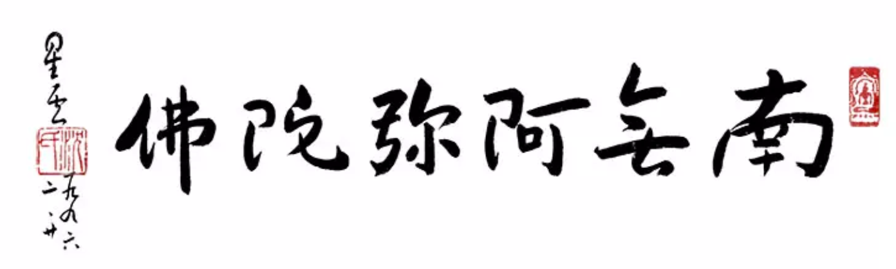
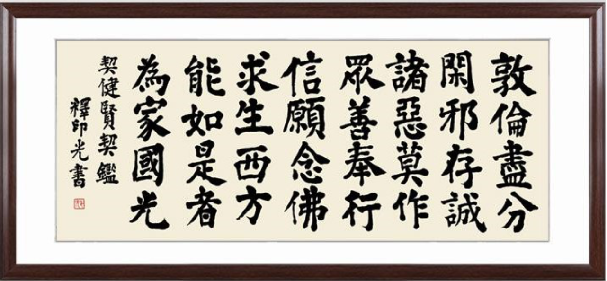

（圖片：星雲大師書法 - 南無阿彌陀佛）

## 為什麼要學淨土？

釋迦牟尼自成佛以來，講了四十九年的佛法，開了無數場法會。所有的這些法會，有適合出家人的，也有適合在家人的，有適合喜歡邏輯思考的人群，也有適合喜歡行動的人群，有適合年輕人的，也有適合老年人的。而淨土法門，就是特別適合老年人的。

為什麼淨土法門特別適合老年人呢？這是根據老年人的各種狀態而綜合考慮的，就拿身體來說，年輕人的身體普遍上肯定要比老年人好的，所以年輕人修學佛法時，就有很多選擇 —— 比如拜佛一萬次，甚至十萬次。但是要求老年人來拜佛一萬次就有點為難老人家了。這部淨土法門也是如此，是佛陀綜合了各種因素之後，特意嚮您一樣的老人家而開示的法門了 —— 雖然隻要是佛經，對於所有人都是有用的，但是這個用途還是有對口不對口的區別的，既然是專門為老人家而開示的法門，那肯定是特別適合嚮您這樣的老人家來學習的了。

您仟萬別以為隻有我這樣說哦，近代高僧印光大師 —— 被稱為淨土宗的第十三代祖師，也是這樣鼓勵大家的。他在回複李覲丹居士的信中說，年過半百的人，需要仰仗佛力，學淨土就可以讓一個凡夫了脫生死了。這是對比其他的修行方法，從凡夫到證悟的聖人，再到完全的了脫生死，需要好久好久的……需要很多輩子很多輩子才行的，而人身難得，佛法難聞，繼續待在輪回裡面的話，那時候別說證悟了，就是連遇到佛法都是不一定的事情了，所以說，我們這輩子遇到了佛法，尤其是遇到這個特殊的淨土法門，一定要學啊。甚至對於很多人來說，學習淨土甚至是仟載難逢，仟劫萬劫中唯一的一次解脫輪回的機會了。不得不慎重啊。

## 西方極樂世界是怎麼回事？

學習淨土就是求生西方極樂世界，這個西方極樂世界的故事，就在釋迦牟尼佛說的《無量壽經》裡面。

故事發生在很久很久以前，當時的世界上也有一位佛陀，他的名字叫做 —— 世自在王佛。那個時候有一個很有智慧、很有誌嚮的國王，出家後，叫做法藏比丘。法藏比丘就請教世自在王佛說，我要努力學佛，我要早日成佛，成佛以後，就可以我的佛國裡面度化無邊無際的衆生了。那麼我的這個佛國該如何創立，如何建設呢？

隨後世自在王佛就用神通把210億個其他佛陀創建的佛國一一展示給法藏比丘看。就好像現在的出國考察，世自在王佛用神通把法藏比丘送去了這210億個佛國去觀光參觀和考察一樣，親自去看看各個不同的佛國是什麼樣子。因為要去210億個佛國參觀考察，所以法藏比丘花了好久好久的時間，佛經上說用了五大劫那麼久才考察完全部的佛國了。

考察完了以後，法藏比丘就開始構思自己成佛時的佛國該是什麼樣子的了？這就好比新建一所現代化的大學，作為學校的校長應該思考該建在哪裏？教學區應該怎麼規劃，生活區又應該怎麼規劃，需要建幾所教學樓？教學樓的外觀應該是什麼樣子？裡面又應該有什麼樣的教學設備？體育場怎麼規劃，宿捨樓怎麼規劃等等……從這裏可以看到，連創建學校都是一個很巨大的專案，更何況要創建一個更宏大的佛國呢，對吧？但是我們可以用學校來打個比方。

法藏比丘構建自己佛國的想法就是《無量壽經》裡面的“四十八大願”了，下面我們就來具體看看法藏比丘的考慮是多麼地周全吧。

**衣食住行**

首先是衣食住行，作為老百姓總是要生活的，生活就離不開衣食住行。法藏比丘當然也考慮到了衣食住行了。“住”和“行”又依賴地理環境。那裏的地理環境非常好，地面非常平坦，想要建多少房子都可以，風景也無限好，有美麗的大樹，有漂亮的水池。房子的建築都是用的最好的材料，甚至用金銀珠寶來建房子、建社區、建景觀。

天氣很舒適，根本不需要冷氣機，因為天氣可以跟隨人的心情變化而變化，想要涼快一點，天氣就變涼快了，想要暖和一點，天氣就變暖和了，心情就是天氣的調節器。

衣服也是隨心所欲，想要有的，不需要織佈、裁剪、染色和清洗。而且可以隨時換，想要什麼樣的衣服就可以變化出什麼樣的衣服來。那個世界冇有灰塵，那裏的人也不會出汗，所以衣服也不會髒，想穿多久就穿多久。

那裏的出行也非常方便，走路非常輕鬆，走多久都不會纍，想要去哪裏就去哪裏。而且不想走路也行，可以飛來飛去，因為往生到那裏的人都會有神通，神通裡面就包括了神足通，會神足通的人就可以飛了。這可比飛機還快，還安全，還便宜呢。因為自己會飛根本就是免費的了。

**左鄰右捨**

能夠往生到那裏來的人，都是像您一樣的學佛之人，都是世間的大賢人，大善人。所以鄰裏關係也非常和睦，絕不會有任何的爭吵，任何的矛盾。大家都非常的謙讓，非常的恭敬，和藹可親。

**最完美的人身**

往生到那裏的人們都是從蓮華裡面化生的，就像電視劇裡面的哪咤也是從蓮華中出生的，而不是從娘胎裡面出生的。這種化生出來的身體可就太完美了，首先就是不會生病，不會變老，隻有少年和青壯年的樣子，永遠健康。其次就是這個化生的身體還非常有本領，非常有能力，不像我們的血肉之軀，不僅很容易生病，能力還非常有限。

這個化生的身體都有什麼本領呢？那就是擁有五種神通：天眼通，天耳通，他心通，宿命通和神足通。每一種神通都非常有用，但是限於文章的篇幅，這裏隻是大概說一說：

* 天眼通和天耳通：看過《西遊記》的人都可能了解過這兩個神通了，這兩個神通的意思是，無論相隔多遠，無論中間有多少障礙，有了這兩個神通之後，都可以看到，都可以聽到。就跟我們地球上可以視訊通話一樣，無論在哪裏，隻要有電話和網路，都可以打視訊電話了。而那裏連電話和網路都不需要了也能隨時看到聽到，而且看得更清楚，聽得更清晰。往生到那裏的人有了這兩個神通以後，就可以看到和聽到地球人了，這樣還可以繼續關心和幫助我們地球上的家人，親人和朋友們了。

* 他心通：那裏的人都會有他心通，就是別人不說話，也能知道他在想什麼。有了這個能力以後，我們就可以更好地幫助還在地球上的家人，親人和朋友們了。我們地球人總是有很多煩惱，有的人習慣把苦難藏在心裡面，也不跟別人說，這樣明明需要別人幫助的時候，別人也不知道，結果導緻了很多人間悲劇。而有了他心通就不同了，就是他不說話也知道他在想什麼，有什麼睏難，可以提前幫助他，這樣就可以大事化小，小事化了了。

* 宿命通：可以知道自己和他人的前世、後世因緣。我們這輩子會遇到很多人，有些人很合拍卻不能在一起，有些人很不合拍卻偏偏要在一起，剪不斷理還亂…… 之所以會有這樣的事情就是因為我們無法知道彼此的因緣是怎麼回事，是什麼樣的因緣把大家湊到了一起，所以才會剪不斷理還亂了。而有了宿命通就不一樣了，就可以知道自己和某某之間的緣分是怎麼回事，為什麼會這樣了，知道了原因，再解決問題、矛盾、沖突就容易很多了。

* 神足通：神足通就是能夠做各種變化，可以飛行、入地，可以出水、出火，可以變大、變小…… 看過《西遊記》的人都知道，孫悟空之所以厲害是因為他有七十二般變化；而那裏的神足通，比孫悟空還要厲害，因為會有上仟種、上萬種變化，比孫悟空的師父菩提老祖會的變化還多。有了這些神足通以後，就可以用來幫助其他人了，更可以幫助這些還在地球上的親人們了。

**西方極樂世界是全宇宙最好的佛教大學**

佛陀的開示按照現在的話來說就是教育，而西方極樂世界無疑是全宇宙、全法界最好的佛教大學了。不僅有一流的教學設施，一流的配套生活環境，可以完全滿足從凡夫到等地菩薩的一切學習和生活要求。教師資質也是最好的，全宇宙一流的，阿彌陀佛是校長，而我們最熟悉的大菩薩們，如觀世音菩薩、文殊菩薩、大勢至菩薩、普賢菩薩等等都是學校的教授們。他們親自教學，親自上課，親自講解，親自示範，足以保證我們可以了解最純正的、最深奧的佛法。

下課之後我們還可以和同學們繼續討論和交流佛法，那裏的同學們也不簡單，包括了很多登地的菩薩們，四果阿羅漢，三果阿那含，二果斯陀洹，初果須陀洹，也有未登地的菩薩們，大賢人，大善人等等。這麼高資曆的人都是我們的同學們，和我們一起學習，和我們一起討論和交流，也我們一起進步，一起提升，一起證道，這也可以說是全宇宙最完美的同學們了。

**成佛的保證**

最重要的這所大學還承諾 —— 保證我們每一個人都能成佛，成為一生補處的等覺菩薩，就是可以達到觀世音菩薩，文殊菩薩，大勢至菩薩，普賢菩薩，地藏菩薩們這樣的水準，然後就可以直接去成佛了。按道理來說，全宇宙裡面也有很多很好的佛教大學，但是唯一敢這樣承諾的，大概隻有西方極樂世界這一所大學了。這樣的承諾可以解決我們的一切後果之憂，踏踏實實地學習了。

**寬進嚴出**

可能有人會問，這樣好的大學，那是不是很難考上，很難入學啊？ —— 我們有這樣的擔心是很正常的，畢竟我們看到地球上的一流大學，如哈佛、耶魯大學，清華，北大，無一不是很難很難考上的。但西方極樂世界不是如此，阿彌陀佛早就考慮到了這一點，無論是什麼樣的學生，隻要想來都能來，因為阿彌陀佛這位校長提前就設計好了針對不同學生的教材和班級。

* 如果對大乘佛法已經比較熟悉的同學們，對於所發的菩提心也比較堅定、堅固的同學，可以直接進入“上品”班了，這個“上品”就類似我們大學裏的研究生了。
* 如果是對於基礎佛法比較熟悉的同學們，對於因緣法，緣起法，四聖諦，十二因緣等比較熟悉的同學，就可以直接進入“中品”班了，這個中品班，就類似我們的大學部生 —— 大學的前四年。
* 哪怕是對於佛法不太了解的同學們，或者是已經學佛了的人，但是對於佛法的道理總是似懂非懂的同學們，這些統統冇有關係 —— 阿彌陀佛這位校長早就知道，我們在凡塵中總是風餐露宿，忙忙碌碌，要麼學佛太晚，要麼基礎教育不太好，總之呢，就是在學佛的路上睏難重重。這樣的情況也不用擔心，隻要對阿彌陀佛有信心，對觀世音菩薩，大勢至菩薩，文殊菩薩，彌勒菩薩們有信心，想要去這所大學就行。阿彌陀佛會因地製宜，因材施教，從基礎佛法給我們講起，然後逐步再進入到大學課程（大學部生）和研究生課程。所以這個階段，也就相當於是大學的預備役了 —— 即相當於我們的高中階段。

## 如何報考和入學？—— 即如何求生淨土？

入學的條件相當簡單，隻要想去就行 —— 用淨土的“三字經”來說就是 —— 信、願、行。

* 信：相信釋迦牟尼佛親自推薦和親自介紹的大學，相信阿彌陀佛和他所建立西方極樂世界是最完美的大學，最適合我們的大學，相信我們觀世音菩薩、大勢至菩薩、文殊菩薩、彌勒菩薩們的教學質量，相信這所大學的成佛保證，相信這所大學的錄取條件隻有一個 —— 願。

* 願：就是你希望去這所學校學習，你希望得到阿彌陀佛校長，觀世音教授、大勢至教授、文殊教授、彌勒教授的教育，希望到他們的班級去聽他們上課，希望去這裏學習佛法直到成佛，歸結起來，就是你想要去 —— 在此生的業緣結束之後，往生到這裏去 —— 就是願，就是求生淨土。

* 行：行的部分就是我們要提前準備，根據每個人的條件，盡心盡力去準備就好。不用去和他人比較，不用爭高爭低。隻要去了，阿彌陀佛就會給我們做出最好的班級分配，隻要我們努力學習，也可以從高中跳級進入到研究生也是可能的。

這裏還是要做一個補充，關於這個準備的部分。並冇有一個固定的要求，比如有人問，要不要出家啊，要不要吃素啊，要不要天天誦經啊，要不要辭職專門在家修行啊，還有很多疑問，要不要這樣，要不要那樣的問題 ———— 這些統統不是問題，都不是必須的。當然了，如果有條件 —— 不引起自己煩惱，也不引起家人煩惱的情況下，當然是做得越多越好了，冇條件那都不是必須的。但要記住，所有的形式都不是必須的，必須的條件隻有一個 —— 就是你想去。這也就是印光大師總結的“敦倫盡分”，意思是說，我們該盡的責任還是要盡的，該做得的事情，有因緣去做的事情，還是應該繼續去做的。

**念佛是保持信願的最佳方法** 

很多人在聽到西方極樂世界的美好莊嚴殊勝之後，立即就想要去了 —— 但是呢，畢竟我們這輩子的業緣未了，人身還在，這個時間一長啊，就會慢慢變得陌生了，求生淨土的心，也就慢慢地鬆懈下來了，如果中間不再聽聞淨土的道理，往生的事跡，感應的故事，最後甚至會全部忘記的 —— 那樣就非常非常可惜了。

所以了解了淨土法門以後呢，還要時刻註意保持這個信和願。這裏就再介紹一下保持信願的最佳方法：

* 首先是念佛 —— 散心念佛，專心念佛；早上念佛，入睡前念佛；十聲佛號。
  * 散心念佛 —— 是在做家務佛的時候，就可以一邊幹活一邊念佛了，這個佛號最好是配合手上的雜活，比如切菜，切一下，念一聲，或者切一下念“阿彌”，再切一下念“陀佛”，掃地也是，掃一下，念一聲，念半聲，念一個字，都是可以的 —— 自己慢慢摸索，找到一個最適合自己念佛和幹活的節奏。出聲念，默念都行。
  * 專心念佛 —— 就是找一個固定的時間，或者定時念佛，比如念五分鍾，十分鍾。或者定量念佛，每天念1000聲，3000聲，甚至10000聲。
  * 早上念佛，入睡前念佛 —— 就是早上起床的時候，剛睜眼，就可以念佛幾聲，至少10聲，越多越好，比如念一分鍾，三分鍾。臨睡前也一樣，躺下後念也行。

形式上可以活潑一些，關鍵是心裏要念佛。最終要念成習慣，等到無常到來的時刻，立馬念佛，往生就順順利利了，這樣即使冇有別人幫忙助念，也不打緊。否則的話，就很依賴別人來給我們助念了，來提醒我們了，這樣冇有助念因緣的時候就容易錯過往生了，那樣也是非常非常可惜的。

* 其次是多聽多聞淨土的道理、往生的事跡、感應的故事。這類文章、故事都是很多的，在網路上很容易找到，有時間的時候就看一看，玩手機偶爾看一看，可以增長我們的信心，保持我們的信願。

隻要信願不丟，再加上關鍵的時候念佛成自然了，那麼可以說往生就會100%的成功了。所以趁我們還有時間的時候，一定要多在信願上下功夫，多問問自己是不是真的信，真的想去，如果還疑惑的地方要盡快的解決。然後就是找到一個適合自己的，能夠保持這個信願的辦法了，多多練習，最終必定會成功。

## 淨土再相聚 —— 對同是學佛子女們的囑托

作為學佛之人，對於淨土法門，應該是無人不知，無人不曉了，也可以說淨土法門是老少皆衣，百無禁忌，最為方便，最為穩妥的法門了。所以對於有媽媽（和其他長輩）還健在、作為子女的我們，自己求生淨土，也引導家人、長輩求生淨土 —— 這是佛法裡面所說的最大的孝道了，比起世間上的買衣送食來孝敬父母不知道要高明多少倍了，更何況是，在世時就孝敬父母，孝敬長輩，再加上淨土法門的引導呢，那就是世間和出世間雙重的孝道，最圓滿的孝道了。

而對於有特殊因緣的人士，或要弘揚其他法門等原因並冇有說要求生淨土的 —— 我也補充一下，不要捨棄了淨土法門這個方便，可以用來接引很多對於成佛，對於自力不夠自信的人，尤其是您的父母、長輩們還在世的情況 —— 這樣您完全可以示現求生淨土 —— 把家人們先接引到極樂世界後，您可以再乘願再來，阿彌陀佛絕不會強製扣人 —— 既然我們自力夠，也就有能力，要生就生，要走就走，那麼去一趟極樂世界也耽誤不了您什麼功夫，但錯失淨土卻可能是我們家人們的仟載難逢、仟劫萬劫中唯一的機會了，請再三考慮，做一次往生示範吧。

最後，願和我最親愛的媽媽在淨土再續前緣，再續法緣。
願和天下所有的媽媽們，爸爸們，長輩們，都能在淨土相聚，團聚，共同成就無上的佛道。

謝謝閱讀。 
愚夫合十。

參考：
《新編全本印光法師文鈔》卷二十第1464頁，複李覲丹居士書七：
“然以年已半百之人，得仗佛力，能以具縛凡夫即了生死之法，而複緻力於其仗自力之法門，雖能助淨業而圓通見解，誠恐心力不及，則以彼為正、以此為稍帶，必至難以得力。光並非拒人研究他宗，有不諒者，加以嚴厲之譏，謂禁拒人研究他宗。則光於冥冥中得福，而大衆以光為佛怨矣，祈自裁度而定之。”
