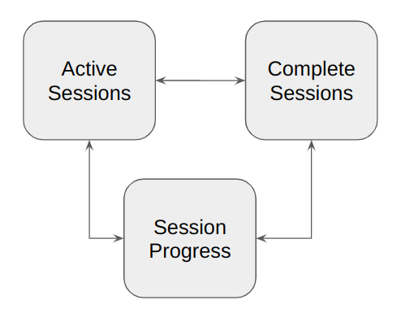
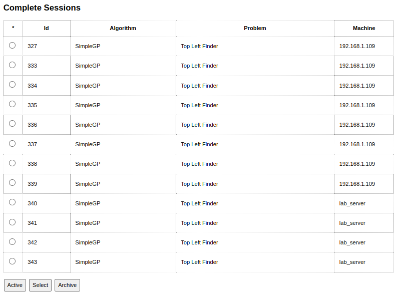
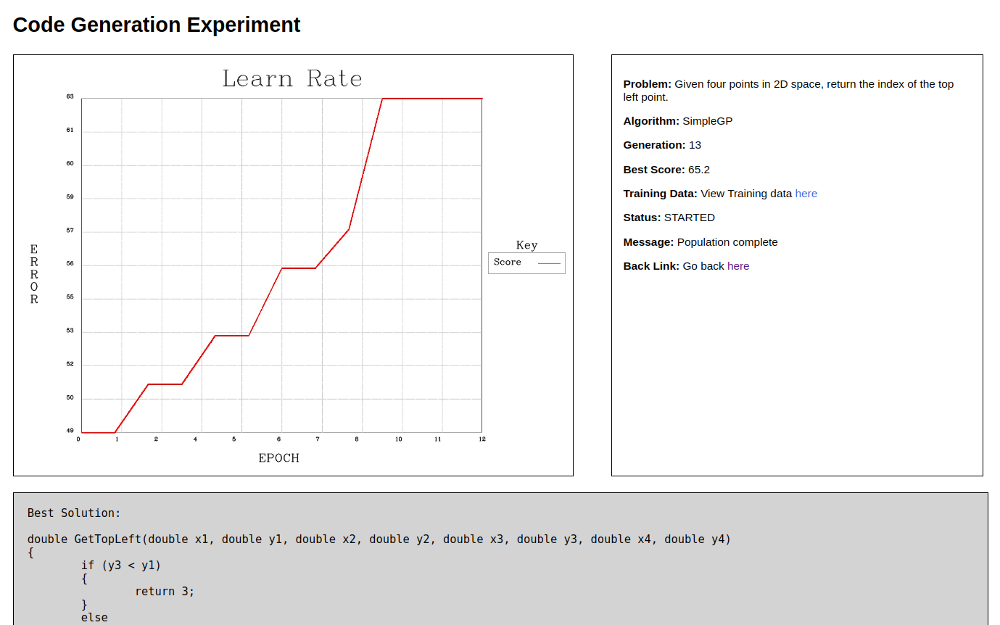

__CodeDash: My code AI code generation arena__

	
Dash Link: <a href="http://neural-vision.ddns.net:8080/CodeDash" target="_default">CodeDash</a>

    
<b>NOTE:</b> Unfortunately, this work is not valuable enough yet to be funded, therefore I am hosting a volatile home machine. Later, if I get the funding, I will move it to a more stable, secure environment.
 

This is a quick description of the _CodeDash_ arena that I built. The main goal of _CodeDash_ is to be able to host multiple machine learning tasks on _multiple_ machines and be able to see the progress of each task in one central place. Ideally, with some independence of where I am located at the time (assuming internet availability). _CodeDash_ also allows me to easily share the results of that learning process with others. For a reader of this blog, the utility of _CodeDash_ could be as follows:

* Those that are super interested could come here and see what machine learning tasks are in progress. Maybe even place bets on which sessions will "converge" and which will fail.
* It could be a medium that I use to communicate the results of the various experiments that I have conducted.
* While I have not made the source code publicly available, the idea of _CodeDash_ might appeal to you as a solution. If this is the case, let me know and I will try and make a public version of the source code available (warning it is written in C++).

Also, any feedback, or thoughts, please do not hesitate to contact me and tell me about them ([trevorgeek@gmail.com](mailto:trevorgeek@gmail.com)).

## CodeDash Layout ##

_Figure 1: The site map for the CodeDash application._

The site map for the _CodeDash_ application is relatively straightforward (for the moment). Currently, active sessions are shown on the _Active Sessions_ page. Sessions that have finished (because they have succeeded, failed, or reached the epoch limit) are then available on the _Complete Sessions_ page. As an administrator, I can "archive" sessions that I feel have no present relevance. There is a "Complete" button on the _Active Sessions_ page and an "Active" button on the _Complete Sessions_ page to allow a user to toggle between these two pages. Selecting a session then brings the user to the _Session Progress_ page in which the progress of the session can be viewed.

_Figure 2: An example of the list on the active sessions page._

The _Session Progress_ page is shown below in _Figure 3_. 

On the top left is a graph showing the progress of the model concerning fitting the solution. Currently, the "error" axis of this graph is the _percentage_ of correct classifications of the training data, where 100% is the ultimate result. The "epoch" axis refers to the cycle of the learning algorithm. As I currently only have a *Genetic Programming* algorithm (SimpleGP) attached to the system, this "epoch" is the generation. 

The top right region is a detail box that contains information about the problem, the algorithm, the state of the solution search, and a back button to return to the _Active Sessions_ page. 

The bottom box contains the best solution that the algorithm has found for the problem at hand. In the case of _SimpleGP_ this is a C++ function that contains nested if statements that lead to return statements that return classifications.

_Figure 3: A partial view of the Session Progress page._

## Future Work ##

The next update that I have scheduled for _CodeDash_ is around the notion of problem tracking. I want to add the capability to upload problems (in ARFF [format](https://www.cs.waikato.ac.nz/~ml/weka/arff.html)), and track the performance of various algorithms around these problems. If you have any problems that you think could be suitable for testing, please let me know!

I am also in the process of building new learning algorithms to training against including:
* An [expression tree](https://www.geeksforgeeks.org/expression-tree/) based Genetic Programming algorithm for formula matching (plus I want to try using this approach for computer vision problems).
* Reinforcement Learning based Symbolic Regression.
* A simple Multi-Layer Perceptron Neural network, potentially using [OpenCV](https://docs.opencv.org/4.x/d0/dce/classcv_1_1ml_1_1ANN__MLP.html).

I am also intending to keep this document updated as I make changes, so keep watching this space!