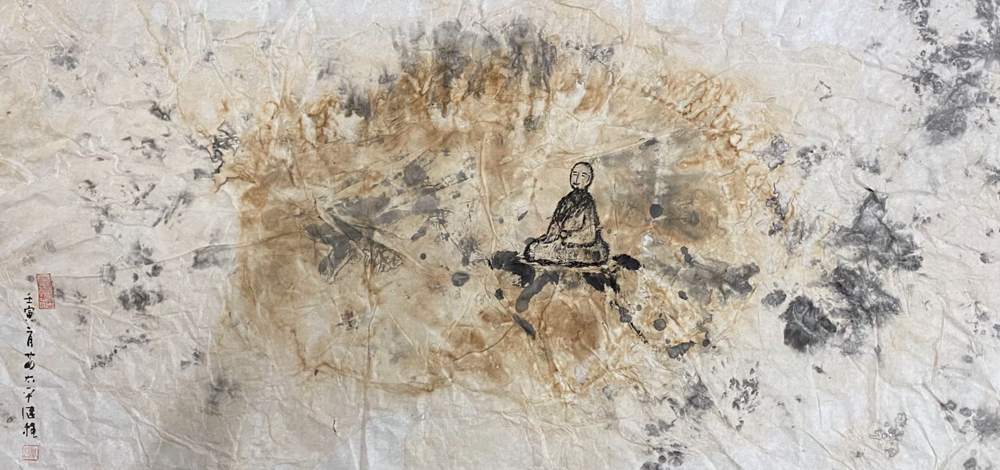
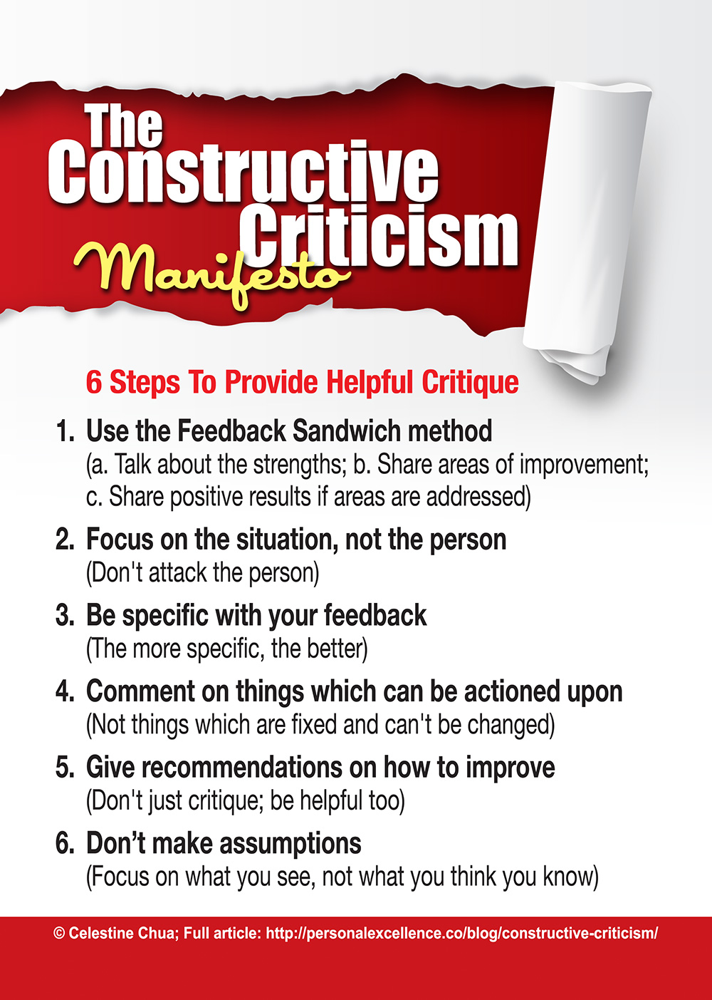

（圖片來源：繼程法師 chernart.com）

學佛的本質是學習 —— 學習佛陀的精神，寺院和道場的本質是學校 —— 提供學習的場所，所以我經常用學習和學校來做比喻和說明。

## 從打罵學生到鼓勵學生

回想起我還在國小、中學的時候，老師打罵和體罰學生是常有的事情。父母們不僅不反對，甚至還對老師們說，孩子不聽話，隨便打，使勁打。所以老師們對待不聽話的學生們也真是不客氣，打罵是常有的事情。我見過的最嚴重的情況是，老師扇了學生一巴掌，因為力氣很大，結果在臉上留有五個紅紅的手指印，清晰可見。父母看了還是受不了，跑到學校要找老師算賬，結果老師躲了起來，於是父母就在學校叫罵了一天。還有的老師，把罵人當做口頭禪 —— 動不動就罵“笨蛋”，髒話張口就來。還有體罰學生，做錯了就跑步多少圈，上課不聽講就把學生倒立著上課等。

這類事情在我上國小，國中的時候，真是的非常常見。父母受教育水準普遍低下，很多父母根本就是文盲，對於如何教育孩子也的確冇有辦法，完全依賴學校的教育。那時的老師人才也不多，每個老師都要帶好多學生，也根本冇有辦法做到因材施教，所以也就隻好採取一些 —— 簡答粗暴的教育方式了。

好在教育在發展，老師人才也不斷豐富 —— 當今社會的學校，打罵學生已經不多見了，尤其是在經濟較發達的城市和地區。也越來越嚮歐美看齊 —— 老師如果再打罵、再體罰學生甚至會犯法，不僅要被取消教師資格，甚至還有牢獄之災了。由此可見，隨著社會進步，教育水準普遍的提高，短短幾十年，就發生了如此之大的變化，從簡單粗暴的教育方式，變成了以鼓勵為主，更文明更人性的教育方式。

這種改變不僅發生在教育行業，佛教領域也是如此。有很多佛友都同時體驗在東方的道場和在西方的道場，對比兩者的風格也能得出上述的結論。普遍來說，在歐美的教育理念也深深地影響著這邊佛教的運作方式，軟言慰語的鼓勵遠多於嚴厲的批評。

不僅學校的教育如此，就是父母對子女的教育也是如此，從以前普遍存在的打罵粗線教育，變成了鼓勵表揚為主的教育方式了。受過現代教育們的父母，也越來越少打著“都是為了你好”而對子女橫加幹涉了。

## 批評要有方便善巧

這並不是說不要批評，而是對於批評也有更高的要求了 —— 批評要有方便善巧，要註意方式方法，要能覺察到對方的感受，要能把握對方接受的方式，這樣才能達到批評的目的 —— 即真正地幫助到了對方，認識到問題，並能夠接受建議。要能夠做到這樣子的批評 —— 還真的不是一件容易的事情呢。所以現代教育也總結了一下關於批評的六個原則：

（圖片來源：https://personalexcellence.co/blog/constructive-criticism-manifesto/ ）

1. 三明治批評法。三明治有三層，第一層先表揚，先肯定，每個人每件事都有可以值得表揚的地方；第二層再說明哪些地方可以提高（即隱晦的批評），第三層最後再鼓勵說，提高了以後的效果會更好。
2. 對事不對人。不攻擊，不否定他人，不隨便衍生，更不輕易全盤否定。
3. 反饋要具體，越具體越好。
4. 批評要務實，是當前可以改變的事情。（杜絕雞湯，聽起來似乎很有道理，卻不知如何實踐 —— 隻給雞湯不給勺子）
5. 要有實質性的建議，不能一味批評，更不能為了批評而批評。
6. 不要基於假設。應該基於事實 —— Facts。

如果能夠遵循這六項批評的原則，那麼這個批評就會非常有實際的效果，對方接受和改變的可能性很大了。也許有人會發現，這裏所說的批評和佛學並無關係，不過是現代社會裡面的通行原則，適用於一切場合，學校，公司，家庭…… 當然也應該適合現代化的道場和寺院了（尤其是對待一般的信衆）。

## 正嚮的教育

若以佛法來說，這就是正嚮的鼓勵式教育了，這尤其是在顯宗（指南傳和漢傳）裡面，尤為強調和重視 —— 如道諦中的八正道：正見、正思惟、正語、正業、正命、正勤、正念、正定。每一道前面就有一個“正”字，其含義則非常明顯了。“正念”修行是目前非常普遍的修行理念，甚至很多非佛教徒也會參與正念的練習，冥想的練習。但如果忽略了“正念”之前的“六個正”，那正念得起來嗎？會真正的、穩定的“正念”嗎？顯然不會，前面每一個“正”都是後面一個“正”的基礎和前提，缺乏前面的“正”，後面的”正“就會像是空中樓閣，沙中建樓了。

雖然佛法中也有“金剛怒目”的說法，但從現在社會教育的發展和現狀來看，很顯然“慈眉善目”更符合主流，更符合文明的，人性的，以人為本的人間佛教了。非主流的意思是並不是否定“金剛怒目”的意義和作用，而是說，“金剛怒目”適用的範圍和普及性不及“慈眉善目”了，應該優先考慮“慈眉善目”，而不是優先“金剛怒目”。

以我作為父母教育子女的情況來看，大多數情況下都是以“慈眉善目”開頭的，然後隨著時間的推移，30分鍾後，一個小時候，耐心逐步消失，情緒逐漸轉為憤怒，最後經常以“咆哮”和“怒目”收場。我從未覺得自己的“發怒”可以歸屬到“金剛怒目”的範疇，所有的“發怒”無一不是煩惱的發作，情緒的失控，最終從身體和語言表現出來的“憤怒”的景象，全身發熱，心跳加速，聲音刺耳，甚至還會沙啞。所以事後我也經常嚮孩子道歉，不該如此發脾氣，然後請求孩子也“慈悲”下父母，盡量不要做令父母發脾氣的事情，容易導緻“兩敗俱傷”。

## 警惕以學佛為名的PUA

最後這個標題可能會令人不適，但實際情況下，還真的存在。若以佛教的立場來看，99.9999999999%以上的人都是有“煩惱”的，有“貪嗔癡“的，有“問題”，是可以提高的 —— 唯一例外的就是佛陀，隻有佛陀才具有100%的圓滿人格，換句話說，從佛陀的層次來批判他人的話，連大菩薩們都可以批評一番，即我們非常熟悉的大菩薩們 —— 觀世音菩薩，彌勒菩薩，文殊師利菩薩等，都可以排排坐，挨個都可以訓斥一下 —— 因為他們都還有“一分微細無明”冇有破，還有提高的空間咧。

這是從佛法上說，可以批評任何人的“理論基礎” —— 即除了佛陀外的任何人，包括大菩薩們，都有“問題”，都有可以提升的空間。如果連大菩薩們都如此，何況我們這些凡夫俗子呢？所以“批評”在佛教裡面，特別容易被“濫用”，因為可以打著“一切為了你好”的名義隨意批評，而且批評的“事實基礎”還牢固的很呢 —— 隻要是凡夫俗子，就離不開“貪嗔癡”的事實。所以“批評”的話語、文章在佛教隨處可見。

唯獨容易被忽視的就是“批評”的真實效果了 —— 不考慮對方的個人因緣，個人情況，方式方法 —— 一頓“批評的亂棍”打下來，有些人莫名其妙憤然離去，有些人委屈求全有話也不敢說，有些人礙於“大德高僧”的威勢下不得不繼續“苟且”，甚至有人因此造成更嚴重的心理傷害…… 再甚者，被一些別有用心的“神棍”利用，最終達到“精神控製”的目的，得以騙財騙色了。如此的情形，如何不令人扼腕。

## 一個小建議

所以我想對那些正在學佛，但卻在心裏感受不到佛法帶來的快樂的人，尤其是在心裏覺得苦悶，越學越委屈的人說幾句 —— 如果你有這樣的情況，請不用再懷疑自己了，雖然我們是凡夫俗子，但並不是無可救藥，換個地方也許會有不同的體驗。佛法上講究“相應”和“對機”，如果經過一段時間（3月或半年以上）的接觸還是感覺很不好，很想離開，那就離開吧，繼續上路，繼續尋找。對於過往，我們接受，因為這也是因緣，但不去隨意評判，如果需要提及，隻需要如實地分享自己的所見所聞和感觸即可。

山不轉水轉，水不轉人轉 —— 繼續保持求學，繼續保持功課，假以時日，必定可以撥開雲霧重見天日。更何況現代社會裡面的佛法資料，文章，視訊，資訊非常發達，搓手可得，無論何宗何派，都可以找到足夠的“基礎內容”，足夠我們先行自修自學很久了。又如果對於宗派也冇有選擇，或無從擇決，那就選擇最最穩妥的淨土法門或最最基礎的阿含經了（二選一即可）。

PUA：最近的網路用語，全稱是Pick-Up Artist，但現在多用於一些“過度批評”的場景，或是企圖通過“批評”和“否定”他人，以達到對其進行精神控製的非法目的。輕則令人惱怒，危害他人心理健康，重則害人害命，也是很多非法組織用來蠱惑人心的常見“套路”。

謝謝閱讀。 
愚夫合十。

