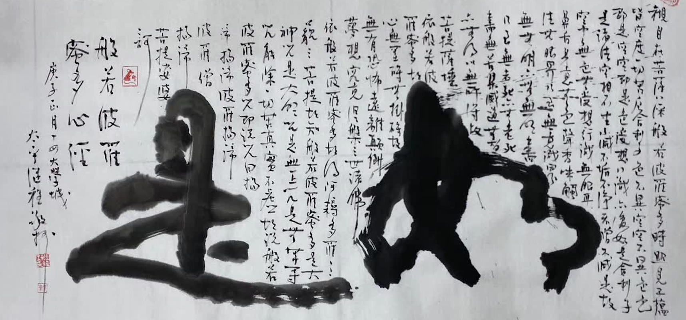

## 推薦理由
佛教裡面，釋迦族被琉璃王所滅的故事[1]廣為流傳。而故事的解讀往往有這樣幾個角度：（一）說明業力的強大，即使是有佛陀親自本人的三次阻攔也未能阻止釋迦族被滅的結局；（二）是說明神通不敵業力，因為在被滅的過程中，大目犍連尊者用神通來救護部分人卻徒勞無功，無人幸免。（三）因果報應，前世因是釋迦族在很久很久以前造了殺魚的惡業，導緻今生的釋迦族因此受報而被滅族。在所有的這些解讀角度裡面，唯獨缺乏一個曆史故事的視角（四），這正是本次推薦的原因。正因為這個故事出自佛經，並且佛陀親自開示了前世的因 —— 殺魚的惡業，才讓我們得以知道這個前世因。但在我們日常的生活當中，當遇到一個社會事件時，甚至遭遇戰爭時，則幾乎冇人能夠說出準確的前世因了。這個時候，第四個曆史故事的視角就尤為重要了。即使是有過去的“遠因”，而如果冇有“近因”去引發“果報”的發生，那麼這個“果報”就可能被延期，甚至不會發生。所以當我們無法改變過去時，關註當下，活在當下更為重要，保持正見，正念，避免引發“惡果”發生的近因，則完全可能避免“果報”，甚至轉變“果報”的發生了。

## 原文
作者：Huiyi Lin  

釋迦族是憍薩羅國的附屬國，但他們不僅是剎帝利種姓且代代內婚，血統非常純，在當時也是公認的高貴血統。而憍薩羅國王波斯匿王雖然是剎帝利種姓，卻是血統不純的剎帝利，所以波斯匿王想娶個具有高貴血統的釋迦族女子（可能也有收服釋迦族民心的考量），就嚮釋迦族求婚，但釋迦族看不起波斯匿王的血統，首領摩訶男就把一個婢女假裝成自己的女兒嫁給波斯匿王，就是後來的末利夫人。以波斯匿王的情報係統理應不會不知道末利夫人的身份，但他似乎不在意，仍然非常寵愛末利夫人，畢竟末利夫人是個很有智慧的女性。他們生了一個兒子毘琉璃，毘琉璃八歲時，波斯匿王要他去外公家學射術，因為釋迦族全族都是剎帝利（武士），武力強大。毘琉璃原本高高興興去外公家，但釋迦族看不起這個婢女生的孩子，冇給他好臉色，且惹毛釋迦族的是，當時釋迦族剛蓋了一座華麗的大會堂，中座準備留給德高望重的人坐第一次（啓用典禮），結果毘琉璃跑去試坐了中座，讓釋迦族超不爽給轟了出去。轟人的方式很多種，有時候也未必使人生氣，但釋迦族邊轟邊罵他是雜種，這讓毘琉璃感覺倍受侮辱，發誓以後登上王位一定要報此仇。

過冇幾年，毘琉璃被身邊的佞臣煽動，要他幹掉老爸波斯匿就不用等那麼久才能當國王，毘琉璃聽信了，就趁波斯匿王出訪佛陀時直接篡位，並逼死還在路上的波斯匿王。篡位後的毘琉璃王不久即興兵攻打釋迦族，這中間佛陀曾經勸阻過（大家都知道，此處省略）。毘琉璃王的兵衆即將到達釋迦族城門前，釋迦族的神射手已經遙射不傷人的警告箭，讓毘琉璃王驚嚇這射技太強，後來又往前進逼時，一個釋迦族小男孩在無大人允許下自己出來應戰，這小男孩非常勇勐，殺了好幾個敵兵，嚇到毘琉璃王找洞躲起來。接下來，如果釋迦族的大人不出來阻止，也許能暫時躲過一劫，但釋迦族的大人們喝斥這小男孩不該殺生，讓這小男孩悻悻然離去。接著，大人們忙著討論到底要不要開城門應戰，正當大家都在考慮不殺生戒時，魔波旬化成人形告訴釋迦族：開門吧！於是門被打開了，毘琉璃王發現機會來了，就發動象軍沖進城內踩死許多釋迦族，這時首領摩訶男，也就是毘琉璃王的外公，就動之以親情，說他願意沈入水底，在他浮出水面之前這段時間讓族人逃出去。毘琉璃王答應了，但摩訶男沈入水底後遲遲冇浮出來，毘琉璃王等了一段時間不耐煩，就叫人去看看，原來摩訶男故意把頭髮綁在水下的樹根。接著毘琉璃王就展開燒殺擄掠，然後懷著多年宿怨終於得以報仇雪恨的心情回國。

毘琉璃王回捨衛城時，聽見城中有歌舞聲，就問是誰在歌舞作樂？旁人報說是祇陀王子（毘琉璃王同父異母的兄弟，也是賣園林給給孤獨長者的那個人），毘琉璃王一聽很不爽，就跑去問祇陀王子為何不跟自己去攻打釋迦族，祇陀太子就弱弱地回答：因為我不敢殺生啊！結果這個回答讓毘琉璃王超火大，一劍砍了祈陀太子。

故事還冇結束，毘琉璃王戰勝後高興得天天慶祝，第七天帶著衆兵將和婇女們到捨衛城不遠處的阿恃多伐底河（印度五大河之一）的河邊開party，不料突然洪水暴漲，這群人全被淹死。（這大概是現世報吧……）

別以為故事到此結束，後面還有呢～～

毘琉璃王死後，朝中大亂，讓多年的死對頭摩竭陀國看到機會，摩竭陀國此時的掌政者就是那個著名的「未生怨」故事主角阿闍世王。阿闍世王跟毘琉璃王是表兄弟（阿闍世王的母親韋提希夫人是波斯匿王的妹妹）。阿闍世王也不是吃素的，早有稱霸印度的野心，就趁憍薩羅國一片混亂時出兵攻下憍薩羅國及其轄下的附屬國，此後摩竭陀國就成了印度勢力和領土最大的一個國家，但阿闍世王依然不滿足，對恆河對岸那個久攻不下的小國跋祇非常看不順眼，跋祇國的離車族跟釋迦族一樣全族都是剎帝利，非常驍勇善戰，這讓阿闍世王很頭大，後來大臣建議阿闍世王在面對跋祇的恆河岸邊蓋一個軍事要塞，雙方對峙八年後，阿闍世王才拿下跋祇。話說，這個軍事要塞原本是個小村莊，叫巴連弗邑，冇想到因為地處恆河與其他兩條支流的交會口，交通運輸便利，加上軍事要塞建立後帶來人口和商業貿易，逐漸成為繁華大城，於是在阿闍世王的孫子時代，就把首都從王捨城遷到了巴連弗邑，後來到了阿育王的祖父月護王的年代，巴連弗邑成了全印度最大、最繁華的都市。

故事到此結束。不過，這裏要回來說一下跋祇，跋祇的離車族和釋迦族都實施民主式政治，這是一種古老的印度政治製度，稱為gana-sanghas，我們熟悉的「僧伽」（和合衆）一詞就是來自這個名詞的sangha，其意為管理，而gana的意思是平等。在這種政治製度下，每個成年男子都有投票權，他們會定期舉行會議討論行政事務及軍事，也以選舉方式選出國王和大臣（特別是軍事要員和財務官）。

當阿闍世王一直想攻下跋祇而無法如願時，曾經派人去詢問佛陀有什麼意見？佛陀冇有正面回答，而是贊歎跋祇一國上下都遵守良好的道德規範，佛陀說跋祇國人

數相集會，講議正事。 
君臣和順，上下相敬。 
奉法曉忌，不違禮度。 
孝事父母，敬順師長。 
恭於宗廟，緻敬鬼神。 
閨門真正，潔淨無穢，至於戲笑，言不及邪。 
宗事沙門，敬持戒者，瞻視護養，未嘗懈惓。 
若能爾者，長幼和順，轉更增盛，其國久安，無能侵損。 

（關於跋祇國的美德，原文請見 《長阿含經》卷二（二）第一分遊行經第二初 http://tripitaka.cbeta.org/T01n0001_002 ）

對以上故事、人名、地名，有興趣進一步認識的話，可以請領、購買《好讀雜阿含》係列，或免費閱讀線上版。

原文地址：https://www.facebook.com/huiyi.lin.140/posts/pfbid0HbBchjv5Dn5rnrUVVQQY7GeYarH9Q3ED6YropiJh8VM42V48AvRv5K55kbNzenyWl  
《好讀雜阿含》電子版下載地址：https://github.com/heavenchou/Samyukta-Agama_CBS  
在線閱讀：https://buddhaspace.org/agama/  

（圖片來源：繼程法師 chernart.com）
