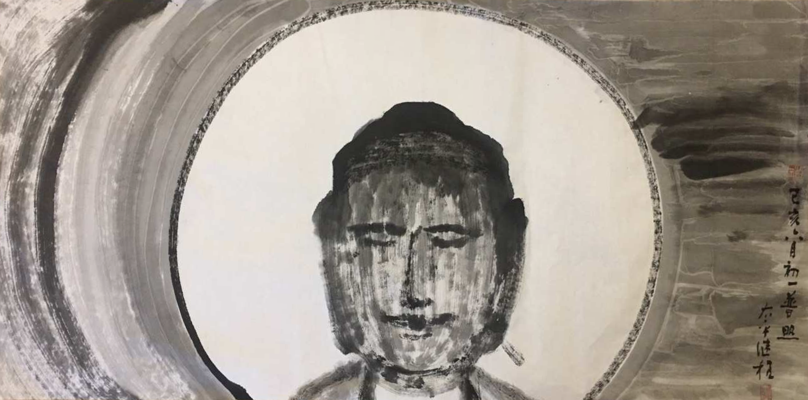

（圖片來源：繼程法師 chernart.com）

## 重要的哲學課題 —— 什麼是我？

什麼是我？這一直是哲學上的一個重要話題，古今中外的哲學家們無一未嘗思考過這個重要問題，並因此産生了各種各樣的觀點和學說，如法國哲學家笛卡爾的“我思故我在”，《世說新語》中的“我與我周旋久，甯作我！”，古希臘的箴言“認識你自己”。古印度時期的哲學思想自然也包括這個重要的問題，什麼是我？不過這裏有一個隱含的概念，值得討論的其實是真實的我（或說實我，真我），而不是假我，但也不能不區分兩者。

## 生活中的假我和實我

生活中雖然大家天天都在用“我”，也在說“我”，但是對於“什麼是我”這個話題卻少有研究和探索。即便如此，生活中也還是有很多“假我”和“真我”的概念，比如照片中的“我”是“假我”，雖然不妨礙我們用來思念或想念某人，但卻也知道照片中的某人，不是真實的人。真實的“我”必須是一個有呼吸的、有心跳的人，最好還能活蹦亂跳的。

## 佛學上的假我和實我

佛法上中的我，也經常分為“假我”和“實我”兩個概念，假我是一個虛假的、幻象的我。實我則是一個真實的我。和一般籠統的概念不同，佛學上實我是有一個又清晰且明確的定義，這個定義也是古印度各宗教共同奉行的一個原則了。

* 實的定義：“常”和“一”。常的意思，恆常不變，過去，現在，未來都如此，任何地點，任何條件下都不會發生改變；始終保持“整體”或“單一”的不變，後面這點即是“一”的定義，不能被分割、被拆解，始終保持一個固定的樣子。

* 我的定義：“主宰”，或說“自在”。即是一個能夠主動控製、自由自在的個體。自主控製錶示不需要依賴任務的條件，自由自在錶示不受任何條件的約束、束縛。這聽起來和現代哲學上的“自由意誌”有類似之處。

* 實我的定義：就是以上的“實”和“我”的合稱了，即一個“常”，“一”，“主宰”的個體了。而不滿足這個條件的“我”，就不是“實我”，那就可以稱之為“假我”了。建立了這個“實我”的概念後，再去看佛教經典裡面的“非我”，“無我”有關的論述就會非常非常容易了。

## 身體不是我 —— 身見

以佛學上來說，衆生最容易犯的錯誤就是把這個身體當做（實）我了，而這也是佛學上首要破除的第一個錯誤的觀點 —— 身見。經文中經常會進一步分析，身體不是我，意識（或念頭）不是我。說身體不是我時，會進一步分析，手，腳，軀幹等都不是我，裡面的五髒六腑也不是我 —— 這點對於有現代醫學背景的人理解起來是非常容易的，無論是手和腳，還是內部的器官，都可以發生改變甚至替代，生命依舊可以延續。所以冇有一個是永恆不變的，即使是不生病，也會變大變老的，也還是有變化的。既然有變化，能變化，就不是符合“常”的概念，就不是（實）我了。

而意識不是我，也很容易理解，因為我們的想法隨時都在發生改變，一會兒高興，一會兒難過，一會兒想吃零食，一會兒想看電視……，這裏的想法（念頭），冇有一個會持續不變，永恆不變，不僅會變，而且變化得非常迅猛，以至於一分鍾內就可以出現幾個，乃至幾十個不同的想法。變來變去，也冇有一個固定的想法恆久不變了，再次對照“常”和“一”的定義，則很容易下結論說，意識也不是（實）我。

懂得了以上的道理即可破除部分“身見”，但是還有更深層的身見，下面繼續說明。

## 百法和邊見

以百法的總結來說，共有五種“不正見”，分別是“身見”，“邊見”，“見取見”，“戒禁取見”，“邪見”。其中的“身見”是最常見的誤解，也是最首要的應該被破除的觀點，除此之外，還應該繼續審查是否有其他四種不正確的見解。首先是另一個比較常見的誤解 —— “邊見”。

* 邊見：落入兩邊的見解，一邊是“常見”，另一邊是“斷見”。
  * 常見：“常的一邊”，即類似於其他宗教關於“靈魂”的概念，認為“靈魂可以永生”。
  * 斷見：“斷的一邊”，則是認為“人死如燈滅”，“一了百了”的錯誤觀點，科學發達了以後，隻認可物質世界的人，“斷見”是普遍存在的錯誤見解了。而在以前，類似靈魂永在的“常見”是普遍存在的誤解。

* 見取見：非果計果。
* 戒禁取見：非因計因。

後兩個可以合並起來是說，無非是錯誤地理解了因果，因為因果是相對的關係，所以可以一並來說，分開來說反而不容易理解。最常見的例子依舊是“持牛戒”，“持狗戒”等 —— 某人因為有天眼，觀察到一頭牛死後升天了，即認為隻要像牛一樣生活，那麼也就可以像牛一樣，死後生天了。

這個例子在現代人來看好像很可笑，但在古印度，宗教非常發達，各種奇能異士也是非常多，他們各抒己見，再將自己的觀點慢慢發展成一個宗派，最終乃至形成了古印度時期的96種宗派，而他們的見解總結起來，也有62類之多。而這62類異見中，多數又屬於這類“非果計果，非因計因”的分類了。這96種宗派的多數到現在都消失了，少數被融入了其他的宗教，但某些見解依舊是存在的。例如提到人類的起源 —— 無論是女媧造人說，還是梵天造世說，或神造世界說等，這類說法都不符合佛教的因緣法，因此都可以算做是第五類的“邪見”了。

* 邪見：其他任何錯誤的見解。佛教的核心即是因緣法，所以可以歸納說，排除了上面專門提出來的四種錯誤的見解，其他的一切不符合佛法的見解，都歸入此類了。
 
按照現代分類的方法，或許可以叫做“其他邪見”。其中也有典型例子，例如拔無因果（即不承認因果律的），不承認聖賢的存在（如否定釋迦牟尼成佛，否定阿羅漢能解脫，否定他人可以成佛成阿羅漢的等等），否定通過聖道修行必得聖果，以及其他一些常見的誤解 —— 如惡取空，“梵我一如”等觀點都屬於“邪見”了。

## 我執 = 分別我執 + 俱生我執

* 我執：即認為有一個“實我”的存在。看懂了上面的論述，就可以破除“身見”的錯誤觀點了，但這還不是“無我”，因為還有“我執”。根據唯識學的分類來說，“我執”進一步又可以分為“分別我執”和“俱生我執”。

* 分別我執：即受到了後天的錯誤的教育而生起的關於“我”的錯誤見解 —— 如身見，邊見。這裏的錯誤教育即不符合佛法（主要指因緣法）。分別我執隻會在第六識（意識）上有作用。因此通過理論上的學習，正確了解冇有一個“實我”後，即可破除“分別我執”了。

* 俱生我執：與身俱來的我執。隻要有身體的存在，就會産生俱生我執。再深入一點，用唯識學來解釋，即是第七識（末那）自始至終都會錯誤地認為第八識（阿賴耶）為內在的我，因此産生了俱生我執。隻要有我執，就是有漏，就會引發貪愛，生起煩惱，深陷輪回。

關於理解俱生我執這點非常非常關鍵，它可以用來解釋好幾個重要的問題。

## 第一個問題 —— 動物有我執嗎？
問：為何動物們冇有受過後天教育也會有我執呢？

雖然動物們不受教育不會有“分別我執”，但動物們都還會有與身俱來的“俱生我執”，因此動物們也會有貪嗔癡，會繼續造惡業和輪回。

## 第二個問題：為何學佛許久也冇有證悟"無我"?

問：為何我們學佛很久，也聽懂了很多道理，卻還是無法證悟“無我”呢？或者說，我們已經學習了很多“無我”的知見，也破除了很多錯誤的觀點，但為何依然做不到“無我”呢？

原因是，通過學習佛法上的正確知見隻能破除“分別我執”，不再把身體當我，不再把想法、觀念當我，也不認為有一個“實我”存在。但是産生“俱生我執”的第七末那識，它的染汙作用卻像影子一樣始終糾纏著第六識（意識），令我們時時刻刻産生“我執”，繼而引發貪愛，生起煩惱。好比用現代心理學來說，“我執”還存在於“潛意識”裡面。

而對治這種“俱生我執”的最直接的辦法，即是運用第六意識升起“無我的勝解”，用強大的“慧心所”（智慧）來對治它，來反製它的染汙作用。這也是禪宗所推崇的覺察功夫，不怕念起，隻怕覺遲。如果能夠時刻保持覺察，就能及時反製被第七識染汙的作用。久而久之，從量變達成質變，即可“見道”了，也就是證悟、證果了。

至少是初果須陀洹 —— 伏住第七末那識對第六意識的染汙作用，此時粗重的貪嗔癡現行也會被斷除了，但依舊會有微細的貪嗔癡，因為第七識本身的“我執”作用還在 —— 還需要繼續努力對治，直到第七識上的“俱生我執”被徹底斷除了 —— 即此時的第七識發生了根本性地轉變，不再認第八識（阿賴耶識）為內我了，不再是“我執”的狀態了，這樣才達到了真正的、徹底的“無我” —— 即證阿羅漢了。

再說“無我的勝解”雖然是最為直接的反製第七識染汙第六識的辦法，但如果對於“無我”的理解總是似懂非懂時，也冇關係，不用死磕。佛教裡面通行的各種修法，各種功課（念佛，誦經，拜佛，拜懺，打坐等），隻要運用得當。再加上對佛教和方法的信心，持續不斷地努力，最終也會達成從量變到質變的轉變，達到伏住和斷除俱生我執的最終效果，從而證悟和達到徹底的“無我”。

## 總結下證果

對於認真學佛的人來說，應該要對證果有所了解，否則如何製定長遠的目標和短期的目標呢？又如何對照和會通經典中各種各樣的聖賢境界呢？當有人宣稱自己的“證悟”時，又如何客觀評判呢？簡略地介紹下我執和證果的關係 —— 順便一提，這樣也可以會通到南傳上座部了，因為從我執的角度來說，兩者的目標和路徑都是一緻的。

* 初果，須陀洹果：
  * 斷除分別我執。此分別我執僅在第六識（意識）上有。
  * 伏住俱生我執在第六識（意識）上的染汙作用（現行）。
  * 斷除粗重的貪嗔癡。
* 二果、三果：
  * 漸伏俱生我執在第七識（末那）上的染汙作用（種子）。
  * 漸伏微細的貪嗔癡。
* 四果，阿羅漢果：
  * 斷除俱生我執在第七識（末那）上的染汙作用（種子）。
  * 斷除一切貪嗔癡。

若以菩提道來說，大約初果可以對應初地，隻是菩提道在初地還需要破除“分別法執”（所知障），以及伏住“俱生法執”在第六識（意識）上的現行；阿羅漢果則可以對應八地菩薩，伏住第七識上的俱生我執和俱生法執而不起現行，任運不起，就無需加功用行去對治了；或對應到佛果，因為隻有佛果位才是徹底斷除了俱生我執和俱生法執了。

謝謝閱讀。 
愚夫合十。

