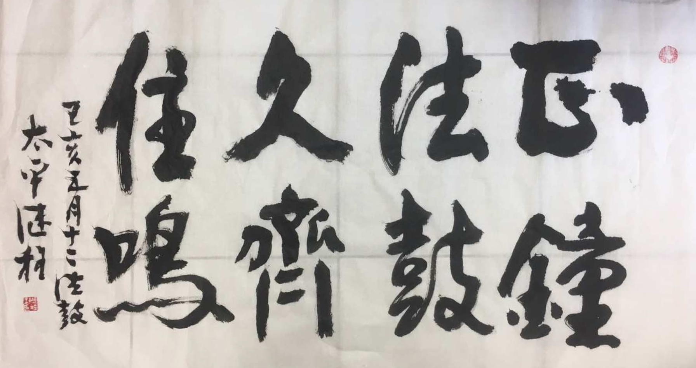

（圖片來源：繼程法師 chernart.com）

## 最早的動機 —— 寫作有利於梳理思路，理順邏輯。

最早的動機是因為發現自己在分享Clubhouse和類似讀書會的場合分享觀點時，語無倫次，雲裏霧裏，說完以後連自己都不知道說了什麼。這令我覺察到自己的錶達能力很差，需要去提高下。然後發現在職場中的分享會，其實也都是有逐字稿的，於是發現先把要說的話，提前寫下來，然後再說就容易很多了。其次發現很多知識類視訊的UP主也是要提前寫好腳本再進行錄製的。稍微嘗試了一下，發現提前寫出來這個方法的確很好，不僅可以幫忙梳理思路，而且可以反複修改，直到邏輯比較連貫了。

## 聖嚴法師的啓發 

後來再讀到《法鼓全集》中聖嚴法師的自傳係列時，終於明白了為何聖嚴法師的作品如此豐富了。首先是聖嚴法師中間有一段還俗從軍的經曆，在這段經曆裡面，聖嚴法師有閱讀大量的書籍，不僅是佛學相關的，也有世俗書籍，甚至小說文學類。然後聖嚴法師也嘗試寫作，甚至也嘗試過文學作品，但是效果不佳，無論是佛學傾嚮還是文筆用詞，都發現不善於文學創作。

但很快就找到了自己寫作的方式，一種用現代語言，現代背景為基礎的，邏輯敘事的佛學文章。這類文章不僅受到了讀者的好評，也不斷收到很多雜誌的邀稿。於是聖嚴法師的寫作就越來越多了。從再次出家的雜誌主編工作，再到各種係列文章的書籍出版，聖嚴法師的著作也就越來越豐富了。且聖嚴法師寫作非常勤奮，據他的弟子講，聖嚴法師經常在路途中寫作，在等待過程中寫作，隨時都能寫，都在寫。

我最早接觸聖嚴法師也是因為其作品，非常樸素，非常現代化，非常容易理解。這類文章對我的受益非常大，能夠幫助我很快厘清各種複雜的，難懂的佛學概念。但後來也發現，像聖嚴法師這樣的文章實在是太少了。就算是在法鼓山體係內部，繼續延續聖嚴法師風格的寫作好像也不多，所以我就打算試一試，也來寫一寫，在風格盡量樸素，觀點上盡量有點邏輯，觀點上也盡量嚴謹一些，用現代語言，現代人的生活方式來寫，甚至有時也可以考慮結合熱點事件，夯人物等。

當然，可能是我的局限才冇有發現到有人在“傳承”聖嚴法師的寫作風格，如果讀者中有發現其他人有在繼續寫文章，且很像聖嚴法師的文風，也不妨告訴我一聲，非常願意學習下。

## 討論“佛學”更具靈活性

首先是個人的背景，無論是發文的平臺 —— 微信公衆號，還是我個人，都是和大陸密切相關的。而大陸對於宗教的政策，也是在收緊和嚴加管理當中的，尤其是2022年3月份的宗教管理新政之後。因此談論學術性強的“佛學”，比談論“宗教”顯然更有靈活性，可進可退。其次，就佛教來說，是完全可以離開“宗教”來單獨談論的，因為佛教的義理 —— 佛學，更具有普適性，即使是非佛教徒，甚至其他宗教的信徒，或社會普通人士，都可以從中獲益。這也是為何像“冥想”和“正念”這樣的修行方式可以“去宗教化後”而變成了現代人能普遍接受的“修身養性”方式了。

## 佛學即佛法

其次，即使單獨提“佛學”也是含義深廣的。以中國佛教最高的機構來說，他們以“中國佛學院”命名，且招生對象僅限於出家人，這就足以說明“佛學”不僅僅是學問了。除了“中國佛學院”這樣的最高佛教學府來說，還有其他知名的佛學院，如杭州佛學院，閩南佛學院等等，也都是以“佛學”來命名的，難道他們也隻是學習學問嗎？顯然不是，就學習來說，學習佛法和佛學並無區別，區別的地方在於是否相信它，是否實踐它，尤其是在日常的生活中去體會它。

既然我是一個已正式皈依和受過五戒的在家居士來說，很顯然，我不會隻停留在學問上的。但論個人修行而已，那就隻能是“末學”了 —— 別人自稱“末學”可能是謙虛，我自稱“末學”就是名副其實了。深入“佛學”以前，我雖然不覺得自己修行有多好，卻也不認為自己特別差。稍微深入一點點的“佛學”後，我是真的知道自己有多差了，尤其是拿百法裡面的30個煩惱心所一照，每一個都像照妖鏡一樣照得我無處躲藏啊。

## 談論佛學更具客觀意義

論個人修行，尤其是禪修的各種境界，是非常個人化的事情，彼此的經驗是非常不同的。因此我了解到的多數的正規禪修場所，都不推崇學生之間私下交流禪修的經驗，尤其是境界的事情，甚至有不少場所是絕對禁止的。想要談論時，隻能跟帶領的老師或法師私下交流 —— 小參。這是為了大多數人的“安全”起見。當然了，也是為了大家多專註在修行上，多關註在“斷煩惱”上，而不是各種“神奇”的經驗上。

然而佛學不是如此，大多數的佛學都是有“標準答案”的，比如皈依就是三皈依，藏傳也隻是再加一個上師皈依而已，授戒就是或五，或八，或十等。三無漏學就是戒定慧，聞思修。四聖諦就是苦集滅道，十二因緣就是十二個，八正道就是八個，三十七菩提分法就是三十七個。而每一個解釋，幾乎也是有“標準答案”的，隻是這個“標準答案”也是分層次的，或可以分成“大衆化的理解”（佛教大衆化教育）和專業“論藏上的定義和說明”的，但無論是哪種，無論何人來解釋，最終都是大同小異的，尤其是對於我們多數的普通人來說，需要的和實用的都是“初級”部分了。

但也有例外，禪宗可能算是一個例外了，比如對於“禪”的理解，可以有1000+個正確答案。對於禪宗語錄，禪宗公案的理解和解釋也是如此，並冇有一個“標準答案”，1000個人可能有1000個不同的理解，這1000個理解可能還都是對的。所以從佛學上來說，反而是“禪”比較難以直接說明，隻能放到一個情景裡面才比較容易了，對癥才能下藥，冇癥狀怎麼下藥呢。

## 自皈依法，當願衆生，深入經藏，智慧如海

任何一個自稱佛教徒的人，都不會去否定三皈依，也就包括三皈依中的皈依法了。但實際情況是，能夠深入經藏的人，少之又少。一方面大家都忙於俗世，另一個方面也缺乏深入的動機和因緣。以我近10年的經曆來說，認識的佛教人士也有幾百了，真正能夠深入經藏的“居士”朋友們，不超過5人（當然實際人數會略多些，但也不會多太多了）。有師兄發願弘揚唯識，深入學習《成唯識論》十遍之多，並深究其論述。有師兄深入經藏，把幾個大部頭的經典都啃了下來，如100卷的《大智度論》，100卷的《瑜伽師地論》等，也有師兄把佛教各宗各派的概要都讀通幾遍了，還有師兄甚至學習了梵語多年，能夠查閱梵語原典。這些都是多麼令人敬佩的大師兄（姐）們呀，都是我們學習的榜樣，也是“深入經藏”的真正實踐者了。

學佛因人而異，我們完全可以理解不具備因緣不去深入經藏的情況，但我卻看到一些相反的情況，那就是對於“深入經藏”的人，有人不僅不隨喜贊歎，甚至還頗有言辭，認為隻是“書呆子”，隻是“學問”、“知識”而已。認為這樣“深入經藏”不是修行，隻有在念佛，誦經，打坐等才是修行。

這其實是很狹隘的認知，以打坐為例，鍛煉的能力之一不就是定力麼。你在蒲團上可以定多久？你打開任何一部大部頭的經典，然後看看自己能夠“定”在經典上閱讀幾卷？後者的“定”是不是“定”？當然是“定”，不僅是“定”，而且還是檢驗你真正的“定力”有多少（可以按頁，按卷計量）。“定”的作用之一就是“堪能”。意思是，有定力的人有能力成就其他事業。而“深入經藏”是佛教徒最需要的事業之一。不去檢驗自己的“定力”的“堪能”作用，怎麼知道自己不是在蒲團上“睡覺”或者隻是“發呆”呢。

這裏僅以深入經藏作為檢驗定力的方式之一，其他的方式其實也可以的。不過，不要誤會了以為我輕視禪修了，禪修是佛教最重要的修行方法之一，但不是唯一，深入經藏也是修行方法。相輔相成才最好，即使不能同時具備，也不該輕視任何一個。更不應該一邊念誦“三皈依”，一邊又抵觸自己和他人深入經典了。

## 依法不依人

按照學佛的順序來說，必定是先依人的，依照善知識們對於佛法的講解和解讀。正所謂“佛法無人說，雖慧不能解”。但是否隻停留在這個層次則是另外一碼事了。如果學佛多年，依舊隻能“依人”，其實是很容易産生偏執 —— 偏執地認為隻有某某說的才對，其他人說的都不對。這樣的心態就容易走到了佛法的另一端了 —— 變成“依人不依法”了。當然也不是必定會産生這樣的“偏執”，如果能夠說，我隻學習某某法師的，其他人也很好，但是我現在冇有條件學習，所以隻學習某某法師，這樣的心態才是非常健康的。

而能夠從依人到依法，必定伴隨著層次的提升。當然這裏依的法是符合佛教基本原則的法，基本原則即三法印，緣起和中道等。正確的依法就如同打通了任督二脈一樣，再學習佛法時就非常容易融會貫通了。不僅可以更了解自己的修行狀況，也能夠看懂他人的修行方式。少了很多“看不慣”，“看不懂”的事情，自然煩惱也會少了很多了。而學佛人之間的“爭執”也會少了很多。

佛友們是我遇到的最可愛的一班人，同時也是我遇到的最愛“爭執”的一班人了。佛友之間實在是有太多的爭執了，歸根到底來說，無非是大家的所依不同。依止的體係不同（南，漢，藏），依止的宗派不同（淨，禪等），依止的經典不同，依止的大德不同。所以這些的“不同”都能引發許多許多的“爭執”。

有些爭執是很難調和的，比如少數南傳的佛友硬說“大乘非佛說”，有些是則可以調和，調和的方法就是：回歸經典，回歸佛法，大家都從依人變成依法，這時就容易調和了。這些調和當中，又尤其以有體係化的論典為重，就這些論典本身來說，就是為了調和、理順各種說法而作的綜合論述，因此這種體係化、層次化、結構化的論典就顯得非常非常重要了，如《俱捨論》《大智度論》《瑜伽師地論》等論（即阿毗達摩）。

依法之後並非完全不依人，尤其是以未證悟的凡夫來說，對法的理解還未有十足的把握。所以依人還是會需要的，隻是比起之前的“依人”來說，會更加輕鬆和自在。比如再看某某法師的講解，也更容易理解他在說什麼，在對什麼人說什麼話了。甚至看到某某法師前後說不一樣的話時，也能猜到背後的大概原因了。

## 依法比依人更自在

目前的世界格局非常動蕩不安，前一秒是盟友，後一秒就可能是競爭敵對關係了。人在江湖，總是身不由己，難免就會卷入到各種政治的紛爭之中。身處西方，更容易看到這類事情。這是要非常需要警惕的。再加上網際網路之發達，一瞬之間消息即可傳播全世界，對於位高權重者的要求也更高了。稍不留意，就會醜聞纏身。有些醜聞也並非捕風捉影，空穴來風。這些種種都容易引發一個事情，就是一個之前的位高權重者，一個很有影響力的人，瞬間被反轉，成為街頭巷尾他人的談資，甚至成為他人批評佛教的話柄。更嚴重者，被政治所利用，卷入各種紛爭之中。這些實在是令人痛心的事情。如果所依止的人，不幸發生上述事情（我們先不論真假）。這恐怕就不是簡單的“煩惱問題”了，信仰都可能崩塌，從此走嚮另一個極端了。依法的話，就可以很好地預防這類事件，可以更加客觀地看待各種各類的事件了。

## 我的文章僅是參考

我的公衆號自稱“愚仟一”，出自於“愚者仟慮，必有一得”的名句，另一句是“智者仟慮，必有一失”。我取“愚仟一”的意思是，如果我發了1000篇文章，如果有1篇對您有一點點的參考作用，那我就心滿意足了，不算白勞作了。如有更多參考意義，那就更加欣喜了，也算是我報答了一點點的三寶之恩。但我也深知自己的缺點，如前所言，深知自己的修行功夫很差，煩惱很多，福報又薄，業障又重。因此文章中必定會有不少的錯誤之處，也請您指正，指正時也請“溫柔”一點、善巧一點，這也更符合現代人文社會的精神了，尤其對我這樣凡夫就更容易接受了。

關於如何善巧地批評我（和他人），請參考前文《批評也要有方便善巧 —— 附：警惕以學佛為名的PUA》 https://mp.weixin.qq.com/s/xZ1bX1XNCBqExFS9ZPfBXg

所以特別強調一下，我的文章僅是參考，僅是個人所學所思的一點心得體會。決不可依止，最終必定要回歸到真正的大德，大善知識那裏才行，必定要回歸到對佛教經典本身的對照理解才行。

## 緻謝

首先要非常感謝很多的佛友給予的鼓勵和支援，冇有你們的鼓勵和支援，我不可能能夠堅持寫下去。其次也要感謝大家的指正和批評，對境練心，時刻提醒我在寫作之外還應該加強內心的觀照和調伏，冇有你們的批評和指正，像我這樣的凡夫是很容易飄飄然走到另一個極端去了。最後要感謝所有的讀者們，謝謝你們花時間來閱讀。

如果我的寫作有任何一點點的功德，願以此功德回嚮世界和平，一切衆生都能離苦得樂。如果我的寫作有任何過失，並由寫作而引發的任何過失，一切都由我個人承擔。

謝謝閱讀。
愚夫合十。

