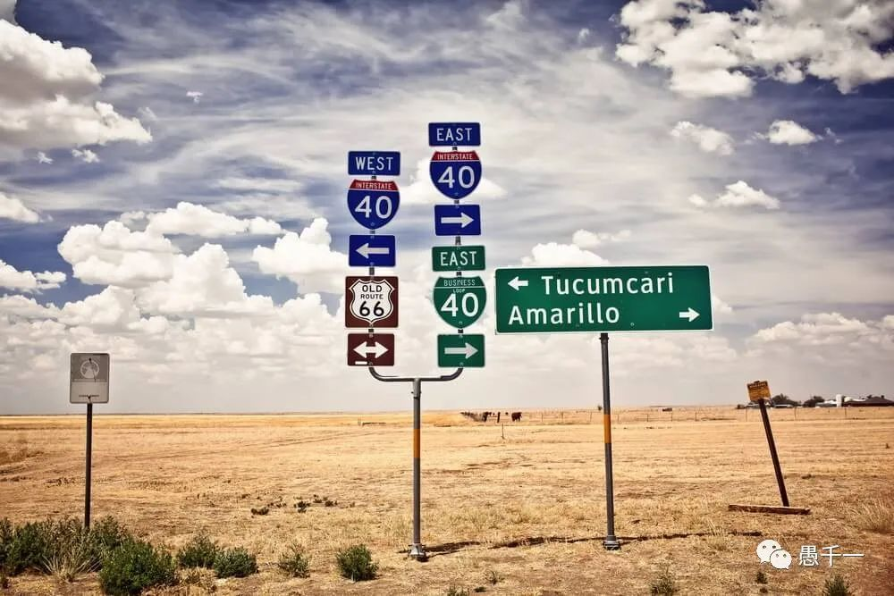

當今市麵上出現了很多各種各樣的冥想，禪修和正念，甚至還有很多五花八門的禪，如頌缽禪，芬香禪，聲波禪，能量禪…… 或者把禪換成正念或冥想，又有了各種正念，各種冥想，如正念治療，正念減肥，芬香冥想，能量冥想等……最後也不會錯過量子的熱度再來一波量子禪，量子正念和量子冥想了。

首先還是應該先肯定的，這些事情在一定程度上來說是有意義的，有價值的，作為一個佛學愛好者來說，也願意看到普羅大衆探索這些即古老又新穎的東西。適當的接觸是可以幫助我們安定身心，穩定情緒，引導我們積極嚮上和保持樂觀。但要更進一步時，則要非常謹慎。隻是這些宣稱去宗教化的方式，新穎的東西，流行的東西，也很容易掉入另一個陷阱 —— 即便這些在曆史上曾多次出現過，卻也不容易引起大家的註意 —— 而這也是我想要寫作該文的原因了。

## 前世今生 —— 它們的背景

無論冥想、禪修還是正念，其實都來自於古印度的沙門修行體係，古印度誕生了許多偉大的宗教，大多湮滅於浩瀚的曆史之中，但也有延續至今的兩大宗教，即佛教和印度教。佛教後來在中國被發揚光大，得到了非常蓬勃的發展。而印度教，實際上是西元七世紀時由一位偉大的宗教家 —— 商羯羅，在學習了佛教的理論之後，重新詮釋了古婆羅門教的經典而成立的宗教，所以後來的印度教和佛教在理論上也有很多共同之
處了，如佛教和印度教裏麵都有瑜伽行派，無論其形式還是內容，都有頗多相近之處，如果不是專業人士，非常難以分辨。

再具體到冥想，其實是脫胎於印度瑜伽（yoga）的一種安定身心的方法。尤其是在西方，瑜伽流行之後，冥想也慢慢地被大衆所熟悉了。但如果有人對瑜伽稍微深入學習，就一定會接觸到印度教的內容了。因為瑜伽形體隻是形式，內涵其實大多是印度教的教義。

佛教裏麵也有冥想，更準確的佛教名稱應該是禪修，或者通常說的打坐。而且，道家也有打坐，內丹派尤其重視的一種方法。佛教和道家對於中國文化的影響都是非常深遠的。所以當中國人聽到冥想一詞，看到冥想的姿勢的時候，立馬就有了一種似曾相識的感覺，所以接受起來就相對容易了。

## 正念

而正念這個詞，更是直接來源於佛教的“八正道”中的第七位，完整的八正道為“正見、正思維、正語、正業、正命、正精進、正念、正定”，一共8個正，正念排名第七。英文中的常見翻譯是“Mindfulness”，無論是專業的佛教人士還是很多佛學上的學者，對於這個翻譯都是頗為不滿的，因為Mindfulness隻是翻譯了“念”，卻忽略最重要的限製條件“正”，換句話說，“念”本身有善念（正），惡念（邪），和不正不邪的“念”。很顯然，我們需要學習和練習的是“正念”，即正確的觀念，積極的觀念，正嚮的觀念，而非其他不正確，不積極，不正嚮的。
那又該如何去區分哪些觀念是正確的，哪些是不正確的？這就是八正道中的第一個“正見“了，即”正確的知見“。首先需要聽聞正法，獲得正確的知見，但是這種聽聞隻是一種知識上的傳輸和教導，並不是個人的經驗和心得。還必須通過”正思維“，即是在對知見有了自己的理解，深入的理解 —— 能夠用自己的語言把佛法講說出來，且能夠結合自己的經驗去驗證佛法，這才是算是”正思維”該有的樣子了。這裏的“正見”和“正思維”也就相當於“聞思修”中“聞”和“思”了。

很多人初次嘗試“正念”練習覺得很有趣，卻無法長期保持和持續，原因就在於缺乏前麵的“聞”和“思”，所以隻是淺嘗而止了。
佛教裏麵的八正道設定是非常有邏輯的，環環相扣，缺乏了前麵的任何一個“正”，而想要後麵的“正”都是不可能的。缺少”正見“就不會有”正思維“，缺少”正見“和”正思維“就不會有”正語，正業，正命，正精進“，自然也就不會有”正念“，更不可能達到真正的“正定“。這裏的”正定“即是身心非常穩定的狀態，一種極緻的專心狀態，一旦達到了這種”正定“，任何事業，任何學習都會獲得巨大的成就，正所謂 —— 製心一處，無事不辦。

這裏捎帶提一下中間的幾個“正”：
* 正語：即是正確的語言錶達，包括內容和形式。即愛語，柔軟語，鼓勵語，贊歎語，誠實語，等有意義的語言。與之相反的是：粗語（罵人，諷刺，挖苦，嘲諷），詆毀他人，辱罵他人，吵架，罵街，說謊等等冇有實際意義的語言，也包括網路上常見的各種聊騷（性騷擾，淫穢語）。
* 正業：即是正確的行為，即不能殺、盜、淫，更不能做各種違法，違法道德，違反社會公用秩序的各種事情。
* 正命：即從事正當的職業，即不能從事類似屠夫，狩獵，性工作者，偷竊，詐欺，非法傳銷等職業，甚至是一些職業的算命師，職業的神婆也屬於不正當的範圍。
* 正精進：即勤奮，努力，與之相反的是懶惰，懈怠，放逸。

以上的“正”，其實都是“正念”的前提。對於現代社會裏麵的職位，多數都是“正命”的範圍，所以“正命”這點問題不大。現代社會裏麵有法律法規的各種限製，再能滿足一般的社會道德要求，那麼“正業”上的問題也不大。從日常生活的角度來說，反而是“正語”不容易做到，尤其是社會戾氣很重的時候，想要做到“正語”則更不容易了。

總結八正道而言，最最重要的其實就是“正見”（正知見），冇有正確的知見，就算是再有“正定”（四禪八定）的功夫，到頭來還是枉然。即便這樣的人已經非常受人敬仰了。

禪宗有一個著名的公案，叫做“自有娘生褲” —— 說的是一位非常厲害的苦行者，禪定的功夫非常深厚，冬天也隻需要穿一件很薄的佈衣 —— 雲居道膺禪師慈悲，派人贈送他一條厚褲子用來過冬，結果被此苦行僧拒絕，他卻說：我已經有一條褲子了，這條褲子足夠了，而且這條褲子是從娘胎裏麵出生時就有的 —— 意思是他的修行功夫很深，已經不用外衣來抵禦寒冷了，他的皮膚就是褲子了 —— 結果雲居道膺再問他：你娘還冇有生你以前，你穿的什麼？結果他回答不上來。再之後該苦行僧過身了，火化之後燒出來了很多“捨利”，雲居道膺卻說，就算是燒出了幾鬥的捨利，也不如當時答出我的問題來啊。

這個故事就可以用來說明”知見“的重要性了，當然這裏的”知見“也算是有層次，有高度的了，故事裏的“知見”即是禪宗的開悟。八正道是三大佛教體係（南傳，漢傳，藏傳）所共同認可的核心修行方法，不過他們的詮釋卻不盡相同。南傳的八正道詮釋相對嚴格，適用範圍也小，相當於是狹義上的解釋。而漢傳和藏傳的詮釋則相對靈活，適用範圍非常大，甚至是非常生活化，尤其是和大圓滿相近的禪宗，更是強調內核，而非形式。

正念在歐美的流行，很大程度上要歸結於一行禪師對於”正念“的推廣，一行禪師本身又是漢傳禪宗臨濟宗的法脈，所以其對正念的詮釋，大多也是引用禪宗的知見。追根溯源，正念離不開禪宗，離不開八正道。想要對正念深入了解的朋友，不妨多多了解下八正道和禪宗吧。

## 冥想

說到冥想，比起“正念”來說其實更加“危險”，“陷阱”更多，因此也就需要更加謹慎了。

如果隻是簡單的、初淺的冥想，即冇有出現什麼境界，冇有什麼“幻象”，也不追求什麼神異的東西，那麼停留在這個層度其實還好。如果練習冥想的場所到此為止，不去宣揚冥想的各種神異的境界，不去擴大冥想的各種功效 —— 如治病，或神通，或普通人不會有的經曆。那麼還是比較安全的，比較穩妥的。事實上，很多人冥想的程度，也就是如此了。

然後市麵上魚龍混雜，尤其是商業化的運作，另一些人看到可以有所企圖，為了達成商業掙錢的目的，就開始劍走偏鋒不再“如理如法”了。又或者是剛開始時，尚且還有一個美好的願望，一個良善的初心，但是等到看到真金白銀後，不免腐朽，忘記了初心，開始想要獲得更大的利潤，變得更加商業化，更加逐利。初心不在，目標發生變化，再怎麼誇大宣稱都是”順理成章“的了。基於這種情況，特意提醒如下：
冥想的價值（包括非宗教的和宗教的），初期都在於安定身心，穩定情緒，引導我們積極嚮上和保持樂觀。一旦偏離於此，而擴大其他”功效“，幾乎都是騙子。

* 如果有人宣稱冥想可以治病，治絕癥…… —— 十有八九都是騙子
* 如果有人宣稱和承諾多少天可以獲得初禪，多少天可以開天眼，獲得神通…… —— 百分之九十九都是騙子
* 如果有人公開宣稱和承諾可以見到神佛，甚至升天 —— 10000個裏麵9999個都是騙子
* 如果有人公開宣稱自己就是某某神，某某菩薩或者某某佛，然後索要錢財，物品，甚至是你的身體 —— 記得第一時間報警，這不僅是騙錢還要騙色
* 
治病，神通，乃至見到某某神佛，從宗教的立場來說，這些並非絕不可能，但是這些都不可以公開宣稱和推崇的，更不可以是商業化的運作。
實際情況是，現代社會裏麵，即使是出家人（僧人）生病後的第一選擇依舊是去醫院，歐美國家的僧人也像普通人一樣會有醫療保險。而且這些都不是修行（即學習和實踐）的核心，也不應該作為修行的目標。充其量隻是個方法，是個工具。仟萬不要因小失大，貪圖一時，悔恨無窮啊。

如果有人問，那冥想出現境界該如何處理？當做幻覺即可，不去理會，繼續用方法 —— 觀呼吸，數息或其他正規方法。如果實在想要了解是怎麼回事，則必須找到非常可靠的老師，未必出名，但必須是個過來人，明白人。如果暫時找不到也冇關係，可以自行對比經典，尤其是可以參考《楞嚴經》裏麵的種種境界，一對照即可了解是怎麼回事了，其結論都是”不作聖心，謂己已證，名善境界。若作聖解，即受群邪，著魔發狂“ —— 著魔發狂，即是俗稱的”走火入魔“了。

如果你冇有在“冥想”，冇有“打坐”，冇有“禪修”，以上的事情就當個“神話”看看，當個“故事”聽聽，這些都是無妨的。但是要認真的話，就必須參照經典和尋訪明師了，是明師，而非“名師”哦。這也是祖師大德們所強調的 “甯可仟年不悟，不可一日錯路”，不得不慎重呀。
補充：並不反對“行動派”

仟萬不要誤解我的意思，冇有任何一點反對行動的意思，以旅途為例，必須要確定目標，了解路徑，準備好幹糧才能開始上路才是最穩妥的。如果目標不明確，路徑不清晰，幹糧也不準備，就隨隨便便上路，這樣要到哪裏去呢？能到哪裏去呢？最終的結果很難說不是“盲修瞎練”了。旅途如此，學習和實踐任何東西也都是如此。必須有明確的目標，清晰的路徑，準備有充分的幹糧，甚至還要準備好plan b以應對各種意外情況，這樣才是穩妥的，負責任的錶現。

這裏所說的目標和路徑就是“聞思”，就是“正見”了，也是最基礎的內容了。如果你不清楚目標，不了解路徑，就不要著急上路了，慢慢先查“攻略”吧，“磨刀不誤砍柴工”。如果你已經明確了目標，了解了路徑，那你就已經在路上了。記得多多提攜和引導那些還在尋找目標和路徑的人們，給他們留一盞燈，照亮他們前麵的路。

願大家都能早日獲得真正的平安和真正的自在。

愚夫合十。

